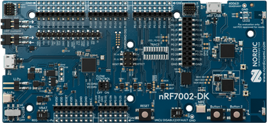
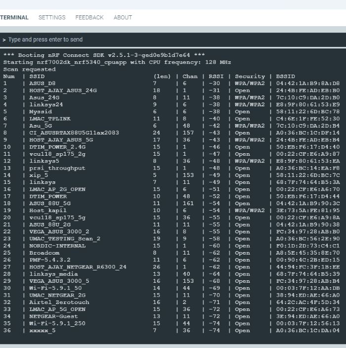

.. _nrf7002dk_nrf5340:
.. _ug_nrf7002_gs:

Getting started with nRF7002 DK
###############################

.. contents::
   :local:
   :depth: 4

This guide lets you evaluate the |NCS|'s support for nRF7002 :term:`Development Kit (DK)` without the need of installing the SDK.
It tells you how to install the :ref:`wifi_scan_sample` sample and perform a quick test of your DK.

If you want to go through an online training course to familiarize yourself with Wi-Fi® and the development of Wi-Fi applications, enroll in the `Wi-Fi Fundamentals course`_ in the `Nordic Developer Academy`_.

Overview
********

The nRF7002 DK (PCA10143) is a single-board development kit for evaluation and development on the nRF7002, a Wi-Fi companion :term:`Integrated Circuit (IC)` to Nordic Semiconductor's nRF5340 System-on-Chip (SoC) host processor.
It is certified for the Wi-Fi Alliance® `certification program <Wi-Fi Certification_>`_ in the Connectivity, Security, and Optimization categories.
See :ref:`ug_wifi_certification` for detailed information.

The nRF7002 is an IEEE 802.11ax (Wi-Fi 6) compliant solution that implements the Wi-Fi physical layer and Medium Access Control (MAC) layer protocols.
It implements the nRF Wi-Fi driver software on the nRF5340 host processor communicating over the QSPI bus.

The nRF5340 host is a dual-core SoC based on the Arm® Cortex®-M33 architecture.
It has the following features:

* A full-featured Arm Cortex-M33F core with DSP instructions, FPU, and Armv8-M Security Extension, running at up to 128 MHz, referred to as the application core.
* A secondary Arm Cortex-M33 core, with a reduced feature set, running at a fixed 64 MHz, referred to as the network core.

The ``nrf7002dk/nrf5340/cpuapp`` board target provides support for the application core on the nRF5340 SoC.
The ``nrf7002dk/nrf5340/cpunet`` board target provides support for the network core on the nRF5340 SoC.

   nRF7002 DK

Minimum requirements
********************

Make sure you have all the required hardware and that your computer and mobile device both have one of the supported operating systems.

Hardware
========

* nRF7002 DK:
  The nRF7002 DK has two external oscillators.

  * The frequency of the slow clock is 32.768 kHz.
  * The frequency of the main clock is 32 MHz.

* Micro-USB 2.0 cable

Supported features
------------------

The ``nrf7002dk/nrf5340/cpuapp`` board configuration supports the following hardware features:

+-----------+------------+----------------------+
| Interface | Controller | Driver/Component     |
+===========+============+======================+
| ADC       | on-chip    | adc                  |
+-----------+------------+----------------------+
| CLOCK     | on-chip    | clock_control        |
+-----------+------------+----------------------+
| FLASH     | on-chip    | flash                |
+-----------+------------+----------------------+
| GPIO      | on-chip    | gpio                 |
+-----------+------------+----------------------+
| I2C(M)    | on-chip    | i2c                  |
+-----------+------------+----------------------+
| MPU       | on-chip    | arch/arm             |
+-----------+------------+----------------------+
| NVIC      | on-chip    | arch/arm             |
+-----------+------------+----------------------+
| PWM       | on-chip    | pwm                  |
+-----------+------------+----------------------+
| RTC       | on-chip    | system clock         |
+-----------+------------+----------------------+
| RTT       | Segger     | console              |
+-----------+------------+----------------------+
| RADIO     | nrf7002    | Wi-Fi 6 (802.11ax)   |
+-----------+------------+----------------------+
| QSPI      | on-chip    | qspi                 |
+-----------+------------+----------------------+
| SPI(M/S)  | on-chip    | spi                  |
+-----------+------------+----------------------+
| SPU       | on-chip    | system protection    |
+-----------+------------+----------------------+
| UARTE     | on-chip    | serial               |
+-----------+------------+----------------------+
| USB       | on-chip    | usb                  |
+-----------+------------+----------------------+
| WDT       | on-chip    | watchdog             |
+-----------+------------+----------------------+

The ``nrf7002dk/nrf5340/cpunet`` board configuration supports the following hardware features:

+-----------+------------+----------------------+
| Interface | Controller | Driver/Component     |
+===========+============+======================+
| CLOCK     | on-chip    | clock_control        |
+-----------+------------+----------------------+
| FLASH     | on-chip    | flash                |
+-----------+------------+----------------------+
| GPIO      | on-chip    | gpio                 |
+-----------+------------+----------------------+
| I2C(M)    | on-chip    | i2c                  |
+-----------+------------+----------------------+
| MPU       | on-chip    | arch/arm             |
+-----------+------------+----------------------+
| NVIC      | on-chip    | arch/arm             |
+-----------+------------+----------------------+
| RADIO     | on-chip    | Bluetooth,           |
|           |            | ieee802154           |
+-----------+------------+----------------------+
| RTC       | on-chip    | system clock         |
+-----------+------------+----------------------+
| RTT       | Segger     | console              |
+-----------+------------+----------------------+
| QSPI      | on-chip    | qspi                 |
+-----------+------------+----------------------+
| SPI(M/S)  | on-chip    | spi                  |
+-----------+------------+----------------------+
| UARTE     | on-chip    | serial               |
+-----------+------------+----------------------+
| WDT       | on-chip    | watchdog             |
+-----------+------------+----------------------+

Other hardware features are not supported by the |NCS| kernel.

Connections and IOs
-------------------

The connections and IOs supported by the development kit are listed in this section.

LED
^^^

* **LED 1** (green) = **P1.06**
* **LED 2** (green) = **P1.07**

Push buttons
^^^^^^^^^^^^

* **Button 1** = **SW1** = **P1.08**
* **Button 2** = **SW2** = **P1.09**
* **BOOT** = **SW5** = boot/reset

Wi-Fi control
^^^^^^^^^^^^^

* BUCKEN = **P0.12**
* IOVDD CONTROL = **P0.31**
* HOST IRQ = **P0.23**
* COEX_REQ = **P0.28**
* COEX_STATUS0 = **P0.30**
* COEX_STATUS1 = **P0.29**
* COEX_GRANT = **P0.24**

Security components
-------------------

The following security components are available:

* Implementation Defined Attribution Unit (`IDAU`_) on the application core.

  The IDAU is implemented with the System Protection Unit and is used to define secure and non-secure memory maps.
  By default, the entire memory space (Flash, SRAM, and peripheral address space) is defined to be secure-accessible only.

* Secure boot.

Software
========

On your computer, one of the following operating systems:

* Microsoft Windows
* macOS
* Ubuntu Linux

|Supported OS|

On your mobile device, one of the following operating systems:

* Android
* iOS

Installing the required software
********************************

On your computer, install `nRF Connect for Desktop`_.
After installing and starting the application, install the Programmer app.

You must also install a terminal emulator, such as `nRF Connect Serial Terminal`_, the nRF Terminal (part of the `nRF Connect for Visual Studio Code`_ extension), or PuTTY.
nRF Connect Serial Terminal is the recommended method for :ref:`nrf70_gs_connecting`.

On your mobile device, install the `nRF Connect for Mobile`_ application from the corresponding application store.

.. _nrf70_gs_installing_sample:

Programming the sample
**********************

You must program and run a precompiled version of the :ref:`wifi_scan_sample` sample on your development kit to test the functions.
Download the precompiled version of the sample from the `nRF7002 DK Downloads`_ page.

After downloading the zip archive, extract it to a folder of your choice.
The archive contains the HEX file used to program the sample to your DK.

To program the precompiled sample to your development kit, complete the following steps:

1. Open the Programmer app.
#. Connect the nRF7002 DK to the computer with a micro-USB cable and turn on the DK.

   **LED 5** starts blinking.

#. Click **SELECT DEVICE** and select the DK from the drop-down list.

   .. figure:: images/nRF7002_programmer_select_device.png
      :alt: Programmer - Select Device

      Programmer - Select Device

   The drop-down text changes to the type of the selected device, with its SEGGER ID below the name.
   The **Device Memory Layout** section also changes its name to the device name, and indicates that the device is connected.
   If the **Auto read memory** option is selected in the **DEVICE** section of the side panel, the memory layout will update.
   If it is not selected and you wish to see the memory layout, click :guilabel:`Read` in the **DEVICE** section of the side panel.

#. Click :guilabel:`Add file` in the **FILE** section, and select **Browse**.
#. Navigate to where you extracted the HEX file and select it.
#. Click the :guilabel:`Erase & write` button in the **DEVICE** section to program the DK.

   Do not unplug or turn off the DK during this process.

.. note::
   If you experience any problems during the process, press ``Ctrl+R`` (``command+R`` on macOS) to restart the Programmer app, and try again.

After you have programmed the sample to the DK, you can connect to it and test the functions.

.. _nrf70_gs_connecting:

Connecting to the sample
************************

You can connect to the sample on the nRF7002 DK with a terminal emulator on your computer using :term:`Universal Asynchronous Receiver/Transmitter (UART)`.
This allows you to see the logging information the sample outputs.

You can use an external UART to USB bridge.
UART communication through the UART to USB CDC ACM bridge is referred to as CDC-UART.

If you have problems connecting to the sample, restart the DK and start over.

To connect using CDC-UART, complete the steps listed on the :ref:`test_and_optimize` page for the chosen terminal emulator.

Once the connection has been established, you can test the sample.

.. _nrf70_gs_testing:

Testing the sample
******************

You can test the :ref:`wifi_scan_sample` sample on your DK.
The test requires that you have :ref:`connected to the sample <nrf70_gs_connecting>` and have the connected terminal emulator open.

After successful programming of the sample onto the nRF7002 DK, scan results output will be shown in the terminal emulator connected to the sample through CDC-UART.

      Scan sample output

Building and debugging
**********************

The nRF5340 application core supports the Armv8-M Security Extension.
Applications built for the ``nrf7002dk/nrf5340/cpuapp`` board boot by default in the secure state.

The nRF5340 network core does not support the Armv8-M Security Extension.
nRF5340 IDAU can configure bus accesses by the nRF5340 network core to have the secure attribute set.
This allows to build and run secure-only applications on the nRF5340 SoC.

Building |NCS| applications with Arm TrustZone
==============================================

Applications on nRF5340 can use Cortex-M Security Extensions (CMSE) and separate firmware for the application core between Secure Processing Environment (SPE) and Non-Secure Processing Environment (NSPE).
You can build SPE using either |NCS| or `Trusted Firmware M`_ (TF-M).
You must always build NSPE using |NCS|.

For information about Cortex-M Security Extensions (CMSE) and the difference between the two environments, see :ref:`app_boards_spe_nspe`.

.. note::
   By default, SPE for the nRF5340 application core is built using TF-M.

Building the firmware with TF-M
-------------------------------

If you want to use |NCS| to build the firmware image separated in SPE with TF-M and NSPE, complete the following steps:

1. Build the |NCS| application for the application core using the ``nrf7002dk/nrf5340/cpuapp/ns`` board target.

   To invoke the building of TF-M, the |NCS| build system requires the Kconfig option :kconfig:option:`CONFIG_BUILD_WITH_TFM` to be enabled, which is set by default when building |NCS| as an application that supports both NSPE and SPE.

   The |NCS| build system performs the following steps automatically:

      a. Build the NSPE firmware image as a regular |NCS| application.
      #. Build an SPE firmware image (with TF-M).
      #. Merge the output image binaries.
      #. Optionally, build a bootloader image (MCUboot).

   .. note::
      Depending on the TF-M configuration, an application DTS overlay can be required to adjust the NSPE image flash memory partition and SRAM starting address and sizes.

#. Build the application firmware for the network core using the ``nrf7002dk/nrf5340/cpunet`` board target.

Building application without CMSE
=================================

Build the |NCS| application as described in :ref:`building`, using the ``nrf7002dk/nrf5340/cpuapp`` board target for the firmware running on the nRF5340 application core and the ``nrf7002dk/nrf5340/cpunet`` board target for the firmware running on the nRF5340 network core.

Programming the firmware to the DK
==================================

Follow the instructions in the :ref:`building` page to build and the :ref:`programming` page to program applications.

.. note::
   To flash and debug applications on the nRF7002 DK, you must use the `nRF Command Line Tools`_ version 10.12.0 or above.

Debugging
=========

See the :ref:`testing` page for information about debugging.

Next steps
**********

You have now completed getting started with the nRF7002 DK.
See the following links for where to go next:

* :ref:`installation` and :ref:`configuration_and_build` documentation to install the |NCS| and learn more about its development environment.
* :ref:`ug_nrf70_developing` documentation for more advanced topics related to the nRF70 Series.
* :ref:`ug_wifi` documentation for information related to Wi-Fi protocol and Wi-Fi modes of operation.
