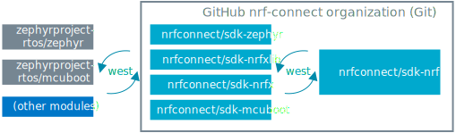

.. _getting_started:
.. _installation:

Installation
############

The |NCS| is a combination of software developed by Nordic Semiconductor and open source projects, hosted as :ref:`ncs_git_intro` repositories in the `nrfconnect GitHub organization`_.
These repositories and their versions form the SDK's code base and are managed using Zephyr's :ref:`ncs_west_intro` tool.

When you install the |NCS|, you set up the following SDK structure:

   The simplified |NCS| repository structure

All repositories with the prefix ``sdk`` contain the |NCS| firmware and code.
You can read more about repository types and what they include in the :ref:`dm_code_base` section of the documentation.

Each repository has a revision, which is determined by the current revision of the main repository `sdk-nrf`_.
This repository is the manifest repository, because it contains the SDK's `west manifest file`_ that lists all the SDK's repositories and their revisions (which is also listed on the :ref:`repos_and_revs` page).

To set up the |NCS|, use one of the following installation methods:

* :ref:`Install the nRF Connect SDK automatically using nRF Connect for Desktop <auto_installation>`.
  This will install all the :ref:`requirements <requirements>`, including the |VSC| and the `nRF Connect for Visual Studio Code`_ extension, which is recommended for creating and building applications.
* :ref:`Install the nRF Connect SDK toolchain manually <manual_installation>`.
  This is an option if you have any issues when installing the |NCS| automatically.

.. note::
   If you want to go through a dedicated training to familiarize yourself with the basic functionalities of the |NCS|, enroll in the `nRF Connect SDK Fundamentals course`_ in the `Nordic Developer Academy`_.

.. toctree::
   :maxdepth: 2
   :caption: Subpages:

   installation/recommended_versions
   installation/assistant
   installation/installing
   installation/updating
