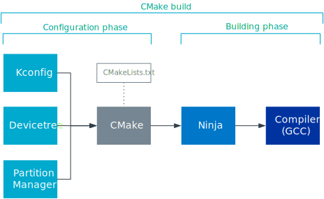

.. _ncs_introduction:

About the |NCS|
###############

.. contents::
   :local:
   :depth: 2

The nRF Connect SDK enables you to develop applications for nRF52, nRF53, and nRF91 Series devices.
It is a set of open source projects maintained by Nordic Semiconductor, consisting of several repositories such as:

* `sdk-nrf`_ repository - contains applications, samples, libraries, and drivers that are specifically targeted at Nordic Semiconductor devices.
* `sdk-nrfxlib`_ repository - contains closed-source libraries and modules in binary format.
  See the :doc:`nrfxlib documentation <nrfxlib:README>`.
* `sdk-mcuboot`_ repository - contains a fork of the `MCUboot`_ project, which provides a secure bootloader application.
  You can find the fork in :file:`bootloader/mcuboot` after obtaining the nRF Connect SDK source code.
  See the :doc:`documentation <mcuboot:index>` in Nordic Semiconductor’s MCUboot fork.
* `sdk-zephyr`_ repository - contains a fork of the `Zephyr`_ project, which provides samples, libraries, and drivers for a wide variety of devices, including Nordic Semiconductor devices.
  See the :doc:`documentation <zephyr:index>` in Nordic Semiconductor’s Zephyr fork.

The main repository is ``sdk-nrf``.
It contains the SDK manifest file that enables you to manage the repositories as one code base with the west tool.

Tools and configuration
***********************

The figure below visualizes the tools and configuration methods in |NCS|.
They are based on the :ref:`Zephyr project <zephyr:getting_started>`.
All of them have a role in the creation of an application, from configuring the libraries or applications to building them.

   |NCS| tools and configuration methods

* :ref:`zephyr:kconfig` generates definitions that configure libraries and subsystems.
* :ref:`Devicetree <zephyr:dt-guide>` describes the hardware.
* CMake generates build files based on the provided :file:`CMakeLists.txt` files, which use information from Kconfig and devicetree.
  See the `CMake documentation`_.
* Ninja (comparable to make) uses the build files to build the program, see the `Ninja documentation`_.
* The `GCC compiler`_ creates the executables.

West
====

The Zephyr project includes a tool called west that enables you to manage multiple repositories.
When developing in the |NCS|, your application will use libraries and features from folders that are cloned from different repositories or projects.
The west tool keeps control of which commits to use from the different projects.
It also makes it fairly simple to add and remove modules.

A west workspace contains one manifest repository and multiple projects, where the manifest repository controls which commits to use from the different projects.
For more information, see the :ref:`zephyr:west` user guide.

See :ref:`getting_started` for information about how to install the |NCS| and about the first steps.
