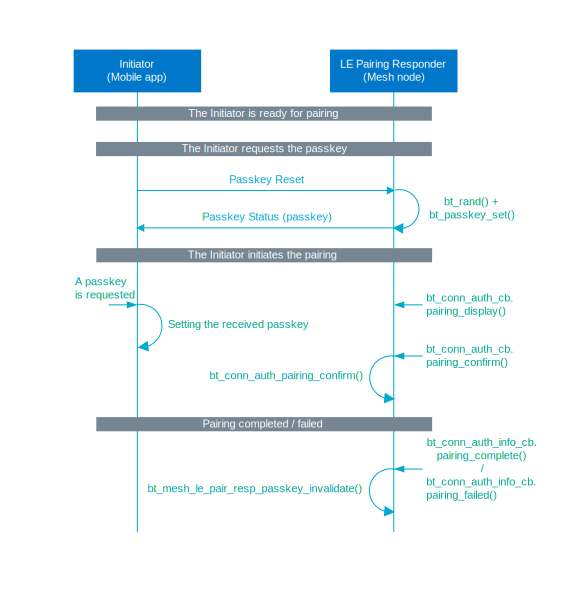

.. _bt_mesh_le_pair_resp_readme:

LE Pairing Responder
####################

.. contents::
   :local:
   :depth: 2

The LE Pairing Responder model is a vendor model and you must enable the :kconfig:option:`CONFIG_BT_APP_PASSKEY` Kconfig option to use this model.
This model can be used to hand over a passkey that will authenticate a Bluetooth LE connection over a mesh network when it is not possible to use other pairing methods.

Before the pairing is initiated, an initiator must send an LE Pairing message with the Passkey Reset sub-opcode.
If the passkey has been set by the :c:func:`bt_mesh_le_pair_resp_passkey_set` function, the predefined passkey will be returned in the Passkey Status message.
Otherwise, a new passkey will be generated by LE Pairing Responder model and returned in the Passkey Status message.
The passkey returned in the LE Pairing message with the Passkey Status sub-opcode should be used for the next pairing.

This model requires an application to only enable the display capability for the LE pairing by setting the :c:member:`bt_conn_auth_cb.passkey_display` callback.
The application must also set the :c:member:`bt_conn_auth_cb.app_passkey` callback to use the passkey generated by LE Pairing Responder model.
After every pairing request, the application must invalidate the previously used passkey by calling the :c:func:`bt_mesh_le_pair_resp_passkey_invalidate` function or calling :c:func:`bt_mesh_le_pair_resp_passkey_set` with the :c:macro:`BT_PASSKEY_RAND` value.
Those functions can be called from callbacks :c:member:`bt_conn_auth_info_cb.pairing_complete` and :c:member:`bt_conn_auth_info_cb.pairing_failed`.
See the :file:`samples/bluetooth/mesh/common/smp_bt_auth.c` file for the reference.

The model supports only LE Secure Connection pairing and requires the :kconfig:option:`CONFIG_BT_SMP_SC_ONLY` to be enabled.

Messages
========

The LE Pairing Request model defines a single message with opcode ``0x11``, which defines at least 1-byte long sub-opcode field.
The supported sub-opcodes are:

Passkey Reset
   Sent to instruct a node to generate a new passkey for the next pairing request.
   The sub-opcode field value is ``0x00``.

Passkey Status
   Sent as a response to the Passkey Reset message.
   The sub-opcode field value is ``0x01``.
   The message contains the 1-byte long request status, and optionally a 3-byte long, 6-digit passkey.
   If the passkey was generated successfully (the status field is ``0x00``), the message contains a 3-byte long, 6-digit passkey.

States
======

None

Extended models
===============

None

Persistent storage
==================

None

API documentation
=================

| Header file: :file:`include/bluetooth/mesh/vnd/le_pair_resp.h`
| Source file: :file:`subsys/bluetooth/mesh/vnd/le_pair_resp.c`

.. doxygengroup:: bt_mesh_le_pair_resp
