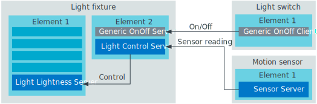
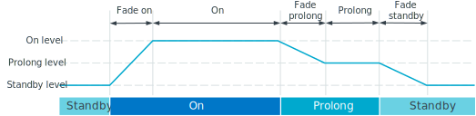

.. _bt_mesh_light_ctrl_srv_readme:

Light Lightness Control Server
##############################

.. contents::
   :local:
   :depth: 2

The Light Lightness Control (LC) Server controls a single :ref:`bt_mesh_lightness_srv_readme` instance on the same device with a state machine.

The state machine defines common behavior for a light fixture through three states, each with its own timing parameters and light levels.
As input to its state machine, the Light LC Server listens for Sensor and OnOff messages.

In addition to the state machine, the Light LC Server may optionally use a regulator to control the ambient illuminance in the room.
The regulator requires illuminance sensor readings acting as feedback for its regulator loop.

The Lightness Control Server is always disabled by default, and must be enabled by a :ref:`bt_mesh_light_ctrl_cli_readme`.

Overview
********

In this section, you can find more detailed information about the following aspects of the Light LC Server:

* `Composition data structure`_
* `Relationship with other nodes`_
* `Lightness state machine`_
* `Illuminance regulator`_

.. _bt_mesh_light_ctrl_srv_composition:

Composition data structure
==========================

As both the Light LC Server and the Light Lightness Server extend the Generic OnOff model, the two models cannot be instantiated on the same element.

.. note::
    Due to implementation limitations, the Light LC Server is instantiated on the next element after the Light Lightness Server it is controlling.

.. figure:: images/bt_mesh_light_ctrl_composition.svg
   :alt: Light Lightness Control Server composition data structure

   Light Lightness Control Server composition data structure

In the application, this composition data looks like this:

.. code-block:: c

   static struct bt_mesh_elem elements[] = {
      /* Lightness element */
      BT_MESH_ELEM(1,
          BT_MESH_MODEL_LIST(BT_MESH_MODEL_LIGHTNESS_SRV(&lightness_srv)),
          BT_MESH_MODEL_NONE),
      /* Light Control element */
      BT_MESH_ELEM(2,
          BT_MESH_MODEL_LIST(BT_MESH_MODEL_LIGHT_CTRL_SRV(&light_ctrl_srv)),
          BT_MESH_MODEL_NONE),
   };

The Light LC Server will log an error during initialization if the controlled Light Lightness Server is on the same element.

Relationship with other nodes
=============================

When the Light LC Server model controls a Light Lightness Server, all nodes should publish to the LC Server or its extended Generic OnOff model, instead of publishing directly to the Light Lightness Server:

The dimmer devices that want to override the light level of the Light Lightness Server can publish directly to it.
This disengages the Light LC Server, and the Light Lightness Server operates independently until the Light LC Server is explicitly re-enabled.

.. _bt_mesh_light_ctrl_srv_composition_state_machine:

Lightness state machine
=======================

The Light LC Server's lightness state machine operates in the following states:

Standby
   There is no activity in the room, and the device's light are either off or dimmed.

On
   There is activity in the room, and the lights are on.

Prolong
   There is no activity detected.
   The lights are at a slightly dimmed level, ready to get back to their *On* level as soon as activity is detected.

Each state has a lightness level and a transition time used for fading.
When the state changes, the light level fades from the previous state's level to the new state's level in a transition time span determined by the new state.

When the Light LC Server is turned on, the following sequence takes place:

   Light Lightness Control Server light levels

The state machine cycles through the states with the following events:

Timeout
   Triggered when the current state has timed out.
   The state machine automatically moves into the next state.

On
   Toggled when a motion sensor is triggered or the On button is pressed on a light switch.

Off
   Toggled when the Off button is pressed on a light switch.

The On and Prolong states will start a timer as soon as the transition into the state is finished.
When this timer expires, the state machine will automatically go into the next state.
If the On event is triggered while in the On state, the timer is reset, and the transition to the Prolong state is postponed.

.. figure:: images/bt_mesh_light_ctrl_states.svg
   :alt: Light Lightness Control Server state machine

   Light Lightness Control Server state machine

.. note::
    The state machine only works while the Light LC Server is enabled, and it always starts in the Standby state.

Resuming the state machine operation
------------------------------------

Whenever something but the Light LC Server interacts with the controlled Light Lightness Server, the Light LC Server disables its state machine, and the Light Lightness Server starts running independently.
To resume the state machine operation, the Light LC Server must be explicitly re-enabled.

To avoid having a Light Lightness Server running independently forever, the Light LC Server implements a resume timer that lets the Light LC Server regain control after being disabled for a certain number of seconds.
The resume timer can be configured with the :kconfig:option:`CONFIG_BT_MESH_LIGHT_CTRL_SRV_RESUME_DELAY` option, and is disabled by default.

.. note::
    The resume timer does not exist in the Bluetooth® mesh specification, and may become incompatible with future specification changes.
    Although it does not break the specification or qualification tests in the current iteration of the Bluetooth mesh specification, its behavior may be unexpected for third party devices, and should be used with caution.

State machine outputs
---------------------

The state machine has two different output values for each state:

Light level
   The light level decides the output light level sent to the controlled Light Lightness Server.
   Each state has a configurable light level, and the output light level will be the light level of the current state, with linear transitions between the states.
   The default light level values per state are:

   * Standby state - 0%
   * On state - 100%
   * Prolong state - 50%

Target illuminance level
   Each state has a configurable target illuminance level, which is used as input to the :ref:`bt_mesh_light_ctrl_srv_reg_readme`.
   The target illuminance level decides the ambient illuminance the regulator should try to achieve, as measured by illuminance sensors nearby.
   Just like with the light level, the target illuminance always matches the configured target illuminance for the current state, with linear transitions between the states.

External event triggers
-----------------------

While the Timeout event is controlled internally, the On and Off events are produced by external behavior.

On event
~~~~~~~~

The On event lets the Light LC Server know that there is activity in the room.
It can be generated by light switches and sensors.

* Light switches can implement one of the following models to send On messages that turn the Light LC Server on:

  * The :ref:`bt_mesh_onoff_cli_readme` model -- which should publish to the Light LC Server's extended Generic OnOff Server model.
  * The :ref:`bt_mesh_light_ctrl_cli_readme` model -- which should publish Light OnOff Set messages to the Light LC Server.

* Occupancy sensors can also trigger the On event, depending on the current state and occupancy mode:

  * If the occupancy mode is enabled, sensor readings that indicate activity can trigger an On event at any time.
  * If the occupancy mode is disabled, sensors cannot turn the lights on, but they will still prevent lights from turning off.

The following sensor types can also trigger the On event:

Motion sensed - :c:var:`bt_mesh_sensor_motion_sensed`
   Any sensor value higher than 0 triggers an On event in the Light LC Server state machine.
   Messages with a value of 0 are ignored.

People count - :c:var:`bt_mesh_sensor_people_count`
   Any sensor value higher than ``0`` triggers an On event in the Light LC Server state machine.
   Messages with a value of ``0`` are ignored.

Presence detected - :c:var:`bt_mesh_sensor_presence_detected`
   Messages with a ``true`` value triggers an On event in the Light LC Server state machine.
   Messages with a ``false`` value are ignored.

Time since motion sensed - :c:var:`bt_mesh_sensor_time_since_motion_sensed`
   When the sensor's *Time since motion sensed* value is lower than the Light LC Server's occupancy delay, the Light LC Server starts a timer that expires at the time equal to *Motion sensed* plus *occupancy delay*.
   When this timer expires, an On event is generated.

.. note::
   Only sensors reporting the *Time since motion sensed* type will be affected by the occupancy delay.
   Other sensor triggers are always instantaneous.

Off event
~~~~~~~~~

The Off event can only be generated by a light switch being turned off.
It moves the Light LC Server into Standby, transitioning from the previous light level with the manual mode Standby fade time (:c:enumerator:`BT_MESH_LIGHT_CTRL_PROP_TIME_FADE_STANDBY_MANUAL`).

The Off event puts the Light LC Server into manual mode, which disables sensor input until the manual mode timeout (:kconfig:option:`CONFIG_BT_MESH_LIGHT_CTRL_SRV_TIME_MANUAL`) expires.
This prevents the lights from turning back on by the movement of the person that presses the light switch.

.. note::
   Unlike other timing parameters, the manual mode timeout is proprietary and cannot be reconfigured at runtime by other models in the mesh network.

Light switches can implement one of the following clients to send Off messages that turn the Light LC Server on:

* :ref:`bt_mesh_onoff_cli_readme` - This model should publish to the Light LC Server's extended Generic OnOff Server model.
* :ref:`bt_mesh_light_ctrl_cli_readme` - This model should publish Light OnOff Set messages to the Light LC Server.

If a Timeout transition from Prolong to Standby is already in progress, the Light LC Server will check whether the remaining transition time is shorter than the Off event fade time and will execute whichever is the fastest.

State machine configuration
---------------------------

Both the timing and output levels are configurable at compile time and at runtime:

* The compile time configuration is done through the Light Control Server Kconfig menu options.
* The runtime configuration must be done by a Light Control Client model instance through the Light Lightness Controller Setup Server.

Timing parameters
~~~~~~~~~~~~~~~~~

This section lists compile and runtime options to be used when setting timing parameters.

Delay from occupancy detected until light turns on
    * Compile time: :kconfig:option:`CONFIG_BT_MESH_LIGHT_CTRL_SRV_OCCUPANCY_DELAY`
    * Runtime: :c:enumerator:`BT_MESH_LIGHT_CTRL_PROP_TIME_OCCUPANCY_DELAY`

Transition time to On state
    * Compile time: :kconfig:option:`CONFIG_BT_MESH_LIGHT_CTRL_SRV_TIME_FADE_ON`
    * Runtime: :c:enumerator:`BT_MESH_LIGHT_CTRL_PROP_TIME_FADE_ON`

Time in On state
    * Compile time: :kconfig:option:`CONFIG_BT_MESH_LIGHT_CTRL_SRV_TIME_ON`
    * Runtime: :c:enumerator:`BT_MESH_LIGHT_CTRL_PROP_TIME_ON`

Transition time to Prolong state
    * Compile time: :kconfig:option:`CONFIG_BT_MESH_LIGHT_CTRL_SRV_TIME_FADE_PROLONG`
    * Runtime: :c:enumerator:`BT_MESH_LIGHT_CTRL_PROP_TIME_FADE_PROLONG`

Time in Prolong state
    * Compile time: :kconfig:option:`CONFIG_BT_MESH_LIGHT_CTRL_SRV_TIME_PROLONG`
    * Runtime: :c:enumerator:`BT_MESH_LIGHT_CTRL_PROP_TIME_PROLONG`

Transition time to Standby state (in auto mode)
    * Compile time: :kconfig:option:`CONFIG_BT_MESH_LIGHT_CTRL_SRV_TIME_FADE_STANDBY_AUTO`
    * Runtime: :c:enumerator:`BT_MESH_LIGHT_CTRL_PROP_TIME_FADE_STANDBY_AUTO`

Transition time to Standby state (in manual mode)
    * Compile time: :kconfig:option:`CONFIG_BT_MESH_LIGHT_CTRL_SRV_TIME_FADE_STANDBY_MANUAL`
    * Runtime: :c:enumerator:`BT_MESH_LIGHT_CTRL_PROP_TIME_FADE_STANDBY_MANUAL`

Manual mode timeout
    * Compile time: :kconfig:option:`CONFIG_BT_MESH_LIGHT_CTRL_SRV_TIME_MANUAL`
    * No runtime option available.

Output parameters
~~~~~~~~~~~~~~~~~

This section lists compile and runtime options to be used when setting output parameters.

On state light level
    * Compile time: :kconfig:option:`CONFIG_BT_MESH_LIGHT_CTRL_SRV_LVL_ON`
    * Runtime: :c:enumerator:`BT_MESH_LIGHT_CTRL_LIGHTNESS_ON`

Prolong state light level
    * Compile time: :kconfig:option:`CONFIG_BT_MESH_LIGHT_CTRL_SRV_LVL_PROLONG`
    * Runtime: :c:enumerator:`BT_MESH_LIGHT_CTRL_LIGHTNESS_PROLONG`

Standby state light level
    * Compile time: :kconfig:option:`CONFIG_BT_MESH_LIGHT_CTRL_SRV_LVL_STANDBY`
    * Runtime: :c:enumerator:`BT_MESH_LIGHT_CTRL_LIGHTNESS_STANDBY`

On state target illuminance
    * Compile time: :kconfig:option:`CONFIG_BT_MESH_LIGHT_CTRL_SRV_REG_LUX_ON`
    * Runtime: :c:enumerator:`BT_MESH_LIGHT_CTRL_PROP_ILLUMINANCE_ON`

Prolong state target illuminance
    * Compile time: :kconfig:option:`CONFIG_BT_MESH_LIGHT_CTRL_SRV_REG_LUX_PROLONG`
    * Runtime: :c:enumerator:`BT_MESH_LIGHT_CTRL_PROP_ILLUMINANCE_PROLONG`

Standby state target illuminance
    * Compile time: :kconfig:option:`CONFIG_BT_MESH_LIGHT_CTRL_SRV_REG_LUX_STANDBY`
    * Runtime: :c:enumerator:`BT_MESH_LIGHT_CTRL_PROP_ILLUMINANCE_STANDBY`

.. _bt_mesh_light_ctrl_srv_reg_readme:

Illuminance regulator
=====================

The illuminance regulator complements the light level state machine by adding an ambient illuminance sensor feedback loop.
This allows the Light Lightness Server to adjust its output level that is based on the room's ambient light, and as a result conserve energy and achieve more consistent light levels.

.. figure:: images/bt_mesh_light_ctrl_reg.svg
   :alt: Illuminance regulator

   Illuminance regulator

The illuminance regulator takes the specified target illuminance level as the reference level and compares it to sensor data from an external illuminance sensor.
The inputs are compared to establish an error for the regulator, which the regulator tries to minimize.
The regulator contains a proportional (P) and an integral (I) component whose outputs are summarized to a light level output.

The illuminance regulator's output level only comes into effect if the required output level is higher than the state machine's output light level.
To get full benefit of the regulator, the state machine's light level output should generally be configured to a lower value than desired, while keeping the target illuminance levels high.
This allows the regulator to conserve energy by taking advantage of the room's ambient lighting.

The Light LC Server uses :ref:`bt_mesh_light_ctrl_reg_readme` to interact with the illuminance regulator.
If the regulator functionality is enabled and no regulator is specified (using :c:macro:`BT_MESH_LIGHT_CTRL_SRV_INIT_WITH_REG`), the server will by default use the :ref:`bt_mesh_light_ctrl_reg_spec_readme`.

Sensor input
------------

The regulator relies on regular sensor input data to function correctly.
This sensor data must come from an external :ref:`bt_mesh_sensor_srv_readme` model and report the ambient light level with the :c:var:`bt_mesh_sensor_present_amb_light_level` sensor type.
The Sensor Server should publish its sensor readings to an address the Light LC Server is subscribed to, using a common application key.

The Light LC Server will process all incoming sensor messages and pass the reported ambient light level to the regulator.
The regulator depends on frequent readings from the sensor server to provide a stable output for the Light Lightness Server.
If the sensor reports are too slow, the regulator might oscillate as it attempts to compensate for outdated feedback.

.. tip::
   Use the Sensor :ref:`bt_mesh_sensor_publishing_delta` feature for ambient light sensors feeding the regulator.
   This makes the sensor send frequent reports when the regulator is compensating for large errors, while keeping the mesh traffic low in stable periods.

The Sensor Server may be instantiated on the same mesh node as the Light LC Server, or on a different mesh node in the same area.
The regulator performance depends heavily on the sensor's placement and sensitivity.
In general, ambient light sensor devices should be placed in a way that allows their light sensor to capture the human perception of the room's light level as closely as possible.

States
******

Not to be confused with the :ref:`state machine states <bt_mesh_light_ctrl_srv_composition_state_machine>`, the Light LC Server's states represent its current mode of operation and configuration.

Mode: ``bool``
    Enables or disables the Light LC Server.
    When disabled, the controlled Light Lightness Server operates independently.

Occupancy mode: ``bool``
    The occupancy mode controls whether sensor activity can turn the lights on.
    If disabled, motion and occupancy sensor messages may only prevent the lights from turning off, and a light switch is required to turn them on.

Light OnOff: ``bool``
    When set, the Light OnOff state may trigger transactions in the lightness state machine.
    When read, the Light OnOff state indicates whether the lights are turned off (in the Standby state) or on (in the On state or the Prolong state).

Properties
    The Light Control Properties are used to configure the Light LC Server behavior.
    See :c:enum:`bt_mesh_light_ctrl_prop` for a list of supported properties and their representation.

Extended models
***************

The Light LC Server extends the following models:

* :ref:`bt_mesh_onoff_srv_readme`

Additionally, it requires a :ref:`bt_mesh_lightness_srv_readme` it can control, instantiated in a different element.
See the :ref:`bt_mesh_light_ctrl_srv_composition` section for details.

Persistent Storage
******************

If :kconfig:option:`CONFIG_BT_SETTINGS` is enabled, the Light LC Server stores all its states persistently using a configurable storage delay to stagger storing.
See :kconfig:option:`CONFIG_BT_MESH_STORE_TIMEOUT`.

Changes to the configuration properties are stored and restored on power-up, so the compile time configuration is only valid the first time the device powers up, until the configuration is changed.

Power-up behavior
=================

When powering up, the Light LC Server behavior depends on the controlled Light Lightness Server's extended :ref:`bt_mesh_ponoff_srv_readme`'s state:

* On Power Up is :c:enumerator:`BT_MESH_ON_POWER_UP_OFF` - The Light LC Server is disabled, and the Light Lightness Server remains off.
* On Power Up is :c:enumerator:`BT_MESH_ON_POWER_UP_ON` - The Light LC Server is disabled, and the Light Lightness Server's Light level is set to its default value.
* On Power Up is :c:enumerator:`BT_MESH_ON_POWER_UP_RESTORE` - The Light LC Server is enabled and takes control of the Lightness Server.
  If the last known value of the Light OnOff state was On, the Light LC Server triggers a transition to the On state.

.. caution::
    The Light LC Server is only re-enabled on startup if the Light Lightness Server's extended Generic Power OnOff Server is in the restore mode.

API documentation
*****************

| Header file: :file:`include/bluetooth/mesh/light_ctrl_srv.h`
| Source file: :file:`subsys/bluetooth/mesh/light_ctrl_srv.c`

.. doxygengroup:: bt_mesh_light_ctrl_srv
   :project: nrf
   :members:
