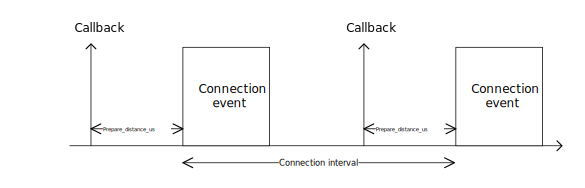
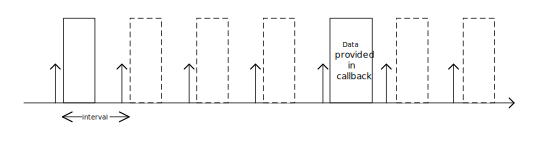

.. _ug_radio_notification_conn_cb:

Radio Notification callback
###########################

.. contents::
   :local:
   :depth: 2

The Bluetooth Radio Notification connection callback feature is used to inform the application about upcoming radio activity for a Bluetooth connection.
The :c:member:`bt_radio_notification_conn_cb.prepare` callback is triggered right before a Bluetooth connection event.
This allows the application to trigger sensor data collection for transmission during the upcoming connection event.

   The prepare callback is called before a connection event

The timing of the prepare callback is configured with the parameter ``prepare_time_us``.
You must set the parameter value large enough to allow the Bluetooth stack to enqueue a data packet for the upcoming connection event.

The :ref:`ble_radio_notification_conn_cb` sample demonstrates how you can use this feature to reduce the latency between data sampling and data transmission.

Radio Notification connection callback with peripheral latency
**************************************************************

When a connection is configured with peripheral latency, the peripheral device may sleep for ``peripheral_latency`` consecutive connection events to save power.
The device may wake up more often if, for example, it has data to send.
The central device assumes that the peripheral will wake up at every connection event.

The :c:member:`ble_radio_notification_conn_cb.prepare` callback will be called before every connection event for both the peripheral and central device.
If the peripheral application provides data to be sent in this callback, the peripheral device will wake up for that given connection event.

   The peripheral wakes up if data is provided in a prepare callback

For this configuration, the application must configure the prepare callback to trigger at least :c:macro:`BT_RADIO_NOTIFICATION_CONN_CB_PREPARE_DISTANCE_US_RECOMMENDED` before the connection event starts.
This allows the Bluetooth stack to start the high frequency clock and radio peripheral if they are not already running.
If the data is provided too close to the start of the connection event, the data will be sent in upcoming events.

Limitations
***********

You can use this feature only with the :ref:`SoftDevice Controller <nrfxlib:softdevice_controller>` and only when the Bluetooth controller and application are located on the same core.

API documentation
*****************

| Header file: :file:`include/bluetooth/radio_notification_cb.h`
| Source file: :file:`subsys/bluetooth/host_extensions/radio_notification_conn_cb.c`

.. doxygengroup:: bt_radio_notification_cb
