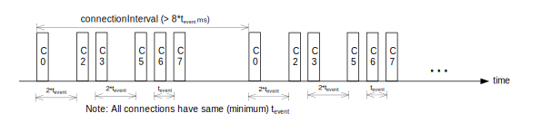
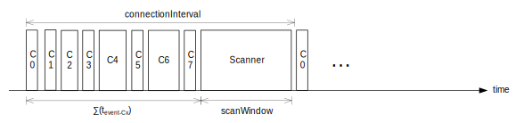

.. _softdevice_controller_scheduling:

Scheduling
##########

.. contents::
   :local:
   :depth: 2

The |controller| has multiple activities, called timing-activities, which require exclusive access to certain hardware resources.
These timing-activities are time-multiplexed to give them the required exclusive access for a period of time.
This is called a timing-event.
Such timing-activities are |BLE| role events; for example, events for Central and Peripheral roles and MPSL :ref:`mpsl_timeslot`.

If timing-events collide, their scheduling is determined by a priority system.
For example, when timing-activity :math:`\mathsf{A}` needs a timing-event at a time that overlaps with timing-activity :math:`\mathsf{B}`, and timing-activity :math:`\mathsf{A}` has higher priority, timing-activity :math:`\mathsf{A}` will get the timing-event.
Activity :math:`\mathsf{B}` will be blocked and its timing-event will be rescheduled for a later time.
If both timing-activity :math:`\mathsf{A}` and timing-activity :math:`\mathsf{B}` have the same priority, the timing-activity which was requested first will get the timing-event.

Timing-activities run to completion and cannot be interrupted by other timing-activities, even if the timing-activity trying to interrupt has a higher priority.
For example, timing-activity :math:`\mathsf{A}` and timing-activity :math:`\mathsf{B}` request a timing-event at overlapping times with the same priority.
Timing-activity :math:`\mathsf{A}` gets the timing-event because it requested it earlier than timing-activity :math:`\mathsf{B}`.
If timing-activity :math:`\mathsf{B}` increases its priority and requests again, it can only get the timing-event if timing-activity :math:`\mathsf{A}` has not already started and there is enough time to change the timing-event schedule.

.. note::
   The figures in this chapter do not illustrate all packets that are sent over the air.
   See `Bluetooth Core Specification`_ for the complete sequence of packets.

Timing-activities and priorities
********************************

The |controller| supports running multiple connections, Advertisers, Scanners, and timeslot events simultaneously.

In |NCS|, flash access is scheduled within MPSL Timeslot events.
However, the flash access APIs provided by the |controller| are available to the application.
The flash access mentioned below is covering the implementation provided by the APIs exposed by the |controller|.

Advertiser and broadcaster timing-events are scheduled as early as possible.
Peripheral link timing-events follow the timings dictated by the connected peer, while central link timing-events are added relative to already running central link timing-events.
All timing-events are scheduled independently and may occur at the same time and therefore collide.
If central links and Scanner are scheduled with a common base interval and the sum of their timing-event lengths is less than this interval, they never block each other.

The different timing-activities have different priorities at different times, dependent upon their state.
As an example, if a connection is about to reach supervision time-out, it will block all other timing-activities and get the timing-event it requests.
In this case, all other timing-activities will be blocked if they overlap with the connection timing-event, and they will have to be rescheduled.
The following table summarizes the priorities.

.. _scheduling_priorities_table:

.. table:: Scheduling priorities

   +-----------------------------+---------------------------------------------------------------------------------------------------+
   | Priority (Decreasing order) | Role state                                                                                        |
   +=============================+===================================================================================================+
   | First priority              | * Central connections that are about to time out                                                  |
   |                             | * Peripheral connection setup (waiting for ACK from peer)                                         |
   |                             | * Peripheral connections that are about to time out                                               |
   +-----------------------------+---------------------------------------------------------------------------------------------------+
   | Second priority             | * Central connection setup (waiting for ACK from peer)                                            |
   |                             | * Initiator                                                                                       |
   |                             | * Periodic advertiser sending a channel map update                                                |
   |                             | * Scanner in the synchronizing state                                                              |
   |                             | * Scanner in the synchronized state where the synchronization is about to be lost                 |
   |                             | * Scanner in the synchronized state receiving auxiliary packets (AUX_CHAIN_IND's)                 |
   |                             | * Connectable Advertiser/Broadcaster which has been blocked consecutively for a few times         |
   |                             | * Scanner which has been blocked for a long time                                                  |
   |                             | * Scanner which is receiving an advertising packet on a secondary advertising channel             |
   +-----------------------------+---------------------------------------------------------------------------------------------------+
   | Third priority              | * All |BLE| roles in states other than above run with this priority                               |
   |                             | * Flash access after it has been blocked consecutively for a few times                            |
   |                             | * MPSL Timeslot with high priority                                                                |
   +-----------------------------+---------------------------------------------------------------------------------------------------+
   | Fourth priority             | * 802.15.4 radio driver                                                                           |
   |                             | * MPSL Timeslot with normal priority                                                              |
   |                             | * Flash access                                                                                    |
   +-----------------------------+---------------------------------------------------------------------------------------------------+
   | Last priority               | * Quality of Service channel survey                                                               |
   +-----------------------------+---------------------------------------------------------------------------------------------------+

.. _initiator_timing:

Initiator timing
****************

This section introduces the different situations that happen with the Initiator when establishing a connection.

The examples in this section demonstrate an Initiator that is configured to listen on one PHY, resulting in one initiator timing-event.
Listening on two PHYs would result in two initiator timing-events as shown in figure :ref:`initiator_with_two_phys` below.

When establishing a connection with no other connections active, the Initiator will establish the connection in the minimum time and allocate the first central link connection event :math:`\mathsf{transmitWindowDelay}` after the connect request is sent, as shown in the following figure.

   Initiator - first connection

.. _initiator_with_two_phys:

   Initiator - first connection initiating two PHYs

When establishing a new connection with other connections already made as a Central, the new central connection's first timing-event is scheduled in any free time either between existing central timing-events or after them.
Central link timing-events will initially be scheduled close to each other, with the minimum time possible between them.
The minimum time between the start of two central role timing-events is the event length of the Central role to which the first timing-event belongs.
This minimum time is referred to as t\ :sub:`event`.
The following figure illustrates establishing a new central connection with one central connection already running.

   Initiator - one central connection running

When a central link disconnects, the timings of other central link timing-events remain unchanged.
The following figure illustrates when central link :math:`\mathsf{C1}` is disconnected, which results in free time between :math:`\mathsf{C0}` and :math:`\mathsf{C2}`.

   Initiator - free time due to disconnection

When establishing a new connection and there is free time available between already running central link timing-events, a Best Fit algorithm is used to find which free timeslot should be used.
The figure below illustrates an example where all existing central connections have the same connection interval and the initiator timing-event starts around the same time as the 1\ :sup:`st` central connection (:math:`\mathsf{C0}`) timing-event in the schedule.
There is available time between :math:`\mathsf{C1}` and :math:`\mathsf{C2}` and, between :math:`\mathsf{C2}` and :math:`\mathsf{C3}`.
A timing-event for new a connection, :math:`\mathsf{Cn}`, is scheduled in the available time between :math:`\mathsf{C2}` and :math:`\mathsf{C3}` because that is the best fit for :math:`\mathsf{Cn}`.

   Initiator - one or more connections as a Central

The figure below illustrates that when no free time between existing central link timing-events is long enough to fit the new connection, the new timing-event is placed after all currently running central link timing-events.

   Initiator - not enough free time

The Initiator is scheduled relative to existing central connections.
This is illustrated in the figure below.
The application requests the Initiator to start at :math:`\mathsf{(1)}` and a reference point, :math:`\mathsf{t_r}`, is determined from the existing links.
From :math:`\mathsf{t_r}`, the earliest possible scan window is found by subtracting the scan interval :math:`\mathsf{T_{SI}}` until the nearest point in the future is found.
In the example, the Initiator blocks the second connection (:math:`\mathsf{C1}`) during its second scan window.
In that window, it receives a connectable advertisement :math:`\mathsf{(2)}` and responds with a connection indication :math:`\mathsf{(3)}`.
The Initiator has now become a Central (:math:`\mathsf{C3}`) and its link is placed between :math:`\mathsf{C1}` and :math:`\mathsf{C2}` by the Best Fit algorithm.

   Initiator - scheduling and connection setup

.. _central_timing:

Connection timing as a Central
******************************

Central link timing-events are added relative to already running central link timing-events.

Central link timing-events are offset from each other by :math:`\mathsf{t_{event}}` depending on the configuration of the connection.
For details about :math:`\mathsf{t_{event}}`, see :ref:`initiator_timing`.

The figure below shows a scenario where two central links are established.
:math:`\mathsf{C0}` timing-events correspond to the first central connection, and :math:`\mathsf{C1}` timing-events correspond to the second central connection.
:math:`\mathsf{C1}` timing-events are initially offset from :math:`\mathsf{C0}` timing-events by :math:`\mathsf{t_{event-C0}}`.
In this example, :math:`\mathsf{C1}` has exactly double the connection interval of :math:`\mathsf{C0}` (the connection intervals have a common factor which is :math:`\mathsf{connectionInterval \, 0}`), so the timing-events remain forever offset by :math:`\mathsf{t_{event-C0}}`.

   Multilink scheduling - one or more connections as a Central, factored intervals

In the figure below, the connection intervals do not have a common factor.
While this connection parameter configuration is possible, it will result in dropped packets when events overlap.
In the scenario in the figure, the second timing-event shown for :math:`\mathsf{C1}` is dropped because it collides with the :math:`\mathsf{C0}` timing-event.

   Multilink scheduling - one or more connections as a Central, unfactored intervals

The figure below shows eight concurrent links as a Central with an event length of 2.5 ms and a connection interval of 20 ms.
This means all eight Centrals will have a connection event within the 20 ms interval, and the connection events will be 2.5 ms apart.

   Multilink scheduling with maximum connections as a Central and minimum interval

The figure below shows a scenario similar to the one illustrated above except the connection interval is longer than 20 ms, and Central 1 and 4 have been disconnected or do not have a timing-event in this time period.
It shows the idle time during a connection interval and how the timings of central link timing-events are not affected if other central links disconnect.

   Multilink scheduling of connections as a Central and interval greater than min

Advanced Central connection timing
==================================

In some advanced use cases, the Central may require links to be closer together than what is supported on the initiating PHY.
This can be achieved by choosing a shorter connection event length and initiating the PHY update procedure to the faster PHY after establishing a connection.

.. note::
   If the peer supports LE Extended Advertising, a connection may be established on the faster PHY directly.

The Central may create connections that have scheduling conflicts on the initiating PHY.
This is illustrated in the figure below.
The central connections :math:`\mathsf{C0}` and :math:`\mathsf{C1}` alternate on blocking each other's timing-events.
This degrades the average link performance.

         The links alternate blocking each other.
   :align: center
   :width: 80%

   Too short connection event length causes scheduling conflicts

After :math:`\mathsf{C0}` has been updated to a faster PHY, it no longer blocks the timing-events of :math:`\mathsf{C1}`.
However, :math:`\mathsf{C1}` and :math:`\mathsf{C2}` are still in conflict, and their average link performance is degraded.
See the figure below.

         The two remaining links will still block each other.
   :align: center
   :width: 80%

   No scheduling conflict for first link after PHY update

When all links have been updated to the faster PHY, the Central has achieved the closest packing of links that is possible for a given connection interval.
In the figure below, all four central links are on the faster PHY, and a Scanner is consuming the remainder of the available time.

         An additional Scanner (S) fills the gap between the last central connection and the start of the next connection interval.
   :align: center
   :width: 80%

   Optimal packing of four links and a Scanner

Scanner timing
**************

Scanning is a periodic activity where the |controller| listens for packets from Advertisers.
When the |controller| starts scanning, it will listen for packets on the primary advertising channels.
If the |controller| is configured to accept extended advertising packets, and it receives a packet with a pointer to a secondary advertising channel, it will continue to scan on this channel to receive the auxiliary packet.

Primary channel Scanner timing
==============================

The following figure shows that when scanning for Advertisers with no active connections, the scan interval and window can be any value within the `Bluetooth Core Specification`_.

   Scanner timing - no active connections

The examples in this section demonstrate a Scanner that is configured to listen on one PHY, resulting in one scanner timing-event.
In the same way, listening on two PHYs would result in two scanner timing-events.

   Scanner timing when scanning on two PHYs

A primary channel scanner timing-event is always placed after the central link timing-events.
The figure below shows that when there are one or more active connections, the scanner or observer role timing-event will be placed after the link timing-events.
When :math:`\mathsf{scanInterval}` is equal to the :math:`\mathsf{connectionInterval}` and a :math:`\mathsf{scanWindow \le (connectionInterval - \sum{t_{event}})}`, scanning will proceed without overlapping with central link timing-events.

   Scanner timing - one or more connections as a Central

In the following figure there is free time available between link timing-events, but the scanner timing-event is still placed after all connections.

   Scanner timing - always after connections

The following figure shows a Scanner with a long :math:`\mathsf{scanWindow}` which will cause some connection timing-events to be dropped.

   Scanner timing - one connection, long window

Primary channel cooperative scanning
------------------------------------

When the sum of the scan windows is set equal to the scan interval, the |controller| will schedule new primary channel scanner timing-events cooperatively.
This allows other timing-events, such as advertising, to be interleaved with the scanning activity.

   Scanner timing - when window is equal to interval, scanning is cooperative

Secondary channel Scanner timing
================================

The |controller| will schedule a new secondary channel scanner timing-event if it receives a packet on a primary channel that points to a secondary channel or when it receives a secondary channel packet that points to another secondary packet.
When the |controller| starts secondary channel scanning, it will pause all ongoing primary channel timing-events.
It will resume primary channel scanning after it has completed all secondary channel timing-events.

   Scanner timing - a secondary scan timing-event pauses primary channel scanning

   Scanner timing - a secondary scan timing-event does not have to fit within the scanWindow

   Scanner timing - a secondary scan timing-event may occur between two primary channel timing-events

   Scanner timing - secondary scan timing-events will pause primary channel scanning

Secondary channel timing-events may be interleaved by other timing-events.
The Advertiser decides when the secondary channel packets are sent.
Therefore, the Scanner cannot decide when the secondary scanning timing-events will occur.

.. figure:: pic/schedule/scanner_timing_10_secondary_between_w_connection.svg
   :alt: Alt text: A diagram showing that a secondary scan timing-events will interleave with connections
   :align: center
   :width: 80%

   Scanner timing - secondary scan timing-events will interleave with connections

Timing when synchronized to a periodic advertiser
*************************************************

These timing-events are added as per the timing dictated by the periodic advertiser, and may therefore collide with other timing-events.

   Timing when synchronized to a periodic advertiser - timing-events may collide

The |controller| will schedule a new timing-event when the advertiser indicates there are more packets for a given advertising event.

   Timing when synchronized to a periodic advertiser - timing-events from unrelated sources can be interleaved

Advertiser Timing
*****************

The Advertiser is started as early as possible, after a random delay in the range of 3 - 13 ms, asynchronously to any other role timing-events.
If no roles are running, advertiser timing-events are able to start and run without any collision.

   Advertiser

When other role timing-events are running in addition, the advertiser role timing-event may collide with those.
The following figure shows a scenario of the Advertiser colliding with a Peripheral (:math:`\mathsf{P}`).

   Advertiser collision

A directed high duty cycle Advertiser is different compared to other Advertiser types because it is not periodic.
The scheduling of the single timing-event required by a directed Advertiser is done in the same way as other advertiser type timing-events.
A directed high duty cycle advertiser timing-event is also started as early as possible, and its priority (refer to :ref:`scheduling_priorities_table`) is raised if it is blocked by other role timing-events multiple times.

Extended advertising events are scheduled as single timing-events.
The events can include packets sent on both the primary and the secondary advertising channels.
The duration of an extended advertising event depends on the mode, data length, and on which PHY the advertising packets are sent.
The |controller| will send as few secondary advertising channel packets as possible with each packet containing the maximum allowed amount of data.
The packets are sent with an AUX frame space of 330 µs.

Periodic Advertiser Timing
**************************

The duration of a periodic advertising event depends on data length and on which PHY the advertising packets are sent.
The |controller| will attempt to minimize the number of packets while maximizing the amount of data in each packet.
The packets are sent with an AUX frame space of 330 µs.

Periodic advertiser timing-events are scheduled similarly to a Central device, meaning they are added relative to already running central link or periodic advertising timing-events.
See :ref:`central_timing` for more information.
The timing-events are offset from each other by :math:`\mathsf{t_{event}}`, which can be configured using a vendor-specific HCI command.
Scheduling conflicts can occur if the length of the periodic advertising data exceeds what can be transmitted in the allocated time.

   Periodic advertiser timing-events are scheduled relative to other Central device events

Peripheral connection setup and connection timing
*************************************************

Peripheral link timing-events are added as per the timing dictated by peer Centrals.

   Peripheral connection setup and connection

Peripheral link timing-events may collide with any other running role timing-events because the timing of the connection as a Peripheral is dictated by the peer.

   Peripheral connection setup and connection with collision

.. table:: Peripheral role timing ranges

   +----------------------------------------------+------------------------------------------------------------------+-----------------------------------------------------------------------------------------------------------------------------------------------------+
   | Value                                        | Description                                                      | Value (μs)                                                                                                                                          |
   +==============================================+==================================================================+=====================================================================================================================================================+
   | :math:`\mathsf{t_{PeripheralNominalWindow}}` | Listening window on peripheral.                                  | | :math:`\small\mathsf{2 \times (16 + 16 + 250 + 250)}`                                                                                             |
   |                                              | It is used to receive first packet in a connection event.        | |                                                                                                                                                   |
   |                                              |                                                                  | | Assuming 250 ppm sleep clock accuracy on both Central and Peripheral with 1-second connection interval.                                           |
   |                                              |                                                                  |   16 μs is the sleep clock instantaneous timing on both Central and Peripheral.                                                                     |
   +----------------------------------------------+------------------------------------------------------------------+-----------------------------------------------------------------------------------------------------------------------------------------------------+
   | :math:`\mathsf{t_{PeripheralEventNominal}}`  | Nominal event length for peripheral link.                        | :math:`\mathsf{t_{PeripheralNominalWindow} + t_{event}}`                                                                                            |
   +----------------------------------------------+------------------------------------------------------------------+-----------------------------------------------------------------------------------------------------------------------------------------------------+
   | :math:`\mathsf{t_{PeripheralEventMax}}`      | Maximum event length for peripheral link.                        | | :math:`\mathsf{t_{PeripheralEventNominal} + 7\, ms}`                                                                                              |
   |                                              |                                                                  | |                                                                                                                                                   |
   |                                              |                                                                  | | 7 ms is added for the maximum listening window for 500 ppm sleep clock accuracy on both Central and Peripheral with 4-second connection interval. |
   |                                              |                                                                  | |                                                                                                                                                   |
   |                                              |                                                                  | | The listening window is dynamic, so it is added to make :math:`\mathsf{t_{radio}}` remain constant.                                               |
   +----------------------------------------------+------------------------------------------------------------------+-----------------------------------------------------------------------------------------------------------------------------------------------------+
   | :math:`\mathsf{t_{AdvEventMax}}`             | Maximum event length for Advertiser role.                        | | :math:`\mathsf{t_{prep\, (max)} + t_{event\,(max\, for\,adv\, role\, except\, directed\, high\, duty\, cycle\, adv)}}`                            |
   |                                              | Applies to all types except directed high duty cycle Advertiser. | |                                                                                                                                                   |
   |                                              |                                                                  | | :math:`\mathsf{t_{prep}}` is the time before first RX/TX available to the protocol stack.                                                         |
   +----------------------------------------------+------------------------------------------------------------------+-----------------------------------------------------------------------------------------------------------------------------------------------------+

.. _connection_timing_with_connection_event_length_extension:

Connection timing with Connection Event Length Extension
********************************************************

Central and peripheral links can extend the event if there is radio time available.

The connection event is the time within a timing-event reserved for sending or receiving packets.
The |controller| can be configured to dynamically extend the connection event length to fit the maximum number of packets inside the connection event before the timing-event must be ended.
The time is extended one packet pair at a time until the maximum extend time is reached.
The connection event cannot be longer than the connection interval; when the interval is reached, the connection event ends and the next connection event begins.
A connection event cannot be extended if it will collide with another timing-event, regardless of the priorities of the timing-events.

To get the maximum bandwidth on a single link, Connection Event Length Extension should be enabled and the connection interval should be increased.
This will allow the |controller| to send more packets within the event and limit the overhead of processing between connection events.
For more information, see :ref:`suggested_intervals_and_windows`.

Multilink scheduling and Connection Event Length Extension can increase the bandwidth for multiple links by utilizing idle time between connection events.
An example of this is shown in the figure below.
Here :math:`\mathsf{C1}` can utilize the free time left by a previously disconnected link :math:`\mathsf{C2}`, :math:`\mathsf{C3}` has idle time as the last central link, and :math:`\mathsf{C0}` is benefitting from having a connection interval set to half of that of :math:`\mathsf{C1}` and :math:`\mathsf{C3}`.

   Multilink scheduling and Connection Event Length Extension

Flash API timing
****************

.. note::
   The Flash API here refers specifically to ``sdc_soc_flash_*`` APIs, which are not used in Zephyr by default.

Flash timing-activity is a one-time activity with no periodicity, as opposed to |BLE| role timing-activities; so the flash timing-event is scheduled in any available time between other timing-events.

To run efficiently with other timing-activities, the Flash API will run in a low priority.
Other timing-activities running in higher priority can collide with flash timing-events.
Refer to :ref:`scheduling_priorities_table` for details on priority of timing-activities, which is used when a higher priority activity collides with a Flash timing-event.
Flash timing-activity will use higher priority if it has been blocked many times by other timing-activities.
It is possible for a Flash timing-activity to not get a timing-event at all if other timing-events occupy the available time and use a higher priority than the Flash timing-activity.
To avoid a long wait time while using Flash API, flash timing-activity will fail in case it cannot get a timing-event before a timeout.

The probability of successfully accessing the flash memory decreases with increasing scheduler activity, such as radio and timeslot activity.
The probability increases with longer connection intervals.
Use the guidelines in :ref:`behavior_with_le_table` to improve the probability of flash operation success.

A flash write must be made in chunks smaller than or equal to the flash page size.
Make flash writes in as small chunks as possible to increase the probability of success and reduce the chance of affecting Bluetooth Low Energy performance.
The table below assumes a flash write size of four bytes.
LE 1M PHY is assumed unless another PHY is specified.

The time required to do a flash memory operation using the flash memory API depends on which Integrated Circuit (IC) is being used.
In the table below, a flash page erase is assumed to last for 90 ms.

.. _behavior_with_le_table:

.. table:: Behavior with Bluetooth Low Energy traffic and concurrent flash operation

   +-------------------------------------------------------------------------------------------------------------------------------+------------------------------------------------------------------------------------------------------------------------------------------------------------------------------------+
   | Bluetooth Low Energy activity                                                                                                 | Flash operation                                                                                                                                                                    |
   +===============================================================================================================================+====================================================================================================================================================================================+
   | High duty cycle directed advertising.                                                                                         | Does not allow flash operation while advertising is active (maximum 1.28 seconds).                                                                                                 |
   |                                                                                                                               | In this case, retrying flash operation will only succeed after the advertising activity has finished.                                                                              |
   +-------------------------------------------------------------------------------------------------------------------------------+------------------------------------------------------------------------------------------------------------------------------------------------------------------------------------+
   | All possible Bluetooth Low Energy roles running concurrently (connections as a Central, Peripheral, Advertiser, and Scanner). | Low to medium probability of flash operation success.                                                                                                                              |
   |                                                                                                                               |                                                                                                                                                                                    |
   |                                                                                                                               | Probability of success increases with:                                                                                                                                             |
   |                                                                                                                               |                                                                                                                                                                                    |
   |                                                                                                                               | * Configurations with shorter event lengths                                                                                                                                        |
   |                                                                                                                               | * Lower data traffic                                                                                                                                                               |
   |                                                                                                                               | * Increase in connection interval and advertiser interval                                                                                                                          |
   |                                                                                                                               | * Decrease in scan window                                                                                                                                                          |
   |                                                                                                                               | * Increase in scan interval                                                                                                                                                        |
   +-------------------------------------------------------------------------------------------------------------------------------+------------------------------------------------------------------------------------------------------------------------------------------------------------------------------------+
   | Extended scanner                                                                                                              | Medium to high probability of flash operation success.                                                                                                                             |
   |                                                                                                                               |                                                                                                                                                                                    |
   |                                                                                                                               | When receiving extended advertising events with secondary channel packets, the scanner cannot choose when the secondary channel timing-events will occur.                          |
   |                                                                                                                               |                                                                                                                                                                                    |
   |                                                                                                                               | Probability of success increases with:                                                                                                                                             |
   |                                                                                                                               |                                                                                                                                                                                    |
   |                                                                                                                               | * Lower secondary channel traffic                                                                                                                                                  |
   |                                                                                                                               |                                                                                                                                                                                    |
   |                                                                                                                               | Probability of success may increase with:                                                                                                                                          |
   |                                                                                                                               |                                                                                                                                                                                    |
   |                                                                                                                               | * Decrease in scan window                                                                                                                                                          |
   |                                                                                                                               | * Increase in scan interval                                                                                                                                                        |
   +-------------------------------------------------------------------------------------------------------------------------------+------------------------------------------------------------------------------------------------------------------------------------------------------------------------------------+
   | Extended scannable advertiser with the following configurations:                                                              | High probability of flash operation success.                                                                                                                                       |
   |                                                                                                                               |                                                                                                                                                                                    |
   | * 255 bytes of scan response data                                                                                             |                                                                                                                                                                                    |
   | * Advertising interval ≥ 100 ms                                                                                               |                                                                                                                                                                                    |
   | * 3 primary advertising channels                                                                                              |                                                                                                                                                                                    |
   +-------------------------------------------------------------------------------------------------------------------------------+------------------------------------------------------------------------------------------------------------------------------------------------------------------------------------+
   | Extended scannable advertiser with the following configurations:                                                              | High probability of flash operation success.                                                                                                                                       |
   |                                                                                                                               |                                                                                                                                                                                    |
   | * LE Coded PHY                                                                                                                |                                                                                                                                                                                    |
   | * 255 bytes of scan response data                                                                                             |                                                                                                                                                                                    |
   | * Advertising interval ≥ 140 ms                                                                                               |                                                                                                                                                                                    |
   | * 3 primary advertising channels                                                                                              |                                                                                                                                                                                    |
   +-------------------------------------------------------------------------------------------------------------------------------+------------------------------------------------------------------------------------------------------------------------------------------------------------------------------------+
   | 8 high bandwidth connections as a Central.                                                                                    | High probability of flash write success.                                                                                                                                           |
   |                                                                                                                               |                                                                                                                                                                                    |
   | 1 high bandwidth connection as a Peripheral.                                                                                  | Medium probability of flash erase success (High probability if the connection interval is > 240 ms).                                                                               |
   |                                                                                                                               |                                                                                                                                                                                    |
   | All active connections fulfill the following criteria:                                                                        |                                                                                                                                                                                    |
   |                                                                                                                               |                                                                                                                                                                                    |
   | * Supervision time-out > 6 x connection interval                                                                              |                                                                                                                                                                                    |
   | * Connection interval ≥ 150 ms                                                                                                |                                                                                                                                                                                    |
   | * All central connections have the same connection interval                                                                   |                                                                                                                                                                                    |
   +-------------------------------------------------------------------------------------------------------------------------------+------------------------------------------------------------------------------------------------------------------------------------------------------------------------------------+
   | 8 high bandwidth connections as a Central.                                                                                    | High probability of flash write success.                                                                                                                                           |
   |                                                                                                                               |                                                                                                                                                                                    |
   | All active connections fulfill the following criteria:                                                                        |                                                                                                                                                                                    |
   |                                                                                                                               |                                                                                                                                                                                    |
   | * Supervision time-out > 6 x connection interval                                                                              |                                                                                                                                                                                    |
   | * Connection interval ≥ 150 ms                                                                                                |                                                                                                                                                                                    |
   | * All connections have the same connection interval                                                                           |                                                                                                                                                                                    |
   +-------------------------------------------------------------------------------------------------------------------------------+------------------------------------------------------------------------------------------------------------------------------------------------------------------------------------+
   | 8 low bandwidth connections as a Central.                                                                                     | High probability of flash operation success.                                                                                                                                       |
   |                                                                                                                               |                                                                                                                                                                                    |
   | All active connections fulfill the following criteria:                                                                        |                                                                                                                                                                                    |
   |                                                                                                                               |                                                                                                                                                                                    |
   | * Supervision time-out > 6 x connection interval                                                                              |                                                                                                                                                                                    |
   | * Connection interval ≥ 110 ms                                                                                                |                                                                                                                                                                                    |
   | * All connections have the same connection interval                                                                           |                                                                                                                                                                                    |
   +-------------------------------------------------------------------------------------------------------------------------------+------------------------------------------------------------------------------------------------------------------------------------------------------------------------------------+
   | 8 low bandwidth connections on LE Coded PHY as a Central.                                                                     | High probability of flash operation success.                                                                                                                                       |
   |                                                                                                                               |                                                                                                                                                                                    |
   | All active connections fulfill the following criteria:                                                                        |                                                                                                                                                                                    |
   |                                                                                                                               |                                                                                                                                                                                    |
   | * Supervision time-out > 6 x connection interval                                                                              |                                                                                                                                                                                    |
   | * Connection interval ≥ 150 ms                                                                                                |                                                                                                                                                                                    |
   | * All connections have the same connection interval                                                                           |                                                                                                                                                                                    |
   +-------------------------------------------------------------------------------------------------------------------------------+------------------------------------------------------------------------------------------------------------------------------------------------------------------------------------+
   | 1 connection as a Peripheral.                                                                                                 | High probability of flash operation success.                                                                                                                                       |
   |                                                                                                                               |                                                                                                                                                                                    |
   | The active connection fulfills the following criteria:                                                                        |                                                                                                                                                                                    |
   |                                                                                                                               |                                                                                                                                                                                    |
   | * Supervision time-out > 6 x connection interval                                                                              |                                                                                                                                                                                    |
   | * Connection interval ≥ 25 ms                                                                                                 |                                                                                                                                                                                    |
   +-------------------------------------------------------------------------------------------------------------------------------+------------------------------------------------------------------------------------------------------------------------------------------------------------------------------------+
   | 4 connections as a Peripheral.                                                                                                | Medium to high probability of flash operation success.                                                                                                                             |
   |                                                                                                                               |                                                                                                                                                                                    |
   | All active connections fulfill the following criteria:                                                                        | The scheduling of connections as Peripheral is done by the peer devices.                                                                                                           |
   |                                                                                                                               | The Peripheral does not influence this scheduling, which means that the connection events may collide and result in flash operations being blocked.                                |
   | * Supervision time-out > 6 x connection interval                                                                              | With multiple connections as Peripheral, choose connection intervals and connection event lengths in a way that leaves enough free time to handle collisions and other activities. |
   | * Connection interval ≥ 115 ms                                                                                                |                                                                                                                                                                                    |
   +-------------------------------------------------------------------------------------------------------------------------------+------------------------------------------------------------------------------------------------------------------------------------------------------------------------------------+
   | | Connectable Undirected Advertising                                                                                          | High probability of flash operation success.                                                                                                                                       |
   | | Nonconnectable Advertising                                                                                                  |                                                                                                                                                                                    |
   | | Scannable Advertising                                                                                                       |                                                                                                                                                                                    |
   | | Connectable Low Duty Cycle Directed Advertising                                                                             |                                                                                                                                                                                    |
   +-------------------------------------------------------------------------------------------------------------------------------+------------------------------------------------------------------------------------------------------------------------------------------------------------------------------------+
   | No Bluetooth Low Energy activity.                                                                                             | Flash operation will always succeed.                                                                                                                                               |
   +-------------------------------------------------------------------------------------------------------------------------------+------------------------------------------------------------------------------------------------------------------------------------------------------------------------------------+

Timeslot API timing
*******************

MPSL Timeslot API timing-activity is scheduled independently of any other timing-activity, meaning it can collide with any other timing-activity in the |controller|.

Refer to :ref:`scheduling_priorities_table` for details on the priority of timing-activities, which is used when a collision occurs.

If the timeslot is requested as *earliest possible*, the Timeslot API timing-event is scheduled in any available free time, which means there is a lower probability of collision.
A Timeslot API timing-activity has two possible priorities.
To run efficiently with other timing-activities, the Timeslot API normally runs in the lowest possible priority.
It uses a higher priority if it has been blocked many times by other timing-activities and is in a critical state.

For more in-depth information see :ref:`mpsl_timeslot`.

.. _suggested_intervals_and_windows:

Suggested intervals and windows
*******************************

The recommendations for choosing intervals and windows in this section apply to connecting and scanning on LE 1M PHY unless specified otherwise.

The time required to fit one timing-event of all active central links is equal to the sum of :math:`\mathsf{t_{event}}` of all active central links.
Therefore, 20 link timing-events can complete in :math:`\mathsf{\sum{t_{event-Cx}}}`, which is 50 ms for connections with a 2.5 ms event length.

This does not leave sufficient free time in the schedule for scanning or initiating new connections (when the number of established connections is less than the maximum).
Scanner, observer, and initiator events can therefore cause connection packets to be dropped.

To reduce the chance of colliding connections, configure all connection intervals to have a common factor.
This common factor should be greater than or equal to :math:`\mathsf{\sum{t_{event-Cx}}}`.
For example, for eight connections with an event length of 2.5 ms, the lowest recommended connection interval is 20 ms.
This means all connections would then have a connection interval of 20 ms or a multiple of 20 ms, such as 40 ms, 60 ms, and so on.

To summarize, when only Central roles are running, all central role intervals (such as connection interval and Scanner interval) should have a common factor.
This common factor should be greater than or equal to :math:`\mathsf{\sum{t_{event-Cx}} + scanWindow}`.

If short connection intervals are not essential to the application and there is a need to have a Scanner running at the same time as connections, then it is possible to avoid dropping packets on any connection as a Central by having a connection interval larger than :math:`\mathsf{\sum{t_{event-Cx}} + scanWindow}`.

For example, setting the connection interval to 43.75 ms will allow three connection events with event length of 3.75 ms and a scan window of 31.0 ms, which is sufficient to ensure the scanner receives advertising packets from a 20 ms (nominal) Advertiser hitting and being responded to within the window.

When the |controller| is configured to do extended scanning, it is able to receive auxiliary packets outside of the configured scan window.
The Scanner uses asynchronous timing-events to receive such auxiliary packets.
To ensure that the |controller| receives packets from an Advertiser, the scan window must be configured to be long enough to receive three primary channel packets.
For an Advertiser configured with an advertising interval of 50 ms, on LE 1M PHY this corresponds to 52.5 ms, for LE Coded PHY this corresponds to 57.5 ms.
There may be role collisions, which will result in packets being dropped.

The event length should be used together with the connection interval to set the desired bandwidth of the connection.
When both Peripheral and Central roles are running, use the event length to ensure a fair allocation of the available Radio time resources between the existing roles and then enable Connection Event Length Extension to improve the bandwidth if possible.

The same formula can be used for the Connected roles on LE 2M PHY and LE Coded PHY.
On LE 2M PHY, it is possible to fit eleven 27 byte packet pairs in one connection event of 7.5 ms.
On LE Coded PHY, it is possible to fit one 27 byte packet pair in one connection event of 7.5 ms.

When using :abbr:`LLPM (Low Latency Packet Mode)`, connection intervals of 1, 2, 3, 4, 5, and 6 ms are supported.
Only one pair of packets may be transmitted in each connection event, and LE 2M PHY is the only PHY supported.
This means that the size of the connection interval is the main factor deciding the bandwidth when using :abbr:`LLPM (Low Latency Packet Mode)`.

Peripheral roles use the same time space as all other roles, including any other Peripheral and Central roles.
A collision-free schedule cannot be guaranteed if a Peripheral role is running along with any other role.
To have fewer colliding Peripherals, set a short event length and enable the Connection Event Length Extension in the |controller| (see :ref:`connection_timing_with_connection_event_length_extension`).

The probability of collision can be reduced, though not eliminated, if the central role link parameters are set as suggested in this section, and the following rules are applied for all roles:

 * The Interval of all roles have a common factor which is greater than or equal to :math:`\mathsf{\sum{t_{event-Cx}} + ScanWindow + t_{PeripheralEventNominal} + t_{AdvEventMax}}`.

  .. note::
     :math:`\mathsf{t_{PeripheralEventNominal}}` can be used in the above equation in most cases, but should be replaced by :math:`\mathsf{t_{PeripheralEventMax}}` for cases where links as a Peripheral can have worst-case sleep clock accuracy and longer connection interval.

 * The intervals for Broadcaster and Advertiser roles can be factored by the smallest connection interval.

  .. note::
     Directed high-duty cycle Advertiser is not considered here because it is not a periodic event.

Worst-case Scenarios
====================

If only |BLE| role events are running and the above conditions are met, the worst-case collision scenario will be: a collision between a Broadcaster, one or more connections as Peripheral, an Initiator, and one or more connections as Central.
The number of colliding connections as Central depends on the maximum timing-event length of other asynchronous timing-activities.
For example, there will be two central connection collisions if all connections have the same bandwidth and both the initiator scan window and the :math:`\mathsf{t_{event}}` for the Broadcaster are approximately equal to the :math:`\mathsf{t_{event}}` of the central connections.
The following figure shows this case of collision.

   Worst-case collision of BLE roles

These collisions will result in collision resolution through the priority mechanism (refer to :ref:`scheduling_priorities_table`).
The worst-case collision will be reduced if any of the above roles are not running.
For example, when only central and peripheral connections are running, in the worst case each role will get a timing-event only 50% of the time because they have the same priority.
Figure :ref:`three_links_central_peripheral` shows this case of collision.

Collision resolution may cause bad performance if suboptimal intervals are chosen.
For example, a Scanner that is configured with a scan interval of 2000 ms and a scan window of 1000 ms will collide with a connection with a connection interval of 50 ms.
In this case, the connection that schedules events often compared to the Scanner will raise its priority and may cause the Scanner to receive less radio time than expected.

.. note::
   These are worst-case collision numbers; an average case will not be as bad.

.. _three_links_central_peripheral:

   Three links running as a Central and one Peripheral

Timing-activities other than |BLE| role events, such as Flash access and MPSL Timeslot API, also use the same time space as all other timing-activities.
Hence, they will also add up to the worst-case collision scenario.

Dropped packets are possible due to collision between different roles as explained above.
Application should tolerate dropped packets by having the supervision time-out for connections long enough to avoid loss of connection when packets are dropped.
For example, in a case where only three central connections and one peripheral connection are running, in the worst case, each role will get a timing-event 50% of the time.
To accommodate this packet drop, set the application's supervision time-out to twice the size needed when only either Central or Peripheral role is running.

The short connection intervals of :abbr:`LLPM (Low Latency Packet Mode)` increase the probability of collisions when initiating.
