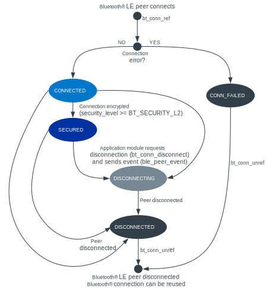

.. _caf_ble_state:

CAF: Bluetooth LE state module
##############################

.. contents::
   :local:
   :depth: 2

The Bluetooth® LE state module is a core Bluetooth module in :ref:`lib_caf` (CAF).
When enabled for an application, the |ble_state| is responsible for the following actions:

* Enabling Bluetooth (:c:func:`bt_enable`)
* Handling Bluetooth connection callbacks (:c:struct:`bt_conn_cb`)
* Propagating information about the connection state and parameters with :ref:`app_event_manager` events

The |ble_state| does not handle Bluetooth advertising or scanning.
If you want to use these functionalities to connect over Bluetooth LE, use :ref:`CAF's Bluetooth LE advertising module <caf_ble_adv>` or Zephyr's :ref:`Bluetooth API <zephyr:bluetooth_api>` directly.

.. note::
   CAF assumes that Bluetooth Peripheral device supports only one simultaneous connection.

Configuration
*************

To use the module, you must enable the following Kconfig options:

* :kconfig:option:`CONFIG_BT`
* :kconfig:option:`CONFIG_BT_SMP` - This option enables Security Manager Protocol support.
* :kconfig:option:`CONFIG_CAF_BLE_STATE` - This option enables the |ble_state| and selects the :kconfig:option:`CONFIG_CAF_BLE_COMMON_EVENTS` Kconfig option, which enables Bluetooth LE common events in CAF.

The following Kconfig options are also available for this module:

* :kconfig:option:`CONFIG_CAF_BLE_STATE_EXCHANGE_MTU` - This option can be used for GATT client (:kconfig:option:`CONFIG_BT_GATT_CLIENT`) to set the Maximum Transmission Unit (MTU) to the maximum possible size that the buffers can hold.
  This option is enabled by default.
* :kconfig:option:`CONFIG_CAF_BLE_USE_LLPM` - This option enables the Low Latency Packet Mode (LLPM).
  If the Bluetooth controller is enabled as part of the application, this option is enabled by default and depends on :kconfig:option:`CONFIG_BT_CTLR_SDC_LLPM`.
  Otherwise, this option is disabled and can be enabled manually.
* :kconfig:option:`CONFIG_CAF_BLE_STATE_SECURITY_REQ` - This option enables setting the security level 2 for a Bluetooth LE connection automatically, right after the connection is established.
  The security level 2 or higher enables connection encryption.
  The device disconnects if establishing the connection security level 2 fails.
* :kconfig:option:`CONFIG_CAF_BLE_STATE_MAX_LOCAL_ID_BONDS` - This option allows to specify the maximum number of allowed bonds per Bluetooth local identity for a Bluetooth Peripheral (:kconfig:option:`CONFIG_BT_PERIPHERAL`).
  If a local identity is already bonded with the maximum number of allowed bonds, new peers are disconnected right after Bluetooth connection is established.

Implementation details
**********************

The |ble_state| is used by both Bluetooth Peripheral and Bluetooth Central devices.

In line with other CAF modules, the |ble_state| uses :ref:`app_event_manager` events to broadcast changes in connection state and parameters.
It also updates connection reference counts to ensure the connections remain valid as long as application modules use them.

Connection state change
=======================

The module propagates information about the connection state changes using :c:struct:`ble_peer_event`.

   Bluetooth connection state handling in CAF

Other application modules can call :c:func:`bt_conn_disconnect` to disconnect the remote peer.
The application module can submit a :c:struct:`ble_peer_event` with :c:member:`ble_peer_event.state` set to :c:enumerator:`PEER_STATE_DISCONNECTING` to let other application modules prepare for the disconnection.

Connection parameter change
===========================

The module submits a :c:struct:`ble_peer_conn_params_event` to inform other application modules about connection parameter update requests and connection parameter updates.

The |ble_state| rejects the connection parameter update request in Zephyr's callback.
An application module can handle the :c:struct:`ble_peer_conn_params_event` and update the connection parameters.

Connection references
=====================

The |ble_state| keeps references to :c:struct:`bt_conn` objects to ensure that they remain valid when other application modules access them.
When a new connection is established, the module calls :c:func:`bt_conn_ref` to increase the object reference counter.
After :c:struct:`ble_peer_event` about disconnection or connection failure is received by all other application modules, the |ble_state| decrements the :c:struct:`bt_conn` object by using :c:func:`bt_conn_unref`.

Low Latency Packet Mode
=======================

If Nordic Semiconductor's SoftDevice Bluetooth LE Link Layer is selected (:kconfig:option:`CONFIG_BT_LL_SOFTDEVICE`) and the :kconfig:option:`CONFIG_CAF_BLE_USE_LLPM` option is enabled, the |ble_state| sends a Bluetooth HCI command to enable the LLPM when Bluetooth is ready.
