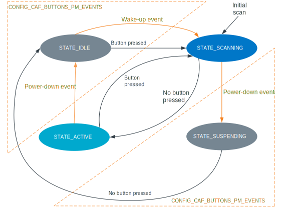

.. _caf_buttons:

CAF: Buttons module
###################

.. contents::
   :local:
   :depth: 2

The buttons module of the :ref:`lib_caf` (CAF) is responsible for generating events related to key presses.
The source of events are changes to GPIO pins.
The module can handle both matrix keyboard and buttons directly connected to GPIO pins.

Configuration
*************

To use the module, you must enable the following Kconfig options:

* :kconfig:option:`CONFIG_CAF_BUTTONS` - This option enables the buttons module.
* :kconfig:option:`CONFIG_GPIO` - This option enables Zephyr's :ref:`zephyr:gpio_api` driver, which is required for interacting with the GPIO pins.

When defining how buttons are connected, you must create a configuration file with the following arrays:

* ``row`` contains pins associated with matrix rows.
* ``col`` contains pins associated with columns, it can be left empty (buttons will be assumed to be directly connected to row pins, one button per pin).

For example, the file contents should look like follows:

.. code-block:: c

	#include <caf/gpio_pins.h>

	static const struct gpio_pin col[] = {
		{ .port = 0, .pin = 31 },
		{ .port = 0, .pin = 24 },
	};

	static const struct gpio_pin row[] = {
		{ .port = 0, .pin = 9  },
		{ .port = 0, .pin = 8  },
		{ .port = 1, .pin = 15 },
		{ .port = 1, .pin = 14 },
	};

You must define both arrays in this configuration file, and specify its location with the :kconfig:option:`CONFIG_CAF_BUTTONS_DEF_PATH` Kconfig option.

.. note::
	The configuration file should be included only by the configured module.
	Do not include the configuration file in other source files.

The following Kconfig options are available for this module:

* :kconfig:option:`CONFIG_CAF_BUTTONS_DEF_PATH`
* :kconfig:option:`CONFIG_CAF_BUTTONS_PM_EVENTS`
* :kconfig:option:`CONFIG_CAF_BUTTONS_SCAN_INTERVAL`
* :kconfig:option:`CONFIG_CAF_BUTTONS_DEBOUNCE_INTERVAL`
* :kconfig:option:`CONFIG_CAF_BUTTONS_POLARITY_INVERSED`
* :kconfig:option:`CONFIG_CAF_BUTTONS_EVENT_LIMIT`

By default, a button press is indicated by a pin switch from the low to the high state.
You can change this with :kconfig:option:`CONFIG_CAF_BUTTONS_POLARITY_INVERSED`, which will cause the application to react to an opposite pin change (from the high to the low state).

Implementation details
**********************

Depending on the configuration, the module can use from two to four states.

   State transitions of the buttons module

By default, the module uses the following states:

* ``STATE_SCANNING``
* ``STATE_ACTIVE``

After initialization, the module starts in ``STATE_SCANNING`` and performs initial scan of configured pins.
If no buttons are pressed the module switches to ``STATE_ACTIVE``.
In this state, the module enables the GPIO interrupts and waits for the pin state to change.

Whenever a button is pressed, the module switches to ``STATE_SCANNING``.
When the switch occurs, the module submits a work with a delay set to :kconfig:option:`CONFIG_CAF_BUTTONS_DEBOUNCE_INTERVAL`.
The work scans the keyboard matrix, or directly connected buttons (depends on configuration).
If any button state change occurs, the module sends an event with the :c:member:`button_event.key_id` of that button.

* If the button is kept pressed while the scanning is performed, the work will be resubmitted with a delay set to :kconfig:option:`CONFIG_CAF_BUTTONS_SCAN_INTERVAL`.
* If no button is pressed, the module switches back to ``STATE_ACTIVE``.

Key ID
======

The :c:member:`button_event.key_id` is an unique 2-byte value that depends on the module configuration described in the configuration file.

The following table breaks down the :c:member:`button_event.key_id` bits.

+------------------------------+
| key_id                       |
+---------+---------+----+-----+
| 0 .. 6  | 7 .. 13 | 14 | 15  |
+=========+=========+====+=====+
| Row idx | Col idx | Reserved |
+---------+---------+----------+

In this :c:member:`button_event.key_id` value:

* The first seven least significant bits (``Row idx``) encode the index of the ``row`` array that corresponds to the GPIO port and the pin to which the button's row is connected.
* The next seven bits (``Col idx``) encode the index of the ``col`` array that corresponds to the GPIO port and the pin to which the button's column is connected.
  If the buttons are directly connected they are denoted only by ``row`` array index, ``col`` array index bits are set to zero.
* The last two bits are reserved for application-specific usage.

For example, if the configuration file looks as described in the `Configuration`_ section of this documentation, an event :c:struct:`button_event` with the :c:member:`button_event.key_id` value equal to ``0x0083`` indicates the following information:

* The button row pin is connected to the GPIO that is at index 3 in the ``row`` array from the configuration file.
  That is, the row port and pin are ``1`` and ``14``, respectively.
* The button column pin is connected to the GPIO that is at index 1 in the ``col`` array from the configuration file.
  That is, the column port and pin are ``0`` and ``24``, respectively.

Power management states
=======================

If the :kconfig:option:`CONFIG_CAF_BUTTONS_PM_EVENTS` Kconfig option is enabled, the module can react to power management events and submit :c:struct:`wake_up_event`.
In that case, the following additional states are available:

* ``STATE_SUSPENDING``
* ``STATE_IDLE``

The power management events that module can react to are the following:

* :c:struct:`power_down_event`
* :c:struct:`wake_up_event`

If a :c:struct:`power_down_event` comes while the module is in the ``STATE_SCANNING`` state, the module switches to ``STATE_SUSPENDING`` and remains in this state until no button is pressed.
Then, it switches to ``STATE_IDLE``.

If a :c:struct:`power_down_event` comes while the module is in the ``STATE_ACTIVE`` state, the module switches to ``STATE_IDLE`` immediately.
Similarly, as in ``STATE_ACTIVE``, in ``STATE_IDLE`` the module enables the GPIO interrupts and waits for the pin state to change.
However, in ``STATE_IDLE`` the module can also invoke :c:struct:`wake_up_event` and send it to all subscribing modules.
