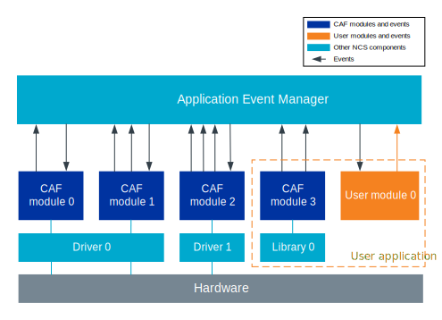

.. _caf_overview:

Common Application Framework overview
#####################################

.. contents::
   :local:
   :depth: 2

Common Application Framework (CAF) is a set of ready-for-use modules and events built on top of :ref:`event_manager`.
Using CAF allows you to have a consistent event-based architecture in your application.

An example of the application that is using the CAF modules in |NCS| is :ref:`nrf_desktop`.

Architecture
************

In an event-based application, parts of the application functionality are separated into isolated modules that communicate with each other using Event Manager's events.
These events are defined either by CAF or by the application.
They are submitted by modules and other modules can subscribe and react to them.

   Common Application Framework architecture example

Every CAF module can use additional libraries or drivers.
The drivers can be used to communicate with hardware.
The module can then broadcast information from the driver using events (for example, the :ref:`buttons module <caf_buttons>` can submit a :c:struct:`button_event` on a button press).
It can also forward information from application to the driver (for example, the :ref:`LEDs module <caf_leds>` can display a given LED effect upon receiving :c:struct:`led_event`).

In your application, you can use any number of CAF modules together with your own custom modules.
Custom modules can use both CAF and custom events.
The figure shows an example application that uses one CAF module and one custom module, which has one custom event.

Enabling CAF
************

To enable CAF, complete the following steps:

1. Enable :kconfig:`CONFIG_CAF` Kconfig option in your project configuration file.
#. Enable and initialize Event Manager.
   See :ref:`event_manager_configuration` for more details.
#. Submit the first :c:struct:`module_state_event`.

Submit ``module_state_event``
=============================

CAF modules are initialized when they receive a :c:struct:`module_state_event` that reports ``MODULE_STATE_READY`` of the module ``main``.
For this to happen, you need to do the following:

1. Add the following in your :file:`main.c` file:

.. code-block:: c

   #define MODULE main
   #include <caf/events/module_state_event.h>

#. Call the following function after Event Manager is initialized:

.. code-block:: c

   module_set_state(MODULE_STATE_READY);

This function call submits the required :c:struct:`module_state_event`.
For an example implementation, see :file:`applications/nrf_desktop/src/main.c`.

CAF modules
***********

CAF supports a set of :ref:`predefined modules <lib_caf>`.
Each of these modules is available for use out of the box and needs to be enabled and configured separately.

There is no limit to the number of modules and events that can be used.
However, Event Manager sets the limit of event types in an application to 32, and CAF inherits this limitation.

Configuration of CAF modules
============================

Each module must be configured separately.
When configuring CAF modules, you will be asked to use the following configuration methods:

* Edit Devicetree Specification (DTS) files - These files reflect the hardware configuration.
  See :ref:`zephyr:dt-guide` for more information about the DTS data structure.
* Edit :file:`_def` files - These files contain configuration arrays for the application modules and are specific to CAF.
* Select Kconfig options or modify Kconfig files, or both - These reflect the software configuration.
  See :ref:`kconfig_tips_and_tricks` for information about how to configure them.

CAF modules can use all or some of these methods.
For example, enabling the :ref:`caf_ble_adv` requires enabling Kconfig options and creating a configuration file, while :ref:`caf_ble_state` can be configured using only Kconfig options.

Adding custom modules
*********************

As part of your application, you can add your own custom modules.
These modules can communicate using Event Manager's events.
However, if you want to add custom modules that communicate with CAF modules using CAF events, you must make sure that they meet the following requirements:

* A custom module must register as Event Manager's listener and subscribe for CAF events that should be handled by that custom module.
  You can subscribe for a CAF event in the same way as you subscribe for any other Event Manager event.
  See the :ref:`event_manager_register_module_as_listener` documentation for instructions about how to configure this.
* The module must work with :c:struct:`module_state_event`.
  It must submit it and react to it.

.. note::
    If you want a module to react to a CAF event, check the event's documentation for information about the event.

CAF events
**********

Listed below are all available CAF events grouped by module, including details about events and how to handle them.

CAF Bluetooth LE common events
==============================

| Header file: :file:`include/caf/events/ble_common_event.h`
| Source file: :file:`subsys/caf/events/ble_common_event.c`

.. doxygengroup:: caf_ble_common_event
   :project: nrf
   :members:

CAF button events
=================

| Header file: :file:`include/caf/events/button_event.h`
| Source file: :file:`subsys/caf/events/button_event.c`

.. doxygengroup:: caf_button_event
   :project: nrf
   :members:

CAF click events
================

| Header file: :file:`include/caf/events/click_event.h`
| Source file: :file:`subsys/caf/events/click_event.c`

.. doxygengroup:: caf_click_event
   :project: nrf
   :members:

CAF LED events
==============

| Header file: :file:`include/caf/events/led_event.h`
| Source file: :file:`subsys/caf/events/led_event.c`

.. doxygengroup:: caf_led_event
   :project: nrf
   :members:

CAF module state events
=======================

| Header file: :file:`include/caf/events/module_state_event.h`
| Source file: :file:`subsys/caf/events/module_state_event.c`

.. doxygengroup:: caf_module_state_event
   :project: nrf
   :members:

CAF power events
================

| Header file: :file:`include/caf/events/power_event.h`
| Source file: :file:`subsys/caf/events/power_event.c`

.. doxygengroup:: caf_power_event
   :project: nrf
   :members:

CAF sensor events
=================

| Header file: :file:`include/caf/events/sensor_event.h`
| Source file: :file:`subsys/caf/events/sensor_event.c`

.. doxygengroup:: caf_sensor_event
   :project: nrf
   :members:
