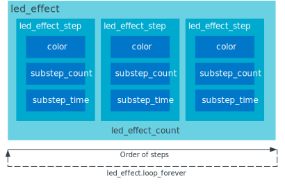

.. _caf_leds:

CAF: LEDs module
################

.. contents::
   :local:
   :depth: 2

The LEDs module of the :ref:`lib_caf` (CAF) is responsible for controlling LEDs in response to LED effect set by a ``led_event``.
The source of such events could be any other module in |NCS|.

The module uses Zephyr's :ref:`zephyr:led_api` driver for setting the LED color, either RGB or monochromatic.
Zephyr's LED driver can use the implementation based on either GPIO or PWM.
Use the PWM-based implementation to achieve smooth changes of brightness.
Use the GPIO-based implementation if your board does not support PWM or if you want to control LEDs connected using the GPIO expander.

Configuration
*************

To use the module, you must fulfill the following requirements:

1. Enable the following Kconfig options:

   * :kconfig:option:`CONFIG_CAF_LEDS` - This option enables the LEDs module.
   * :kconfig:option:`CONFIG_LED` - This option enables the LED driver API.

#. Complete one of the following steps to choose and configure the LED driver implementation:

   a. For the PWM-based implementation, Zephyr's :ref:`zephyr:pwm_api` driver is used for setting the LED color (that is, the brightness of the diodes).
      For this reason, set the following options:

      * :kconfig:option:`CONFIG_CAF_LEDS_PWM`
      * :kconfig:option:`CONFIG_LED_PWM`
      * :kconfig:option:`CONFIG_PWM`

   b. For the GPIO-based implementation, Zephyr's :ref:`zephyr:gpio_api` driver is used for setting the LED color (that is, the brightness of the diodes).
      For this reason, set the following options:

      * :kconfig:option:`CONFIG_CAF_LEDS_GPIO`
      * :kconfig:option:`CONFIG_LED_GPIO`
      * :kconfig:option:`CONFIG_GPIO`

#. Configure LEDs in DTS.
   See `Configuring LEDs in DTS`_ for details.

The following Kconfig options are also available for this module:

* :kconfig:option:`CONFIG_CAF_LEDS_PM_EVENTS` - This option enables the reaction to `Power management events`_.

.. note::
   The GPIO-based LED driver implementation supports only turning LED on or off.
   Smooth changes of brightness are not supported, because of hardware limitations.
   Therefore, the LED effects that use smooth changes of LED brightness are not properly displayed by this implementation.

Configuring LEDs in DTS
=======================

Zephyr's LEDs are configured using compatible DTS nodes.
You must enable or create DTS nodes for the configuration to work.
You can do this in the devicetree file, either in the board-specific :file:`dts` file or in a DTS overlay file.
Using the option with the overlay file merges the settings to configuration.
For more help, see :ref:`zephyr:dt-guide`.

The value of the ``compatible`` property of the DTS node depends on the selected LED driver implementation.
For example, you can use a node that is compatible with ``pwm-leds`` to configure LEDs controlled with PWM.
See the following subsections for more detailed information about configuring LED driver implementations supported by CAF LEDs.

The LEDs module assumes that a single DTS node is a separate and complete logical LED.
The LEDs module expects that the node will hold configuration of HW LEDs responsible for reproducing all required color channels.
The number of HW LEDs configured to reproduce color channels can be either one or three (either monochromatic or following the RGB order, with the red channel defined first, then the green one, then the blue one).
If only one HW LED is used for a monochromatic setting, the module converts the tri-channel color to a single value of brightness and passes it to this single HW LED.
The LED color channels are represented as child nodes of the compatible DTS node.

Configuring PWM LEDs
--------------------

To properly use the LEDs module and have LEDs driven by PWM, you must configure the PWM driver and the LED PWM driver.

Configuring the PWM driver specifies which PWM channel is related to which GPIO pin.
Configuring the LED PWM driver defines which PWM port is to be used for each LED and selects the GPIO pin for usage.
In case of the LED PWM driver, the GPIO pin must match the one passed to the PWM driver.

The configuration process requires enabling the PWM ports and enabling or creating the LED PWM nodes.
Make sure to configure all PWM ports and channels that are used by the application.

Enabling the PWM ports
~~~~~~~~~~~~~~~~~~~~~~

To enable the PWM ports, you must set the PWM port status to ``"okay"`` in the devicetree file and configure an appropriate pin control configuration.

The following code snippets show examples of the DTS nodes:

* Example 1 (enabling an existing port node):

  .. code-block:: devicetree

	&pinctrl {
		pwm0_default_alt: pwm0_default_alt {
			group1 {
				psels = <NRF_PSEL(PWM_OUT0, 0, 8)>;
			};
		};

		pwm0_sleep_alt: pwm0_sleep_alt {
			group1 {
				psels = <NRF_PSEL(PWM_OUT0, 0, 8)>;
				low-power-enable;
			};
		};
	};

	&pwm0 {
		status = "okay";
		pinctrl-0 = <&pwm0_default_alt>;
		pinctrl-1 = <&pwm0_sleep_alt>;
		pinctrl-names = "default", "sleep";
	};

  In this example, the ``pwm0`` has its channel 0 bound to the GPIO pin number ``8``.
* Example 2 (enabling an existing port node):

  .. code-block:: devicetree

	&pinctrl {
		pwm0_default_alt: pwm0_default_alt {
			group1 {
				psels = <NRF_PSEL(PWM_OUT0, 0, 11)>,
					<NRF_PSEL(PWM_OUT1, 0, 26)>,
					<NRF_PSEL(PWM_OUT2, 0, 27)>;
				nordic,invert;
			};
		};

		pwm0_sleep_alt: pwm0_sleep_alt {
			group1 {
				psels = <NRF_PSEL(PWM_OUT0, 0, 11)>,
					<NRF_PSEL(PWM_OUT1, 0, 26)>,
					<NRF_PSEL(PWM_OUT2, 0, 27)>;
				low-power-enable;
			};
		};

		pwm1_default_alt: pwm1_default_alt {
			group1 {
				psels = <NRF_PSEL(PWM_OUT0, 0, 4)>;
			};
		};

		pwm1_sleep_alt: pwm1_sleep_alt {
			group1 {
				psels = <NRF_PSEL(PWM_OUT0, 0, 4)>;
				low-power-enable;
			};
		};
	};

	&pwm0 {
		status = "okay";
		pinctrl-0 = <&pwm0_default_alt>;
		pinctrl-1 = <&pwm0_sleep_alt>;
		pinctrl-names = "default", "sleep";
	};

	&pwm1 {
		status = "okay";
		pinctrl-0 = <&pwm1_default_alt>;
		pinctrl-1 = <&pwm1_sleep_alt>;
		pinctrl-names = "default", "sleep";
	};

Enabling the LED PWM nodes
~~~~~~~~~~~~~~~~~~~~~~~~~~

To enable the LED PWM nodes in the devicetree file, you must set their status to ``"okay"`` in the devicetree file and specify to which PWM node they are related to.
You can also decide to create these nodes from scratch.
There is no limit to the number of node instances you can create.

For the LEDs to be configured correctly, make sure that LED PWM node channel numbers in the :file:`dts` file are matching the PWM nodes set when `Enabling the PWM ports`_.

The following code snippets show examples of the DTS nodes:

* Example 1 (enabling existing LED PWM node):

  .. code-block:: none

	&pwm_led0 {
		status = "okay";
		pwms = <&pwm0 0 PWM_MSEC(20) PWM_POLARITY_NORMAL>;
		label = "LED0";
	};

  In this example, the ``pwms`` property is pointing to the ``pwm0`` PWM node set in Example 1 in `Enabling the PWM ports`_, with the respective channel number (``0``).
* Example 2 (creating new LED PWM nodes):

  .. code-block:: none

	pwmleds0 {
		compatible = "pwm-leds";
		status = "okay";

		pwm_led0: led_pwm_0 {
			status = "okay";
			pwms = <&pwm0 0 PWM_MSEC(1) PWM_POLARITY_INVERTED>;
			label = "LED0 red";
		};

		pwm_led1: led_pwm_1 {
			status = "okay";
			pwms = <&pwm0 1 PWM_MSEC(1) PWM_POLARITY_INVERTED>;
			label = "LED0 green";
		};

		pwm_led2: led_pwm_2 {
			status = "okay";
			pwms = <&pwm0 2 PWM_MSEC(1) PWM_POLARITY_INVERTED>;
			label = "LED0 blue";
		};
	};

	pwmleds1 {
		compatible = "pwm-leds";
		status = "okay";

		pwm_led3: led_pwm_3 {
			status = "okay";
			pwms = <&pwm1 0 PWM_MSEC(20) PWM_POLARITY_NORMAL>;
			label = "LED1";
		};
	};

  In this example, ``pwmleds0`` is a tri-channel color LED node, while ``pwmleds1`` is a monochromatic LED node.
  Both ``pwmleds`` nodes are pointing to the ``pwms`` properties corresponding to PWM nodes set in Example 2 in `Enabling the PWM ports`_, with the respective channel numbers.

.. note::
   Set the PWM period for the LED to a smaller value, such as 1 millisecond, to avoid glitches during tri-channel LED color updates.
   Because of the limitations of Zephyr's :ref:`zephyr:pwm_api`, color channels are not updated simultaneously.
   The first LED channel is updated one PWM period before other channels.
   A short LED PWM period mitigates the glitches.

Configuring GPIO LEDs
---------------------

To properly use the LEDs module and have LEDs driven by GPIO, you must configure the GPIO driver and the LED GPIO driver.

Enabling the GPIOs
~~~~~~~~~~~~~~~~~~

In general, boards in Zephyr configure and enable the GPIO drivers by default, so no additional configuration is needed.
You can also use the LED GPIO driver to control LEDs connected using a GPIO expander supported by Zephyr.
For example, the DTS configuration of the ``thingy52_nrf52832`` board supports ``sx1509b`` GPIO expander, which is used to control lightwell RGB LEDs.

Enabling the LED GPIO nodes
~~~~~~~~~~~~~~~~~~~~~~~~~~~

To enable the LED GPIO nodes in the devicetree file, you must set their status to ``"okay"`` and specify to which GPIO nodes they are related to.
You can also decide to create these nodes from scratch.
There is no limit to the number of node instances you can create.

The LED GPIO is configured as a node that is compatible with ``gpio-leds``.
The following code snippets show examples of DTS nodes:

* Example 1 - RGB LED controlled using GPIO expander (``sx1509b``)

  .. code-block:: none

	leds0 {
		compatible = "gpio-leds";
		label = "Lightwell RGB";
		status = "okay";

		led0: led_0 {
			gpios = <&sx1509b 7 GPIO_ACTIVE_LOW>;
			label = "Red LED";
		};
		led1: led_1 {
			gpios = <&sx1509b 5 GPIO_ACTIVE_LOW>;
			label = "Green LED";
		};
		led2: led_2 {
			gpios = <&sx1509b 6 GPIO_ACTIVE_LOW>;
			label = "Blue LED";
		};
	};

* Example 2 - Monochromatic LED connected directly to the GPIO of an MCU

  .. code-block:: none

	leds1 {
		compatible = "gpio-leds";
		label = "Green LED";
		status = "okay";

		led0: led_0 {
			gpios = <&gpio0 13 GPIO_ACTIVE_LOW>;
			label = "Green LED 0";
		};
	};

Make sure to configure all the LED GPIO nodes that are used by the application.

.. note::
   In general, boards defined by Zephyr define a ``leds`` node that is compatible with ``gpio-leds``.
   The node can also be used by the module.
   Before enabling the node, make sure it meets the requirements of the CAF LEDs module.

Implementation details
**********************

The LED effect defines the LED behavior over time for the LEDs by setting their brightness level periodically.
This allows for different RGB or monochromatic colors.
An example may be an LED that is blinking or breathing with a given color.
Such LED behavior is referred to as *LED effect*.

The LED color is achieved by setting the proper pulse widths for the PWM signals.
To achieve the desired LED effect, colors for the given LED are periodically updated using work (:c:struct:`k_work_delayable`).
One work automatically updates the color of a single LED.

.. note::
   If you use the GPIO-based implementation, the signal's duty cycle can be either 0% or 100% and the LED can be either turned on or off.

If the application goes to the error state, the LEDs are used to indicate error.

LED effect
==========

The LED effect (:c:struct:`led_effect`) is described by the following characteristics:

* Pointer to an array of LED steps (:c:member:`led_effect.steps`).
* Size of the array (:c:member:`led_effect.step_count`).
* Flag indicating if the sequence should start over after it finishes (:c:member:`led_effect.loop_forever`).

To achieve the desired LED effect, the LED color is updated periodically based on the LED steps defined for the given LED effect, which in turn are divided in multiple smaller updates called *substeps*.

   Characteristics of a led_effect

During every substep, the next LED color is calculated using a linear approximation between the current LED color and the :c:member:`led_effect_step.color` described in the next LED step.
A single LED step also defines the number of substeps for color change between the given LED step and the previous one (:c:member:`led_effect_step.substep_count`), as well as the period of time between color updates (:c:member:`led_effect_step.substep_time`).
After achieving the color described in the next step, the index of the next step is updated.

After the last step, the sequence restarts if the :c:member:`led_effect.loop_forever` flag is set for the given LED effect.
If the flag is not set, the sequence stops and the given LED effect ends.

Power management events
=======================

If the :kconfig:option:`CONFIG_CAF_LEDS_PM_EVENTS` Kconfig option is enabled, the module can react to following power management events:

* ``power_down_event``
* ``wake_up_event``

If a ``power_down_event`` comes, the module turns LEDs off.
The PWM drivers are set to the suspended state to reduce power consumption.

If a ``wake_up_event`` comes, PWM drivers are set to state active and LED effects are updated.
