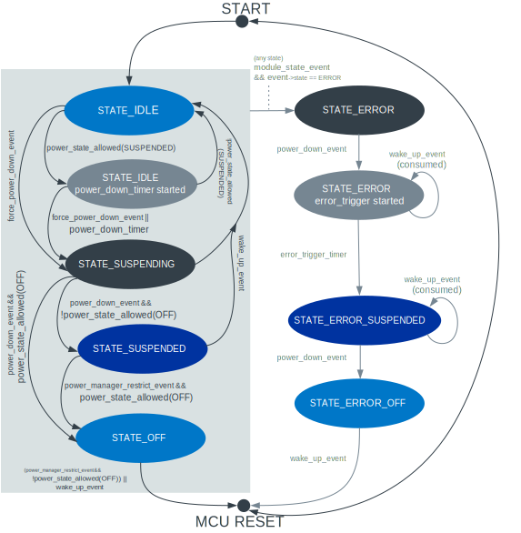

.. _caf_power_manager:

CAF: Power manager module
#########################

.. contents::
   :local:
   :depth: 2

The |power_manager| of the :ref:`lib_caf` (CAF) is responsible for reducing the energy consumption of battery-powered devices.
The module achieves this reduction by switching to low power modes when the device is not used for a longer period of time.

Configuration
*************

You can enable the |power_manager| by selecting the :kconfig:`CONFIG_CAF_POWER_MANAGER` option in the configuration.

This module uses Zephyr's :ref:`zephyr:pm_api` subsystem.

Timeout configuration options
=============================

With the :kconfig:`CONFIG_CAF_POWER_MANAGER_TIMEOUT` configuration option, you can set the period of time after which the application enters the low power mode.
By default, the timeout is set to 120 seconds.

The :kconfig:`CONFIG_CAF_POWER_MANAGER_ERROR_TIMEOUT` sets the period of time after which the device is turned off upon an internal error.

Optional boolean for keeping the system on
==========================================

The :kconfig:`CONFIG_CAF_POWER_MANAGER_STAY_ON` lets the system stay on also when there are no active connections.

For more information about configuration options, check the help in the configuration tool.

Implementation details
**********************

The |power_manager| is started when the "main" is ready (which is reported using :c:struct:`module_state_event`).

When started, it can do the following operations:

* Manage `Power states`_
* Trigger `Switching to low power`_
* Handle `Wake-up scenarios`_ from suspended or off states

Power states
============

The application can be in the following power states:

* `Idle`_
* `Suspended`_
* `Off`_
* `Error`_

The |power_manager| takes control of the overall operating system power state.

   Power manager state handling in CAF

See the following section for more details about how the application state converts to the system power state.

Idle
----

In this state, the board power management is left totally to the operating system.
The peripherals can be turned on, including LEDs.

The application remains in this state indefinitely if any of the modules has restricted the allowed power level to :c:enum:`POWER_MANAGER_LEVEL_ALIVE`.

If no module blocks other power states, the power-down counter is active.
On timeout, the |power_manager| sets the application to either the suspended or the off state.
There are some events that reset the power-down counter:

* :c:struct:`keep_alive_event`
* The moment when the last module stops restricting :c:enum:`POWER_MANAGER_LEVEL_ALIVE` - that is, at the moment when any power-down state is allowed, the counter is cleared too.

Suspended
---------

Upon power-down timeout, the |power_manager| switches the application to the suspended state if there is at least one module that restricts power-down levels to :c:enum:`POWER_MANAGER_LEVEL_SUSPENDED` and there is no module that restricts power below level to any higher state (:c:enum:`POWER_MANAGER_LEVEL_ALIVE`).

The other modules of the application, if applicable, will turn off the peripherals or switch them to standby to conserve power.
The operating system is kept in the :c:enum:`PM_STATE_ACTIVE` state.

It is assumed that the operating system will conserve power by setting the CPU state to idle whenever possible.
The established connection is maintained.

Off
---

Upon power-down timeout, the |power_manager| switches the application to the deep sleep mode if no module restricts it.
This means that all the modules are restricted to :c:enum:`POWER_MANAGER_LEVEL_OFF` or :c:enum:`POWER_MANAGER_LEVEL_MAX`.

If applicable, the other modules of the application turn off the peripherals or switch them to standby to conserve power.
The operating system switches to the :c:enum:`POWER_STATE_DEEP_SLEEP_1` state.
The devices are suspended and the CPU is switched to the deep sleep (off) mode.

A device reboot is required to exit this state.

Error
-----

The |power_manager| checks if any application modules have reported an error condition.

When any application module switches to the error state (that is, broadcasts :c:enum:`MODULE_STATE_ERROR` through :c:struct:`module_state_event`), the |power_manager| puts the application into the error state.
Then, after the period of time defined by :kconfig:`CONFIG_CAF_POWER_MANAGER_ERROR_TIMEOUT`, it puts the application to the off state.
During this period, other modules can report the error condition to the user (for example, :ref:`caf_leds` can keep working in the error state).

Restricting power states
========================

Any registered module can restrict the power state allowed by the usage of :c:struct:`power_manager_restrict_event`.
It provides the module ID and the deepest allowed power state.
The |power_manager| uses flags to restrict modes for any module.
This means that you can repeatedly send the :c:struct:`power_manager_restrict_event`.

Switching to low power
======================

When the |power_manager| detects that the application is about to enter the low power state (either suspended or off), it sends a :c:struct:`power_down_event`.
Other application modules react to this event by changing their configuration to low power, for example by turning off LEDs.

Some modules might not be ready to switch to the lower power state.
In such case, the module that is not yet ready should consume the :c:struct:`power_down_event` and change its internal state, so that it enters the low power state when ready.

After entering the low power state, each module must report this by sending a :c:struct:`module_state_event`.
The |power_manager| continues with the low power state change when it gets a notification that the module switched to the low power.

Only after all modules confirmed that they have entered the low power state (by not consuming the :c:struct:`power_down_event`), the |power_manager| sets the required application's state.

If a disconnection happens while the device is in the suspended state, the |power_manager| switches the application to the off state.

However, the application can also be configured to keep the system in the suspended state when there are no active connections, instead of switching to the off state.
To select this behavior, use the :kconfig:`CONFIG_CAF_POWER_MANAGER_STAY_ON` configuration option.

Wake-up scenarios
=================

The application can be woken up in the following scenarios:

* `Wake-up from the suspended state`_
* `Wake-up from the off state`_

Wake-up from the suspended state
--------------------------------

Any module can trigger the application to switch from the suspended state back to the idle state by submitting a :c:struct:`wake_up_event`.
This is normally done on some external event, for example upon interaction from the user of the device.

The application modules receive a :c:struct:`wake_up_event`, which switches them back to the normal operation.
The |power_manager| sets the application to the idle state.
This also restarts the power-down counter if the device is not connected through USB.

Wake-up from the off state
--------------------------

In the off state, the CPU is not running and the CPU reboot is required.

Before the application enters the off state, at least one module must configure the peripheral under its control, so that it issues a hardware-related event capable of rebooting the CPU (that is, capable of leaving the CPU off mode).
After the reboot, the application initializes itself again.

.. |power_manager| replace:: power manager module
