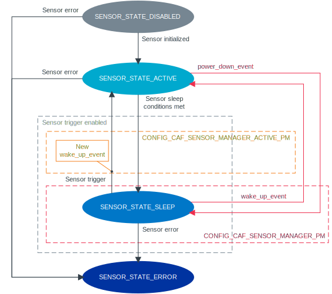

.. _caf_sensor_manager:

CAF: Sensor manager module
##########################

.. contents::
   :local:
   :depth: 2

The |sensor_manager| of the :ref:`lib_caf` (CAF) generates the following types of events in relation with the sensor defined in the module configuration:

* :c:struct:`sensor_event` when the sensor is sampled.
* :c:struct:`sensor_state_event` when the sensor state changes.

Configuration
*************

The following Kconfig options are required:

* :kconfig:option:`CONFIG_CAF_SENSOR_MANAGER` - This option enables the |sensor_manager|.
* :kconfig:option:`CONFIG_SENSOR` - This option enables Zephyr's :ref:`zephyr:sensor` driver, which is required for interacting with the sensors.

The following Kconfig options are also available for the module:

* :kconfig:option:`CONFIG_CAF_SENSOR_MANAGER_DEF_PATH`
* :kconfig:option:`CONFIG_CAF_SENSOR_MANAGER_THREAD_STACK_SIZE`
* :kconfig:option:`CONFIG_CAF_SENSOR_MANAGER_THREAD_PRIORITY`
* :kconfig:option:`CONFIG_CAF_SENSOR_MANAGER_PM`
* :kconfig:option:`CONFIG_CAF_SENSOR_MANAGER_ACTIVE_PM`

To use the module, you must complete the following requirements:

1. Physically connect the sensor.
#. Add and enable the sensor in the devicetree file.
   For example, in the :file:`BOARD.dts` file.
   For more information about adding sensor device to devicetree, refer to :ref:`zephyr:use-dt-overlays`.
#. Enable the :kconfig:option:`CONFIG_CAF_SENSOR_MANAGER` and :kconfig:option:`CONFIG_SENSOR` Kconfig options.
#. Enable the sensor of your choice in Kconfig.
   Each sensor has its own set of Kconfig options.
#. Add the configuration file that contains an array of :c:struct:`sm_sensor_config` for the sensor that you want to use in your application by completing the following steps:

   a. Add a file that defines the following information in an array of :c:struct:`sm_sensor_config` for every sensor that you want to be handled by the |sensor_manager|:

      * :c:member:`sm_sensor_config.dev_name` - Sensor device name.
        The name must match the sensor label in the :file:`BOARD.dts` file.
      * :c:member:`sm_sensor_config.event_descr` - Sensor event description.
        The event description is used to identify the sensor in the application.
      * :c:member:`sm_sensor_config.chans` - Channel configuration.
        This is an array of :c:struct:`caf_sampled_channel` struct that configures the sensor channel with the following information:

        * :c:member:`caf_sampled_channel.chan` - Sensor channel.
          Depends on the particular sensor.
        * :c:member:`caf_sampled_channel.data_cnt` - Number of values in :c:member:`caf_sampled_channel.chan`.

      * :c:member:`sm_sensor_config.chan_cnt` - Size of the :c:member:`sm_sensor_config.chans` array.
      * :c:member:`sm_sensor_config.sampling_period_ms` - Sensor sampling period, in milliseconds.
      * :c:member:`sm_sensor_config.active_events_limit` - Maximum number of unprocessed :c:struct:`sensor_event`.

      For example, the file content could look like follows:

      .. code-block:: c

         #include <caf/sensor_manager.h>
         static const struct caf_sampled_channel accel_chan[] = {
                 {
                         .chan = SENSOR_CHAN_ACCEL_XYZ,
                         .data_cnt = 3,
                 },
         };
         static const struct sm_sensor_config sensor_configs[] = {
                 {
                         .dev_name = "LIS2DH12-ACCEL",
                         .event_descr = "accel_xyz",
                         .chans = accel_chan,
                         .chan_cnt = ARRAY_SIZE(accel_chan),
                         .sampling_period_ms = 20,
                         .active_events_limit = 3,
                 },
         };

   #. Specify the location of the file with the :kconfig:option:`CONFIG_CAF_SENSOR_MANAGER_DEF_PATH` Kconfig option.

.. note::
     |only_configured_module_note|

.. _caf_sensor_manager_configuring_trigger:

Enabling sensor trigger
=======================

The |sensor_manager| supports the sensor trigger functionality.
This functionality allows the |sensor_manager| to stop sampling a specific sensor when specified conditions are met.
For more details about the sensor trigger, see Zephyr's :ref:`zephyr:sensor` driver.

.. note::
   Not all sensors support the trigger functionality.
   For more details, see the sensor-specific Kconfig file.

To use the sensor trigger, complete the following steps:

1. Enable the sensor trigger option in the sensor-specific Kconfig file.
   The Kconfig option name is different for each sensor.
   For example, for the LIS2DH accelerometer, set the :kconfig:option:`CONFIG_LIS2DH_TRIGGER_GLOBAL_THREAD` option to ``y``.
#. Extend the module configuration file by adding :c:member:`sm_sensor_config.trigger` in an array of :c:struct:`sm_sensor_config`.
   :c:member:`sm_sensor_config.trigger` configures the sensor trigger with the following information:

      * ``.cfg`` information that depends on the particular sensor API:

        * :c:member:`sm_trigger.cfg.type` - Trigger type.
          The type depends on the particular sensor.
        * :c:member:`sm_trigger.cfg.chan` - Channel on which the trigger is set.
          The channel depends on the particular sensor.

      * ``.activation`` information that depends on the |sensor_manager|:

        * :c:member:`sm_trigger.activation.type` - Sensor value comparison method.
          See `Sensor trigger activation`_ for more details.
        * :c:member:`sm_trigger.activation.thresh` - Sensor trigger activation threshold.
        * :c:member:`sm_trigger.activation.timeout_ms` - Time after which the sensor is put to sleep.

   For example, the extended configuration file for the LIS2DH accelerometer could look like follows:

   .. code-block:: c

        #include <caf/sensor_manager.h>

        static const struct caf_sampled_channel accel_chan[] = {
                {
                        .chan = SENSOR_CHAN_ACCEL_XYZ,
                        .data_cnt = 3,
                },
        };

        static struct sm_trigger trig = {
                .cfg = {
                        .type = SENSOR_TRIG_DELTA,
                        .chan = SENSOR_CHAN_ACCEL_XYZ,
                },
                .activation = {
                        .type = ACT_TYPE_ABS,
                        .thresh = 0.5,
                        .timeout_ms = 4000,
                },
        };

        static const struct sm_sensor_config sensor_configs[] = {
                {
                        .dev_name = "LIS2DH12-ACCEL",
                        .event_descr = "accel_xyz",
                        .chans = accel_chan,
                        .chan_cnt = ARRAY_SIZE(accel_chan),
                        .sampling_period_ms = 20,
                        .active_events_limit = 3,
                        .trigger = &trig,
                },
        };

.. note::
    |only_configured_module_note|

Enabling passive power management
=================================

The |sensor_manager| can react to :c:struct:`power_down_event` and :c:struct:`wake_up_event`.
This functionality is called *passive power management* and allows the |sensor_manager| to manage sensors state.
See `Passive power management`_ for more information.

The configuration scenario depends on whether you configured and enabled the sensor trigger:

* If you :ref:`enabled the sensor trigger <caf_sensor_manager_configuring_trigger>` for your sensor, enable the :kconfig:option:`CONFIG_CAF_SENSOR_MANAGER_PM` Kconfig option to use passive power management.
* If you did not enable the sensor trigger functionality, you need to manually configure passive power management.

Manually configuring passive power management
---------------------------------------------

To manually configure the passive power management functionality, complete the following steps:

1. Enable :kconfig:option:`CONFIG_CAF_SENSOR_MANAGER_PM` Kconfig option.
#. Extend the module configuration file of the sensor of your choice by adding :c:member:`sm_sensor_config.suspend` in an array of :c:struct:`sm_sensor_config`.
   For example, the extended configuration file for the LIS2DH accelerometer could look like follows:

   .. code-block:: c

        #include <caf/sensor_manager.h>

        static const struct sm_sensor_config sensor_configs[] = {
                {
                        .dev_name = "LIS2DH12-ACCEL",
                        .event_descr = "accel_xyz",
                        .chans = accel_chan,
                        .chan_cnt = ARRAY_SIZE(accel_chan),
                        .sampling_period_ms = 20,
                        .active_events_limit = 3,
                        .suspend = true,
                },
        };

If :c:member:`sm_sensor_config.suspend` is true, the sensor is suspended when :c:struct:`power_down_event` is received.
The default value for :c:member:`sm_sensor_config.suspend` is ``false``.

.. note::
    |device_pm_note|

Enabling active power management
================================

The |sensor_manager| can create :c:struct:`power_manager_restrict_event` and :c:struct:`wake_up_event`.
This functionality is called *active power management*.
See `Active power management`_ for more information.

To use the active power management in the |sensor_manager|, enable the :kconfig:option:`CONFIG_CAF_SENSOR_MANAGER_ACTIVE_PM` Kconfig option.

Implementation details
**********************

The |sensor_manager| starts in reaction to :c:struct:`module_state_event`.
When started, it can do the following operations:

* Periodically sample the configured sensors.
* Submit :c:struct:`sensor_event` when the sensor channels are sampled.
* Submit :c:struct:`sensor_state_event` if the sensor state changes.

The |sensor_manager| samples sensors periodically, according to the configuration specified for each sensor.
Sampling of the sensors is done from a dedicated preemptive thread.
You can change the thread priority by setting the :kconfig:option:`CONFIG_CAF_SENSOR_MANAGER_THREAD_PRIORITY` Kconfig option.
Use the preemptive thread priority to make sure that the thread does not block other operations in the system.

For each sensor, the |sensor_manager| limits the number of :c:struct:`sensor_event` events that it submits, but whose processing has not been completed.
This is done to prevent out-of-memory error if the system workqueue is blocked.
The limit value for the maximum number of unprocessed events for each sensor is placed in the :c:member:`sm_sensor_config.active_events_limit` structure field in the configuration file.
The ``active_sensor_events_cnt`` counter is incremented when :c:struct:`sensor_event` is sent and decremented when the event is processed by the |sensor_manager| that is the final subscriber of the event.
A situation can occur that the ``active_sensor_events_cnt`` counter will already be decremented but the memory allocated by the event would not yet be freed.
Because of this behavior, the maximum number of allocated sensor events for the given sensor is equal to :c:member:`sm_sensor_config.active_events_limit` plus one.

The dedicated thread uses its own thread stack.
You can change the size of the stack by setting the :kconfig:option:`CONFIG_CAF_SENSOR_MANAGER_THREAD_STACK_SIZE` Kconfig option.
The thread stack size must be big enough for the sensors used.

Sensor state events
===================

Each sensor can be in one of the following states:

* :c:enumerator:`SENSOR_STATE_DISABLED` - Initial state.
* :c:enumerator:`SENSOR_STATE_SLEEP` - Sensor sleeps and no sampling is performed.
  Available if the sensor trigger is configured or :kconfig:option:`CONFIG_CAF_SENSOR_MANAGER_PM` is enabled.
* :c:enumerator:`SENSOR_STATE_ACTIVE` - Sensor is actively sampling.
* :c:enumerator:`SENSOR_STATE_ERROR` - Sensor error.

The following figure shows the possible state transitions.

   State transitions of the sensors used by the sensor manager module

The |sensor_manager| submits :c:struct:`sensor_state_event` whenever the sensor state changes.
Each sensor starts in the :c:enumerator:`SENSOR_STATE_DISABLED` state, which is not reported by the module.
Also, each sensor acts independently to others.
If one of the sensors reports an error, it does not stop the |sensor_manager| from sampling other sensors.

After the initialization, each sensor changes its state to :c:enumerator:`SENSOR_STATE_ACTIVE` and start periodic sampling.
In case of an error sensor submits :c:struct:`sensor_state_event` with the :c:enumerator:`SENSOR_STATE_ERROR` state.

If the trigger functionality or :kconfig:option:`CONFIG_CAF_SENSOR_MANAGER_PM` is enabled the sensor can be put into the :c:enumerator:`SENSOR_STATE_SLEEP` state.
In this state, the sensor is not actively sampling and is not reporting any :c:struct:`sensor_event`.
If the sensor trigger fires or the :c:struct:`wake_up_event` comes, the sensor state changes to :c:enumerator:`SENSOR_STATE_ACTIVE` and periodic sampling is restarted.

Sensor trigger activation
=========================

The sensor trigger is activated and the sensor is put to sleep if the values measured by the sensor do not deviate from the last sensor value by more than :c:member:`sm_trigger.activation.threshold` for the period of time specified in :c:member:`sm_trigger.activation.timeout_ms`.
If the value measured by the sensor does not fit within the threshold, the last sensor value is updated and the sensor continues the sampling process.

The sensor trigger activation type is of the :c:enumerator:`ACT_TYPE_ABS` (Absolute deviation) type.

Passive power management
========================

If the :kconfig:option:`CONFIG_CAF_SENSOR_MANAGER_PM` Kconfig option is enabled, the sensors react to :c:struct:`power_down_event` and :c:struct:`wake_up_event`.

If a :c:struct:`power_down_event` comes when the sensor is in the :c:enumerator:`SENSOR_STATE_ACTIVE` state, the sensor state changes to :c:enumerator:`SENSOR_STATE_SLEEP` and sensor stops sampling.

Depending on the trigger functionality configuration:

* If the sensor has the trigger functionality configured, the trigger is activated and the :c:member:`sm_sensor_config.suspend` is ignored.
* If no trigger is configured, the sensor is either resumed or suspended depending on the value of :c:member:`sm_sensor_config.suspend`.

.. note::
    |device_pm_note|

If a :c:struct:`wake_up_event` comes when the sensor is in the :c:enumerator:`SENSOR_STATE_SLEEP` state, the sensor switches to :c:enumerator:`SENSOR_STATE_ACTIVE` and starts actively sampling.

Depending on the trigger functionality configuration:

* If the sensor does not support the trigger functionality and :c:member:`sensor_config.suspend` is true, the sensor device is resumed.
* If the sensor supports the trigger functionality, the trigger is deactivated.

Active power management
=======================

If :kconfig:option:`CONFIG_CAF_SENSOR_MANAGER_ACTIVE_PM` is enabled, the sensor can submit :c:struct:`power_manager_restrict_event` and :c:struct:`wake_up_event`.

A :c:struct:`power_manager_restrict_event` restricts a power level to which the application can be put.
It is submitted every time the allowed state changes.

If there is any sensor that is in the :c:enumerator:`SENSOR_STATE_ACTIVE` state, the module power state is restricted to the :c:enumerator:`POWER_MANAGER_LEVEL_ALIVE` state.
If all the sensors are in the :c:enumerator:`SENSOR_STATE_SLEEP` state and if at least one sensor has trigger activated, the power state is restricted to the :c:enumerator:`POWER_MANAGER_LEVEL_SUSPENDED` state.
Having all the sensors sleeping and none of them with the trigger functionality enabled means that any power state is allowed.

If the sensor's trigger functionality is configured, each time the trigger is activated :c:struct:`wake_up_event` is created and sent to other modules.

Sending :c:struct:`wake_up_event` to other modules results in waking up the whole system.

.. _sensor_sample_period:

Changing sensor sample period
=============================

To change sensor sample period you have to send :c:struct:`set_sensor_period_event` with new period value in milliseconds.
To identify which sensor sampling period you want to change, set the sensor description in :c:struct:`set_sensor_period_event`.
The following code shows an example of changing accelerometer sampling to 400 ms:

   .. code-block:: c

        #include <caf/events/sensor_event.h>

        struct set_sensor_period_event *event = new_set_sensor_period_event();
        event->sampling_period = 400;
        event->descr = "accel_sim_xyz";
        APP_EVENT_SUBMIT(event);
