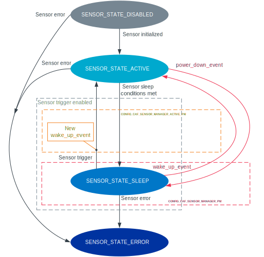

.. _caf_sensor_sampler:

CAF: Sensor sampler module
##########################

.. contents::
   :local:
   :depth: 2

The |sensor_sampler| of the :ref:`lib_caf` (CAF) generates the following types of events in relation with the sensor defined in the module configuration:

* ``sensor_event`` when the sensor is sampled.
* ``sensor_state_event`` when the sensor state changes.

Configuration
*************

To use the module, you must complete the following requirements:

1. Physically connect the sensor, add and enable it, for example, in the :file:`BOARD.dts` devicetree file.
   For more information about adding sensor device to devicetree, refer to :ref:`zephyr:use-dt-overlays`.
#. Enable the following Kconfig options:

   * :kconfig:`CONFIG_CAF_SENSOR_SAMPLER` - This option enables the |sensor_sampler|.
   * :kconfig:`CONFIG_SENSOR` - This option enables Zephyr's :ref:`zephyr:sensor_api` driver, which is required for interacting with the sensors.

Additionally, you need to configure the sensor that you want to use in your application and enable it in the sensor Kconfig option.

The following Kconfig options are also available for the module:

* :kconfig:`CONFIG_CAF_SENSOR_SAMPLER_DEF_PATH`
* :kconfig:`CONFIG_CAF_SENSOR_SAMPLER_THREAD_STACK_SIZE`
* :kconfig:`CONFIG_CAF_SENSOR_SAMPLER_THREAD_PRIORITY`

Adding module configuration file
================================

In addition to setting the Kconfig options, you must also add a module configuration file that contains an array of :c:struct:`sensor_config`.

To do so, complete the following steps:

1. Add a file that defines the following information for every sensor that should be handled by the |sensor_sampler| in an array of :c:struct:`sensor_config`:

   * :c:member:`sensor_config.dev_name` - Sensor device name.
     The name must match the sensor label in the :file:`BOARD.dts` file.
   * :c:member:`sensor_config.event_descr` - Sensor event description.
     The event description is used to identify sensor in an application.
   * :c:member:`sensor_config.chans` - Channel configuration.
     This is an array of :c:struct:`sampled_channel` struct that configures the sensor channel with the following information:

     * :c:member:`sampled_channel.chan` - Sensor channel.
       Depends on the particular sensor.
     * :c:member:`sampled_channel.data_cnt` - Number of values in :c:member:`sampled_channel.chan`.

   * :c:member:`sensor_config.chan_cnt` - Size of the :c:member:`sensor_config.chans` array.
   * :c:member:`sensor_config.sampling_period_ms` - Sensor sampling period, in milliseconds.
   * :c:member:`sensor_config.active_events_limit` - Maximum number of unprocessed :c:struct:`sensor_event`.
   * :c:member:`sensor_config.suspend_pm_state` - The power state to be set for the sensor when it receives a suspend event.

   For example, the file content could look like follows:

   .. code-block:: c

        #include <caf/sensor_sampler.h>

        static const struct sampled_channel accel_chan[] = {
                {
                        .chan = SENSOR_CHAN_ACCEL_XYZ,
                        .data_cnt = 3,
                },
        };

        static const struct sensor_config sensor_configs[] = {
                {
                        .dev_name = "LIS2DH12-ACCEL",
                        .event_descr = "accel_xyz",
                        .chans = accel_chan,
                        .chan_cnt = ARRAY_SIZE(accel_chan),
                        .sampling_period_ms = 20,
                        .active_events_limit = 3,
                },
        };

#. Specify the location of the file with the :kconfig:`CONFIG_CAF_SENSOR_SAMPLER_DEF_PATH` Kconfig option.

.. note::
    |only_configured_module_note|

Enabling sensor trigger
=======================

The |sensor_sampler| supports the sensor trigger functionality.
This functionality allows the |sensor_sampler| to stop sampling a specific sensor when specified conditions are met.
For more details about the sensor trigger, see Zephyr's :ref:`zephyr:sensor_api` driver.

.. note::
   Not all sensors support the trigger functionality.
   For more details, see the sensor-specific Kconfig file.

To use the sensor trigger, complete the following steps:

1. Enable the sensor trigger option in the sensor-specific Kconfig file.
   The Kconfig option name is different for each sensor.
   For example, for the LIS2DH accelerometer, set the ``CONFIG_LIS2DH_TRIGGER_GLOBAL_THREAD`` option to ``y``.
#. Extend the module configuration file by adding :c:member:`sensor_config.trigger` in an array of :c:struct:`sensor_config`.
   :c:member:`sensor_config.trigger` configures the sensor trigger with the following information:

      * ``.cfg`` information that depends on the particular sensor API:

        * :c:member:`trigger.cfg.type` - Trigger type.
          The type depends on the particular sensor.
        * :c:member:`trigger.cfg.chan` - Channel on which the trigger is set.
          The channel depends on the particular sensor.

      * ``.activation`` information that depends on the |sensor_sampler|:

        * :c:member:`trigger.activation.type` - Sensor value comparison method.
          See `Sensor trigger activation`_ for more details.
        * :c:member:`trigger.activation.thresh` - Sensor trigger activation threshold.
        * :c:member:`trigger.activation.timeout_ms` - Time after which the sensor is put to sleep.

   For example, the extended configuration file for the LIS2DH accelerometer could look like follows:

   .. code-block:: c

        #include <caf/sensor_sampler.h>

        static const struct sampled_channel accel_chan[] = {
                {
                        .chan = SENSOR_CHAN_ACCEL_XYZ,
                        .data_cnt = 3,
                },
        };

        static struct trigger trig = {
                .cfg = {
                        .type = SENSOR_TRIG_DELTA,
                        .chan = SENSOR_CHAN_ACCEL_XYZ,
                },
                .activation = {
                        .type = ACT_TYPE_ABS,
                        .thresh = 0.5,
                        .timeout_ms = 4000,
                },
        };

        static const struct sensor_config sensor_configs[] = {
                {
                        .dev_name = "LIS2DH12-ACCEL",
                        .event_descr = "accel_xyz",
                        .chans = accel_chan,
                        .chan_cnt = ARRAY_SIZE(accel_chan),
                        .sampling_period_ms = 20,
                        .active_events_limit = 3,
                        .trigger = &trig,
                },
        };

.. note::
    |only_configured_module_note|

Implementation details
**********************

The |sensor_sampler| starts in reaction to ``module_state_event``.
When started, it can do the following operations:

* Periodically sample the configured sensors.
* Submit ``sensor_event`` when the sensor channels are sampled.
* Submit ``sensor_state_event`` if the sensor state changes.

The |sensor_sampler| samples sensors periodically, according to the configuration specified for each sensor.
Sampling of the sensors is done from a dedicated preemptive thread.
You can change the thread priority by setting the :kconfig:`CONFIG_CAF_SENSOR_SAMPLER_THREAD_PRIORITY` Kconfig option.
Use the preemptive thread priority to make sure that the thread does not block other operations in the system.

For each sensor, the |sensor_sampler| limits the number of ``sensor_event`` events that it submits, but whose processing has not been completed.
This is done to prevent out-of-memory error if the system workqueue is blocked.
The limit value for the maximum number of unprocessed events for each sensor is placed in the ``sensor_config.active_events_limit`` structure field in the configuration file.
The ``active_sensor_events_cnt`` counter is incremented when ``sensor_event`` is sent and decremented when the event is processed by the sensor sampler that is the final subscriber of the event.
A situation can occur that the ``active_sensor_events_cnt`` counter will already be decremented but the memory allocated by the event would not yet be freed.
Because of this behavior, the maximum number of allocated sensor events for the given sensor is equal to ``active_events_limit`` plus one.

The dedicated thread uses its own thread stack.
You can change the size of the stack by setting the :kconfig:`CONFIG_CAF_SENSOR_SAMPLER_THREAD_STACK_SIZE` Kconfig option.
The thread stack size must be big enough for the sensors used.

Sensor state events
===================

Each sensor can be in one of the following states:

* :c:enumerator:`SENSOR_STATE_DISABLED` - Initial state.
* :c:enumerator:`SENSOR_STATE_SLEEP` - Sensor sleeps and no sampling is performed.
  Available only if the sensor trigger is configured.
* :c:enumerator:`SENSOR_STATE_ACTIVE` - Sensor is actively sampling.
* :c:enumerator:`SENSOR_STATE_ERROR` - Sensor error.

The following figure shows the possible state transitions.

   State transitions of the sensors used by the sensor sampler module

The |sensor_sampler| submits ``sensor_state_event`` whenever the sensor state changes.
Each sensor starts in the ``SENSOR_STATE_DISABLED`` state, which is not reported by the module.
Also, each sensor acts independently to others.
If one of the sensors reports an error, it does not stop the sensor sampler from sampling other sensors.

After the initialization, each sensor changes its state to :c:enumerator:`SENSOR_STATE_ACTIVE` and start periodic sampling.
In case of an error sensor submits ``sensor_state_event`` with the :c:enumerator:`SENSOR_STATE_ERROR` state.

If the trigger functionality is enabled, the sensor can be put into the :c:enumerator:`SENSOR_STATE_SLEEP` state.
In this state, the sensor is not actively sampling and is not reporting any ``sensor_event``.
If the sensor trigger fires the sensor change state to :c:enumerator:`SENSOR_STATE_ACTIVE` and restarts periodic sampling.

Sensor trigger activation
=========================

The sensor trigger is activated and the sensor is put to sleep only if the values measured by the sensor do not deviate from the last sensor value by more than :c:member:`trigger.activation.threshold` for the period of time specified in :c:member:`trigger.activation.timeout_ms`.
If the value measured by the sensor does not fit within the threshold, the last sensor value is updated and the sensor continues the sampling process.

The sensor trigger activation type can be of the following type:

* :c:enumerator:`ACT_TYPE_ABS` - Absolute deviation.
* :c:enumerator:`ACT_TYPE_PERC` - Percentage deviation.

.. |sensor_sampler| replace:: sensor sampler module
.. |only_configured_module_note| replace::    Only the configured module should include the configuration file.
   Do not include the configuration file in other source files.
