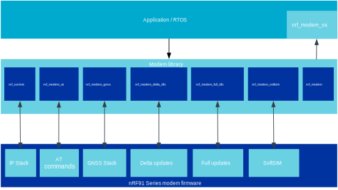

.. _architecture:

Library architecture
####################

.. contents::
   :local:
   :depth: 2

The library implements a communication interface between the application and modem cores on the nRF91 Series through the RPC protocol, using the Inter Processor Communication (IPC) peripheral and a shared region of RAM.

The following figure shows a simplified Modem library architecture:

   Modem library architecture diagram

Shared memory configuration
***************************

The shared memory between the application and modem cores must reside within the lowest 128 kilobytes of RAM.
The application is responsible for reserving the memory area before passing it onto the library.

In bootloader mode, the shared memory area must be as large as the value of ``NRF_MODEM_SHMEM_BOOTLOADER_SIZE`` and its base address must be 4-bytes aligned.
The library accepts the shared memory base address and size as parameters to the :c:func:`nrf_modem_bootloader_init` function through the :c:struct:`nrf_modem_bootloader_init_params` structure.

In normal operating mode, the shared memory is divided into the following four regions:

* Control
* TX
* RX
* Trace

The application can adjust the size of these regions based on its requirements, with the exception of the control region, which has a fixed size that must be equal to the value of ``NRF_MODEM_SHMEM_CTRL_SIZE``.
The base address of all regions must be 4-bytes aligned.
The library accepts the layout of these regions as parameters to the :c:func:`nrf_modem_init` function through the :c:struct:`nrf_modem_init_params` structure.

For |NCS| users, the Partition Manager will automatically reserve some RAM for each region during linking, according to the size of each region as specified in the glue.

Control area
============

The control area contains the data structures that are used to setup the communication between the modem core and the application core.
Among the sizes of the memory regions, only the size of the control area is fixed, and it is exported in the :file:`nrf_modem.h` file.

For |NCS| users, the build system and the glue implementation will automatically take care of passing the correct size to the :c:func:`nrf_modem_init` call.

TX area
=======

The TX area contains the data payload of messages that are sent to the modem.
The size of this area affects the largest buffer that :c:func:`nrf_send` can send in a single call, and the size of the longest AT command that can be sent to the modem.
When provisioning the TLS certificates, the size of the TX area must be large enough to accommodate the TLS certificate and the AT command that is used for provisioning.
The library OS abstraction layer defines the following functions to allocate and free data in this memory region:

* :c:func:`nrf_modem_os_shm_tx_alloc`
* :c:func:`nrf_modem_os_shm_tx_free`

.. important::
   It must be possible for the Modem library to allocate up to the number of bytes passed by the TX region size in the :c:struct:`nrf_modem_init_params` structure.
   If the OS implementation of :c:func:`nrf_modem_os_shm_tx_alloc` requires any overhead, additional memory must be set aside by the application.

RX area
=======

The RX area is entirely managed by the modem and this area contains all the incoming data from the modem.
The incoming data includes GNSS data, AT command responses, and IP traffic.
The size of this area determines the maximum amount of incoming data from the modem that the application core can buffer.
If the area is full and the application has not read the data yet, new data cannot be buffered in this area.

An example of an operation that requires a large RX area is the reading of a TLS certificate associated with a security tag.
The size of the RX area must be as large as the size of the TLS certificate that is being read, and the AT command that is used to read the certificate.

Trace area
==========

The trace area contains the trace output from the modem core.
This area of memory is optional, and the area size can be configured to be zero, to disable the trace output.

Library heap
************

The Modem library dynamically allocates memory during some operations, for example tracing and DNS lookups.
This memory is never shared with the modem core and hence, it can be located anywhere in the application core's RAM instead of the shared memory regions.
The library OS abstraction layer defines the following functions to allocate and free up dynamic memory for the library:

* :c:func:`nrf_modem_os_alloc`
* :c:func:`nrf_modem_os_free`
