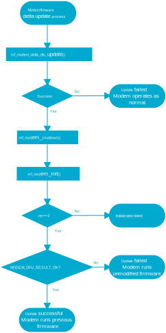
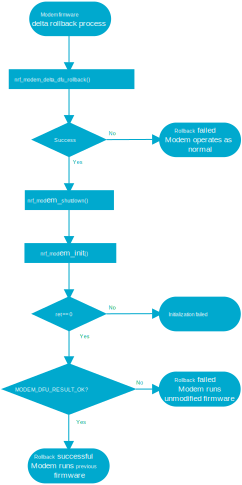

.. _nrf_modem_delta_dfu:

Delta firmware updates
######################

.. contents::
   :local:
   :depth: 2

The Modem library supports delta updates of the modem firmware.
A delta update is an update that requires downloading only the parts of the modem firmware that have changed, instead of downloading the whole firmware.
Such updates can save significant amounts of time and bandwidth.

During a firmware delta update, the application transfers the firmware into an area of flash memory in the modem, known as the *scratch area*.
Once the firmware delta update has been transferred completely, the application schedules the update of the modem firmware, which happens the next time the application boots the modem while calling :c:func:`nrf_modem_init`.
The same delta update for updating to a new firmware version can be used to perform a rollback to the original firmware version from which the update was done.

The delta update functionality is available through the Modem library :ref:`nrf_modem_delta_dfu_api`, found in :file:`nrfxlib/nrf_modem/include/nrf_modem_delta_dfu.h`.

Delta update packages
*********************

A delta update is a binary file, with a :file:`.bin` extension.
The update file is named in such a way that both the source and destination firmware versions can be identified, for example, :file:`mfw_nrf9160_update_from_1.2.2_to_1.2.3`.
Modem delta update files are part of the official modem releases and can be found in the `nRF9160 modem firmware zip file`_ or `nRF91x1 LTE firmware zip file`_ depending on the SiP you are using.

.. note::
   Delta update files might not be available for any two of the modem firmware versions but only for specific versions, as applicable.
   This might depend on the extent of the update, which cannot exceed the size of the scratch area of the modem firmware version it applies to.

Limitations
===========

The size of the scratch area can be retrieved with the :c:func:`nrf_modem_delta_dfu_area` function, which returns the size of the area in bytes.
A limitation of delta updates is that the size of the update must not exceed the area of flash memory that a given modem firmware version has dedicated for this operation.
The size of this area varies for any given modem firmware version and it can be retrieved with the Modem library's :c:func:`nrf_modem_delta_dfu_area` function.
In general, this function can be useful when the size of the largest delta update that can be received needs to be reported to an external service, for example an LwM2M server.
In practice, the application does not use this function in the normal update process, since all delta update files that are part of the `nRF9160 modem firmware zip file`_ or `nRF91x1 LTE firmware zip file`_ are guaranteed to fit in the scratch area of the modem firmware version that they apply to.

Reading the modem firmware UUID
*******************************

A modem firmware UUID is a unique identifier for a modem firmware version build.
The modem firmware UUID for given firmware version is found in the :file:`README.txt` file of the `nRF9160 modem firmware zip file`_ or `nRF91x1 LTE firmware zip file`_ depending on the SiP you are using, and can also be retrieved by using the :c:func:`nrf_modem_delta_dfu_uuid` function.

Features
********

Following are the features of modem firmware delta updates.

Security
========

Modem firmware delta updates implement security features to ensure that only firmware updates from the `nRF9160 modem firmware zip file`_ or `nRF91x1 LTE firmware zip file`_ are ever programmed to the modem.
Delta update files are encrypted and signed.
The modem takes care of verifying the signature and decrypting the content as necessary.

Fail-safety
===========

Modem firmware delta updates implement several fail-safe mechanisms to ensure that the modem continues to operate normally in case of errors.

* If the modem detects issues with the firmware that is being transferred, such as the firmware being corrupt, the modem automatically aborts the update process and continues to operate as normal.
* If the modem detects issues with the new firmware before commencing the update process at boot time, the modem automatically aborts the update process and runs the previous firmware when it boots again.
* If the device suddenly loses power during the transfer of the new firmware, the application can resume the operation when power is restored and the modem boots again.
* If the device suddenly loses power during the update process at boot time, the modem resumes the operation automatically when it boots again.

Firmware rollback
=================

The modem performs a rollback to the previous version automatically in case it detects problems during boot.
If the modem does not detect problems during boot, it runs the new firmware.
If the application detects issues with the new modem firmware, it can manually roll back to the previous modem firmware by calling :c:func:`nrf_modem_delta_dfu_rollback`.
The operation is scheduled, and the modem performs a rollback to the previous modem firmware version the next time it boots.
Since the same firmware delta update file can be used to both update to a newer modem firmware and roll back to the previous firmware version, the application can perform a rollback offline.

Update resumption
=================

The transfer of a firmware delta update can be paused and resumed by the application.
The possibility of resuming firmware updates adds the flexibility to the application to download the new firmware when appropriate, and to save bandwidth and time in case of a sudden power loss during the update process.
The application can start the transfer of a firmware delta update by calling the :c:func:`nrf_modem_delta_dfu_write_init` function and pause the transfer by calling the :c:func:`nrf_modem_delta_dfu_write_done` function.

Performing delta updates
************************

A delta modem firmware upgrade consists of the following steps:

#. Initializing the Modem library
#. Preparing the scratch area
#. Transferring the new firmware
#. Scheduling the firmware update
#. Reinitializing the modem to perform the update and run the new firmware
#. Checking the result of the update

Initializing the Modem library
==============================

The Delta DFU interface can be used once the application initializes the Modem library in normal mode by calling :c:func:`nrf_modem_init`.

Preparing the scratch area
==========================

The scratch is an area of modem's flash memory where the modem receives the delta update.

The state of the scratch area can be retrieved by the :c:func:`nrf_modem_delta_dfu_offset` function and it represents the offset of the firmware image in the scratch area, if any, within the total size of the firmware update:

#. When the offset is zero, the scratch area is empty, and it is ready to receive a new modem firmware.
#. When the offset is :c:macro:`NRF_MODEM_DELTA_DFU_OFFSET_DIRTY`, the scratch area must be erased before it can accept a new modem firmware.

Erasing the scratch area
------------------------

If the scratch area offset is equal to :c:macro:`NRF_MODEM_DELTA_DFU_OFFSET_DIRTY`, the scratch area has to be erased to receive a new modem firmware.

To commence erasing the scratch area, the application calls :c:func:`nrf_modem_delta_dfu_erase`, which will return immediately after the operation has been scheduled, but will not wait for its completion.
To determine if the erase operation is complete, the application calls :c:func:`nrf_modem_delta_dfu_offset` until the function returns zero and reports zero as the offset.

The following snippet shows how to erase the scratch area and wait for operation to complete:

.. code-block:: c

	int foo(void)
	{
		int err;
		size_t offset;

		err = nrf_modem_delta_dfu_erase();
		if (err) {
			/* error */
		}

		do {
			err = nrf_modem_delta_dfu_offset(&offset);
			/* sleep and try after a while */
			k_sleep(K_SECONDS(1));
		} while (err != 0 && offset != 0);

		printk("Modem firmware erase has completed\n");
		return 0;
	}

.. note::
   The modem prioritizes network operations over flash operations.
   The erase operation might take a longer time when the network is in use.
   Deregister from the network to ensure the erase operation is completed in timely manner, if necessary.

Resuming an update
------------------

When the offset is non-zero and different from :c:macro:`NRF_MODEM_DELTA_DFU_OFFSET_DIRTY`, the scratch area contains a part of modem firmware, the writing of which might have been interrupted due to a power loss or paused.

If the application does not require resuming the delta update operation and requires beginning a new update, it must erase the scratch area using :c:func:`nrf_modem_delta_dfu_erase`.
If the application requires resuming the delta update operation, it must resume transferring the new firmware from the offset reported by :c:func:`nrf_modem_delta_dfu_offset`.
For example, if the offset is 2500 and the application needs to transfer a new firmware with a total size of 10000 bytes, the application must resume transferring the firmware from byte 2500.

Transferring the new firmware
=============================

The modem performs several checks during the transfer to ensure that the firmware received is not corrupt, and it is a valid delta update for the current modem firmware.
The application can initiate the firmware transfer by calling :c:func:`nrf_modem_delta_dfu_write_init`.
The application then calls :c:func:`nrf_modem_delta_dfu_write` to transfer the firmware to the modem scratch area.
When the application completes the transfer of the whole firmware or when it needs to pause the transfer, it calls :c:func:`nrf_modem_delta_dfu_write_done`.
The application can pause or resume the firmware transfer as necessary.

.. note::
   The modem reserves some of its RAM to prepare for receiving a new firmware in the scratch area (that is, when the application has called :c:func:`nrf_modem_delta_dfu_write_init`).
   To release that RAM, the application must call :c:func:`nrf_modem_delta_dfu_write_done` when it is not in the process of transferring a new firmware to the modem.

Scheduling the firmware update
==============================

The application schedules the execution of a firmware delta update by calling :c:func:`nrf_modem_delta_dfu_update`.
Upon success, the operation is scheduled and the modem updates its firmware the next time the application boots the modem by calling :c:func:`nrf_modem_init`.

.. note::
   The return value of :c:func:`nrf_modem_delta_dfu_update` only indicates whether the modem has scheduled the update and does not represent the result of the actual update operation.

   Modem delta DFU update flowchart

Reinitializing the modem to perform the update
==============================================

To let the modem perform the update, the application must reinitialize the modem by calling :c:func:`nrf_modem_shutdown` followed by :c:func:`nrf_modem_init`.

Checking the result of the update
=================================

The application is notified of the result of the update through the :c:member:`nrf_modem_init_params.dfu_handler` callback with one of the following values:

* ``NRF_MODEM_DFU_RESULT_OK`` - The update is successful. The modem is running the new firmware.
* ``NRF_MODEM_DFU_RESULT_AUTH_ERROR`` - The update did not take place. The modem is running the original firmware.
* ``NRF_MODEM_DFU_RESULT_UUID_ERROR`` - The update did not take place. The modem is running the original firmware.
* ``NRF_MODEM_DFU_RESULT_INTERNAL_ERROR`` - The modem encountered an internal error while updating, and it will not boot to prevent executing unintended operations. The next firmware update operation can only be attempted through the :ref:`nrf_modem_bootloader_api`.
* ``NRF_MODEM_DFU_RESULT_HARDWARE_ERROR`` - The modem encountered a hardware error while updating, and it will not boot to prevent executing unintended operations. The next firmware update operation can only be attempted through the :ref:`nrf_modem_bootloader_api`.
* ``NRF_MODEM_DFU_RESULT_VOLTAGE_LOW`` - The modem did not have sufficient voltage to apply the firmware update. The operation will be retried the next time the modem is started.

The application can verify that the modem runs the new modem firmware by reading the modem firmware UUID or reading the ``AT+CGMR`` command response.

Rolling back to a previous firmware
***********************************

The application can roll back to the previous modem firmware version after it has executed an update.
The same firmware delta that is used to update to a new firmware version can be used to roll back to the previous firmware version.
Thus, the application need not download the previous modem firmware version but can perform the rollback entirely in an offline mode, without registering to the network.

.. important::
   The rollback functionality is only available as long as the application does not erase the contents of the scratch area by calling :c:func:`nrf_modem_delta_dfu_erase`.
   Once the application has called :c:func:`nrf_modem_delta_dfu_erase` it can no longer roll back to a previous modem firmware version using the delta DFU API.

To roll back to the previous modem firmware version, the application calls :c:func:`nrf_modem_delta_dfu_rollback`.
Upon success, the operation is scheduled and the modem performs a rollback to the previous modem firmware when the application boots it by calling :c:func:`nrf_modem_init`.
The return value of :c:func:`nrf_modem_delta_dfu_rollback` only indicates whether the modem has scheduled the rollback and does not represent the result of the actual rollback operation.

The figure below shows the flow chart for the rollback operation.

   Modem delta DFU rollback flowchart

Reinitializing the modem to perform the rollback
================================================

To let the modem perform the rollback, the application must reinitialize the modem by calling :c:func:`nrf_modem_shutdown` followed by :c:func:`nrf_modem_init`.

Checking the result of the rollback
===================================

The application is notified of the result of the update through the :c:member:`nrf_modem_init_params.dfu_handler` callback with one of the following values:

* ``NRF_MODEM_DFU_RESULT_OK`` - The rollback is successful. The modem is running the new firmware.
* ``NRF_MODEM_DFU_RESULT_AUTH_ERROR`` - The rollback did not take place. The modem is running the original firmware.
* ``NRF_MODEM_DFU_RESULT_UUID_ERROR`` - The rollback did not take place. The modem is running the original firmware.
* ``NRF_MODEM_DFU_RESULT_INTERNAL_ERROR`` - The modem encountered an internal error while executing the rollback, and it will not boot to prevent executing unintended operations. For subsequent programming, the modem can only be programmed through the :ref:`nrf_modem_bootloader_api`.
* ``NRF_MODEM_DFU_RESULT_HARDWARE_ERROR`` - The modem encountered a hardware error while executing the rollback, and it will not boot to prevent executing unintended operations. For subsequent programming, the modem can only be programmed through the :ref:`nrf_modem_bootloader_api`.
* ``NRF_MODEM_DFU_RESULT_VOLTAGE_LOW`` - The modem did not have sufficient voltage to apply the firmware rollback. The operation will be retried the next time the modem is started.

The application can verify that the modem runs the previous modem firmware by reading the modem firmware UUID or the ``AT+CGMR`` command response.

Thread safety
*************

The Delta DFU API is thread safe and can be used by multiple threads.
