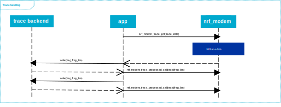
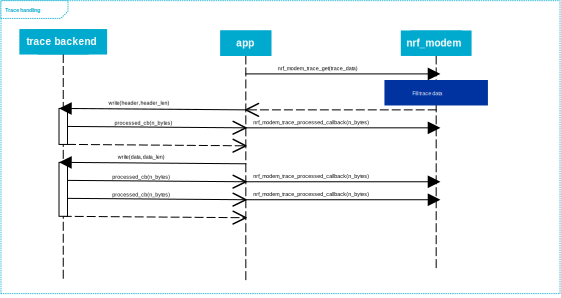
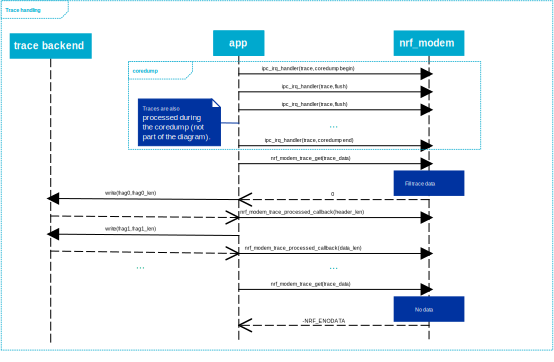

.. _modem_trace:

Modem traces
############

The modem trace APIs in the Modem library are used to retrieve binary trace data from the modem core.
The application is responsible for forwarding the trace data to a host computer, where it can be collected with the `Cellular Monitor`_ PC tool to extract PCAP data, or to save them to file for further inspection by Nordic Semiconductor.

In the |NCS|, the :ref:`nrf_modem_lib_readme` takes care of retrieving and forwarding the trace data, for example to a computer or to a non-volatile memory.

Enabling modem traces
*********************

To enable traces the application must initialize the Modem library with a non-zero trace region size.
The trace output from the modem can be toggled at runtime using the AT command ``%XMODEMTRACE``, which can also be used to change the trace output level.
For more information, see the `Modem trace activation %XMODEMTRACE`_ section in the nRF9160 AT Commands Reference Guide or the same section in the `nRF91x1 AT Commands Reference Guide`_ depending on the SiP you are using.

In the |NCS|, the :ref:`nrf_modem_lib_readme` offers a dedicated function to simplify the task of enabling and disabling the trace output, and setting the trace level.

Fetching modem traces
*********************

Modem traces are retrieved by the application and output to a trace medium, typically UART.
You can call the :c:func:`nrf_modem_trace_get` function to retrieve traces from the Modem library.

The trace data, containing multiple fragments, must be processed in order, starting from the first array index.

Once the trace data is processed, the application must call the :c:func:`nrf_modem_trace_processed` function to release the memory allocated in the trace memory area.
If the trace data is processed in fragments, this can be split into multiple calls, for example, one call for each fragment of processed data.

   Modem library trace processing

Processing modem traces
***********************

The application must call the :c:func:`nrf_modem_trace_processed` function as it processes the trace data to inform the Modem library that the trace data has been handled and can be released.
It is not necessary that the application has processed a whole trace fragment before calling the :c:func:`nrf_modem_trace_processed` function.
To maximize the availability of the shared memory in the trace region, the application must call the :c:func:`nrf_modem_trace_processed` function frequently as soon as some bytes are processed.
Hence, the :c:func:`nrf_modem_trace_processed` function must be called with the total number of bytes in the trace fragments before making a new call to the :c:func:`nrf_modem_trace_get` function.

An example is shown in the following figure:

   Modem library asynchronous trace processing

Tracing and modem faults
************************

When a fault occurs in the modem and traces are enabled, the modem will send a coredump using the trace interface.
The :c:func:`nrf_modem_trace_get` function returns trace fragments until there are no more fragments to process.
In the case where there are no more trace fragments after a modem coredump is complete, the :c:func:`nrf_modem_trace_get` function returns ``-NRF_ENODATA`` as shown in the following figure:

   Modem library coredump trace sequence

.. note::

   The :c:func:`nrf_modem_trace_get` function returns with an error when the modem is uninitialized or shut down, or when there is no more trace data after a coredump.
   In these cases, the application must wait for the modem to be reinitialized before calling the :c:func:`nrf_modem_trace_get` function again.
