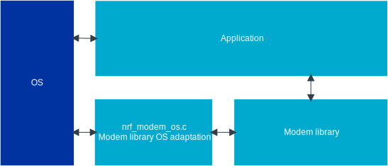
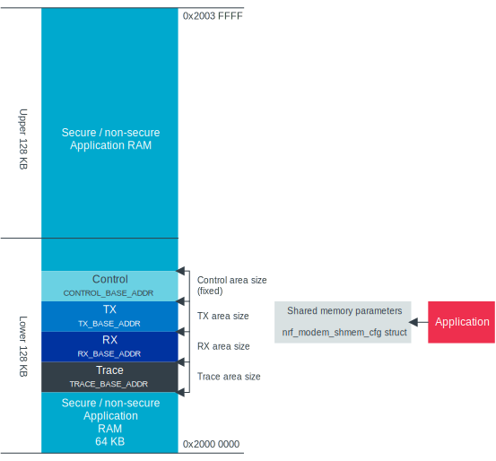

.. _nrf_modem_ug_porting:

Porting to an OS
################

.. contents::
   :local:
   :depth: 2

The :ref:`nrf_modem` from Nordic Semiconductor is an OS-agnostic C library where OS-specific parts are moved out of the library.
To use the library with your OS or scheduler, you must first port it by creating a custom :file:`nrf_modem_os.c` file, which serves as an OS abstraction layer.
The library exposes a :file:`nrf_modem_os.h` header file that defines the functions that must be implemented in :file:`nrf_modem_os.c`.
The :file:`nrf_modem.h` header file exposes functions provided by the library that the OS integration module can interface with.

The following diagram presents the Modem library :ref:`OS abstraction layer<nrf_OS_abstraction>`.
Arrows indicate that the elements can communicate with each other directly.

   Modem library OS abstraction overview

To use the Modem library, you must make sure that the following requirements are met:

* The application using the Modem library is run in :ref:`Non-Secure Processing Environment (NSPE) <nrf:app_boards_spe_nspe>`.
* The IPC and FPU peripherals are available in NSPE.
* The shared memory resides in the lower 128 KB of RAM.
* The application provides an implementation of the OS interface in the :file:`nrf_modem_os.h` file.
* The library depends on the nrfx IPC driver or equivalent IPC driver.

Obtaining the Modem library
***************************

The application can either include nrfxlib or only the Modem library.
Header files are located in the :file:`nrf_modem/include/` folder.
You can locate the library binary (for both hard-float and soft-float) in the :file:`nrf_modem/lib/` folder.
The binaries are delivered based on the SoC they support.
The :file:`nrf_modem/lib/nRF9160` folder contains the binaries for the nRF9160 SiP, and the :file:`nrf_modem/lib/nRF9120` folder contains the binaries for other nRF91 Series SiPs.

IPC driver and interrupt
************************

The Modem library uses the IPC peripheral for communication with the modem using the nrfx IPC driver.
The application must either include the nrfx IPC driver or implement its own IPC driver with the same signature as the nrfx IPC driver.

If the OS has its own IRQ handler scheme that does not directly forward the IPC_IRQHandler, the OS must route the IPC_IRQHandler to the nrfx IPC IRQ handler.

Peripheral configuration
************************

As the Modem library has been compiled to operate on peripherals in NSPE, the following two peripherals must be configured to be non-secure:

* NRF_IPC
* NRF_POWER

If you are using the hard-float variant of the Modem library, the FPU must be activated in both Secure Processing Environment (SPE) and NSPE, and must be configured to allow the non-secure application to run FPU instructions.

The :file:`nrfx/mdk/system_nrf91.c` file provides a template on how to configure the FPU in both cases.
The system file also provides several Errata workarounds specific to the chip variant used, which are needed for any SPE application.

Memory
******

The Modem library requires the following two types of memories for the modem:

* Library heap
* Shared memory

The OS abstraction implementation is responsible for providing a dynamic memory allocation for both type of memories.

Library heap
============

The modem uses the library heap for dynamic memory allocations.
It has no location requirements and may use the OS provided heap implementation.

Shared memory
=============

The size of the shared memory regions can be configured during initialization of the library.
The regions must reside in the lower 128kB of RAM.
The secure application must configure these regions as non-secure to make these regions accessible by both the modem and the application.

The following RAM overview diagram shows the placement of Modem library in the sequential RAM, and it also indicates the configurable memory position values:

   Modem library memory overview

Following are the minimum sizes of the regions of the Modem Library:

*  The minimum size of the control region is given in the :file:`nrf_modem_platform.h` file.
*  The RX/TX sizes are set using the  :kconfig:option:`CONFIG_NRF_MODEM_LIB_SHMEM_TX_SIZE` and :kconfig:option:`CONFIG_NRF_MODEM_LIB_SHMEM_RX_SIZE` Kconfig options.
   The RX/TX must fit the data for the largest command or socket operation executed.
*  The trace area size can remain zero if traces are not used.
   If traces are used, refer to :ref:`modem_trace` for more information on the trace area size.

Faults and traces
*****************

The Modem library provides facilities to obtain trace data and handle modem faults.
Information about these facilities can be found in :ref:`fault_handling` and :ref:`modem_trace`.

Following are the method by which the application can handle the modem fault:

* Re-initialize the modem through :c:func:`nrf_modem_shutdown` and :c:func:`nrf_modem_init` if the application can handle that.
* Reset the SoC.

Message sequence diagrams
*************************

The following message sequence diagrams show the interactions between the application, Modem library, and the OS:

#. Sequence of the initialization of the Modem library.
   Configuration of the high and low priority IRQs:

    .. figure:: images/nrf_modem_initialization_sequence.svg
        :alt: Initialization (main thread)

        Initialization (main thread)

#. Handling a timeout or sleep:

    .. figure:: images/nrf_modem_timers_sequence.svg
        :alt: Timedwait

        Timedwait

.. _nrf_OS_abstraction:

OS abstraction layer
********************

To create an OS abstraction layer for the Modem library, you must implement the functions in the :file:`nrf_modem_os.h` file.
An OS abstraction layer implementation for the Zephyr RTOS is also available in the |NCS|.
See :file:`nrf_modem_os.c` for more details.

Specification
=============

The details for each function are shown in the following section and in the header file:

nrf_modem_os_init()
-------------------

This function is called by the Modem library when the application has issued :c:func:`nrf_modem_init`.
It is responsible for initializing OS-specific functionality related to the Modem library OS abstraction.

If Nordic Proprietary trace is enabled, the library generates trace data that can be retrieved using the :c:func:`nrf_modem_trace_get` function.
See :ref:`modem_trace` for more information.

*Required actions*:

* Initialize heap memory.
* Initialize timers/threads.
* If Nordic Proprietary trace is enabled, initialize a trace thread and the trace backend (for example, UART or SPI).

nrf_modem_os_busywait()
-----------------------

This function is called by the Modem library when a blocking timed context is required.

nrf_modem_os_sleep()
--------------------

This function is called by the Modem library to put a thread to sleep unconditionally for a given amount of time.

.. _nrf_modem_os_timedwait:

nrf_modem_os_timedwait()
------------------------

This function is called by the Modem library to put a thread to sleep for a certain amount of time or until an event occurs.

*Required actions*:

* Put the thread to sleep, if applicable, or otherwise wait until the amount of time specified by ``timeout`` has elapsed, or until :c:func:`nrf_modem_os_event_notify` is called with the same ``context`` parameter, or with ``context`` equal to ``0``.
* After the wait is complete, update the ``timeout`` parameter with the amount of time left to sleep.
  This will be ``0`` if the timeout has elapsed or the amount of time left to sleep if the wait was interrupted by a call to :c:func:`nrf_modem_os_event_notify`.
* Check the Modem library initialization status using :c:func:`nrf_modem_is_initialized` and return ``-NRF_ESHUTDOWN`` if that call returns ``false``.

The following points decide the *Function return value*:

* If the modem is not initialized, that is, if :c:func:`nrf_modem_is_initialized` returns false, function return value will be ``-NRF_ESHUTDOWN``.
* If there is a time out, function return value will be ``-NRF_EAGAIN``.
* In all other cases, function return value will be ``0``.

nrf_modem_os_event_notify()
---------------------------

This function is called by the Modem library when an event occurs.

*Required action*:

* Wake all threads that are sleeping in :c:func:`nrf_modem_os_timedwait` that have the same ``context``.
  A ``context`` parameter with value ``0`` shall wake up all threads put to sleep with :c:func:`nrf_modem_os_timedwait`.

nrf_modem_os_alloc()
--------------------

This function is called by the library to allocate memory dynamically, and it is like a *malloc* call.
There are no specific requirements related to the location where this memory must be allocated in RAM.

nrf_modem_os_free()
-------------------

This function must free the memory allocated by :c:func:`nrf_modem_os_alloc`.

nrf_modem_os_shm_tx_alloc()
---------------------------

This function is called by the library to dynamically allocate the memory that must be *shared with the modem core*.
This function allocates memory on the TX memory region that is passed to the :c:func:`nrf_modem_init` function during the initialization.

nrf_modem_os_shm_tx_free()
--------------------------

This function releases the memory allocated by :c:func:`nrf_modem_os_shm_tx_alloc`.

nrf_modem_os_errno_set()
------------------------

This function translates errnos from the Modem library to the OS-defined ones.

*Required action*:

* Implement a translation for each errno set by the Modem library.
  If it overlaps with errnos of your OS, the translation is not needed.

nrf_modem_os_is_in_isr()
------------------------

This function is called by the library to check whether or not it is executing in a interrupt context.

nrf_modem_os_sem_init()
-----------------------

This function is called by the library to allocate and initialize a semaphore.

*Required action*:

* Allocate and initialize a semaphore.
* If an address of an already allocated semaphore is provided as an input, the allocation part is skipped and the semaphore is only reinitialized.

.. note::

   Semaphores are not required if multithreaded access to modem functionality is not needed.
   In this case, the function can blindly return ``0``.

nrf_modem_os_sem_give()
-----------------------

This function is called by the library to give a semaphore.

nrf_modem_os_sem_take()
-----------------------

This function is called by the library to take a semaphore.

nrf_modem_os_sem_count_get()
----------------------------

This function is called to retrieve the count of a semaphore.

nrf_modem_os_log()
------------------

This function is called by the library to output logs.
This function can be called in an interrupt context.

nrf_modem_os_logdump()
----------------------

This function is called by the library to dump binary data.
This function can be called in an interrupt context.

Template
========

The following code snippet shows a template implementation of the Modem library OS abstraction layer.
You can use it as a starting point and customize it for your OS or scheduler.

.. code-block:: c

    #include <nrf_modem.h>
    #include <nrf_modem_os.h>
    #include <nrf_errno.h>
    #include <nrf.h>
    #include "errno.h"

    void nrf_modem_os_init(void)
    {
        /* Initialize the glue layer and required peripherals. */
    }

    void nrf_modem_os_shutdown(void)
    {
        /* Deinitialize the glue layer.
           When shutdown is called, all pending calls to nrf_modem_os_timedwait
           shall exit and return -NRF_ESHUTDOWN. */
    }

    void *nrf_modem_os_shm_tx_alloc(size_t bytes)
    {
        /* Allocate a buffer on the TX area of shared memory. */
    }

    void nrf_modem_os_shm_tx_free(void *mem)
    {
        /* Free a shared memory buffer in the TX area. */
    }

    void *nrf_modem_os_alloc(size_t bytes)
    {
        /* Allocate a buffer on the library heap. */
    }

    void nrf_modem_os_free(void *mem)
    {
        /* Free a memory buffer in the library heap. */
    }

    void nrf_modem_os_busywait(int32_t usec)
    {
        /* Busy wait for a given amount of microseconds. */
    }

    int32_t nrf_modem_os_timedwait(uint32_t context, int32_t *timeout)
    {
        if (!nrf_modem_is_initialized())
        {
            return -NRF_ESHUTDOWN;
        }

        /* Put a thread to sleep for a specific time or until an event occurs.
           Wait for the timeout.
           All waiting threads shall be woken by nrf_modem_event_notify.
           A blind return value of zero will cause a blocking wait. */

        if (!nrf_modem_is_initialized())
        {
            return -NRF_ESHUTDOWN;
        }

        return 0;
    }

    void nrf_modem_os_event_notify(void)
    {
        /* Notify the application that an event has occurred.
           This shall wake all threads sleeping in nrf_modem_os_timedwait. */
    }

    void nrf_modem_os_errno_set(int errno_val)
    {
        /* Set OS errno. */
    }

    bool nrf_modem_os_is_in_isr(void)
    {
        /* Check if executing in interrupt context. */
    }

    int nrf_modem_os_sem_init(void **sem, unsigned int initial_count, unsigned int limit)
    {
        /* The function shall allocate and initialize a semaphore and return its address
           through the `sem` parameter. If an address of an already allocated semaphore is provided as
           an input, the allocation part is skipped and the semaphore is only reinitialized. */
        return 0;
    }

    void nrf_modem_os_sem_give(void *sem)
    {
        /* Give a semaphore. */
    }

    int nrf_modem_os_sem_take(void *sem, int timeout)
    {
        /* Try to take a semaphore with the given timeout. */
        return 0;
    }

    unsigned int nrf_modem_os_sem_count_get(void *sem)
    {
        /* Get a semaphore's count. */
        return 0;
    }

    void nrf_modem_os_log(int level, const char *fmt, ...)
    {
        /* Generic logging procedure. */
        va_list ap;
        va_start(ap, fmt);
        vprintf(fmt, ap);
        printf("\n");
        va_end(ap);
    }

    void nrf_modem_os_logdump(int level, const char *str, const void *data, size_t len)
    {
        /* Log hex representation of object. */
    }
