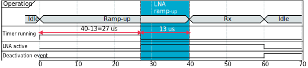
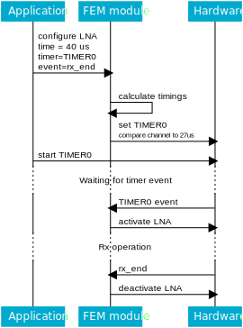
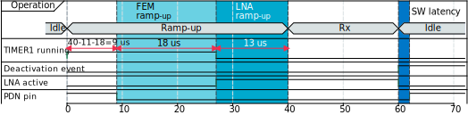
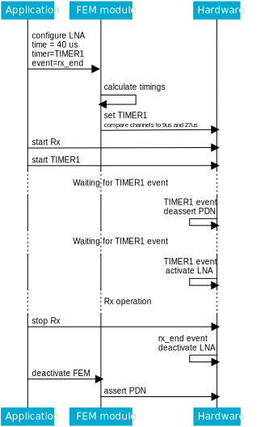

.. _mpsl_fem:

Front-end module feature
########################

.. contents::
   :local:
   :depth: 2

The front-end module feature allows the application to interface with several types of front-end modules (FEMs).
This allows an increase of the transmitted power through a Power Amplifier (PA) or an increase of the sensitivity through a Low-Noise Amplifier (LNA).
Any increase in power and sensitivity results in an increased communication range.
The exact PA and LNA gains are dependent on the specific FEM used.

Implementation
**************

Three FEM implementations are provided:

nRF21540 GPIO
  Compatible with the nRF21540 FEM and implements a 3-pin interface.
  It can also optionally use the MODE pin for switching PA gain between two preconfigured values.

nRF21540 GPIO SPI
  Compatible with the nRF21540 FEM and implements a 3-pin interface to enable and disable the PA and LNA.
  It also supports PA gain control using the SPI interface.

Simple GPIO
  A simplified version, made to be compatible with other front-end modules.
  It implements a 2-pin interface.

All currently supported implementations use the PA and LNA pins for controlling the FEM.
Additionally, the nRF21540 implementations use the PDN pin for powering down the FEM internal circuits, to reduce energy consumption.

TX power split
**************

When an application requests a given transmission power, it wants to achieve that power at the antenna.
Usually, the application does not know all hardware components, such as RF front-end modules, on the radio signal path.
To achieve a specific value of transmission power at the antenna, every FEM implementation provides a dedicated API that calculates the PA gain and SoC output power combination that results in the requested power at the antenna.
It also calculates a private setting value applied to the FEM that is needed to achieve the calculated PA gain.
The meaning of this private setting is specific to each FEM implementation.

FEM implementations with multiple PA gains available (for example, nRF21540 with MODE pin support) choose which gain to use based on hardware limitations and the requested power value.
Alternatively, an external model can be used to determine the gain.

TX power split using models
===========================

You can achieve the TX power split using a model, to compensate, for example, for external conditions.
The model can be either external (passed to MPSL) or built-in.

A built-in model is currently provided only for the nRF21540 GPIO SPI FEM implementation and it is in an :ref:`experimental <nrf:software_maturity>` stage.
The provided model allows for temperature, voltage, and frequency compensation.

The model is passed to MPSL before the FEM configuration, and contains two callbacks: ``fetch`` and ``init``.
After it completes the configuration, MPSL calls ``init`` to pass all the calibration and configuration data required by the specific FEM implementation to the model and to initialize the model.
Each time a TX power split is needed, MPSL calls the ``fetch`` function and passes the frequency and the requested output power to the model.
The model then decides how to split this power into components, and calculates both the private setting for the specific FEM implementation and the actually achieved output power.

Configurable timings
********************

In both implementations, two timings can be configured:

* ``LNA time gap``, the time between the LNA activation and the start of radio reception.
* ``PA time gap``, the time between the PA activation and the start of radio transmission.

For the nRF21540, two additional timings can also be configured:

* ``TRX hold time``, the time interval for which the FEM is kept powered up after the PDN deactivation event occurs.
* ``PDN settle time``, the time interval reserved for the FEM settle, before the PA or LNA activation.

General usage
*************

The Power Amplifier and the Low-Noise Amplifier are responsible for, respectively, transmission and reception, and are configured and activated independently.
The two functionalities cannot be configured and set to operate simultaneously, because they share some resources.
As such, after operating with a Power Amplifier, the PA configuration must be cleared to be able to configure and use a Low-Noise Amplifier afterward, and vice versa.

Both amplifiers are controlled through activation and deactivation events.
Two types of events are supported:

* A *timer event*.
  It is the ``COMPARE`` event of a hardware timer and it can be used for both PA and LNA activation and deactivation.
* A *generic event*.
  It is any other event type and it can only be used for PA and LNA deactivation.

To prepare a generic event, the application must provide the event register.
To prepare a timer event, the application must provide the following:

* The instance of the timer, which the protocol has to start by itself.
* The *Compare Channels* mask, which tells the front-end module which Compare Channels of the provided Timer are free to use.
* The Start time, at which the front-end module can start preparing the PA or LNA.
* The End time, at which the front-end module must be ready for the RF procedure.

Then, the module can configure the timer to activate or deactivate the FEM accordingly, taking also into account the FEM settle time.

The following example activates the LNA for an RX operation, using the following parameters:

* RX ramp-up time - 40 us
* LNA settle time - 13 us
* LNA deactivation event - ``rx_end``
* LNA activation timer - ``TIMER0``

The *RX ramp-up time* is the total time scheduled by the application.

The steps needed to properly configure LNA in this example are the following:

1. The application configures the LNA to be activated by the timer event, with the start time set to 0 us and the end time set to 40 us.
#. The application provides the ``rx_end`` event as the LNA deactivation event.
#. The FEM module reads the scheduled time and sets the ``TIMER0`` compare channel to 27 us, as a result of the RX ramp-up time (40 us) minus the LNA settle time (13 us).
#. The application starts the RX operation.
#. The application starts ``TIMER0``.

The following picture illustrates the timings in this scenario:

   Timing of the LNA pin for reception

The following picture illustrates the calls between the application, the FEM module, and the hardware in this scenario:

   Sequence diagram of LNA control for reception

nRF21540 usage
**************

In the nRF21540 implementation, the PDN pin is used to power down the FEM internal circuits.
The FEM can be powered down on an explicit application request.
The FEM is powered back up automatically before PA or LNA are activated.

The following example controls LNA and PDN during an RX operation, using the following parameters:

* RX ramp-up time - 40 us
* LNA settle time - 13 us
* PDN settle time - 18 us
* LNA deactivation event - ``rx_end``
* PDN deactivation event - ``software``
* LNA activation timer - ``TIMER1``

The *RX ramp-up time* is the total time scheduled by the application.

The steps needed to properly configure LNA and PDN in this example are the following:

1. The application configures the power-down passing ``rx_end`` as the activation event.
#. The application configures LNA to be activated by the timer event, with the start time set to 0 us and the end time set to 40 us.
#. The application provides the ``rx_end`` event as the LNA deactivation event.
#. The FEM module reads the scheduled time and sets ``TIMER1`` compare channels to 27 us (40-13) and 9 us (27-18).
#. The application starts the RX operation.
#. The application starts ``TIMER1``.

The following picture illustrates the timing in this scenario:

   Timing of the LNA and PDN pins for reception

The following picture illustrates the calls between the application, the FEM module, and the hardware in this scenario:

   Sequence diagram of LNA and PDN control for reception

PA gain control
===============

FEM implementations with multiple PA gains available can choose which gain to use.

PA switched gain
----------------

Both nRF21540 implementations can control the FEM to select one of two available PA gains without the need to provide any model.
To do so, the nRF21540 GPIO implementation uses MODE pin switching, while the nRF21540 GPIO SPI implementation performs the appropriate SPI transfers.

To enable this feature for the nRF21540 GPIO implementation, the MODE pin must be enabled in the interface configuration that the application passes on initialization.
To enable this feature for the nRF21540 GPIO SPI implementation, runtime gain control must be enabled in the interface configuration that the application passes on initialization.

PA Gain control using a built-in compensation model
---------------------------------------------------

The nRF21540 GPIO SPI implementation can be used with the built-in model.
Using this model allows for the compensation of external conditions like temperature, supply voltage and frequency.

The model is currently in an :ref:`experimental <nrf:software_maturity>` stage.
To use this model, MPSL's getter function must acquire the structure containing the model callbacks and then must pass it to MPSL just like all the other models.
