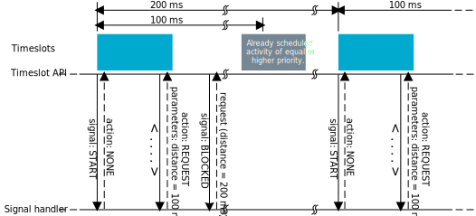
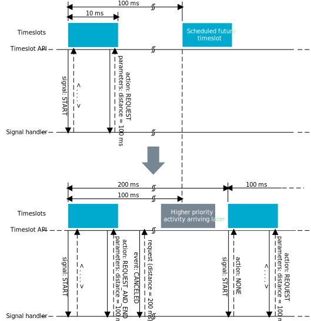
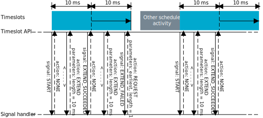

.. _mpsl_timeslot:

Timeslot
########

.. contents::
   :local:
   :depth: 2

The Timeslot interface allows developers to implement their own 2.4 GHz proprietary protocol that can be run concurrently with other protocols using the MPSL.
The Timeslot feature gives the application access to the radio and other restricted peripherals during defined time intervals, denoted as timeslots.
It can also be used to suppress radio activity and to reserve guaranteed time for application activities with hard timing requirements.

The feature works by having the MPSL time-multiplex access to peripherals between the application and itself.
MPSL exposes APIs to open a Timeslot session and request timeslots.
When a Timeslot request is granted, the application has exclusive and real-time access to the following peripherals:

 * TIMER0
 * TIMER1 for the nRF53 Series
 * RADIO
 * TEMP
 * PPI channel 19 for the nRF52 Series
 * Other peripherals used by protocol stacks using the MPSL

These peripherals can be used freely for the duration (length) of the timeslot.

Request types
*************
There are two types of Timeslot requests, *earliest possible* and *normal* Timeslot requests.

Timeslots may be requested as *earliest possible*, in which case the timeslot occurs at the first available opportunity.
In the request, the application can limit how far into the future the start of the timeslot can be placed.

.. note:: The first request in a session must always be *earliest possible* to create the timing reference point for later timeslots.

Timeslots may also be requested at a given time (*normal*).
In this case, the application specifies in the request when the timeslot starts and the time is measured from the start of the previous timeslot.

The application may also request to extend an ongoing timeslot.
Extension requests may be repeated, prolonging the timeslot even further.

Timeslots requested as *earliest possible* are useful for single timeslots and for non-periodic or non-timed activity.
Timeslots requested at a given time relative to the previous timeslot are useful for periodic and timed activities, for example, a periodic proprietary radio protocol.
Timeslot extension can be used to secure as much continuous radio time as possible for the application, for example, running an "always on" radio listener.

Request priorities
******************
Timeslots can be requested at either high or normal priority, indicating how important it is for the application to access the specified peripherals.
A timeslot request can only be blocked or canceled due to an overlapping activity that has a higher scheduling priority.

Timeslot length
***************
A timeslot is requested for a given length.
Ongoing timeslots have the possibility to be extended.

The length of the timeslot is specified by the application.
Longer continuous timeslots can be achieved by requesting to extend the current timeslot.
A timeslot can be extended multiple times.
However, if there are other concurrent protocol activities, the extension might fail.
The maximum timeslot length is 128 seconds.

Scheduling
**********
The MPSL includes a scheduler that manages timeslots and priorities and sets up timers to grant timeslots.

Whether a timeslot request is granted and access to the peripherals is given is determined by the following factors:

* The time the request is made
* The exact time in the future the timeslot is requested for
* The desired priority level of the request
* The length of the requested timeslot

Timeslot API timing-activities are scheduled independently of any other timing activities.
Therefore, they can collide with any other timing-activities of other protocols.
If a later arriving timeslot of higher priority causes a collision, the request will be canceled.
However, a timeslot that has already started cannot be interrupted or canceled.

If the timeslot is requested as earliest possible, it is scheduled at any available free time.
Therefore, there is less probability of collision with the earliest possible request.

High-frequency clock configuration
**********************************
The application can request the MPSL to guarantee that the HFCLK source is set to the external crystal and that it is ramped up and stable before the start of the timeslot.
If the application requests the MPSL to have the external high-frequency crystal ready by the start of the timeslot, the MPSL handles the enabling and disabling of the crystal.
The application does not need to disable the crystal at the end of the timeslot.
The MPSL disables the crystal after the end of the timeslot unless the MPSL needs to use it within a short period of time after the end of the timeslot.
In such case, the MPSL leaves the crystal running.

If the application does not request the MPSL to have the external high-frequency crystal ready by the start of the timeslot,
then the high-frequency clock might or might not be running during the timeslot.

Performance considerations
**************************
The Timeslot API shares core peripherals with the MPSL, and application-requested timeslots are scheduled along with other MPSL activities.
Therefore, the use of the timeslot feature might influence the performance of other users of MPSL.
Configurations of other MPSL users, like the :ref:`softdevice_controller`, should be considered when using the timeslot feature.

All timeslot requests should use the lowest priority to minimize disturbances to other activities.
The high priority should only be used when required, such as for running a radio protocol with certain timing requirements that are not met by using normal priority.
By using the highest priority available to the Timeslot API, other non-critical radio protocol traffic might be affected.
Other users of MPSL, like the |controller| might have access to higher priority levels than the application.
These levels will be used for important radio activity, for instance when the device is about to lose a connection.

Timeslots should be kept as short as possible in order to minimize the impact on the overall performance of the device.
Requesting a short timeslot makes it easier for the scheduler to fit in between other scheduled activities.
The timeslot can be later extended.
This does not affect other sessions, as it is only possible to extend a timeslot if the extended time is unreserved.

It is important to ensure that a timeslot has completed its outstanding operations before the time it is scheduled to end (based on its starting time and requested length).
Otherwise, the MPSL behavior is undefined and might result in an unrecoverable fault.

Ending a timeslot in time
*************************
The application is responsible for keeping track of timing within the timeslot and for ensuring that the application’s use of the peripherals does not last for longer than the granted timeslot length.

For these purposes, the application is granted access to the TIMER0 peripheral for the length of the timeslot.
This timer is started from zero at the start of the timeslot and is configured to run at 1 MHz.
The recommended practice is to set up a timer interrupt that expires before the timeslot expires, with enough time left for the timeslot to do any clean-up actions before the timeslot ends.
Such a timer interrupt can also be used to request an extension of the timeslot, but there must still be enough time to clean up if the extension is not granted.

.. note::
   The scheduler uses the LFCLK source for time calculations when scheduling events.
   If the application uses a TIMER (sourced from the current HFCLK source) to calculate and signal the end of a timeslot, it must account for the possible clock drift between the HFCLK source and the LFCLK source.

Signal handler considerations
*****************************

Depending on the signal type, a signal arrives at interrupt priority level 0, or at the interrupt priority of ``low_prio_irq``.
Therefore, in order to invoke MPSL APIs inside the signal handler, thread safety must be taken into account.

.. note::
   Processing of high priority signals cannot exceed the granted time of the timeslot.
   If it does, the behavior is undefined and the MPSL might malfunction.

API usage scenarios
===================

In this section, several Timeslot API usage scenarios are provided with descriptions of the sequence of events within them.

Complete session example
************************

The following figure shows a complete timeslot session.
In this case, only timeslot requests from the application are being scheduled, and there is no other protocol activity.

1. At start, the application opens a session and requests a first timeslot (which must be of type earliest possible).
#. The MPSL schedules the timeslot.
#. At the start of the timeslot, the MPSL calls the application signal handler with the :c:enumerator:`MPSL_TIMESLOT_SIGNAL_START` signal.
   After this, the application is in control and has access to the peripherals.
#. The application will then typically set up :c:enumerator:`MPSL_TIMESLOT_SIGNAL_TIMER0` to expire before the end of the timeslot to get a signal indicating that the timeslot is about to end.
#. In the last signal in the timeslot, the application uses the signal handler return action to request a new timeslot 100 ms after the first.

All subsequent timeslots are similar.
The signal handler is called with the :c:enumerator:`MPSL_TIMESLOT_SIGNAL_START` signal at the start of the timeslot.
The application then has control, but must arrange for a signal to come towards the end of the timeslot.
As the return value for the last signal in the timeslot, the signal handler requests a new timeslot using the :c:enumerator:`MPSL_TIMESLOT_SIGNAL_ACTION_REQUEST` action.

Eventually, the application does not require more timeslot events.
Therefore, at the last signal in the last timeslot, the application returns END from the signal handler.
The MPSL then sends an :c:enumerator:`MPSL_TIMESLOT_SIGNAL_SESSION_IDLE` signal to the application signal handler.
The application calls :c:func:`mpsl_timeslot_session_close`, and the MPSL sends the :c:enumerator:`MPSL_TIMESLOT_SIGNAL_SESSION_CLOSED` signal. The session has now ended.

   Complete timeslot session

Blocked scenario
****************

Timeslot requests might be blocked due to an overlap with activities already scheduled by the MPSL.

.. note::
   It is possible to issue a timeslot request when getting blocked.
   However, it is likely that the new request will get blocked as well.
   This may cause the CPU to become less available for other processing.

The following figure shows a situation in the middle of a session where a requested timeslot cannot be scheduled.

1. At the end of the first timeslot illustrated here, the application signal handler returns a :c:enumerator:`MPSL_TIMESLOT_SIGNAL_ACTION_REQUEST` action to request a new timeslot.
#. The new timeslot cannot be scheduled as requested because of a collision with an already scheduled activity.
#. The application is notified about this by an :c:enumerator:`MPSL_TIMESLOT_SIGNAL_BLOCKED` signal to the application signal handler.
#. The application then makes a new request for a later point in time.
#. This request succeeds (it does not collide with anything), and a new timeslot is eventually scheduled.

   Blocked timeslot example

Canceled scenario
*****************

In certain situations, a requested and scheduled application timeslot might be revoked in the middle of a session.

The following figure shows a situation where a requested and scheduled application timeslot is being revoked.

1. The upper part of the figure shows that the application has ended a timeslot by returning the :c:enumerator:`MPSL_TIMESLOT_SIGNAL_ACTION_REQUEST` action, and that the new timeslot has been scheduled.
#. The new scheduled timeslot has not started yet, as its starting time is in the future.
   The lower part of the figure shows the situation some time later.
#. In the meantime, another higher priority activity has requested time that overlaps with the scheduled application timeslot.
#. To accommodate the higher priority request, the application timeslot is removed from the schedule and, instead, the higher priority activity is scheduled.
#. The application is notified about this by an :c:enumerator:`MPSL_TIMESLOT_SIGNAL_CANCELLED` event to the application signal handler.
#. The application then makes a new request at a later point in time.
#. That request succeeds (it does not collide with anything), and a new timeslot is eventually scheduled.

   Revoked timeslot example

Extension example
*****************

An application can use timeslot extension to create long continuous timeslots that give the application as much time as possible while disturbing other activities as little as possible.

1. In the following figure, the application uses the signal handler return action to request an extension of the timeslot.
#. The extension is granted, and the timeslot is seamlessly prolonged.
#. The second attempt to extend the timeslot fails, as a further extension would cause a collision with another scheduled activity.
#. Therefore, the application makes a new earliest possible request.
#. This results in a new timeslot being scheduled immediately after the other activity.
   This new timeslot can be extended a number of times.

   Extended timeslot example
