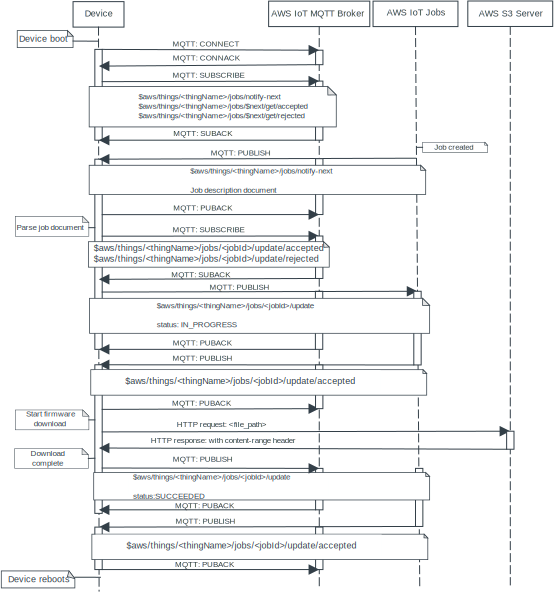

.. _lib_aws_fota:

AWS FOTA
########

.. contents::
   :local:
   :depth: 2

The Amazon Web Services firmware over-the-air (AWS FOTA) library combines the :ref:`lib_aws_jobs` and :ref:`lib_fota_download` libraries into a library that can perform an over-the-air firmware update using HTTP and HTTPS.

It connects to the specified broker using the existing or given certificates and uses `TLS`_ for the MQTT connection.
This means that the data sent in each MQTT message is encrypted.

When an update is available, the library receives a notification that contains metadata about the update.
This metadata contains the location of the uploaded firmware image.
The library then uses HTTP or HTTPS to download the firmware image, replacing the current firmware with the downloaded firmware.
After the new firmware image is downloaded, the application must perform a reboot to run the new image and complete the FOTA process.
The library supports the updating of delta images for both the application and modem firmware.

See :ref:`AWS FOTA implementation <aws_fota_implementation>` for information about the download procedure, and `AWS IoT Developer Guide`_ for general information about the Amazon Web Services IoT service.

Requirements
************

The library requires an `AWS account`_ with access to Simple Storage Service (S3) and the IoT Core service.

Creating a FOTA job
*******************

#. Go to `AWS S3 console`_ and sign in.
#. Click :guilabel:`Create bucket` and select a name.
#. Uncheck :guilabel:`Block all public access` under the *Block Public Access settings for this bucket* label.
#. Scroll down and click :guilabel:`Create bucket`.
#. Click the newly created bucket, select :guilabel:`Permissions` and insert the following permissive policy under *Bucket Policy*:

   .. parsed-literal::
      :class: highlight

      {    "Version": "2012-10-17",
           "Statement": [
               {
                   "Effect": "Allow",
                   "Principal": "*",
                   "Action": "s3:GetObject",
                   "Resource": "arn:aws:s3:::*bucket_name*/\*"
               }
            ]
      }

   Replace the *bucket_name* with the name of your bucket.

.. note::
   The policy example is only intended for development environments.
   AWS Best Practices recommends that the **principal** is specified in the Bucket Policy to prevent anonymous users access to S3.
   For more information, refer to the example policies listed in `AWS IoT Core policy examples`_ and `Security best practices in AWS IoT Core`_.

#. Click :guilabel:`Objects` to go back to the bucket.
#. Click :guilabel:`Upload` and :guilabel:`Add files`.
#. Select the file :file:`app_update.bin` (located in the :file:`zephyr` subfolder of your build directory).

   If you want to update the modem firmware, extract the content of a downloaded modem firmware zip and select the desired delta update, for example :file:`mfw_nrf9160_update_from_1.3.1_to_1.3.2`.
   The various modem firmware versions can be found in `nRF9160 DK Downloads`_ for the nRF9160 DK, and `nRF9161 DK Downloads`_ for the nRF9161 DK.
#. Click :guilabel:`Upload` and then :guilabel:`Close`.
#. Click the uploaded image file :file:`app_update.bin` and copy the *Object URL* without the *https://* prefix and folder path.
#. Create a text file (job document) with content as in the snippet, replacing the following data:

     * *protocol* with either `http` or `https`.
     * *host_url* with the *Object URL* copied in the previous step (for example, ``examplebucket.s3.eu-central-1.amazonaws.com``).
     * *file_path* with the path and file name (for example, ``app_update.bin``).

   .. parsed-literal::
      :class: highlight

      {
        "operation": "app_fw_update",
        "fwversion": "v1.0.2",
        "size": 181124,
        "location": {
          "protocol": "*protocol*",
          "host": "*host_url*",
          "path": "*file_path*"
         }
      }

   To use a single URL, such as when using presigned AWS S3 URLs, see :ref:`aws_iot_jobs`.
   See `AWS IoT Developer Guide: Jobs`_ for more information about AWS jobs.
#. In the `AWS S3 console`_ Select the bucket, click :guilabel:`Upload`, and upload your job document.
   You must now have two files in your bucket, the uploaded image and the job document.
#. Log in to the `AWS IoT console`_.
#. Go to :guilabel:`Manage` -> :guilabel:`Remote actions`-> :guilabel:`Jobs`, and select :guilabel:`Create job`.
#. Click :guilabel:`Create custom job`, enter a unique job name and select your *Thing*.
#. Click :guilabel:`Browse S3` and locate the job document.
#. Click :guilabel:`Next`.
#. Select :guilabel:`Snapshot` under *Job run type*
#. Click the :guilabel:`Submit` button.

After the job has been submitted, the device picks up the job automatically.
This can take several minutes.
In the `AWS S3 console`_ you can check the status of the job to confirm that it is in progress.

Troubleshooting
===============

ERROR: -NRF_ECONNREFUSED:
   Error -NRF_ECONNREFUSED ("Connection refused") indicates an error with the configured certificates.

ERROR: -NRF_EHOSTUNREACH:
   Error -NRF_EHOSTUNREACH ("Host is unreachable") indicates that the download URL provided in the job document is wrong.

Content range is not defined:
   If you host the firmware image on a different server than in an S3 bucket, this error indicates that the Content-Range field is missing in the HTTP GET header.
   To fix this problem, configure the host server to provide this field.
   Also, confirm that your file is available from the browser without being logged into your AWS account.

Configuration
*************

Configure the following parameters when using this library:

* :kconfig:option:`CONFIG_AWS_FOTA_PAYLOAD_SIZE` - Sets the maximum payload size for AWS IoT job messages.
* :kconfig:option:`CONFIG_AWS_FOTA_DOWNLOAD_SECURITY_TAG` - Sets the security tag to be used in case of HTTPS downloads.

Additionally, configure the :ref:`lib_download_client` library:

* :kconfig:option:`CONFIG_DOWNLOAD_CLIENT_MAX_HOSTNAME_SIZE` - Sets the maximum length of the host name for the download client.
* :kconfig:option:`CONFIG_DOWNLOAD_CLIENT_MAX_FILENAME_SIZE` - Sets the maximum length of the file name for the download client.

.. _aws_fota_implementation:

Implementation
**************

The following sequence diagram shows how a firmware over-the-air update is implemented through the use of `AWS IoT MQTT`_, `AWS IoT jobs`_, and `AWS Simple Storage Service (S3)`_.

   AWS Firmware Over-the-Air

.. important::
   Other devices that are connected to the same AWS MQTT broker receive the same messages if the following conditions are met:

   * The other device has valid (but different) certificates that use the same AWS IoT policy as the original device.
   * The other device is subscribed to the same MQTT topic as the original device.

.. _aws_iot_jobs:

AWS IoT jobs
============

The implementation uses a job document like the following (where *protocol* is either `http` or `https`, *bucket_name* is the name of your bucket and *file_name* is the name of your file) for passing information from `AWS IoT jobs`_ to the device:

.. parsed-literal::
   :class: highlight

   {
     "operation": "app_fw_update",
     "fwversion": "v1.0.2",
     "size": 181124,
     "location": {
       "protocol": "*protocol*",
       "host": "*bucket_name*.amazonaws.com",
       "path": "*file_name*.bin"
      }
   }

Alternatively, to use a single URL, a document like the following can be used:

.. parsed-literal::
   :class: highlight

   {
     "operation": "app_fw_update",
     "fwversion": "v1.0.2",
     "size": 181124,
     "location": {
       "url": "*url*"
      }
   }

For information on how to use presigned AWS S3 URLs, refer to `AWS IoT Developer Guide: Managing Jobs`_.

Limitations
***********

* If the :kconfig:option:`CONFIG_AWS_FOTA_DOWNLOAD_SECURITY_TAG` Kconfig option is not configured but HTTPS is selected as the protocol, the update job fails.
  For further information about HTTPS support, refer to :ref:`the HTTPS section of the download client documentation <download_client_https>`.
* The library requires a Content-Range header to be present in the HTTP response from the server.
  This limitation is inherited from the :ref:`lib_download_client` library.

API documentation
*****************

| Header file: :file:`include/net/aws_fota.h`
| Source files: :file:`subsys/net/lib/aws_fota/`

.. doxygengroup:: aws_fota
   :project: nrf
   :members:
