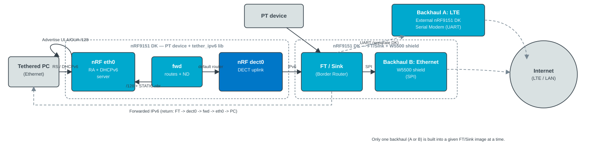

.. _lib_dect_tethering:

DECT NR+: IPv6 tethering
#########################

.. contents::
   :local:
   :depth: 2

The DECT NR+ IPv6 tethering library turns an nRF device with a DECT NR+ uplink into an IPv6 gateway for a tethered host on Ethernet.
It advertises the device as the host's default router, assigns DECT NR+-derived ULA and GUA ``/128`` addresses through a built-in DHCPv6 server, and forwards traffic using standard Zephyr IPv6 routing.

.. note::
   The current implementation is :ref:`experimental <software_maturity>`.

Overview
********

Use this library when a PC or similar host is connected over Ethernet (``eth0``) and must reach the IPv6 network through the device's DECT NR+ interface (``dect0``).

The tether model is split across two mechanisms on the host leg:

* Router Advertisements (RA) on Ethernet tell the host to use this device as the IPv6 default gateway.
  The Managed (M) flag directs the host to obtain addresses through DHCPv6 rather than SLAAC.
* A minimal DHCPv6 server on UDP port ``547`` offers ULA and GUA ``/128`` values derived from the DECT NR+ interface.
* IPv6 forwarding helpers install a default router on ``dect0`` toward the DECT NR+ parent and ``/128`` routes plus neighbor entries on ``eth0`` so return traffic reaches the tethered host.

An optional mDNS forwarder can bridge IPv6 mDNS (UDP port ``5353``) between ``eth0`` and ``dect0`` for service discovery across the two legs.

It targets PT (Portable Termination) devices with an established DECT NR+ stack and network interfaces.

Implementation
==============

The library uses Zephyr IPv6 routing (routes and neighbor discovery), not L2 address rewrite hooks.
Address sourcing on ``dect0`` may use :kconfig:option:`CONFIG_NET_L2_DECT_IPV6_IFACE_UNICAST_SKIP` when ULA/GUA are not listed on the interface address table.

Architecture
------------

The following figure shows the IPv6 tethering data path, together with the surrounding system context: PT devices connect directly to the FT in a star topology, and an FT/Sink Border Router bridges the DECT NR+ network out to the Internet over one of its two backhauls (LTE using Serial Modem on a separate DK, or Ethernet through a W5500 shield on the same DK; only one is built into a given FT/Sink image at a time).

   IPv6 tethering data path: the host learns the default router and addresses on ``eth0``; forwarded traffic uses routes and neighbors installed by the library.

Modules
-------

.. list-table::
   :header-rows: 1

   * - Module
     - Source file
     - Role
   * - Host Ethernet
     - :file:`dect_tether_ipv6_host.c`
     - Resolves the tethered host leg (Kconfig name or first Ethernet)
   * - Init
     - :file:`dect_tether_ipv6.c`
     - Starts RA, DHCPv6, routing, uplink, and optional mDNS in order; rolls back on failure
   * - Addresses
     - :file:`dect_tether_ipv6_addr.c`
     - Reads ULA/GUA from ``dect0`` (iface list or L2 off-iface helper)
   * - RA
     - :file:`dect_tether_ipv6_ra.c`
     - ICMPv6 RAs on Ethernet (default router, RDNSS, M flag, optional PIO with L=0/A=0)
   * - DHCPv6
     - :file:`dect_tether_ipv6_dhcpv6_srv.c`
     - Minimal server, lease snapshot, proactive revoke on DECT NR+ uplink loss
   * - Uplink
     - :file:`dect_tether_ipv6_uplink.c`
     - Subscribes to DECT NR+ parent association events; triggers RA/DHCP and routing helpers
   * - Routing
     - :file:`dect_tether_ipv6_fwd.c`
     - DECT NR+ parent default router, Ethernet ``/128`` routes, STATIC neighbors
   * - mDNS (optional)
     - :file:`dect_tether_ipv6_mdns_fwd.c`
     - AF_PACKET tap between ``eth0`` and ``dect0`` (no IID masquerade)

When the DECT NR+ parent association is released, the uplink module triggers RA withdrawal (router lifetime 0, M cleared, RDNSS lifetime 0), DHCPv6 lease revoke (IAADDR lifetimes 0), and routing teardown so the tethered host is notified promptly.

Supported features
==================

* ICMPv6 Router Advertisements on the host Ethernet interface: default router lifetime, optional MTU, Managed (M) flag, optional RDNSS (RFC 8106), optional Prefix Information Options with L=0 and A=0 (prefix hint without SLAAC).
* Minimal DHCPv6 server: Solicit, Request, Renew, Rebind, Confirm, and Information-request handling; joins ``ff02::1:2``.
* IPv6 routing helpers: default router on ``dect0`` after parent association; ``/128`` routes and STATIC neighbor entries on ``eth0`` after DHCPv6 bind.
* Uplink loss handling: debounced lease revoke and unsolicited RA when the DECT NR+ parent association is lost.
* Optional IPv6 mDNS forwarder between Ethernet and DECT NR+ (queries and unicast replies filtered by ULA/GUA scope).

Requirements
************

The library requires:

* IPv6 networking (:kconfig:option:`CONFIG_NET_IPV6`)
* DECT NR+ L2 (:kconfig:option:`CONFIG_NET_L2_DECT`)
* UDP sockets (:kconfig:option:`CONFIG_NET_UDP` and :kconfig:option:`CONFIG_NET_SOCKETS`)
* An Ethernet interface for the host leg when RA or DHCPv6 is enabled
* DECT NR+ parent association for upstream IPv6 connectivity
* :kconfig:option:`CONFIG_NET_ROUTE`, :kconfig:option:`CONFIG_NET_ROUTING`, and
  :kconfig:option:`CONFIG_NET_IPV6_NBR_CACHE` (required by the library for IPv6 forwarding)
* :kconfig:option:`CONFIG_NET_L2_DECT_MGMT` when RA or DHCPv6 is enabled (pulls in
  :kconfig:option:`CONFIG_NET_MGMT_EVENT_INFO` for DECT NR+ association-change events)

Configuration
*************

To enable the library, set :kconfig:option:`CONFIG_DECT_TETHER_IPV6_LIB`.

Sub-features are controlled by dedicated Kconfig options (all under ``DECT NR+ libraries`` → ``DECT IPv6 tethering``):

* :kconfig:option:`CONFIG_DECT_TETHER_IPV6_RA`—ICMPv6 RAs on Ethernet (default: enabled)
* :kconfig:option:`CONFIG_DECT_TETHER_IPV6_DHCPV6_SERVER`—minimal DHCPv6 server (default: enabled)
* :kconfig:option:`CONFIG_DECT_TETHER_IPV6_MDNS_FORWARD`—mDNS tap (default: disabled)
* :kconfig:option:`CONFIG_DECT_TETHER_IPV6_HOST_ETH_IFACE`—host Ethernet interface name (default: empty, first Ethernet)

See :file:`subsys/net/lib/dect/tether_ipv6/Kconfig` for RA timing, RDNSS addresses, DHCPv6 lifetimes, debug trace options, and mDNS thread settings.

Usage
*****

Call :c:func:`dect_tether_ipv6_init` after ``nrf_modem_lib_init()`` and with the network stack initialized.
Call :c:func:`dect_tether_ipv6_deinit` to stop RA, DHCPv6, forwarding, and mDNS threads or handlers.

.. code-block:: c

   #include <dect_tether_ipv6.h>

   int err;

   err = nrf_modem_lib_init();
   if (err) {
       return err;
   }

   err = dect_tether_ipv6_init();
   if (err) {
       return err;
   }

Samples using the library
*************************

The following |NCS| sample uses this library:

* :ref:`dect_tether_ipv6_sample`

Limitations
***********

The library has the following limitations:

* The DHCPv6 server holds one active lease (DUID+IAID); other hosts get NoAddrsAvail or are ignored.
* RA, DHCPv6, and forwarding operate on the host Ethernet interface selected by
  :kconfig:option:`CONFIG_DECT_TETHER_IPV6_HOST_ETH_IFACE` (empty = first Ethernet).
* Ethernet ingress source filtering by tethered host address is not implemented.
  A design based on :kconfig:option:`CONFIG_NET_PKT_FILTER` and the IPv6 receive hook
  (using the committed DHCPv6 lease as the allowlist) is tracked as a possible enhancement.
* Cross-leg unicast mDNS is dropped when the source or destination is link-local
  (``fe80::``); only multicast queries/responses to ``ff02::fb`` are forwarded.
* If DECT NR+-derived addresses change between exchanges, Request/Renew/Rebind Replies
  include the previous IAADDR entries with lifetime 0 before any new addresses.

Dependencies
************

* :ref:`zephyr:networking_api`
* DECT NR+ L2 helpers (:file:`net/dect/dect_net_l2.h`)
* :kconfig:option:`CONFIG_NET_L2_ETHERNET` for the host leg
* :kconfig:option:`CONFIG_NET_SOCKETS_PACKET` when mDNS forwarding is enabled

API documentation
*****************

| Header file: :file:`subsys/net/lib/dect/tether_ipv6/dect_tether_ipv6.h`
| Source files: :file:`subsys/net/lib/dect/tether_ipv6/`

.. doxygengroup:: dect_tether_ipv6
