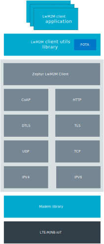

.. _lib_lwm2m_client_utils:

LwM2M client utils
##################

.. contents::
   :local:
   :depth: 2

The LwM2M client utils library enables an nRF9160-based device to connect to an LwM2M server such as `Leshan Demo Server`_ using the Lightweight Machine to Machine (`LwM2M`_) protocol over LTE.
Once the device is connected, the library supports the querying the device to retrieve location data or information about the modem.
This library builds on top of Zephyr's :ref:`lwm2m_interface` client.

Overview
********

The purpose of the library is to provide a basic combination of LwM2M objects, which forms a common communication framework for applications that communicate with an LwM2M server.
Following are the fixed set of readily initialized objects that are available to the users:

* Firmware Update object
* Connectivity Monitoring object
* Device object
* Location object
* LwM2M Security object
* Signal Measurement Information object
* Proprietary Location Assistance object

These objects do not indicate a complete set of resources that a device is expected to support.
Based on the use case, a user application can, and is expected to, define additional set of resources based on the capabilities of the device.

By default, the library uses LTE-M for connecting and it does not utilize a bootstrap server.
The library does not use the LwM2M Queue mode either.
To use NB-IoT, a bootstrap server, or the queue mode, follow the implementation details described in the :ref:`lwm2m_client` sample.

Configuration
*************

Enable the following parameters to use this library:

* :kconfig:option:`CONFIG_LWM2M_CLIENT_UTILS`
* :kconfig:option:`CONFIG_LWM2M_CLIENT_UTILS_DEVICE_OBJ_SUPPORT`
* :kconfig:option:`CONFIG_LWM2M_CLIENT_UTILS_SECURITY_OBJ_SUPPORT`
* :kconfig:option:`CONFIG_LWM2M_CLIENT_UTILS_CONN_MON_OBJ_SUPPORT`
* :kconfig:option:`CONFIG_LWM2M_CLIENT_UTILS_LOCATION_OBJ_SUPPORT`
* :kconfig:option:`CONFIG_LWM2M_CLIENT_UTILS_FIRMWARE_UPDATE_OBJ_SUPPORT`
* :kconfig:option:`CONFIG_LWM2M_CLIENT_UTILS_SIGNAL_MEAS_INFO_OBJ_SUPPORT`

Support for the objects is enabled by default, but they can be set individually.
Disable the :kconfig:option:`CONFIG_LWM2M_CLIENT_UTILS_DEVICE_OBJ_SUPPORT` Kconfig option only if you are implementing a ``Reboot`` resource on your application because of a mandatory requirement.

If you are using the Firmware Update object and require downloading of firmware images from TLS enabled services like HTTPS, configure :kconfig:option:`CONFIG_LWM2M_CLIENT_UTILS_DOWNLOADER_SEC_TAG` to specify the security tag that has root certificate for the target server.

.. _lwm2m_client_utils_additional_confg:

Additional configuration
========================

The :kconfig:option:`CONFIG_LWM2M_CLIENT_UTILS_RAI` Kconfig option enables :term:`Release Assistance Indication (RAI)` for access stratum (AS).
When AS RAI is configured, the device might indicate that no further data is expected in the near future and the connection can be released.
AS RAI was introduced in the 3GPP Release 14 and needs to be supported by the network.

The :kconfig:option:`CONFIG_LWM2M_CLIENT_UTILS_LTE_CONNEVAL` Kconfig option enables the connection pre-evaluation feature that requests information about a cell that is likely to be used for data transmission.
Based on the received estimation of the energy efficiency, the application can decide when the actual data transmission is started.
The application sets the maximum delay for data transmission, the threshold for energy consumption, and the poll period for evaluation.
If the estimated energy usage is above the configured threshold value, the connection pre-evaluation pauses the LwM2M engine and waits for a better signal state that meets the energy efficiency threshold, then resumes data transmission.
But if this waiting period is longer than the maximum delay set for the data transmission, the connection pre-evaluation resumes the LwM2M engine.

.. note::
   Connection pre-evaluation consumes a small amount of energy every time it requests information about a cell.

Defining custom objects
=======================

In addition to the basic objects, you can also create custom LwM2M objects.
For most of the applications, the business logic might be implemented inside custom objects, which are either proprietary to the application or following an external specification like `IPSO objects`_.
In any case, the application can extend the resource tree by defining specific objects in addition to the objects that are already defined by LwM2M.

Before defining proprietary objects, check if a similar functionality is already defined in `LwM2M Object and Resource Registry`_ and use it instead of defining custom objects.

.. note::
   Zephyr's :ref:`lwm2m_interface` library has only a limited support for some IPSO objects.
   To extend the functionality beyond the supported objects, you must make changes to the internal engine as well.

To define custom objects, complete the following steps:

1. Determine the object ID of the object.
#. Identify the resources corresponding to the object.
#. Determine the resource ID for a resource that must be customized.
#. Form the resource path for the resource in the ``object ID/instance/resource ID`` format.
#. Create a structure for storing the resource value.
#. Define a read function that responds to the read requests for the resource value from the server.
#. Pass the resource information to the LwM2M client utils library to register callbacks for the resource and to publish the sensor data.

The following example describes how you can define an object that follows the Generic Sensor definition from IPSO.
To enable the support for Generic Sensor, set the Kconfig option :kconfig:option:`CONFIG_LWM2M_IPSO_GENERIC_SENSOR` to ``y``.

To define an object that follows the Generic Sensor definition, complete the following steps:

1. Determine the object ID of the object:

   Refer `LwM2M Object and Resource Registry`_ list and observe that the object ID of the Generic Sensor object is ``3300``.

#. Identify the resources corresponding to the object:

   Click on the entry for the object ID(``3300`` in this example) in the LwM2M Object and Resource Registry list to open a `raw XML`_ file or open the user friendly `LwM2M editor`_ to determine the resources that are defined for the specific the object ID.
   The following table shows the resource list corresponding to the Generic Sensor object:

   .. list-table::
      :header-rows: 1
      :widths: auto

      * - ID
        - Name
        - Operations
        - Instances
        - Mandatory
        - Type
        - Description
      * - 5700
        - Sensor Value
        - R
        - Single
        - Mandatory
        - Float
        - Last or Current Measured Value from the Sensor.
      * - 5701
        - Sensor Units
        - R
        - Single
        - Optional
        - String
        - Measurement Units Definition.
      * - 5601
        - Min Measured Value
        - R
        - Single
        - Optional
        - Float
        - The minimum value measured by the sensor since power ON or reset.
      * - 5602
        - Max Measured Value
        - R
        - Single
        - Optional
        - Float
        - The maximum value measured by the sensor since power ON or reset.

#. Determine the resource ID for a resource that must be customized:

   This example changes only the single resource that is marked ``Mandatory`` in the above table, which is Sensor Value.
   You can see that the resource ID for the Sensor Value resource is ``5700``.

#. Form the resource path for the resource in the ``object ID/instance/resource ID`` format:

   LwM2M uses resource paths in the ``object ID/instance/resource ID`` format.
   The object ID in the example is ``3300`` and since it is the first instance of the object, the instance value is ``0``.
   Therefore, the full path for the sensor value will be ``3300/0/5700``.
   You must use this path in the LwM2M client utils library API.

#. Define a read function that responds to the read requests for the resource value from the server:

   .. code:: c

     static double sensor_value = 1.0;

      static void *read_cb(uint16_t obj_inst_id, uint16_t res_id, uint16_t res_inst_id, size_t *data_len)
      {
         /* Only object instance 0 is currently used */
         if (obj_inst_id != 0) {
            *data_len = 0;
         return NULL;
         }

         /* Demo: change the sensor value */
         sensor_value += 0.1;

         /* Return sensor value for the LwM2M library */
         lwm2m_set_f64(&LWM2M_OBJ(3300, 0, 5700), sensor_value);
         *data_len = sizeof(sensor_value);
         return &sensor_value;
      }

#. Pass the resource information to the LwM2M client utils library to register callbacks for the resource and to publish the sensor data:

   .. _example_callback:

   .. code:: c

      int init_resource(void)
      {
         lwm2m_create_obj_inst(&LWM2M_OBJ(3300, 0);
         lwm2m_register_read_callback(&LWM2M_OBJ(3300, 0, 5700), read_cb);
         return 0;
      }

   The above code registers the object instance and passes the resource information to the library to register the read callback.

At this stage, the generic sensor is fully functional.
For defining outputs, the process is very much similar but instead of read callback, write callback is defined.

Registering a read callback is optional and is recommended if you want to read the data directly from a sensor on each read operation.
If the value of a readable resource is modified on an event, a read callback need not be registered.
An example is the Push Button object.
On receipt of an event that is triggered by button press or release, the value is updated through the lwm2m_engine with :c:func:`lwm2m_set_bool`.
When a read operation is issued by the server, the engine obtains the button value directly from the object's internal data instead of the read callback.
This causes the internal engine to allocate memory and store all the resources that are defined for the IPSO object ID.

Extending the library with new object types
===========================================

If the library is not supporting the object type that you need, it is possible to extend the support by introducing completely new object types.
This is currently possible only by using an internal API from the LwM2M engine.

Before creating new object types, see the existing implementation of IPSO objects from :file:`zephyr/subsys/net/lib/lwm2m` directory.
Select one of the existing object types, for example Push Button, and refactor it according to your need.

The following example shows how to create a new object type that follows the IPSO Digital Output definition:

1. Define the following IDs:

   .. code:: c

      #define IPSO_DIGITAL_OUTPUT_ID        3201
      #define OUTPUT_DIGITAL_STATE_ID        5550
      #define RESOURCE_PATH &LWM2M_OBJ(IPSO_DIGITAL_OUTPUT_ID, 0, OUTPUT_DIGITAL_STATE_ID)

#. Define the storage for the output type:

   .. code:: c

      /* resource state */
      struct output_data {
         bool state;
      };
      static struct output_data output_data[MAX_INSTANCE_COUNT];

#. Define the resources for the object type:

   .. code:: c

      #define N_RESOURCES        1
      static struct lwm2m_engine_obj_field fields[] = {
         OBJ_FIELD(OUTPUT_DIGITAL_STATE_ID, RW, BOOL),
     };

   The above code defines only a single resource.

#. Define the structures that are required by the engine:

   .. code:: c

      static struct lwm2m_engine_obj output_obj;
      static struct lwm2m_engine_obj_inst inst[MAX_INSTANCE_COUNT];
      static struct lwm2m_engine_res res[MAX_INSTANCE_COUNT][N_RESOURCES];
      static struct lwm2m_engine_res_inst res_inst[MAX_INSTANCE_COUNT][N_RESOURCES];

#. Pass the information about how you want to create the object to the LwM2M engine:

   .. code:: c

      static struct lwm2m_engine_obj_inst *output_create(uint16_t id)
      {
         /* Check that there is no other instance with this ID */
         /* It is assumed that the instance ID is same as the index in the array */
         if (inst[id].obj) {
            LOG_ERR("Cannot create instance - already existing: %u", id);
            return NULL;
         }

         if (id >= MAX_INSTANCE_COUNT) {
            LOG_ERR("Cannot create instance - no more room: %u", id);
            return NULL;
         }

         /* Set default values */
         (void)memset(&output_data[id], 0, sizeof(output_data[id]));

         (void)memset(res[id], 0, sizeof(res[id][0]) * ARRAY_SIZE(res[id]));
         init_res_instance(res_inst[id], ARRAY_SIZE(res_inst[id]));

         /* initialize instance resource data */
         int i = 0, j = 0;
         INIT_OBJ_RES(OUTPUT_DIGITAL_STATE_ID, res[id], i,
               res_inst[id], j, 1, false, true,
               &output_data[id].state,
               sizeof(output_data[id].state),
               NULL, NULL, NULL, NULL);

         inst[id].resources = res[id];
         inst[id].resource_count = i;

         LOG_DBG("Created IPSO Output instance: %d", id);

         return &inst[id];
      }

#. Register the new object type with the engine:

   .. code:: c

      int ipso_output_init()
      {
         output_obj.obj_id = IPSO_DIGITAL_OUTPUT_ID;
         output_obj.fields = fields;
         output_obj.field_count = ARRAY_SIZE(fields);
         output_obj.max_instance_count = ARRAY_SIZE(inst);
         output_obj.create_cb = output_create;
         lwm2m_register_obj(&output_obj);
         lwm2m_create_obj_inst(&LWM2M_OBJ(3201, 0));
         lwm2m_register_post_write_callback(RESOURCE_PATH, on_off_cb);
         return 0;
      }

   As shown in the above code, the instance is created, and a callback is attached to it.
   The content of the callback is similar as in the :ref:`Generic Sensor example <example_callback>`. Some details are left out in these examples and for more information, see the existing IPSO objects from the LwM2M engine.

API documentation
*****************

| Header files: :file:`include/net/lwm2m_client_utils.h`
| Source files: :file:`subsys/net/lib/lwm2m_client_utils/lwm2m`

.. doxygengroup:: lwm2m_client_utils
   :project: nrf
   :members:
   :inner:
