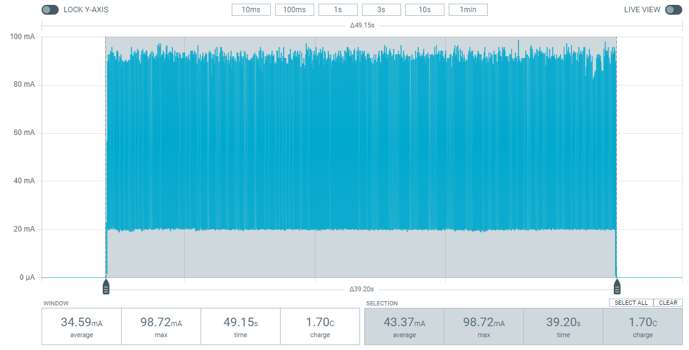

.. _lib_nrf_cloud_agps:

nRF Cloud A-GPS
###############

.. contents::
   :local:
   :depth: 2

The nRF Cloud A-GPS library enables applications to request and process Assisted GPS (`A-GPS`_) data from `nRF Cloud`_ to be used with the nRF9160 SiP.
This library is an enhancement to the :ref:`lib_nrf_cloud` library.

Overview
********

Using A-GPS reduces the time for a :term:`Global Navigation Satellite System (GNSS)` module to estimate its position, which is also called :term:`Time to First Fix (TTFF)`.
To get a position fix, a GNSS module needs information such as the satellite orbital data broadcasted by the satellites.
If nRF Cloud A-GPS service is used, the broadcasted information can be downloaded at a faster rate from nRF Cloud.

In addition to reducing the time to fix, A-GPS also provides ionospheric correction data to the device.
Ionospheric corrections enable GNSS to estimate the ionospheric delay for each satellite, making the position data more accurate.
While ionospheric corrections can also be downloaded from the satellite broadcast, this is often not practical because the whole GPS navigation message takes 12.5 minutes.

.. note::
   To use the nRF Cloud A-GPS service, you need an nRF Cloud account and the device needs to be associated with the account.

Configuration
*************

Configure the following options to enable or disable the use of this library:

* :kconfig:option:`CONFIG_NRF_CLOUD_AGPS`
* :kconfig:option:`CONFIG_NRF_CLOUD_MQTT` or :kconfig:option:`CONFIG_NRF_CLOUD_REST`

See :ref:`configure_application` for information on how to change configuration options.

Usage
*****

A-GPS data can be requested using one of the following methods:

* By specifying an array of A-GPS types.
* By requesting all the available assistance data.

If :kconfig:option:`CONFIG_NRF_CLOUD_MQTT` is enabled, the :c:func:`nrf_cloud_agps_request` function is used to request by type, and the :c:func:`nrf_cloud_agps_request_all` function is used to return all available assistance data.
If :kconfig:option:`CONFIG_NRF_CLOUD_REST` is enabled, the :c:func:`nrf_cloud_rest_agps_data_get` function is used to request A-GPS data.

When nRF Cloud responds with the requested A-GPS data, the :c:func:`nrf_cloud_agps_process` function processes the received data.
The function parses the data and passes it on to the modem.

Practical considerations
************************

When A-GPS data is downloaded using LTE network, the LTE link is in `RRC connected mode <Radio Resource Control_>`_.
The GNSS module can only operate when the device is in RRC idle mode or `Power Saving Mode (PSM)`_.
The time to switch from RRC connected mode to RRC idle mode depends on the network.
The switching time is usually not controlled by the device and is typically in the range of 5 to 70 seconds.
If the GNSS module has already been started before the device enters the RRC idle mode, this time may make TTFF appear longer than the actual time GNSS has spent running.

The validity time of a particular type of assistance data is different for each type of assistance data.
As an example, `Almanac`_ data has a far longer validity than `Ephemeris`_ data.
Usually, the best practice is to download only the assistance data requested by GNSS to reduce data traffic and save power, see :ref:`gnss_int_assistance_need`.

Data usage
==========

The size of full assistance data is around three kB.
Ephemerides for 32 GPS satellites are two kB, while everything else (almanacs, UTC parameters, ionospheric corrections, GPS system time, location and satellite integrity) is roughly one kB.
Ephemerides are only valid for two to four hours.
To have valid ephemerides at all times, new ephemerides need to be downloaded on average every two hours.
The cumulative amount of data for ephemerides for a day would then be 24 kB (24 / 2 * 2 kB).
Of rest of the data types, almanacs are by far the largest.
Almanacs are valid for weeks, so the data usage depends mostly on the need of ephemerides.

.. _agps_filtered_ephemerides:

Filtered ephemerides
--------------------

When the application only requires a GNSS fix once every two hours, it can reduce LTE data charges by enabling the :kconfig:option:`CONFIG_NRF_CLOUD_AGPS_FILTERED` Kconfig option (A-GPS filtered mode).
This option causes nRF Cloud to send ephemerides data for only those satellites whose elevation is at or above the :kconfig:option:`CONFIG_NRF_CLOUD_AGPS_ELEVATION_MASK` angle at the current moment.

When using the A-GPS filtered mode with the GNSS unit in periodic tracking mode, applications should disable scheduled downloads in the GNSS unit.
Applications do this when initializing the GNSS unit by bitwise ORing the :c:enumerator:`NRF_MODEM_GNSS_USE_CASE_SCHED_DOWNLOAD_DISABLE` bitmask with any other needed use case values, then passing the resulting value to the :c:func:`nrf_modem_gnss_use_case_set` function.
This ensures the GNSS unit does not stay on longer than needed due to the lack of a full set of ephemerides.

When the application requires multiple GNSS fixes within two hours, it can avoid unnecessary A-GPS data downloads from nRF Cloud by having the :kconfig:option:`CONFIG_NRF_CLOUD_AGPS_FILTERED` Kconfig option disabled.
This ensures that the ephemerides are available also for SVs that are not visible upon A-GPS data download, but become visible before the GNSS is started again.

Energy consumption
==================

Downloading A-GPS data over LTE consumes energy.
However, considering the energy consumption of both LTE and GNSS, the total energy consumption with A-GPS is lower than without it in most cases, even for a single fix.
Downloading the data using LTE is much quicker and the time GNSS needs to be active to get a fix is significantly reduced.

The example images illustrate the difference in energy consumption with and without A-GPS.
The time required to download the A-GPS data and to get a fix depend on the conditions, so the actual energy consumption and time needed varies.

LTE is configured to use the Power Saving Mode (PSM) with eight second active time in both cases.
nRF Cloud over MQTT is used to download the assistance data.
A cloud connection is established before the measurement starts, so the measurement only includes the assistance data download.

With A-GPS enabled, assistance data is first downloaded using LTE.
GNSS starts when the assistance data has been downloaded and the modem enters the RRC idle mode.

.. figure:: images/gnss_fix_ppk_agps.png
   :width: 100 %
   :alt: Current measurement with A-GPS

   Current measurement with A-GPS

It takes approximately 15 seconds to download assistance data, get the GNSS fix and switch LTE back to PSM.
The total consumed charge is approximately 0.5 C.

Without A-GPS, GNSS needs to run for a longer time.
LTE remains in PSM and the total energy consumption depends only on how long GNSS runs.

   Current measurement without A-GPS

It takes approximately 39 seconds to get the fix and the total consumed charge is 1.7 C.

Limitations
***********

.. agpslimitation_start

Approximate location assistance data is based on LTE cell location.
Not all cell locations are always available.
If they are not available, the location data will be absent in the A-GPS response.

.. agpslimitation_end

Dependencies
************

This library uses the following |NCS| libraries:

* :ref:`modem_info_readme`
* :ref:`lib_nrf_cloud`

It uses the following `sdk-nrfxlib`_ library:

* :ref:`nrfxlib:gnss_interface`

API documentation
*****************

| Header file: :file:`include/net/nrf_cloud_agps.h`
| Source files: :file:`subsys/net/lib/nrf_cloud/src/`

.. doxygengroup:: nrf_cloud_agps
   :project: nrf
   :members:
