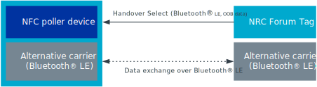
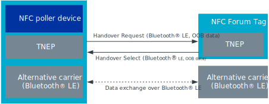

.. _nfc_tnep_ch_readme:

NFC TNEP Connection Handover
############################

.. contents::
   :local:
   :depth: 2

The NFC TNEP Connection Handover service handles the exchange of Connection Handover Messages between an NFC Forum Tag and an NFC Forum Poller device.
It uses the TNEP protocol in the Single Response Communication mode to exchange the handover messages between:

   * NFC Tag Device (see :ref:`tnep_tag_readme`)
   * NFC Poller Device (see :ref:`tnep_poller_readme`)

The Connection Handover Service name URI for the service announced in the Service Parameter record is ``urn:nfc:sn:handover``.

Handover protocol
*****************

The Connection Handover Protocol enables two NFC Forum devices to negotiate a shared set of alternative (non-NFC) communication carriers.
The Handover Requester Device is the NFC Forum Device that initiates the handover negotiation.
The Handover Selector Device is the NFC Forum Device that is initially passive and responds to the Handover Requester.

Static handover
===============

In the static handover, the Handover Requester only reads a Handover Select Message from the NFC Tag Device.
TNEP is not used in this communication form.

Negotiated handover
===================

In the negotiated handover, the Handover Requester provides a Handover Request Message that contains its set of supported carriers to the Handover Selector.
The Handover Selector replies with a Handover Select Message that contains the list of carriers that they both support.
Connection Handover NDEF messages are exchanged as defined by TNEP.

Device Role
***********

The role of the NFC Poller Device depends on the NFC Tag Device.
If the NFC Tag Device takes the role of the Handover Requester, it responds to the Service Select with a Handover Request Message.
This message includes a TNEP status record.
The NFC Poller Device responds with the Handover Select Message after having received the Handover Request Message.

If the NFC Tag Device takes the role of the Handover Selector, then the NFC Tag Device does not add any NDEF records defined in this specification into the TNEP status message.
The TNEP status message follows the Service Select message and the NFC Tag Device waits for a Handover Request Message from the NFC Poller Device.

The NFC Tag Device role is defined by callback set in the :c:struct:`nfc_tnep_ch_cb` structure and passed to the :c:func:`nfc_tnep_ch_service_init` function.

   * Handover Selector role. Set :c:member:`nfc_tnep_ch_cb.request_msg_recv`.
   * Handover Requester role. Set :c:member:`nfc_tnep_ch_cb.request_msg_prepare` and :c:member:`nfc_tnep_ch_cb.select_msg_recv`.

NFC Tag Device
**************

The following code sample demonstrates how to use this module with an NFC Tag Device:

.. literalinclude:: ../../../../../samples/bluetooth/peripheral_nfc_pairing/src/main.c
    :language: c
    :start-after: include_startingpoint_nfc_tnep_ch_tag_rst
    :end-before: include_endpoint_nfc_tnep_ch_tag_rst

This library is used in the :ref:`peripheral_nfc_pairing` sample.

NFC Poller Device
*****************

The following code sample demonstrates how to use this module with an NFC Poller Device:

.. literalinclude:: ../../../../../samples/bluetooth/central_nfc_pairing/src/main.c
    :language: c
    :start-after: include_startingpoint_nfc_tnep_ch_poller_rst
    :end-before: include_endpoint_nfc_tnep_ch_poller_rst

This library is used in the :ref:`central_nfc_pairing` sample.

API documentation
*****************

| Header file: :file:`include/nfc/tnep/ch.h`
| Source files: :file:`subsys/nfc/tnep/ch/`

.. _nfc_tnep_ch:

.. doxygengroup:: nfc_tnep_ch
   :project: nrf
   :members:
