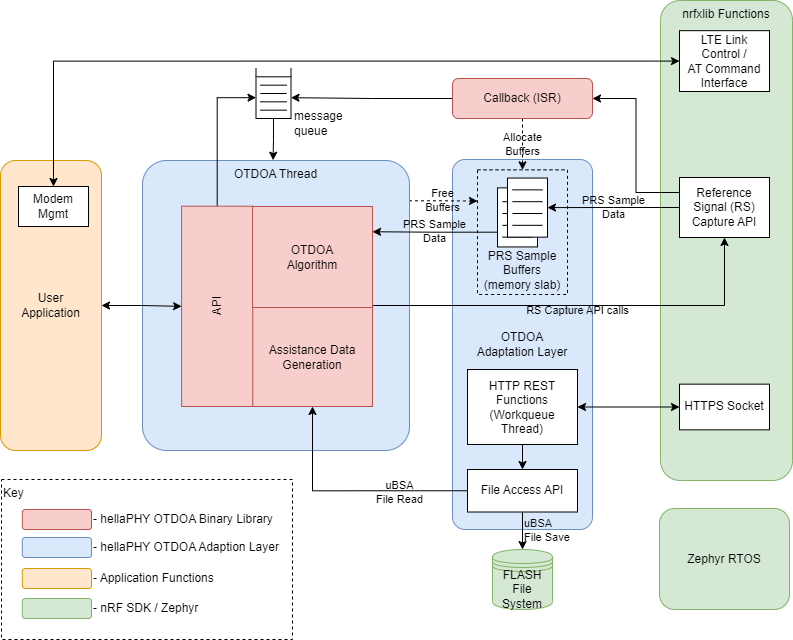

.. otdoa firmware architecture

hellaPHY OTDOA Firmware Architecture
====================================

The hellaPHY OTDOA subsystem consists of a hellaPHY OTDOA binary library (delivered in binary object code format),
and the hellaPHY OTDOA Adaptation Layer (delivered as source code as part of the nRF Connect SDK).

The figure below presents an overview of the hellaPHY OTDOA firmware subsystem. Functions that are implemented
in the binary library are shown in red, while those that are implemented in the adaptation
layer are shown in blue. Functions that are part of the nRF Connect SDK / Zephyr environment are shown
in green, and functions implemented by the user application are shown in orange.

hellaPHY OTDOA Binary Library
-----------------------------

The hellaPHY OTDOA binary library implements the following functions:

* OTDOA algorithms, including PRS signal time difference estimation and position estimation
* Assistance Data Generation that selects a set of cells for measurement
* OTDOA Application Programming Interface (API)
* A callback function to passing PRS sample data to the OTDOA system.

OTDOA Algorithm
~~~~~~~~~~~~~~~

The OTDOA algorithm comprises all the functions necessary to estimate the device
position based on reference signal time difference measurements. This includes
time-of-arrival estimation for multiple cells, time difference calculations,
position estimation using the time difference values, and various filtering functions.

The OTDOA algorithm also includes an enhanced cell-ID (eCID) position estimate function
that it uses when it cannot make a position estimate using OTDOA (for example when there are too
few cells observed).

Assistance Data Generation
~~~~~~~~~~~~~~~~~~~~~~~~~~

The assistance data generation function selects the set of cells that are measured by
the OTDOA algorithm. It is a subset of the larger set of cells contained in the uBSA.
The assistance data generation is typically done using the location of the current serving
cell as a "seed," and selecting a set of cells that are geographically close to the serving
cell.

OTDOA API
~~~~~~~~~

The hellaPHY OTDOA binary includes a C-callable API that allows user application code to control
and configure the OTDOA system. With the exception of initialization functions, these
APIs are thread-safe.

OTDOA Callback
~~~~~~~~~~~~~~

The hellaPHY OTDOA binary library includes a callback that implements the transfer of PRS samples
from the nrfxlib Reference Signal (RS) Capture API to the OTDOA algorithm. This callback
allocates a buffer, fills the buffer with PRS sample data, and sends a message to the OTDOA
algorithm indicating that the data is available for processing.

hellaPHY OTDOA Adaptation Layer
-------------------------------

The hellaPHY OTDOA adaptation layer implements these functions:

* HTTP REST interface to a cloud server to download the uBSA
* Optional HTTP REST interface for uploading of position estimate results to a server
* File Access API
* Zephyr threading functions
* Buffering for PRS sample data from the modem via the nrfxlib RS Capture API.

HTTP REST Interface
~~~~~~~~~~~~~~~~~~~

The adaptation layer includes the HTTP REST interface function that allows it to
download the uBSA and configuration information from a cloud server. The adaptation
layer uses the Zephyr TLS secure socket functions to communicate with the server.

Once downloaded, the uBSA file and the configuration file are stored in a file system on the UE,
where they may be accessed by the OTDOA library's algorithm and assistance generation functions.

File Access API
~~~~~~~~~~~~~~~

The file access API in the allows the adaptation layer and the OTDOA binary functions to access
files within the Zephyr file system in a thread-safe manner

Zephyr Threading Functions
~~~~~~~~~~~~~~~~~~~~~~~~~~

The adaptation layer supports various threading functions for the OTDOA system, including:

* a workqueue thread for the HTTP REST interface
* a traditional Zephyr thread for the OTDOA binary library functions, including a message queue

PRS Sample Buffering
~~~~~~~~~~~~~~~~~~~~

The adaptation layer provides a mechanism to buffer the data used by the OTDOA algorithm to
estimate timing differences between cells. This data is in the form of in-phase and
quadrature-phase (I/Q) samples from the modem, and it is stored in a memory slab
within the adaptation layer.
