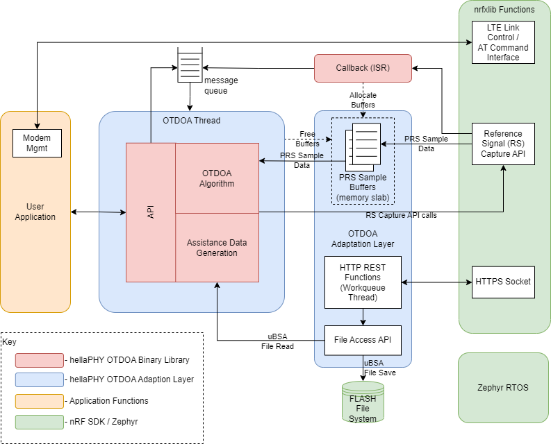

.. _otdoa_overview:

hellaPHY OTDOA Overview
#######################

hellaPHY Observed Time-Difference of Arrival (hellaPHY OTDOA) is a technique for estimating a UE's position.
It involves estimating time differences between signals broadcast by the terrestrial LTE cellular
network. These time difference estimates can then be used to triangulate the UE's position based
upon known cellular base station positions, in much the same way as GNSS systems triangulate
a position based upon know satellite positions. The hellaPHY OTDOA implementation in this library is
*UE-based*, meaning that the position estimate is calculated by the UE application processor,
rather than by a network server.

Cells in the LTE network broadcast Positioning Reference Signals (PRS) signals
that may be used to estimate the time difference of arrival at the UE. The PRS
signals are periodically broadcast by the LTE network (typically for 1 msec.
every 160 msec.), and they are multiplexed in a way that allows the UE to detect
PRS broadcast by multiple base stations at the same time.

Information about the cellular base stations, including their positions,
is contained in micro-Base Station Almanac (uBSA) file that is downloaded
by the UE from a network server. This uBSA is stored in a file system on
the UE, and it typically covers a large geographic area. The UE uses this
uBSA for many position estimates; if it moves outside the geographic coverage
area a new uBSA is automatically downloaded. An important function of the
OTDOA Adaptation Layer is to download the uBSA from a network server, and store
it in the UE file system for access by the OTDOA binary library.

Once the uBSA has been downloaded, all position estimate calculations are
performed by n the UE application processor. This includes collection of the PRS
signals, estimation of time differences of arrival, and triangulation
calculations necessary to estimate the UE position.

hellaPHY OTDOA has the following advantages:

* Very low power consumption
* Excellent privacy, since position estimates are calculated by the UE without network involvement.
* Good accuracy comparted to alternative cellular positioning technologies.

Implementation
**************

The hellaPHY OTDOA firmware subsystem consists of a binary library (delivered in binary
object code format), and the adaptation layer (delivered as source code as part of
the nRF Connect SDK). The diagram below shows an overview of the hellaPHY OTDOA firmware subsystem
in a typical application.

See :doc:`otdoa_firmware` and :doc:`otdoa_data_flow` for more information.

Supported Features
******************
The hellaPHY OTDOA adaptation layer supports the following features:

* uBSA download via an HTTP REST interface
* Configuration file download via an HTTP REST interface
* Optional position estimate results upload to a server via an HTTP REST interface

The hellaPHY OTDOA binary library supports the following features:

* OTDOA position estimate
* Enhanced Cell ID (ECID) position estimation algorithm providing a fallback estimate when the OTDOA position estimate is not available.
* Position estimate accuracy estimation algorithm.

Supported backends
******************
Not applicable

Requirements
************

hellaPHY OTDOA Binary Library
=============================
The hellaPHY OTDOA adaptation layer requires the hellaPHY OTDOA binary library to be separately
downloaded and integrated into the nRF Connect SDK by the developer.

Security Requirements
=====================

TLS Certificate
---------------
The UE requires a TLS certificate to authenticate with the network server
when downloading the uBSA or configuration information. This certificate
may be installed by the application using the :c:func:`otdoa_api_install_tls_cert`
API. Alternatively, the certificate may be installed by the adaptation layer
using the :kconfig:option:`CONFIG_OTDOA_API_TLS_CERT_INSTALL` configuration
option.

Network Server Keys
-------------------
The UE requires a public/private key pair to authenticate with the network server
when downloading the uBSA or configuration information. The private key is
loaded into the UE using the :c:func:`otdoa_api_provision` API. The public key
is sent to the network server where it is used to authenticate the UE.

Instructions for generating the public/private key pair are provided along with
the OTDOA binary library.

Configuration
*************
To use the OTDOA adaptation layer, enable the :kconfig:option:`CONFIG_OTDOA_AL_LIB` configuration option.

You can also configure the following options in the adaptation layer:

* :kconfig:option:`CONFIG_OTDOA_CFG_DL_INTERVAL` to configure the interval between config downloads.
* :kconfig:option:`CONFIG_OTDOA_PRS_SAMPLES_BUFFER_COUNT` to configure the number of buffer slabs for PRS samples.
* :kconfig:option:`CONFIG_OTDOA_HTTP_BLACKLIST_TIMEOUT` to configure the number of uBSA requests to make before removing an SC ECGI from the DL blacklist.
* :kconfig:option:`CONFIG_OTDOA_ENABLE_RESULTS_UPLOAD` to enable uploading of OTDOA results to a server.

These options control the HTTP thread and the RS thread operations:

* :kconfig:option:`CONFIG_OTDOA_HTTP_QUEUE_STACK_SIZE` to configure the HTTP work queue stack size.
* :kconfig:option:`CONFIG_OTDOA_HTTP_QUEUE_PRIORITY` to configure the HTTP work queue priority.
* :kconfig:option:`CONFIG_OTDOA_RS_THREAD_STACK_SIZE` to configure the RS work queue stack size in bytes.
* :kconfig:option:`CONFIG_OTDOA_RS_THREAD_PRIORITY` to configure the RS thread priority.

These options control the BSA download server and the results upload server:

* :kconfig:option:`CONFIG_OTDOA_BSA_DL_SERVER_URL` to configure the URL to download BSA files from.
* :kconfig:option:`CONFIG_OTDOA_HTTPS_PORT` to configure the port to use for OTDOA HTTPS operations.
* :kconfig:option:`CONFIG_OTDOA_HTTP_PORT` to configure the port to use for OTDOA HTTP operations.
* :kconfig:option:`CONFIG_OTDOA_RESULTS_UPLOAD_PW` to configure the password to use for Phywi API authentication when uploading OTDOA results.
* :kconfig:option:`CONFIG_OTDOA_UPLOAD_SERVER_URL` to configure the URL to upload OTDOA results to.

Security options:

* :kconfig:option:`CONFIG_OTDOA_API_TLS_CERT_INSTALL` to enable installing a TLS certificate through the OTDOA library.
* :kconfig:option:`OTDOA_TLS_SEC_TAG` to configure the TLS security tag slot to install PhyWi TLS certificate to.

OTDOA Library Types:

* :kconfig:option:`CONFIG_OTDOA_LIB_TYPE_PROD` to link with the standard production release version of the OTDOA binary library.
* :kconfig:option:`CONFIG_OTDOA_LIB_TYPE_DBG` to link with a version of the OTDOA binary library that includes verbose debug logging.
* :kconfig:option:`CONFIG_OTDOA_LIB_TYPE_DEV` to link with a version of the OTDOA binary library that includes modem capture support

Shell commands list
*******************

Usage
*****

Samples using the library
*************************
The following |NCS| samples use the hellaPHY OTDOA library and adaptation layer:

* :ref:`otdoa_sample`

Application integration
***********************

Additional information
**********************

Limitations
***********

Dependencies
************
This hellaPHY OTDOA library uses the following nRF Connect SDK libraries:

* LTE Link Control
* AT Command Library
* Modem Key Management
* Modem Information
* RS Capture (a new library supporting OTDOA)

It also uses the following secure firmware component:

* Trusted Firmware-M

It uses the following Zephyr libraries and services:

* Threads
* Queues
* Timers
* Memory Slabs
* File System (typically Little FS)

FLASH File System
=================

The OTDOA library uses a FLASH file system for storage of uBSA information. Typically
this makes use of the Zephyr Little FS file system, mounted on either an external serial
FLASH or using the NRF SoC internal FLASH.

Approximately 25KB of storage are used in this file system.

API documentation
*****************

| Header file: :file:`include/otdoa_al/otdoa_api.h`
| Source files: :file:`lib/otdoa_al/*.c`

.. doxygengroup:: phywi_otdoa_api
