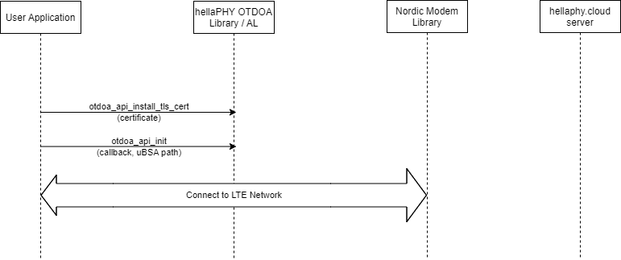

.. _otdoa_api:

hellaPHY OTDOA Application Programming Interface (API)
======================================================

The hellaPHY OTDOA library API provides a clear and consistent interface between the user's application
and the hellaPHY OTDOA library. It may also be accessed by Nordic's Location Library if that
feature is enabled by the developer.

The sections below provide message sequences for a variety of normal case and failure scenarios.
There are two normal case scenarios, one where a new uBSA must be downloaded, and one where
no uBSA download is required.

Each sequence shows API calls between the user application and the OTDOA Library. This API
is fully described in the file ``lib/otdoa/include/otdoa_api.h``.

Note that the majority of the OTDOA library functions are implemented on a separate thread.
So API calls made by the location library / app are typically converted into a message that
is sent to the OTDOA thread for processing. These messages are shown in the sequence diagrams
below (for example, the ``otdoa_api_start_session()`` API call gets converted to an ``OTDOA_CTRL_TEST``
message sent to the OTDOA thread).

Initialization
--------------

The hellaPHY OTDOA subsystem is initialized by the user application as shown in the message sequence
chart below. The call to ``otdoa_api_install_tls_cert()`` is optional, the user application
can manage the TLS certificate itself.

If the user application manages the TLS certificate, the :kconfig:option:`CONFIG_OTDOA_API_TLS_CERT_INSTALL`
option should be set to ``n``. In either case, the :kconfig:option:`OTDOA_TLS_SEC_TAG` must be set to
the tag where the certificate is installed.

Note that the ``otdoa_api_init()`` API includes a callback parameter. The OTDOA subsystem will use this callback
to pass results back to the user application as described in the next sections.

PRS Session Normal Case without uBSA Download
---------------------------------------------

In this case, the uBSA is already available in the file system, and it contains the current serving
cell. So the OTDOA library can generate the assistance data, and no uBSA download is required.

The user application manages the connection to the LTE network. In order to perform an
OTDOA position estimate, the UE must be connected to the live LTE network.

The user application initiates the hellaPHY OTDOA position estimation by calling ``otdoa_api_start_session()``.
The application can specify the duration of the position estimate in 160 ms. PRS occasions, as
well as a timeout (in milliseconds) for the position estimate complettion.

The hellaPHY OTDOA library directly accesses the nrfxlib RS Capture API to perform the position estimate.
It determines that the current serving cell is in the uBSA, and thus it can begin the position
estimate process (labelled "PRS Session" in the diagram)

Once the position estimate is complete, the results are returned to the user application
(via a callback) in the OTDOA_EVENT_RESULTS event.

PRS Session Normal Case with uBSA Download
------------------------------------------

In this sequence, a new uBSA must be downloaded before the position estimate can be done. The
hellaPHY OTDOA library detects that a new uBSA is required, and signals this to the user application
in the OTDOA_EVENT_UBSA_DL_REQ event.

The user application then requests that the OTDOA library download a new uBSA using the
``otdoa_api_ubsa_download()`` API call. This is done to allow the user application to "approve" the download.

When the download completes, the hellaPHY OTDOA library notifies the location library / app using the
``OTDOA_EVENT_UBSA_DL_COMPL`` event. The location library / app then signals that the new uBSA
is ready by calling the ``otdoa_api_ubsa_available()`` API. The library then executes the
position estimate as described above, and returns the result to the user application in the
OTDOA_EVENT_RESULTS event.

uBSA Download Failure
---------------------

If the uBSA download fails, the error is indicated to the user application in the
OTDOA_EVENT_UBSA_DL_COMPL event. There are a number of possible causes for such a
failure, including:

* Loss of the LTE connection (for example out of service area)
* Failure to establish IP communication with the server
* Failure to authenticate with the server

In this case, the user application should then cancel the position estimate by calling the
``otdoa_api_cancel_session()`` API. The hellaPHY OTDOA library will the return OTDOA_EVENT_FAIL
event with a cancelled error status.

No Network Connection
---------------------

In the case there is no connection to the network, the OTDOA library will return an OTDOA_EVENT_FAIL
event to the user application.

Session Canceled
----------------

The user application may cancel an OTDOA position estimate by calling the ``otdoa_api_cancel_session()``
API as shown in the figure below.

Session Timeout
---------------

If the session times out, an OTDOA_EVENT_FAIL event is returned to the user application
as shown in the figure below.

