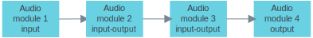
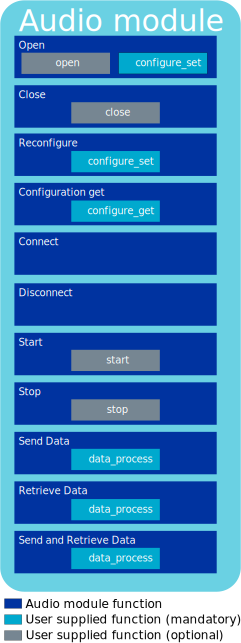
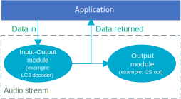

.. _lib_audio_module:

Audio module
############

.. contents::
   :local:
   :depth: 2

The audio module library is an interface to audio processing functions that coordinate audio states and the exchange of audio-related data of an LE Audio application, such as :ref:`nrf53_audio_app`.

Overview
********

The audio module is an interface for constructing custom audio processing modules, such as decoder, encoder, and I2S output.
It provides a common interface to audio processing algorithms. The operation of the module is determined by a set of user provided functions that perform the processing.

Using this interface, you can open and configure the custom modules, connect to them, and start and stop them.
You can also send audio data to and from the application.

There are three module types:

* Input - Obtains data internally within the module (for example I2S input) and outputs the data to another module, the application or both.
* Output - Takes input from another module or the application and outputs the data internally within the module (for example I2S output).
* Input-Output - Takes input from another module or the application, processes the data and then outputs the data to another module, the application or both.

This is an example of how you can connect modules together:

Implementation
==============

The audio module is implemented as a set of functions. These functions call out to the user's implementation that are wrapped in the :c:struct:`audio_module_functions` API. The following figure shows how the audio module functions and the user provided functions relate:

The following table outlines the available functions that are defined in :c:struct:`audio_module_functions` and whether they are mandatory or not:

.. list-table::
    :header-rows: 1

    * - Function
      - Mandatory/Optional
      - Comment
    * - ``audio_module_functions.*open``
      - Optional
      - Perform any operations necessary to open the module implementation.
    * - ``audio_module_functions.*close``
      - Optional
      - Tidy up and close the module implementation.
    * - ``audio_module_functions.*configure_set``
      - Mandatory
      - Configure the module implementation to perform a particular operation.
    * - ``audio_module_functions.*configuration_get``
      - Mandatory
      - Return the internal configuration of the module implementation.
    * - ``audio_module_functions.*start``
      - Optional
      - Perform any operations necessary to set the module implementation running.
    * - ``audio_module_functions.*stop``
      - Optional
      - Perform any operations necessary to stop the module implementation.
    * - ``audio_module_functions.*data_process``
      - Mandatory
      - Process the data within the module implementation.

A module implementation can run only if these user provided functions are defined and given to the audio module.
The audio module framework itself cannot perform any tasks, as it merely supplies a consistent way to interface to an audio algorithm.

The following figure show the internal states of the audio module:

.. figure:: images/audio_module_states.svg
   :alt: Audio module internal states

Configuration
*************

To use the audio module library, set the following Kconfig options to ``y`` in the project configuration file :file:`prj.conf`:

* :kconfig:option:`CONFIG_AUDIO_MODULE`
* :kconfig:option:`CONFIG_DATA_FIFO`

Application integration
***********************

To create your own audio module for an LE Audio application, complete the following steps:

#. Write the mandatory functions required by the function table API in `Implementation`_.
#. Write any optional functions.
#. Assign the function table to an instance of an audio module.

The audio application opens the module, configures it and connects it to other modules, the application or both.
The module can then be started and you can transfer data in accordance to what type the module is. The module types are described in `Overview`_.

The following figure demonstrates a simple decoding audio system, where the decoded audio is sent to an I2S output and returned to the application:

Dependencies
************

This library uses the following |NCS| library:

* :ref:`lib_data_fifo`

API documentation
*****************

| Header file: :file:`include/audio_module/audio_module.h`
| Source files: :file:`subsys/audio_module/audio_module.c`

.. doxygengroup:: audio_module
   :project: nrf
   :members:
