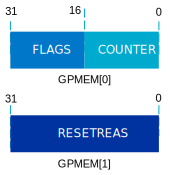

.. _network_core_monitor:

Network core monitor
####################

.. contents::
   :local:
   :depth: 2

This library monitors the network core status of the nRF5340 processor.

Overview
********

It detects suspensions and resets in the network processor.
When a reset occurs, you can read the cause of the reset.

Implementation
==============

The library uses two general-purpose registers of the IPC peripheral in the application core and writes the state of the network processor to them.



   IPC peripheral registers

The ``GPMEM[0]`` register is divided into two 16-bit parts.

The ``COUNTER`` value is incremented by the network core every :kconfig:option:`CONFIG_NCM_FEEDING_INTERVAL_MSEC`.
If the network core is suspended, the counter value is not updated.

The ``FLAGS`` field has the ``Reset`` flag as the bit 0.

The reset bit is set at the boot of the network core.
It informs the application core that a reset of the network core has occurred.

During the startup of the network core, the reset bit is set and the cause of the reset is written to the IPC register ``GPMEM[1]``.
This value is rewritten from the network core's ``RESET.RESETREAS`` register.
For a detailed description of the bits in this register, see the `RESETREAS`_ section for nRF5340.

The :c:func:`ncm_net_core_event_handler` function may be implemented by your application.
On the application core, the network core monitor checks the values of IPC registers written by the network core every :kconfig:option:`CONFIG_NCM_FEEDING_INTERVAL_MSEC`.
If the network core malfunctions and fails to increment the ``COUNTER`` value, the :c:func:`ncm_net_core_event_handler` function is called on the application core.
This function is also called when the network core is restarted.
The network core monitor provides a ``__weak`` implementation of that function in the :file:`nrf/subsys/net_core_monitor/app_core.c` file.

The following events are supported and also listed in the :file:`nrf/include/net_core_monitor.h` file:

* :c:macro:`NCM_EVT_NET_CORE_RESET`

   * Event triggered when a network core reset occurs.
   * The ``reset_reas`` variable holds the reason for the reset.
     It is rewritten from the ``RESET.RESETREAS`` register.

* :c:macro:`NCM_EVT_NET_CORE_FREEZE`

   * Event triggered when the network core is not responding.

Configuration
*************

To enable this library, set the :kconfig:option:`CONFIG_NET_CORE_MONITOR` Kconfig option to ``y`` on both network and application cores.

The :kconfig:option:`CONFIG_NCM_APP_FEEDING_INTERVAL_MSEC` Kconfig option specifies how often the counter is updated by the network core.
The default value is 500 milliseconds.

The :kconfig:option:`CONFIG_NCM_RESET_INIT_PRIORITY` Kconfig option sets priority for the initialization function.
The function reads the cause of the processor reset and passes this information to the application core.
It is executed at the network core boot.

Usage
*****

To enable the Network core monitor library, set the :kconfig:option:`CONFIG_NET_CORE_MONITOR` Kconfig option.

The :c:func:`ncm_net_core_event_handler` function can be used to notify the application about the status of the network core.
To define the user action for the event, you must override the ``__weak`` function definition of :c:func:`ncm_net_core_event_handler`.
Otherwise, the ``__weak``` definition is called and it prints information about the event.

See the following usage example.

.. code-block::

   #include "net_core_monitor.h"
   ...
   /* This is the override for the __weak handler. */
   void ncm_net_core_event_handler(enum ncm_event_type event, uint32_t reset_reas)
   {
      switch (event) {
      case NCM_EVT_NET_CORE_RESET:
         printk("The network core reset.\n");
         /* do something */
         break;
      case NCM_EVT_NET_CORE_FREEZE:
         printk("The network core is not responding.\n");
         /* do something */
         break;
      }
   }

Dependencies
************

The module uses two general-purpose registers, ``GPMEM[0]`` and ``GPMEM[1]``, of the application core's IPC peripheral.

API documentation
*****************

| Header file: :file:`include/net_core_monitor.h`
| Source files: :file:`subsys/net_core_monitor/`

.. doxygengroup:: net_core_monitor
   :project: nrf
   :members:
