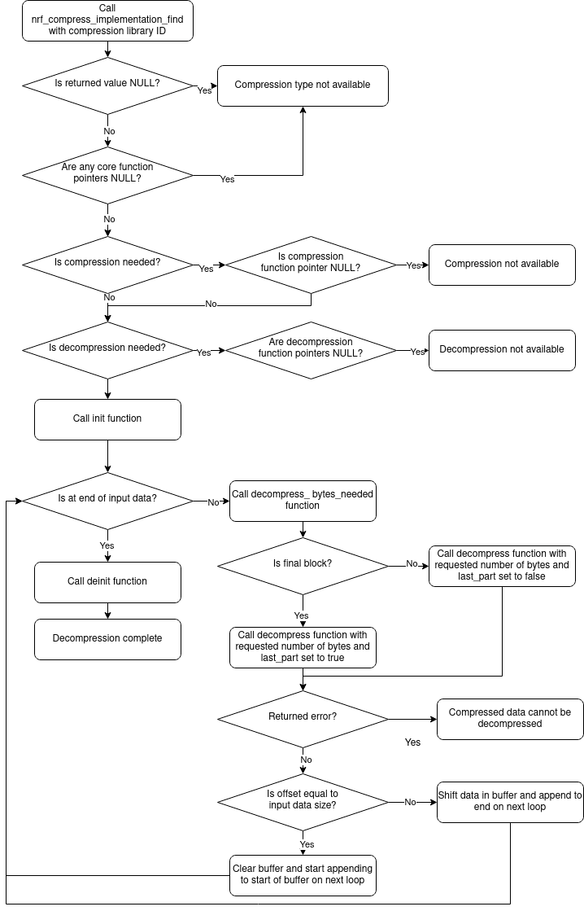

.. _nrf_compression:

nRF Compression
###############

.. contents::
   :local:
   :depth: 2

The nRF Compression library in the |NCS| provides a streamlined API for data compression and decompression on devices.

.. _nrf_compression_config:

Configuration
*************

You can enable different compression types by configuring the appropriate Kconfig options.
See :ref:`configuring_kconfig` for information about the different ways you can set Kconfig options in the |NCS|.

To enable this library, set the :kconfig:option:`CONFIG_NRF_COMPRESS` Kconfig option.
For decompression, set the :kconfig:option:`CONFIG_NRF_COMPRESS_DECOMPRESSION` Kconfig option.

.. note::
    The compression functionality is not currently supported.

.. _nrf_compression_config_compression_types:

Compression types configuration
===============================

You can use the available compression types by enabling their respective Kconfig options:

.. list-table::
   :header-rows: 1

   * - Name
     - Kconfig options
     - Implementation details
   * - LZMA version 1
     - :kconfig:option:`CONFIG_NRF_COMPRESS_LZMA` and :kconfig:option:`CONFIG_NRF_COMPRESS_LZMA_VERSION_LZMA1`
     - | Exclusive: cannot be enabled with LZMA version 2.
       | Fixed probability size of 14272 bytes.
       | Fixed dictionary size of 128 KiB.
   * - LZMA version 2
     - :kconfig:option:`CONFIG_NRF_COMPRESS_LZMA` and :kconfig:option:`CONFIG_NRF_COMPRESS_LZMA_VERSION_LZMA2`
     - | Exclusive: cannot be enabled with LZMA version 1.
       | Fixed probability size of 14272 bytes.
       | Fixed dictionary size of 128 KiB.
   * - ARM thumb filter
     - :kconfig:option:`NRF_COMPRESS_ARM_THUMB`
     - ---

Memory allocation configuration options
=======================================

Compression and decompression can use a significant amount of memory.
To manage this, use the following Kconfig options to choose between static and dynamic (malloc) allocations from the system heap:

:kconfig:option:`CONFIG_NRF_COMPRESS_MEMORY_TYPE_STATIC`
  This is the default option that uses static buffers, ensuring their availability but preventing other uses of the memory.

:kconfig:option:`CONFIG_NRF_COMPRESS_MEMORY_TYPE_MALLOC`
  The option uses dynamic memory allocation, requiring the heap to have sufficient contiguous free memory for buffer allocation upon initializing the compression type.
  This allows other parts of the application to utilize the memory when the compression system is not in use.

Other configuration options
===========================

:kconfig:option:`CONFIG_NRF_COMPRESS_CHUNK_SIZE`
  This option specifies the chunk size, which is the maximum amount of data that can be input to a compression library.
  It determines the size of buffers that are statically or dynamically allocated, unless the compression type has a different memory allocation due to how it works.

:kconfig:option:`CONFIG_NRF_COMPRESS_CLEANUP`
  This option enables memory buffer cleanup upon calling the :c:func:`nrf_compress_deinit_func_t` function.
  It is performed to prevent possible leakage of sensitive data.
  If data security is not a concern, this option can be disabled to reduce flash usage.

Samples using the library
*************************

The :ref:`nrf_compression_mcuboot_compressed_update` sample uses this library.

Application integration
***********************

The following sections describe how to integrate the nRF Compression library in your application.

Implementing a compression type
===============================

You can implement custom compression types by using a shim over the compression source files.

.. note::

    Currently, due to the large memory requirements when compressing, the subsystem only supports data decompression.

.. note::

    The function definitions include ``inst`` as the first argument, which is reserved for future use.
    It should be set to ``NULL`` when initializing the compression library.

Initialization and deinitialization
===================================

The following initialization and deinitialization functions are necessary for managing the lifecycle of the compression library within your application or module:

* :c:func:`nrf_compress_init_func_t` - The ``init`` function is used when an application or module initiates the use of the compression library.
  It sets up the required buffers and reset all internal variables to their default values.
* :c:func:`nrf_compress_deinit_func_t` - The ``deinit`` function is used for cleaning up and releasing the buffers.
  If the :kconfig:option:`CONFIG_NRF_COMPRESS_CLEANUP` Kconfig option is enabled, it also ensures that all buffers are cleared prior to releasing them to prevent any possible data leakage.

Reset
=====

The :c:func:`nrf_compress_reset_func_t` function is used to reset the compression library if it is partially used.
It resets the internal variables and buffers without performing deinitialization, which allows the compression library to be reused with a new file.

Decompression
=============

There are two functions for decompression:

* :c:type:`nrf_compress_decompress_bytes_needed_t` - This function determines the ideal amount of data to supply for decompression.
  It typically matches the value of the :kconfig:option:`CONFIG_NRF_COMPRESS_CHUNK_SIZE` Kconfig option, unless limited by a header or the final amount of data required is predetermined.
* :c:func:`nrf_compress_decompress_func_t` - This function processes input data and, if decompressed output data is available, returns a buffer containing that data along with its size.
  Not all input data may be consumed when this function is called.
  The compression library might require complete blocks and might not process the final block if it is incomplete, especially if multiple blocks are provided.
  In such cases, the ``offset`` value will be updated to reflect the amount of data that was read from the input buffer
  The application or module must monitor the amount of data it intends to decompress.
  It will set the ``last_part`` value to true when submitting the final segment of the data stream for decompression.
  This is crucial as some compression libraries require this information.

Defining compression type
=========================

Once the code is developed, the library must be defined in an iterable section using the :c:macro:`NRF_COMPRESS_IMPLEMENTATION_DEFINE` macro, located in the header file :file:`include/nrf_compress/implementation.h`.
There are following requirements depending on the library's capabilities:

* If a library only supports compression, the compression function must be defined, and two decompression functions must be set to ``NULL``.
* If a library only supports decompression, the two decompression functions must be defined, and the compression function must be set to ``NULL``.
* If a library supports both compression and decompression, all three functions must be defined.

All other functions are always mandatory and must always be defined.
Additionally, you must define a unique ID for the compression library.
It should be globally available, allowing applications or modules use it.

Integrating the compression subsystem
=====================================

To decompress data using the nRF Compression library, complete the following steps:

1. Use the :c:func:`nrf_compress_implementation_find` function with the ID of the desired compression type.
   If it returns ``NULL``, the compression type is not supported.
#. Check the ``init``, ``deinit`` and ``reset`` core function pointers.
   If any return ``NULL``, there is an implementation issue with the compression type.
#. For decompression support, check the :c:type:`nrf_compress_decompress_bytes_needed_t` and :c:func:`nrf_compress_decompress_func_t` function pointers.
   If either is ``NULL``, there is an implementation issue with the compression type.
#. Call the :c:func:`nrf_compress_init_func_t` function to set up the compression library.
   If a non-zero error is returned, the library cannot be initialized, possibly due to insufficient memory or other issues.
#. Call the :c:type:`nrf_compress_decompress_bytes_needed_t` function to determine how many bytes of data should be specified for decompression.
   If a non-zero error is returned, there is an issue with the compression library.
#. Call the :c:func:`nrf_compress_decompress_func_t` function with the requested amount of data (or the maximum available, if less is available).
   In case there is no more data to process, set the ``last_part`` value to true, otherwise set it to false.
   If a non-zero error is returned, the provided data might be invalid.
#. Ensure that if the ``offset`` updated value is not equal to the size of the input data provided, the next call to  :c:func:`nrf_compress_decompress_func_t` function includes the unused bytes from the buffer at its start.
#. Verify if the ``output_size`` value is greater than ``0``.
   In such a case, the specified amount of data is available in the ``output`` buffer and you should copy it or move it to its intended destination.
#. Repeat the process of calling the :c:type:`nrf_compress_decompress_bytes_needed_t` function followed by  :c:func:`nrf_compress_decompress_func_t` until all the data has been processed.
#. Call the :c:func:`nrf_compress_deinit_func_t` function to clean up the compression library.

See the following figure for the overview of the decompression flow:

    nRF Compression library decompression flowchart

API documentation
*****************

| Header file: :file:`include/nrf_compress/implementation.h`
| Source files: :file:`subsys/nrf_compress/src/`

.. doxygengroup:: compression_decompression_subsystem
