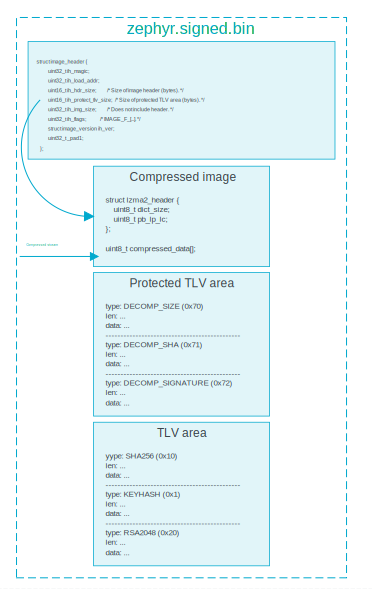

Zephyr Signed Binary File Internals
===================================

This text describes internals of the ``zephyr.signed.bin`` file when image compression is enabled. This knowledge is not required to be able to successfully use the image compression subsystem. However, it can be useful if there is a need for verification or custom integration.

LZMA Header
-----------

The ``lzma2_header`` encodes compression parameters using two bytes.

Dictionary Size
---------------

The ``dict_size`` is calculated using the following method:

.. code-block:: c

    unsigned int i = 0;

    for (i = 0; i < 40; i++) {
        if (raw_dict_size <= (((uint32_t)2 | ((i) & 1)) << ((i) / 2 + 11))) {
            break;
        }
    }
    dict_size = (uint8_t)i;

which allows dict size to be one of the following values:

.. list-table::
   :header-rows: 1

   * - Hex Value
     - Size
   * - 0x00
     - 4096
   * - 0x01
     - 6144
   * - 0x02
     - 8192
   * - 0x03
     - 12288
   * - 0x04
     - 16384
   * - 0x05
     - 24576
   * - 0x06
     - 32768
   * - 0x07
     - 49152
   * - 0x08
     - 65536
   * - 0x09
     - 98304
   * - 0x0a
     - 131072
   * - 0x0b
     - 196608
   * - 0x0c
     - 262144
   * - 0x0d
     - 393216
   * - 0x0e
     - 524288
   * - 0x0f
     - 786432
   * - 0x10
     - 1048576
   * - 0x11
     - 1572864
   * - 0x12
     - 2097152
   * - 0x13
     - 3145728
   * - 0x14
     - 4194304
   * - 0x15
     - 6291456
   * - 0x16
     - 8388608
   * - 0x17
     - 12582912
   * - 0x18
     - 16777216
   * - 0x19
     - 25165824
   * - 0x1a
     - 33554432
   * - 0x1b
     - 50331648
   * - 0x1c
     - 67108864
   * - 0x1d
     - 100663296
   * - 0x1e
     - 134217728
   * - 0x1f
     - 201326592
   * - 0x20
     - 268435456
   * - 0x21
     - 402653184
   * - 0x22
     - 536870912
   * - 0x23
     - 805306368
   * - 0x24
     - 1073741824
   * - 0x25
     - 1610612736
   * - 0x26
     - 2147483648
   * - 0x27
     - 3221225472

Literal Context, Literal Pos, and Pos Bits
------------------------------------------

The second byte of the ``lzma2_header`` carries three parameters:

- number of "literal context" bits (lc)
- number of "literal pos" bits (lp)
- number of "pos" bits (pb)

These parameters are encoded with the following formula:

.. code-block:: c

    pb_lp_lc = (uint8_t)((pb * 5 + lp) * 9 + lc);

In order to retrieve back raw values, the following code is used:

.. code-block:: c

    lc = pb_lp_lc % 9;
    pb_lp_lc /= 9;
    pb = pb_lp_lc / 5;
    lp = pb_lp_lc % 5;

Default Parameters
------------------

Currently, the compression parameters are fixed with:

- **dictsize**: 131072
- **pb**: 2
- **lc**: 3
- **lp**: 1

Extracting LZMA Stream from Image
---------------------------------

The offset of the compressed stream can be determined by adding the ``lzma2_header`` size and the value stored in ``image_header.ih_hdr_size``.

The size of the compressed stream is stored in ``image_header.ih_img_size``.

Assuming the compressed stream is isolated and stored in a file named 'raw.lzma', decompression can be performed with either:

.. code-block:: bash

    unlzma --lzma2 --format=raw --suffix=.lzma raw.lzma

or, in case an ARM thumb filter has been used:

.. code-block:: bash

    unlzma --armthumb --lzma2 --format=raw --suffix=.lzma raw.lzma

This creates a file named 'raw' which is identical to the image before compression was performed.

TLVs
----

Additional TLVs have been introduced:

- **DECOMP_SIZE (0x70)**: Size of decompressed image
- **DECOMP_SHA (0x71)**: Hash of decompressed image
- **DECOMP_SIGNATURE (0x72)**: Signature of either hash or whole image.

The selection of signature and hash type is done the same way as if the image hasn’t been compressed.

These three TLVs are placed in the Protected TLV section, thus included in hashing and signature calculation in the next stage.

Example
-------

A simple stand-alone verification program can be found at:

.. code-block:: none

    tests/subsys/nrf_compress/decompression/independent_cmp.c

