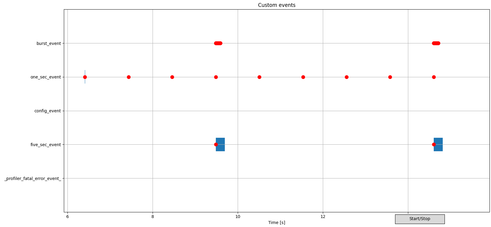

.. _nrf_profiler:

nRF Profiler
############

.. contents::
   :local:
   :depth: 2

The nRF Profiler provides an interface for logging and visualizing data for performance measurements, while the system is running.
You can use the module to profile :ref:`app_event_manager` events or custom events.
The output is provided using RTT and can be visualized in a custom Python backend.

See the :ref:`nrf_profiler_sample` sample for an example of how to use the nRF Profiler.

.. _nrf_profiler_configuration:

Configuration
*************

Since Application Event Manager events are converted to nRF Profiler events, the nRF Profiler can be configured to profile custom events or Application Event Manager events, or both.

Configuring for use with custom events
======================================

To use the nRF Profiler for custom events, complete the following steps:

1. Enable the :kconfig:option:`CONFIG_NRF_PROFILER` Kconfig option.
   This option adds the nRF Profiler source code to the application.
#. Call :c:func:`nrf_profiler_init` during the application start to initialize the nRF Profiler.
#. Profile custom events, as described in the following section.

.. _nrf_profiler_profiling_custom_events:

Profiling custom events
-----------------------

To profile custom events, complete the following steps:

1. Register the custom events using :c:func:`nrf_profiler_register_event_type`.
   The following code example shows how to register event types:

   .. code-block:: c

      static const char * const data_names[] = {"value1", "value2", "value3", "value4", "string"};
      static const enum nrf_profiler_arg data_types[] = {NRF_PROFILER_ARG_U32, NRF_PROFILER_ARG_S32,
                  NRF_PROFILER_ARG_S16, NRF_PROFILER_ARG_U8,
                  NRF_PROFILER_ARG_STRING};

      no_data_event_id = nrf_profiler_register_event_type("no_data_event", NULL,
                  NULL, 0);
      data_event_id = nrf_profiler_register_event_type("data_event", data_names,
                  data_types, 5);

#. Add a structure for sending information about event occurrences:

   a. Add the following mandatory functions to the structure:

      * :c:func:`nrf_profiler_log_start` - Start logging.
      * :c:func:`nrf_profiler_log_send` - Send profiled data.

   #. Add one or more of the following optional functions in-between the mandatory functions, depending on the data format:

      * :c:func:`nrf_profiler_log_encode_uint32` - Add 32-bit unsigned integer connected with the event.
      * :c:func:`nrf_profiler_log_encode_int32` - Add 32-bit integer connected with the event.
      * :c:func:`nrf_profiler_log_encode_uint16` - Add 16-bit unsigned integer connected with the event.
      * :c:func:`nrf_profiler_log_encode_int16` - Add 16-bit integer connected with the event.
      * :c:func:`nrf_profiler_log_encode_uint8` - Add 8-bit unsigned integer connected with the event.
      * :c:func:`nrf_profiler_log_encode_int8` - Add 8-bit integer connected with the event.
      * :c:func:`nrf_profiler_log_encode_string` - Add string connected with the event.

#. Wrap the calls in one function that you then call to profile event occurrences.
   The following code example shows a function for profiling an event with data:

   .. code-block:: c

      static void profile_data_event(uint32_t val1, int32_t val2, int16_t val3,
                  uint8_t val4, const char *string)
      {
        struct log_event_buf buf;

        nrf_profiler_log_start(&buf);
        /* Profiling data connected with an event */
        nrf_profiler_log_encode_uint32(&buf, val1);
        nrf_profiler_log_encode_int32(&buf, val2);
        nrf_profiler_log_encode_int16(&buf, val3);
        nrf_profiler_log_encode_uint8(&buf, val4);
        nrf_profiler_log_encode_string(&buf, string);
        nrf_profiler_log_send(&buf, data_event_id);
      }

   .. note::

	    The ``data_event_id`` and the data that is profiled with the event must be consistent with the registered event type.
	    The data for every data field must be provided in the correct order.

Configuration for use with Application Event Manager
====================================================

If you are using the Application Event Manager, in order to use the nRF Profiler follow the steps in
:ref:`app_event_manager_profiler_tracer_em_implementation` and :ref:`app_event_manager_profiler_tracer_config` on the :ref:`app_event_manager_profiler_tracer` documentation page.

.. _nrf_profiler_backends:

Enabling supported backend
**************************

The nRF Profiler supports a custom backend that is based around Python scripts to visualize the output data.
The backend communicates with the host using RTT.

To save profiling data, the scripts use CSV files for event occurrences and JSON files for event descriptions.

Available scripts
=================

The scripts can be found under :file:`scripts/nrf_profiler/` in the |NCS| folder structure.
The following script files are available:

* :file:`data_collector.py` - This script connects to the device using RTT, receives profiling data, and saves it to files.
  When running the script from the command line, provide the time for collecting data (in seconds) and the dataset name.
  For example:

  .. parsed-literal::
     :class: highlight

     python3 data_collector.py 5 test1

  In this command, ``5`` is the time value for collecting data and ``test1`` is the dataset name.
* :file:`plot_from_files.py` - This script plots events from the dataset that is provided as the command-line argument.
  For example:

  .. parsed-literal::
     :class: highlight

     python3 plot_from_files.py test1

  In this command, ``test1`` is the dataset name.
* :file:`real_time_plot.py` - This script connects to the device using RTT, plots data in real-time, and saves the data.
  When running the script from the command line, provide the dataset name.
  For example:

  .. parsed-literal::
     :class: highlight

     python3 real_time_plot.py test1

* :file:`merge_data.py` - This script combines data from ``test_p`` and ``test_c`` datasets into one dataset ``test_merged``.
  It also provides clock drift compensation based on the synchronization events: ``sync_event_p`` and ``sync_event_c``.
  This enables you to observe times between events for the two connected devices.
  As command-line arguments, provide names of events used for synchronization for a Peripheral (``sync_event_p``) and a Central (``sync_event_c``), as well as names of datasets for the Peripheral (``test_p``), the Central (``test_c``), and the merge result (``test_merged``).
  For example:

  .. parsed-literal::
     :class: highlight

     python3 merge_data.py test_p sync_event_p test_c sync_event_c test_merged

Running the backend
===================

To enable and run the custom backend, complete the following steps:

1. Connect device to the computer.
2. Complete the configuration steps for use with either custom events or Application Event Manager, as described in the :ref:`nrf_profiler_configuration` section.
#. From the list of `Available scripts`_, choose the Python script that you want to use for event visualization, analysis, and calculating statistics.
#. Run the script from the command line using its related command.

.. _nrf_profiler_backends_custom_visualization:

Backend visualization
=====================

When you run either the :file:`plot_from_files.py` or the :file:`real_time_plot.py` script, the profiled events are visualized in a GUI window.

The visual output can look like the following diagram:

.. nrf_profiler_GUI_start

   Example of nRF Profiler backend script visualization

.. nrf_profiler_GUI_end

In this diagram:

* Red dots indicate the submissions for the related events.
* Blue vertical rectangles indicate the processing of the events, with their width corresponding to the processing time length.
* The :guilabel:`Start/Stop` button can be used to pause or resume the real-time plot translation.

The GUI also supports the following actions:

* Scrolling on the diagram using the mouse wheel zooms it in or out.

  * When plotting is paused, scrolling zooms to the cursor location.
  * When plotting in running, scrolling zooms to the right edge of the plot.

* Middle mouse button can be used to mark an event submission or processing for tracking, and to display the event data.
* When plotting is paused, you can click and drag with the left mouse button to pan the plot.
* You can click the left or right mouse button to place a vertical line at the cursor location.
  When two lines are present, the application measures the time between them and displays it.

Shell integration
*****************

The nRF Profiler is integrated with Zephyr's :ref:`zephyr:shell_api` module.
You can use the :kconfig:option:`CONFIG_NRF_PROFILER_SHELL` option to add an additional subcommand set (:command:`nrf_profiler`) to the shell.
The option is enabled by default.

This subcommand set contains the following commands:

:command:`list`
  Show a list of profiled event types.
  The letters "E" or "D" indicate if profiling is currently enabled or disabled for a given event type.

:command:`enable` or :command:`disable`
  Enable or disable profiling.
  If called without additional arguments, the command applies to all event types.
  To enable or disable profiling for specific event types, pass the event type indexes (as displayed by :command:`list`) as arguments.

API documentation
*****************

| Header file: :file:`include/nrf_profiler.h`
| Source files: :file:`subsys/nrf_profiler/`

.. doxygengroup:: nrf_profiler
   :project: nrf
   :members:
