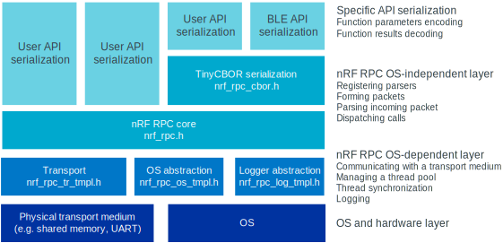
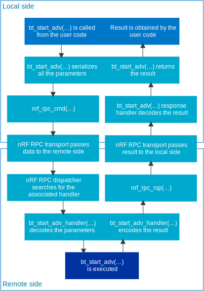
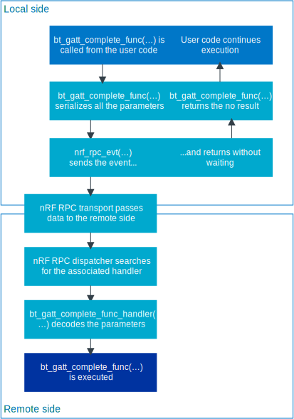
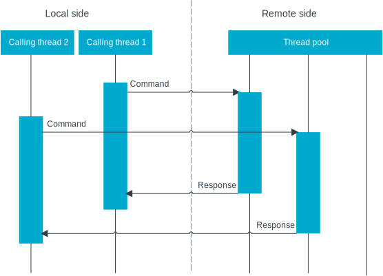
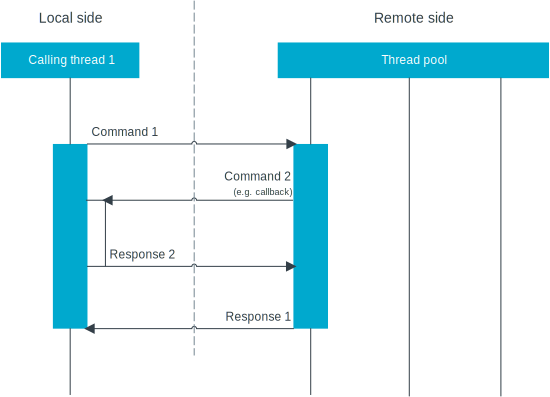
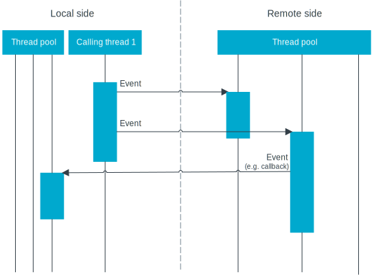

.. _nrf_rpc_architecture:

Architecture
############

.. contents::
   :local:
   :depth: 2

The following picture gives an overview of the nRF RPC architecture:

   nRF RPC architecture layers

Types of communication
======================

You can issue the calls in one of two ways: using a command/response or an event.

A **command and response** is intended to be used for synchronous function calls.
The caller sends the command to the other side and waits for a response.
The response is sent after the remote function returns on the remote core.
The following image shows an example of the command and response flow.

   nRF RPC command and response flow

**Events** are intended to be used for asynchronous function calls.
The caller sends an event to the other side and returns immediately.
See the :ref:`nrf_rpc_architecture_threads` section.
It is not possible to return anything from the remote side after receiving an event, but it is possible to send an event in the opposite direction.
The following image shows an example of the event flow.

   nRF RPC event flow

.. _nrf_rpc_architecture_threads:

Threads
=======

When a remote procedure call is received, it must be executed in the context of a thread.
For this reason, each side of nRF RPC contains a thread pool.
The thread pool is OS-dependent and implemented in the OS abstraction layer.
The number of threads in a thread pool is configurable.

The nRF RPC sends a packet and it is executed by an available thread from a thread pool.
In the case of a command being received, a response is sent directly to a waiting thread, so no new thread is allocated for a response.

The following image presents sample command and response flows.

   nRF RPC simple command flow

A thread waiting for a response can be reused to receive a new incoming command from the remote thread for which the local thread is waiting, for example, when a callback is called synchronously.
The following diagram demonstrates this situation.

   nRF RPC recursive command flow

Events always reserve a new thread from the remote thread pool.
Pay special attention when sending multiple events one after another, because each event reserves a new thread.
Sending events too fast might consume the entire thread pool and, as a result, block all outgoing commands and events until a thread becomes available in the thread pool .
Sample events are shown in the diagram below.

   nRF RPC simple event flow

Error handling
==============

Two kinds of errors might occur when using this library.

 Error during parsing of an incoming packet
    These errors cannot be directly returned to the user as a return value.
    The user is informed about such errors through a callback.
    First, if the group in which the error happened is known, then a group error callback is called.
    Second, a global error handler (provided to the :c:func:`nrf_rpc_init` function) is called.
    Malformed packets should not normally happen, because the transport layer is responsible for reliable packet transferring.
    Such errors are a serious problem from which nRF RPC will probably not recover.

 Error during packet sending
    This kind of errors is passed to the caller as a return value.
    They indicate that the transport layer is not able to transfer a packet.
    Such errors are a serious problem from which nRF RPC will probably not recover, because missing packets might put nRF RPC in an undefined state.

You can also pass errors during packet sending to an error handler by using a ``_no_err`` variant of sending functions.

Lower layers
============

The lower layers of nRF RPC are OS-dependent.
They are responsible for communicating with a transport medium, managing a thread pool, thread synchronization, communication, and logging.

.. note::
   Detailed knowledge about how the lower layers are implemented is not required when using the nRF RPC API.
   However, this knowledge is required to implement an alternative transport or to port to a different operating system.

Transport
---------

The main role of a transport is to transfer packets between two sides.
You can implement your own transport for any nRF RPC group.
The transport layer defines a destination remote CPU.

The header file describing the nRF RPC transport API is :file:`include/nrf_rpc_tr.h`.

Assign your transport interface to the nRF RPC group as follows:

.. code-block:: c

   /* Setup this structure with your transport API and transport specific data. */
   struct nrf_rpc_tr your_transport;

   NRF_RPC_GROUP_DEFINE(math_group, "sample_math", &your_transport, NULL, NULL, NULL);

Operating system abstraction
----------------------------

The operating system abstraction provides functionality for nRF RPC that depends on the operating system.
It manages the thread pool, thread synchronization, and communication.

The template header describing the OS abstraction is :file:`template/nrf_rpc_os_tmpl.h`.

Logging
-------

nRF RPC logs some of its activities.
This allows for tracking, diagnosis, and debugging.
It provides four levels for logging: errors, warnings, information, and debug.

Error logs indicate serious errors, so they should be enabled if possible.
Debug logs should be enabled only to track specific problems.

The template header describing the logger is :file:`template/nrf_rpc_log_tmpl.h`.
