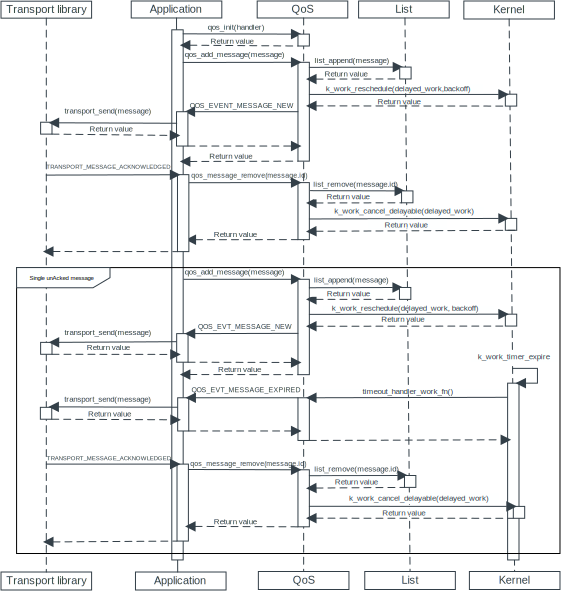

.. _qos:

Quality of Service
##################

.. contents::
   :local:
   :depth: 2

The Quality of Service (QoS) library provides APIs to store and handle acknowledgment of multiple in-flight messages.
The library is transport agnostic, which means that it does not enforce any transport-related functionality to the caller.

Implementation
==============

The following sequence diagram shows a typical usage of the library:

   QoS library implementation sequence diagram

Configuration
*************

To use this library, set the :kconfig:option:`CONFIG_QOS` Kconfig option and include the :file:`include/lib/qos.h` file to your project.

Additionally, Configure the following options when using this library:

* :kconfig:option:`CONFIG_QOS_PENDING_MESSAGES_MAX`
* :kconfig:option:`CONFIG_QOS_MESSAGE_NOTIFIED_COUNT_MAX`
* :kconfig:option:`CONFIG_QOS_MESSAGE_NOTIFY_TIMEOUT_SECONDS`

Usage
*****

The :c:func:`qos_message_add` and :c:func:`qos_message_remove` functions add and remove the messages respectively from the library.
Before adding a message, it must be associated with a message flag.
This flag determines whether or not the message needs to be stored in the pending list that is internal to the library and how the message must be notified.
Following are the available flags:

* ``QOS_FLAG_RELIABILITY_ACK_DISABLED`` - The library notifies the message only once and is not added to the internal pending list.
* ``QOS_FLAG_RELIABILITY_ACK_REQUIRED`` - The library adds the message to the internal pending list and notifies after every time interval set in the :kconfig:option:`CONFIG_QOS_MESSAGE_NOTIFY_TIMEOUT_SECONDS` Kconfig option with the :c:enum:`QOS_EVT_MESSAGE_TIMER_EXPIRED` event.
  The library notifies the message until the message is removed or the limit set through the :kconfig:option:`CONFIG_QOS_MESSAGE_NOTIFIED_COUNT_MAX` Kconfig option is reached.

.. note::
   All messages that are added to the library using the :c:func:`qos_message_add` function is notified with the :c:enum:`QOS_EVT_MESSAGE_TIMER_EXPIRED` event.

The following code block displays how the library can be initialized and a single message is added:

.. code-block:: c

   /* Define message types that can be used to route data. */
   enum {
      SENSOR_DATA,
      DIAGNOSTIC_DATA
   };

   /* Event handler used to receive notifications from the library. */
   static void qos_event_handler(const struct qos_evt *evt)
   {
      switch (evt->type) {
      case QOS_EVT_MESSAGE_NEW:
      case QOS_EVT_MESSAGE_TIMER_EXPIRED:
         /* Check evt->message.type and route message based on type. */
         break;
      case QOS_EVT_MESSAGE_REMOVED_FROM_LIST:
         /* Free payload if (evt->message.heap_allocated == true) */
         break;
      default:
         break;
      }
   }

   /* QoS library message data structure. */
   struct qos_data message = {
		.heap_allocated = true,
		.data.buf = pointer_to_payload,
		.data.len = size_of_payload,
		.id = qos_message_id_get_next(),
		.type = SENSOR_DATA,
		.flags = QOS_FLAG_RELIABILITY_ACK_REQUIRED
   };

   /* Initialize the QoS library and set the library event handler. */
   err = qos_init(qos_event_handler);
   if (err) {
      LOG_ERR("qos_init, err", err);
      return err;
   }

   /* Add a single message. */
   err = qos_message_add(&message);
   if (err) {
      LOG_ERR("qos_message_add, error: %d", err);
      return err;
   }

To remove a message from the pending list, call :c:func:`qos_message_remove` with the message ID of the corresponding message:

.. code-block:: c

   err = qos_message_remove(message_id);
   if (err) {
      LOG_ERR("qos_message_remove, error: %d", err);
      return err;
   }

Messages added to the library can be associated with specific message types.
These message types can be used to route messages after they have been notified in the library callback handler.
For messages that require acknowledgment, message transport libraries often need a message ID.
The application can use the :c:func:`qos_message_id_get_next` function to generate the Message IDs.

.. note::
   Some transport libraries reserve specific message IDs for internal use, typically lower integer ranges.
   Hence, the :c:func:`qos_message_id_get_next` function generates IDs based on an ID base, :c:macro:`QOS_MESSAGE_ID_BASE` of 15000.

Samples using the library
*************************

The :ref:`Asset Tracker v2 <asset_tracker_v2_description>` application uses this library.

API documentation
*****************

| Header file: :file:`include/qos.h`
| Source files: :file:`lib/qos.c`

.. doxygengroup:: qos
   :project: nrf
   :members:
