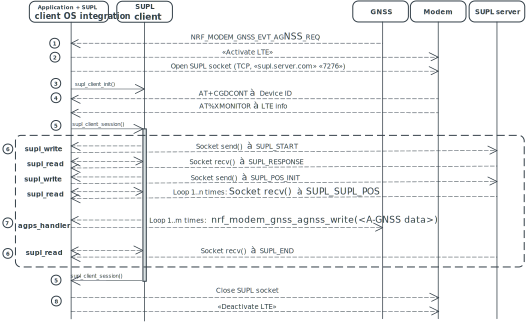

.. _supl_client:

SUPL client and SUPL client OS integration
##########################################

.. contents::
   :local:
   :depth: 2

This section documents both the Secure User-Plane Location (SUPL) client library and the SUPL client OS integration library.

The Secure User-Plane Location (SUPL) client library is an OS-independent library that is distributed separately with a different license than the |NCS|.
This library can be used to receive A-GNSS data from a SUPL server using the SUPL protocol.

The SUPL client OS integration library is a source code library distributed with the |NCS|.
This library is used to integrate the SUPL client library with an |NCS| application.

The SUPL client is used with a 3rd party SUPL server.
For example, Google hosts a SUPL server (supl.google.com), but for commercial use a license is required.

Secure User-Plane Location
**************************

SUPL enables the transfer of assistance and network-based positioning data of a SUPL Enabled Terminal (SET), such as an nRF9160 DK or a Thingy:91, over an IP User Plane bearer.
See `SUPL context model`_ for more information on the SUPL architecture.
SUPL is designed to support future positioning technologies.
The SUPL version supported by the SUPL client library is 2.0.4.

SUPL uses `A-GNSS`_ for obtaining GPS satellite data, overcoming limitations of a standalone GNSS module.

A standalone GNSS module downloads orbital data (like Ephemeris_ and the Almanac_) from satellites to calculate the current position of a device.
It has the following limitations:

* Typically, the data download from the satellites takes a long time and the first position is calculated in 30-40 seconds.

* Any loss of signal requires the whole process to be restarted.

An A-GNSS server is a cached server that stores the orbital data.
This information can be downloaded at a fast rate since an A-GNSS capable device supports mobile radio-network bearers with high data rate such as LTE.

SUPL payload
============

`LTE Positioning Protocol (LPP)`_ is the supported SUPL payload format.

LPP is a point-to-point protocol used between a location server (for example, a `Secure Location Protocol (SLP)`_ server) and a target device (for example, SET) to position the device using position-based information obtained from reference sources.
A SET is a logical part of a device that supports communication with a SUPL network.

SUPL session and transaction type
=================================

A typical SUPL client session is SET-based, that is, the position is calculated based on SET.
See `SET-initiated SUPL collaboration`_ for more information.

Each LPP session consists of one or more LPP transactions.
Each LPP transaction corresponds to a single operation such as capability exchange, assistance data transfer, or location information transfer.

.. note::

   The SUPL client library supports only assistance data transfer as the transaction type.

The following image shows the steps in the SUPL client connection session.

.. msc::
   hscale = "1.1";
   SET,SLP;
   --- [label="Data connection setup"];
   SET=>SLP      [label="SUPL START (session-id, lid, SET capabilities)"];
   SET<=SLP      [label="SUPL RESPONSE (session-id, posmethod)"];
   SET=>SLP      [label="SUPL POS INIT (session-id, lid, SET capabilities)"];
   SET..SLP [linecolor="#00a9ce", textcolor="#00a9ce", label="\nloop 1..N times"];
   SET<=SLP      [label="SUPL POS (session-id, LPP)"];
   ...;
   SET..SLP [linecolor="#00a9ce"];
   SET<<SLP      [label="SUPL END (session-id)"];
   --- [label="Data connection teardown"];

.. _supl_client_lib:

SUPL client library
*******************

The SUPL client library must be downloaded separately and integrated into the |NCS| by the user.
Before you download the library, read through the license on the webpage.
You must accept the license before you can download the library.

.. _download_supl:

Downloading and installing
==========================

You can download the SUPL client library from the `nRF9160 DK product page <SUPL client download_>`_.

Download the nRF9160 SiP SUPL client library zip file and extract it into the :file:`nrf/ext/lib/bin/` folder.
Make sure to maintain the folder structure that is used in the zip file.

Configuration
=============

To enable the SUPL client library, set :kconfig:option:`CONFIG_SUPL_CLIENT_LIB` to ``y``.
See :ref:`configure_application` for information on how to change configuration options.

.. note::

   The SUPL client library requires that the newlib C library is used.
   You can enable it using the :kconfig:option:`CONFIG_NEWLIB_LIBC` Kconfig option.

Resource initialization and ownership
=====================================

Two buffers are used in the SUPL communication session.
These buffers, namely the primary and secondary buffers, are owned by the user of the SUPL client library.
The sizes of the buffers are defined by the ``LIBSUPL_PRI_BUF_SIZE`` and ``LIBSUPL_SEC_BUF_SIZE`` parameters.
These parameters are defined in the ``supl_session.h`` header file.

The SUPL client library implements the following functionalities:

* Send messages to the SUPL server
* Receive messages from the SUPL server
* Send A-GNSS data to the GNSS module

These functionalities are implemented using a set of callback functions.
Both the buffers and the pointers to the callback functions are passed to the SUPL client library through the :c:func:`supl_client_init` function.

API callback functions
======================

Callback functions are needed to achieve platform independence.
If your application uses the SUPL client library, you must implement these callback functions.
For an example of the implementation, see the :ref:`gnss_sample` sample.
The implementation is located in the :file:`samples/cellular/gnss/src/` directory.
The various callback functions implemented in the SUPL client library and their purposes are listed below.

A-GNSS handler
   Callback function to handle nRF assistance data types defined in :ref:`agnss_data_type_enum_api`.
   This callback writes the A-GNSS data to the GNSS module.
   The `LTE Positioning Protocol (LPP)`_ data contained within the SUPL payload is converted to nRF A-GNSS data structures defined in :file:`nrf_modem_gnss.h` that can be written directly using the GNSS API.

SUPL logger
   Callback function to output the SUPL client library debug messages.
   Callback implementation is optional.
   If the callback function is not implemented, the library does not display debug messages.

Millisecond counter
   Callback function for millisecond counter.
   Callback implementation is optional.
   If the callback function is not implemented, the library assumes 1 second receive timeout and estimates SUPL level timeouts based on that.

SUPL read
   Callback function for receiving incoming data from the SUPL server.

SUPL write
   Callback function for sending outgoing data to the SUPL server.

SUPL session
============

The SUPL communication spans the following events and message transfers:

* Receiving an event from the GNSS module requesting to update A-GNSS data
* Executing subsequent message transfers until the completion of the A-GNSS session
* Pushing data into the GNSS module

The following message sequence chart (MSC) describes the flow of communication in a SUPL session.

.. _supl_session_msc_desc:

The various steps in the communication session are described below:

1. The application receives a request from the GNSS to start a SUPL session.
   GNSS sends the :c:macro:`NRF_MODEM_GNSS_EVT_AGNSS_REQ` event when it needs fresh A-GNSS data.

#. If the LTE modem is deactivated, the user must enable the LTE modem.
   When the modem is enabled, it initiates a TCP socket to connect to the SUPL server.
   In the SUPL session MSC above, the application opens a TCP socket to connect to the SUPL server.
#. In order to start a SUPL session, the application must first initialize the SUPL client library.
   This is done by calling the :c:func:`supl_init` function of the SUPL client OS integration library.
   The function sets up the API and the buffers required for initializing the SUPL client library and invokes the :c:func:`supl_client_init` function with these parameters.
#. The application can then begin the SUPL session by calling the :c:func:`supl_session` function with a copy of the :c:type:`nrf_modem_gnss_agnss_data_frame` data that was received through the A-GNSS data request event from the GNSS module.
   The SUPL client OS integration library generates the following parameters that are necessary for the session:

   * ``supl_session_ctx_t`` structure from the A-GNSS request event data
   * ``lte_params_t`` structure from the data read from the LTE modem
   * ``device_id`` from device IP address

#. The SUPL client OS integration library then starts the SUPL session by calling the :c:func:`supl_client_session` function from the SUPL client library with the ``supl_session_ctx_t`` parameter.
   The application does not return from this function until the SUPL session is finished or the :c:func:`supl_client_abort` function is called.
#. The :c:func:`supl_client_session` function forms the entry point for the SUPL session.
   There is no specific limit on the number of subsequent SUPL sessions that can be executed from this entry point.
   See the documentation on the `SET-Initiated Non-Roaming Successful Case (Proxy mode)`_ for more information on the SUPL session.
   The callback functions used for data transfer are listed below:

    * SUPL write (:c:type:`supl_write_t`): callback for sending outgoing data to the SUPL server
    * SUPL read (:c:type:`supl_read_t`): callback for receiving incoming data from the SUPL server

#. The decoded SUPL data is sent to the GNSS module using the A-GNSS handler (:c:func:`agps_handler_t`) callback function.
#. After the application returns from the :c:func:`supl_client_session` function, the TCP socket is no longer used by the SUPL client library and can be closed.

SUPL client OS integration library
**********************************

The SUPL client OS module integrates the SUPL client library into the |NCS|.

SUPL session
============

Before starting a SUPL session, the application must initialize the SUPL client library by calling the :c:func:`supl_init` function of the SUPL client OS integration library.
Once the library is initialized, any number of subsequent SUPL sessions can be executed with the same set of initialized parameters.

To start the SUPL session, the application must call the :c:func:`supl_session` function of the SUPL client OS integration library.
The library then creates the necessary parameters and starts the SUPL session in the SUPL client library.
The SUPL client OS integration library abstracts the details of the :ref:`supl_client_lib` away from the user.

See steps 3, 4 and 5 in the :ref:`SUPL session MSC description <supl_session_msc_desc>` for more information.

API documentation
=================

| Header file: :file:`include/supl_os_client.h`
| Source files: :file:`lib/supl/`

.. doxygengroup:: supl_os
   :project: nrf
   :members:
