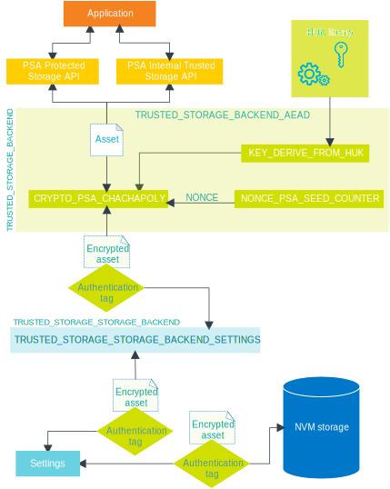

.. _trusted_storage_readme:

Trusted storage
###############

.. contents::
   :local:
   :depth: 2

The trusted storage library enables its users to provide integrity, confidentiality and authenticity of stored data using Authenticated Encryption with Associated Data (AEAD) algorithms or cryptographic hash, without the use of TF-M Platform Root of Trust (PRoT).
The library implements the PSA Certified Secure Storage API.

Overview
********

The following subsections give an overview of the library architecture, its interfaces, choices and backends.

Architecture
============

The trusted storage library is designed and implemented in a modular way, which allows and simplifies customization.
This is realized by using backends for the different tasks performed within the trusted storage.

The library provides users two choices that are interfacing backends: ``TRUSTED_STORAGE_BACKEND`` and ``TRUSTED_STORAGE_STORAGE_BACKEND``.
The backends are also modular, allowing customization of what crypto implementation and the key nonce are provided.

The following image gives an overview of the default architecture of the trusted storage library.

   Overview of the trusted storage library architecture

External storage is not supported by the trusted storage library by default.
To add support for external storage, implement a custom storage backend.

Interfaces
==========

The trusted storage library provides two storage interfaces for use with device-protected storage:

* PSA internal trusted storage, designed to store critical data that must be placed inside internal non-volatile memory.
  The size of the storage available by the internal trusted storage API is expected to be limited, and therefore should be used for small, security-critical values.
  Examples of assets that require this kind of storage are replay protection values for external storage and keys for use by components of the PSA Root of Trust.
* PSA protected storage, designed to store all other critical data that do not need to be stored inside internal non-volatile memory.

The two interfaces provide a consistent way for applications to access the storage types, through PSA Internal Trusted Storage API and PSA Protected Storage API.

Choices and backends
====================

The trusted storage library comes with two choices:

* ``TRUSTED_STORAGE_BACKEND`` that defines a backend for handling of encryption, authentication or other means of validation of the stored data.
  It is responsible for what is happening with the data before and after they are read from or written to non-volatile storage.
* ``TRUSTED_STORAGE_STORAGE_BACKEND`` that defines a backend that handles how the data are written to non-volatile storage.

In other words, ``TRUSTED_STORAGE_BACKEND`` is responsible for modifying the assets before they are forwarded to the ``TRUSTED_STORAGE_STORAGE_BACKEND``, which again handles storing of data in the non-volatile storage.

The following backends are used in the trusted storage library:

``TRUSTED_STORAGE_BACKEND_AEAD``
   Uses an AEAD scheme to provide integrity, confidentiality and authenticity.
   The trusted storage library provides the ``TRUSTED_STORAGE_BACKEND_AEAD`` backend, but it has support for adding other secure implementation backends to provide various levels of trust, depending on the device security features.

   Uses a separate backend to perform the AEAD operation, set by the Kconfig option :kconfig:option:`CONFIG_TRUSTED_STORAGE_BACKEND_AEAD_CRYPTO`.
   The nonce and the key for the AEAD operation are provided by separate backends, allowing a custom implementation.

   For the key, the default choice is to use the :kconfig:option:`CONFIG_TRUSTED_STORAGE_BACKEND_AEAD_KEY_DERIVE_FROM_HUK` Kconfig option.
   With this option, a :ref:`lib_hw_unique_key` and the UID are used to derive an AEAD key.

``TRUSTED_STORAGE_STORAGE_BACKEND_SETTINGS``
   Stores the given assets by using :ref:`Zephyr's settings subsystem <zephyr:settings_api>`.
   The backend requires that Zephyr's settings subsystem is enabled for use (Kconfig option :kconfig:option:`CONFIG_SETTINGS` has to be set).

   The trusted storage library provides the ``TRUSTED_STORAGE_STORAGE_BACKEND_SETTINGS`` as a storage backend, but it has support for adding other memory types for storage.

Requirements
************

Before using the trusted storage library with its default settings and options, make sure to meet the following requirements:

* The hardware unique key (HUK) :ref:`library <lib_hw_unique_key>` and :ref:`sample <hw_unique_key_usage>` are enabled and ready for use to derive an AEAD key.
* Zephyr's settings subsystem has to be enabled for use by setting the Kconfig option :kconfig:option:`CONFIG_SETTINGS`.

  * The settings subsystem uses the :ref:`zephyr:nvs_api` file system by default.
    This file system has to be mounted to a mount point at application startup. For more information about this, see :ref:`zephyr:file_system_api`.

.. _trusted_storage_configuration:

Configuration
*************

Set the Kconfig option :kconfig:option:`CONFIG_TRUSTED_STORAGE` to enable the trusted storage library.

Use the Kconfig option :kconfig:option:`CONFIG_TRUSTED_STORAGE_BACKEND` to define the backend that handles encryption and authentication.
If this Kconfig option is set, the configuration defaults to the only currently available option :kconfig:option:`CONFIG_TRUSTED_STORAGE_BACKEND_AEAD` to use an AEAD scheme for encryption and authentication of stored data.

Use the Kconfig option :kconfig:option:`CONFIG_TRUSTED_STORAGE_STORAGE_BACKEND` to define the backend that handles how the data are written to and from the non-volatile storage.
If this Kconfig option is set, the configuration defaults to the :kconfig:option:`CONFIG_TRUSTED_STORAGE_STORAGE_BACKEND_SETTINGS` option to use Zephyr's settings subsystem.
Alternatively, you can use a custom storage backend by setting the Kconfig option :kconfig:option:`CONFIG_TRUSTED_STORAGE_STORAGE_BACKEND_CUSTOM`.

The following options are used to configure the AEAD backend and its behavior:

:kconfig:option:`CONFIG_TRUSTED_STORAGE_BACKEND_AEAD_MAX_DATA_SIZE`
   Defines the maximum data storage size for the AEAD backend (256 as default value).

:kconfig:option:`CONFIG_TRUSTED_STORAGE_BACKEND_AEAD_CRYPTO`
   Selects what implementation is used to perform the AEAD cryptographic operations.
   This option defaults to :kconfig:option:`CONFIG_TRUSTED_STORAGE_BACKEND_AEAD_CRYPTO_PSA_CHACHAPOLY` using the ChaCha20Poly1305 AEAD scheme via PSA APIs.

:kconfig:option:`CONFIG_TRUSTED_STORAGE_BACKEND_AEAD_NONCE`
   Selects what implementation provides AEAD nonce.
   You can choose one of the following values when this configuration option is set:

   * :kconfig:option:`CONFIG_TRUSTED_STORAGE_BACKEND_AEAD_NONCE_PSA_SEED_COUNTER` - Selects the PSA Crypto for nonce initial random seed and a counter incrementing nonce for each AEAD encryption.
     This is the default option for the AEAD nonce.
   * :kconfig:option:`CONFIG_TRUSTED_STORAGE_BACKEND_AEAD_NONCE_CUSTOM` - Selects a custom implementation for AEAD nonce provider.

:kconfig:option:`CONFIG_TRUSTED_STORAGE_BACKEND_AEAD_KEY`
   Selects what implementation provides the AEAD keys.
   You can choose one of the following values when this configuration option is set:

   * :kconfig:option:`CONFIG_TRUSTED_STORAGE_BACKEND_AEAD_KEY_DERIVE_FROM_HUK` - Selects HUK to derive a key based on the UID file.
     This is the default selection for the AEAD key provider, and also the only really secure option.
   * :kconfig:option:`CONFIG_TRUSTED_STORAGE_BACKEND_AEAD_KEY_HASH_UID` - Selects the use of SHA-256 of the UID file as the key.
     This option is not as secure as when using HUKs for key derivation as it will only provide integrity of the data.
     Use this option only when HUK is not possible to use.
   * :kconfig:option:`CONFIG_TRUSTED_STORAGE_BACKEND_AEAD_KEY_CUSTOM` - Selects a custom implementation for the AEAD key provider.

Usage
*****

The trusted storage library can only be used on a build using a board target with :ref:`CMSE disabled <app_boards_spe_nspe_cpuapp>` (``/cpuapp``).
When you build for ``/cpuapp``, you build the firmware for the application core without CMSE and thus no TF-M.
The library can be used directly on such a build to store important assets.
However, for cryptographic keys we suggest to use the `PSA functions for key management`_.
These APIs will internally use this library to store persistent keys.

Dependencies
************

This library has dependencies to following libraries:

* :ref:`lib_hw_unique_key`
* :ref:`Zephyr's settings subsystem <zephyr:settings_api>`

API documentation
*****************

Protected storage
=================

| Header file: :file:`include/protected_storage.h`
| Source files: :file:`subsys/secure_storage/src/protected_storage/backend_interface.c`

.. doxygengroup:: protected_storage
   :project: nrf
   :members:

Internal trusted storage
========================

| Header file: :file:`include/internal_trusted_storage.h`
| Source files: :file:`subsys/secure_storage/src/internal_trusted_storage/backend_interface.c`

.. doxygengroup:: internal_trusted_storage
   :project: nrf
   :members:
