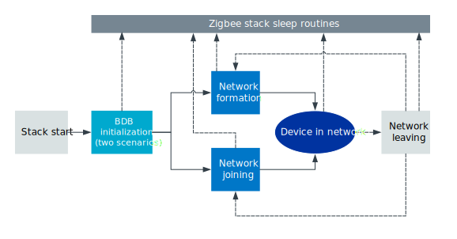
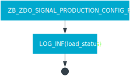
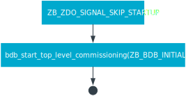
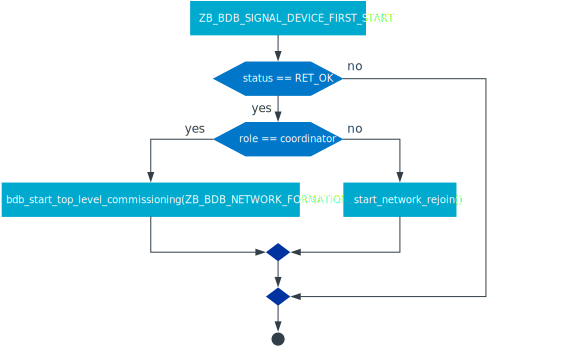
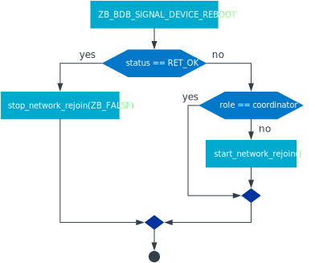
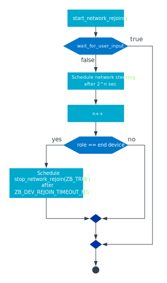
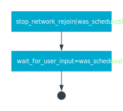
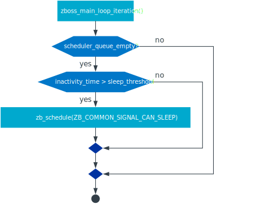

.. _lib_zigbee_application_utilities:

Zigbee application utilities
############################

.. contents::
   :local:
   :depth: 2

Zigbee application utilities library provides a set of components that are ready for use in Zigbee applications:

* :ref:`lib_zigbee_signal_handler` for handling common ZBOSS stack signals.
* API for parsing and converting Zigbee data types.
  Available functions are listed in :file:`include/zigbee/zigbee_app_utils.h`.
* :c:func:`zigbee_led_status_update` for indicating the status of the device in a network using LEDs.

.. note::
    Links to ZBOSS functions and signals on this page point to ZBOSS `API documentation`_.

.. _lib_zigbee_signal_handler:

Zigbee default signal handler
*****************************

The :ref:`nrfxlib:zboss` interacts with the user application by invoking the `zboss_signal_handler()`_ function whenever a stack event, such as network steering, occurs.
It is mandatory to define `zboss_signal_handler()`_ in the application.

Because most of Zigbee devices behave in a similar way, :c:func:`zigbee_default_signal_handler` provides the default logic to handle stack signals.

.. note::
    |zigbee_library|

.. _zarco_signal_handler_minimal:

Minimal zboss_signal_handler implementation
===========================================

This function can be called in the application's `zboss_signal_handler()`_ to simplify the implementation.
In such case, this minimal implementation includes only a call to the default signal handler:

.. code-block:: c

    void zboss_signal_handler(zb_uint8_t param)
    {
        /* Call default signal handler. */
        zigbee_default_signal_handler(param);

        /* Free the Zigbee stack buffer. */
        zb_buf_free(param);
    }

With this call, the device is able to join the Zigbee network or join a new network when it leaves the previous one.

In general, using the default signal handler is worth considering because of the following reasons:

* It simplifies the application.
* It provides a default behavior for each signal, which reduces the risk that an application breaks due to an unimplemented signal handler.
* It provides Zigbee role specific behavior (for example, finite join/rejoin time)
* It makes the application less sensitive to changes in the Zigbee stack commissioning API.

The default signal handler also serves as a good starting point for a custom signal handler implementation.

.. _zarco_signal_handler_extending:

Extending zboss_signal_handler
==============================

There are cases in which the default handler is not sufficient and needs to be extended.
For example, when the application wants to use the procedure of the initiator of Finding & Binding or use the production configuration feature.

If you want to extend `zboss_signal_handler()`_ to cover additional functionalities, write signal handler implementation for the required ZBOSS signal.
For example, for a device that initiates the F&B procedure, extend `zboss_signal_handler()`_ with a switch case statement for `ZB_BDB_SIGNAL_FINDING_AND_BINDING_INITIATOR_FINISHED`_:

.. code-block:: c

    void zboss_signal_handler(zb_bufid_t bufid)
    {
        zb_zdo_app_signal_hdr_t   *sg_p  = NULL;
        zb_zdo_app_signal_type_t  sig    = zb_get_app_signal(bufid, &sg_p);
        zb_ret_t                  status = ZB_GET_APP_SIGNAL_STATUS(bufid);
        zb_nwk_device_type_t      role   = zb_get_network_role();
        zb_bool_t                 comm_status;

        switch (sig) {
        case ZB_BDB_SIGNAL_FINDING_AND_BINDING_INITIATOR_FINISHED:
            /* Check status of signal. */
            if (status == RET_OK) {
                /* This signal is received with additional data. Read additional information to get status of F&B procedure. */
                zb_zdo_signal_fb_initiator_finished_params_t *fnb_params =
                    ZB_ZDO_SIGNAL_GET_PARAMS(sg_p, zb_zdo_signal_fb_initiator_finished_params_t);

                switch (fnb_params->status) {
                case ZB_ZDO_FB_INITIATOR_STATUS_SUCCESS:
                    /* F&B with a Target on the Initiator side is completed with a success. */
                    break;

                case ZB_ZDO_FB_INITIATOR_STATUS_CANCEL:
                    /* F&B on the Initiator side is canceled. */
                    break;

                case ZB_ZDO_FB_INITIATOR_STATUS_ALARM:
                    /* F&B on the Initiator side is finished by timeout. */
                    break;

                case ZB_ZDO_FB_INITIATOR_STATUS_ERROR:
                    /* F&B on the Initiator side finished with a failure. */
                    break;

                default:
                    /* Unrecognised status of F&B procedure. */
                    break;
                }
            } else {
                /* F&B procedure failed. */
            }
            break;

        default:
            /* All other signals are forwarded to the zigbee default signal handler. */
            ZB_ERROR_CHECK(zigbee_default_signal_handler(bufid));
            break;
        }

        if (bufid) {
            zb_buf_free(bufid);
        }
    }

.. _zarco_signal_handler_full:

Complete zigbee_default_signal_handler implementation
=====================================================

In its complete implementation, the `zboss_signal_handler()`_ allows the application to control a broader set of basic functionalities, including joining, commissioning, and network formation.

   Zigbee default signal handler logic (simplified)

The following sections describe the logic implemented inside :c:func:`zigbee_default_signal_handler` and correspond to the shapes in the figure.

.. _zarco_signal_handler_startup:

Behavior on stack start
-----------------------

When the stack is started through :c:func:`zigbee_enable`, the stack generates the following signals:

* `ZB_ZDO_SIGNAL_PRODUCTION_CONFIG_READY`_ -- indicating that the stack attempted to load application-specific production configuration from flash memory.
* `ZB_ZDO_SIGNAL_SKIP_STARTUP`_ -- indicating that the stack has initialized all internal structures and the Zigbee scheduler has started.

The reception of these signals determines the behavior of the default signal handler:

* Upon reception of `ZB_ZDO_SIGNAL_PRODUCTION_CONFIG_READY`_, the default signal handler prints out a log with the signal status, and then exits.

   ZB_ZDO_SIGNAL_PRODUCTION_CONFIG_READY signal handler

* Upon reception of `ZB_ZDO_SIGNAL_SKIP_STARTUP`_ signal, the default signal handler performs the BDB initialization procedure, and then exits.

   ZB_ZDO_SIGNAL_SKIP_STARTUP signal handler

.. note::
    If you want to perform some actions before the stack attempts to join or rejoin the Zigbee network, you can overwrite this behavior by providing a custom `ZB_ZDO_SIGNAL_SKIP_STARTUP`_ signal handler implementation.

.. _zarco_signal_handler_bdb_initialization:

Zigbee Base Device Behavior initialization
------------------------------------------

Once the BDB initialization procedure is finished, depending on the data stored inside the Zigbee persistent storage, the stack completes one of the following scenarios:

* `New device scenario`_: Generate the `ZB_BDB_SIGNAL_DEVICE_FIRST_START`_ signal for factory new devices.
* `Commissioned device scenario`_: Perform a single attempt to rejoin the Zigbee network based on NVRAM contents and then generate the `ZB_BDB_SIGNAL_DEVICE_REBOOT`_ signal.

Both scenarios cause different behavior of the default signal handler.

.. _zarco_signal_handler_bdb_initialization_new_devices:

New device scenario
+++++++++++++++++++

For factory new devices, the default signal handler performs the following actions:

* Starts the BDB network formation on coordinator devices.
  Once finished, the stack generates `ZB_BDB_SIGNAL_FORMATION`_ signal, and continue to :ref:`zarco_signal_handler_network`.
* Calls :c:func:`start_network_rejoin` to start the :ref:`zarco_network_rejoin` on routers and end devices.
  Once the procedure is started, the device tries to join the network until cancellation.
  Each try takes place after a longer period of waiting time, for a total maximum of 15 minutes.
  Devices may behave differently because the implementation of :c:func:`start_network_rejoin` is different for different Zigbee roles.
  See :ref:`zarco_network_rejoin` for more information.

Once handling of the signal is finished, the stack generates the `ZB_BDB_SIGNAL_STEERING`_ signal, and continues to :ref:`zarco_signal_handler_network`.

   Scenario for factory new devices (ZB_BDB_SIGNAL_DEVICE_FIRST_START)

.. _zarco_signal_handler_bdb_initialization_commissioned:

Commissioned device scenario
++++++++++++++++++++++++++++

For devices that have been already commissioned, the default handler performs the following actions:

* For devices that implement the coordinator role, the handler does not perform additional actions.

    * This keeps the network closed for new Zigbee devices even if the coordinator is reset.

* For devices that successfully rejoin the Zigbee network, the handler does not perform additional actions.

    * This does not open the network for new devices if one of existing devices is reset.
    * If :ref:`zarco_network_rejoin` is running, it is cancelled.

* For routers and end devices, if they did not join the Zigbee network successfully, the handler starts :ref:`zarco_network_rejoin` by calling :c:func:`start_network_rejoin`.

Once finished, the stack generates the `ZB_BDB_SIGNAL_STEERING`_ signal, and continues to :ref:`zarco_signal_handler_network`.

   Scenario for already commissioned devices (ZB_BDB_SIGNAL_DEVICE_REBOOT)

.. _zarco_signal_handler_network:

Zigbee network formation and commissioning
------------------------------------------

According to the logic implemented inside the default signal handler, the devices can either form a network or join an existing network:

1. Coordinators first form a network.
   Attempts to form the network continue infinitely, with a one-second delay between each attempt.

   .. figure:: images/zigbee_signal_handler_05_formation.svg
      :alt: Forming a network following the generation of ZB_BDB_SIGNAL_FORMATION

      Forming a network following the generation of ZB_BDB_SIGNAL_FORMATION

   By default, after the successful network formation on the coordinator node, a single-permit join period of 180 seconds is started, which allows new Zigbee devices to join the network.
#. Other devices then join an existing network during this join period.

    * When a device has joined and :ref:`zarco_network_rejoin` is running, the procedure is cancelled.
    * If no device has joined and the procedure is not running, the procedure is started.

   .. figure:: images/zigbee_signal_handler_06_steering.svg
      :alt: Forming a network following the generation of ZB_BDB_SIGNAL_STEERING

      Forming a network following the generation of ZB_BDB_SIGNAL_STEERING

.. _zarco_signal_handler_leave:

Zigbee network leaving
----------------------

The default signal handler implements the same behavior for handling `ZB_ZDO_SIGNAL_LEAVE`_ for both routers and end devices.
When leaving the network, the default handler calls :c:func:`start_network_rejoin` to start :ref:`zarco_network_rejoin` to join a new network.

Once :c:func:`start_network_rejoin` is called, the stack generates the `ZB_BDB_SIGNAL_STEERING`_ signal and continues to :ref:`zarco_signal_handler_network`.

.. figure:: images/zigbee_signal_handler_09_leave.svg
   :alt: Leaving the network following ZB_ZDO_SIGNAL_LEAVE

   Leaving the network following ZB_ZDO_SIGNAL_LEAVE

.. _zarco_network_rejoin:

Zigbee network rejoining
------------------------

The Zigbee network rejoin procedure is a mechanism that is similar to the ZDO rejoin back-off procedure.
It is implemented to work with both routers and end devices and simplify handling of cases such as device joining, rejoining, or leaving the network.
It is used in :c:func:`zigbee_default_signal_handler` by default.

If the network is left by a router or an end device, the device tries to join any open network.

The Zigbee rejoin procedure retries to join a network with each try after ``2^n`` seconds, where ``n`` is the number of retries.
The period is limited to the time specified in ``REJOIN_INTERVAL_MAX_S``, which by default equals 15 minutes.

When :c:func:`start_network_rejoin` is called, the rejoin procedure is started.

   Starting the rejoin procedure

When ``stop_network_rejoin(was_scheduled)`` is called, the network rejoin is canceled and the alarms scheduled by :c:func:`start_network_rejoin` are canceled.

   Stopping the rejoin procedure

The rejoin procedure is different for routers and end devices in the following aspects:

* The router uses the default signal handler to try to join or rejoin the network until it succeeds.
* The end device uses the default signal handler to try to join or rejoin the network for a finite period of time, because the end devices are often powered by batteries.

  * The procedure to join or rejoin the network is restarted after the device resets or power cycles.
  * The procedure to join or rejoin the network can be restarted by calling :c:func:`user_input_indicate`, but it needs to be implemented in the application (for example, by calling :c:func:`user_input_indicate` when a button is pressed).
    The procedure is restarted only if the device was unable to join and the procedure is not running.

  For the end device, the application alarm is scheduled with ``stop_network_rejoin(ZB_TRUE)``, to be called after the amount of time specified in ``ZB_DEV_REJOIN_TIMEOUT_MS``.

  If :c:func:`stop_network_rejoin` is called with ``was_scheduled`` set to ``ZB_TRUE``, :c:func:`user_input_indicate` can restart the rejoin procedure.
  :c:func:`user_input_indicate` restarts the rejoin procedure if the device did not join the network and is not trying to join a network.
  It is safe to call this function from an interrupt and to call it multiple times.

  .. figure:: images/zigbee_signal_handler_10_rejoin_user_input.svg
     :alt: User input restarting the rejoin procedure

     User input restarting the rejoin procedure

.. note::
    The Zigbee network rejoin procedure is managed from multiple signals in :c:func:`zigbee_default_signal_handler`.
    If the application controls the network joining, rejoining, or leaving, each signal in which the Zigbee network rejoin procedure is managed should be handled in the application.
    In this case, :c:func:`user_input_indicate` must not be called.

.. _zarco_sleep:

Zigbee stack sleep routines
---------------------------

For all device types, the Zigbee stack informs the application about periods of inactivity by generating a ``ZB_COMMON_SIGNAL_CAN_SLEEP`` signal.

The minimal inactivity duration that causes the signal to be generated is defined by ``sleep_threshold``.
By default, the inactivity duration equals approximately 15 ms.
The value can be modified by the ``zb_sleep_set_threshold`` API.

   Generation of the ZB_COMMON_SIGNAL_CAN_SLEEP signal

The signal can be used to suspend the Zigbee task for the inactivity period.
This allows the Zephyr kernel to switch to other tasks with lower priority.
Additionally, it allows to implement a Zigbee Sleepy End Device.
For more information about the power optimization of the Zigbee stack, see :ref:`zigbee_ug_sed`.

The inactivity signal can be handled using the Zigbee default signal handler.
If so, it allows the Zigbee stack to enter the sleep state and suspend the Zigbee task by calling :c:func:`zigbee_event_poll` function.

If the default behavior is not applicable for the application, you can customize the sleep functionality by overwriting the :c:func:`zb_osif_sleep` weak function and implementing a custom logic for handling the stack sleep state.

.. figure:: images/zigbee_signal_handler_08_deep_sleep.svg
   :alt: Implementing a custom logic for putting the stack into the sleep mode

   Implementing a custom logic for putting the stack into the sleep mode

.. _zarco_signal_handler_custom_commissioning:

Custom commissioning behavior
=============================

If the commissioning behavior described in the :ref:`zarco_signal_handler_full` is not applicable for your application, you can write a custom signal handler implementation.
This implementation must handle the following signals that are used during the commissioning:

* `ZB_BDB_SIGNAL_DEVICE_FIRST_START`_
* `ZB_BDB_SIGNAL_DEVICE_REBOOT`_
* `ZB_BDB_SIGNAL_STEERING`_
* `ZB_BDB_SIGNAL_FORMATION`_
* `ZB_ZDO_SIGNAL_LEAVE`_

Use the following code as reference, with a call to :c:func:`zigbee_default_signal_handler` at the end for handling non-commissioning signals (for example, those related to :ref:`zarco_sleep`):

.. code-block:: c

    void zboss_signal_handler(zb_bufid_t bufid)
    {
        zb_zdo_app_signal_hdr_t   *sg_p  = NULL;
        zb_zdo_app_signal_type_t  sig    = zb_get_app_signal(bufid, &sg_p);
        zb_ret_t                  status = ZB_GET_APP_SIGNAL_STATUS(bufid);
        zb_nwk_device_type_t      role   = zb_get_network_role();
        zb_bool_t                 comm_status;

        switch (sig) {
        case ZB_BDB_SIGNAL_DEVICE_FIRST_START:
            if (status == RET_OK) {
                if (role != ZB_NWK_DEVICE_TYPE_COORDINATOR) {
                    /* If device is Router or End Device, start network steering. */
                    comm_status = bdb_start_top_level_commissioning(ZB_BDB_NETWORK_STEERING);
                } else {
                    /* If device is Coordinator, start network formation. */
                    comm_status = bdb_start_top_level_commissioning(ZB_BDB_NETWORK_FORMATION);
                }
            } else {
                /* Failed to initialize Zigbee stack. */
            }
            break;

        case ZB_BDB_SIGNAL_DEVICE_REBOOT:
            /* fall-through */
        case ZB_BDB_SIGNAL_STEERING:
            if (status == RET_OK) {
                /* Joined network successfully. */
                /* Start application-specific logic that requires the device to be connected to a Zigbee network. */
            } else {
                /* Unable to join the network. Restart network steering. */
                comm_status = bdb_start_top_level_commissioning(ZB_BDB_NETWORK_STEERING);
                ZB_COMM_STATUS_CHECK(comm_status);
            }
            break;

        case ZB_ZDO_SIGNAL_LEAVE:
            if (status == RET_OK) {
                /* Device has left the network. */
                /* Start application-specific logic or start network steering to join a new network. */

                /* This signal comes with additional data in which type of leave is stored. */
                zb_zdo_signal_leave_params_t *leave_params = ZB_ZDO_SIGNAL_GET_PARAMS(sg_p, zb_zdo_signal_leave_params_t);

                switch (leave_params->leave_type) {
                case ZB_NWK_LEAVE_TYPE_RESET:
                    /* Device left network without rejoining. */
                    break;

                case ZB_NWK_LEAVE_TYPE_REJOIN:
                    /* Device left network with rejoin. */
                    break;

                default:
                    /* Unrecognised leave type. */
                    break;
                }
            } else {
                /* Device was unable to leave network. */
            }
            break;

        case ZB_BDB_SIGNAL_FORMATION:
            if (status == RET_OK) {
                /* Network formed successfully, start network steering. */
                comm_status = bdb_start_top_level_commissioning(ZB_BDB_NETWORK_STEERING);
            } else {
                /* Network formation failed, restart. */
                ret_code = ZB_SCHEDULE_APP_ALARM((zb_callback_t)bdb_start_top_level_commissioning, ZB_BDB_NETWORK_FORMATION, ZB_TIME_ONE_SECOND);
            }
            break;

        default:
            /* Call default signal handler for non-commissioning signals. */
            ZB_ERROR_CHECK(zigbee_default_signal_handler(bufid));
            break;
        }

        if (bufid) {
            zb_buf_free(bufid);
        }
    }

.. _lib_zigbee_application_utilities_options:

Configuration
*************

To enable the Zigbee application utilities library, set the :kconfig:option:`CONFIG_ZIGBEE_APP_UTILS` Kconfig option.

Logging
    To configure the logging level of the library, use the :kconfig:option:`CONFIG_ZIGBEE_APP_UTILS_LOG_LEVEL` Kconfig option.

Automatic PAN ID conflict resolution
    To enable automatic PAN ID conflict resolution, use the :kconfig:option:`CONFIG_ZIGBEE_PANID_CONFLICT_RESOLUTION` Kconfig option.
    This option is enabled by default.

Factory reset button
    To configure the time of the button press that initiates the device factory reset, use the :kconfig:option:`CONFIG_FACTORY_RESET_PRESS_TIME_SECONDS` Kconfig option.
    This option is set to 5 seconds by default.

    For more information about the factory reset, see the `Resetting to factory defaults`_ section in the ZBOSS stack documentation.

Trust Center Rejoin
    To enable the Trust Center Rejoin feature, use the :kconfig:option:`CONFIG_ZIGBEE_TC_REJOIN_ENABLED` Kconfig option.
    This option is enabled by default.

For detailed steps about configuring the library in a Zigbee sample or application, see :ref:`ug_zigbee_configuring_components_application_utilities`.

API documentation
*****************

| Header file: :file:`include/zigbee/zigbee_app_utils.h`
| Source file: :file:`subsys/zigbee/lib/zigbee_app_utils/zigbee_app_utils.c`

.. doxygengroup:: zigbee_app_utils
   :project: nrf
   :members:
