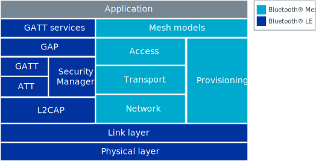

.. _mesh_concepts:

Bluetooth Mesh concepts
#######################

.. contents::
   :local:
   :depth: 2

Bluetooth® mesh is a profile specification developed and published by the Bluetooth® Special Interest Group (SIG).
This document explains the basic concepts of the Bluetooth Mesh and gives an overview of the operation and capabilities of the profile, as well as the life cycle of a mesh device.
For more information about the |NCS| implementation of the Bluetooth Mesh, see :ref:`Bluetooth Mesh architecture documentation <mesh_architecture>`.

The Bluetooth Mesh is based on the Bluetooth LE part of the Bluetooth® 4.0 Specification, and shares the lowest layers with this protocol.
On-air, the Bluetooth Mesh physical representation is compatible with existing Bluetooth LE devices, as mesh messages are contained inside the payload of Bluetooth LE *advertisement* packets.
However, Bluetooth Mesh specifies a completely new host stack, and although some concepts are shared, Bluetooth Mesh is incompatible with the Bluetooth Host.

   Relationship between Bluetooth Mesh and Bluetooth LE specifications

This page describes basic Bluetooth Mesh concepts.
Check the official `Bluetooth Mesh glossary`_ for definitions of the most important Bluetooth Mesh-related terms used in this documentation.

.. _mesh_concepts_app_areas:

Application areas
*****************

Bluetooth Mesh primarily targets simple control and monitoring applications, like light control or sensor data gathering.
The packet format is optimized for small control packets, issuing single commands or reports, and is not intended for data streaming or other high-bandwidth applications.

Using Bluetooth Mesh causes higher power consumption than when using traditional Bluetooth LE applications.
This is mainly due to the need for keeping the radio running constantly.
Therefore, unlike the Bluetooth LE advertisers, active mesh devices cannot be powered by coin-cell batteries for extended periods of time.

Bluetooth Mesh supports up to 32767 devices in a network, with a maximum network diameter of 126 hops.

.. _mesh_concepts_network_topo:

Network topology and relaying
*****************************

Bluetooth Mesh is a broadcast-based network protocol, where every device in the network sends and receives all messages to and from all devices within radio range.

There is no concept of connections in a mesh network.
Any device in the network may relay messages from any other device.
This feature makes it possible for a mesh device to send messages to a device outside the radio range, by having one or more other devices relay the messages towards the destination.
This feature also allows devices to move around, and drop in and out of the network at any time.

.. _mesh_concepts_network_topo_transport:

Mesh transport
==============

Bluetooth Mesh utilizes the Bluetooth LE advertiser and scanner roles, communicating through Bluetooth LE advertisement packets.
The advertisement packets are picked up by nearby mesh devices and handled like other Bluetooth LE advertisement packets.
The mesh packets are represented with a unique AD (advertisement data) type and added to the advertisement packet payload.

Bluetooth LE devices send advertisement packets at regular *advertisement intervals*, and mesh packets are no exception.
However, unlike traditional advertisers, mesh devices will change their advertisement payload on every transmission, broadcasting new mesh packets as they are queued up in the stack.

If there is no traffic in the mesh network or the mesh stack, or if the application does not generate any messages, the devices stay silent until there is something to transmit.

.. _mesh_concepts_network_topo_relays:

Relays
======

Bluetooth Mesh expands the range of the network by relaying messages.
Any mesh device may be configured to act as a relay, and no dedicated relay devices are needed to build a network.

Every device acting as a relay will decrement the time to live (TTL) value in received messages and forward them if the TTL equals two or higher.
This undirected relaying is referred to as *message flooding* and ensures a high probability of message delivery, without requiring any information on the network topology.

The Bluetooth Mesh profile specification does not provide any routing mechanisms, and all messages are forwarded by all relays until the TTL value reaches zero.
To avoid messages being repeatedly forwarded by the same relays, all mesh devices maintain a *message cache*.
This cache is used for filtering out packets that the device has already handled.

The flooding-based approach to message relaying can cause a lot of redundant traffic on air, which may impact the throughput and reliability of the network.
Therefore, it is highly recommended to limit the number of relays in a network to restrict this effect.

The number of relay-enabled devices in the network is a trade-off between message route-redundancy and reliability.
It should be tuned according to:

* Network density
* Traffic volumes
* Network layout
* Requirements for reliability and responsiveness

.. _mesh_concepts_network_topo_power:

Power consumption
=================

To enable broadcast-based communication, the devices must continuously keep their radio in listening mode.
This causes significantly higher power consumption than in a typical Bluetooth LE device.

To enable low-power devices to take part in the mesh network, Bluetooth Mesh contains a *friendship* feature.
This protocol lets low-power devices establish a relationship with a regular mesh device, which will then cache and forward messages to the low-power device at regular intervals.
This saves the low-power device from having to stay on to listen for incoming messages.

.. _mesh_concepts_network_topo_gatt:

GATT proxy
==========

To enable support for legacy Bluetooth LE devices that do not support receiving mesh packets, Bluetooth Mesh defines a separate protocol for tunneling mesh messages over the Bluetooth LE GATT protocol.
For this purpose, the Bluetooth Mesh profile specification defines a GATT bearer and the corresponding GATT Proxy Protocol.
This protocol allows legacy Bluetooth LE devices to participate in the mesh network by establishing a GATT connection to a mesh device that has the proxy feature enabled.

The legacy device gets assigned an address and the necessary keys to become a full-fledged member of the network.
The device receives the security credentials through the regular provisioning procedure or through some out-of-band mechanism.

.. _mesh_concepts_addressing:

Addressing
**********

The Bluetooth Mesh addressing scheme is different from the Bluetooth LE addressing scheme.
It features three types of addresses:

* *Unicast addresses* - Unique for every device
* *Group addresses* - For forming a group of devices and addressing them all at once
* *Virtual addresses* - Untracked UUID-based addresses with a large address space

When a device is added to a network, it is assigned a range of unicast addresses that represents it.
A device's unicast addresses cannot be changed and are always sequential.
The unicast address space supports having 32767 unicast addresses in a single mesh network.
Unicast addresses can be used by any application to directly send a message to a device.

Group addresses are allocated and assigned as part of the network configuration procedure.
A group address may represent any number of devices, and a device may be part of any number of groups.
There can at most be 16127 general purpose group addresses in a mesh network.

Virtual addresses can be considered a special form of group addresses, and can be used to represent any number of devices.
Each virtual address is a 128-bit UUID generated from a text label.
The virtual addresses do not have to be tracked by a network configuration device, and in this way, users can generate virtual addresses before deployment or addresses can be generated ad-hoc between devices in the network.

.. _mesh_concepts_models_and_elements:

Models and elements
*******************

To standardize communication between devices from different vendors, the Bluetooth Mesh profile specification defines an access layer, which routes mesh messages between the various *models* in a device.
A model represents a specific behavior or service and defines a set of states and messages that act on these states.
The Bluetooth Mesh profile specification and the model specification each define a set of models to cover typical usage scenarios like device configuration, sensor readings, and light control.
In addition to these, vendors are free to define their own models with accompanying messages and states.

The models in a device belong in *elements*.
Every device has one or more elements, each acting as a virtual entity in the mesh with its own unique unicast address.
Each incoming message is handled by a model instance in an element.
To make it possible to uniquely resolve how messages are handled, only one model instance per element can implement a handler for a specific message opcode.
If a device has multiple instances of the same model, each instance must be assigned to a separate element.
Similarly, if two models implement handlers for the same message, these models must be in separate elements.

To represent complex behavior with minimal message and state duplication, models can be made up of other models, potentially spanning multiple elements.
These models are referred to as *extended models*.
Models that are purely self-contained are referred to as root models.

Models talk to each other through a publish-and-subscribe system.
Every model may subscribe to a set of group and virtual addresses, and the model will only handle messages that are published to one of its subscription addresses or the containing element's unicast address.
Any model may maintain a publish address that it publishes messages to.
This publish address can be of any type.

.. figure:: images/bt_mesh_access.svg
   :alt: A graphical depiction of access layer structure

   Access layer structure

For more information about models, see :ref:`bt_mesh_models`.

.. _mesh_concepts_lifecycle:

Device life cycle
*****************

Every new device that is to be added to the mesh network must go through the following stages to become a mesh network node:

* :ref:`Provisioning <mesh_concepts_lifecycle_provisioning>` - After this stage, an unprovisioned device becomes a network node.
  This stage includes the following steps:

  1. Discovery
  #. :ref:`Authentication <mesh_concepts_security_authentication>`
  #. :ref:`Addressing <mesh_concepts_addressing>` assignment and network information exchange

  After the last step, the device becomes a node.

* :ref:`Configuration <mesh_concepts_lifecycle_network_config>` - After this stage, a node is able to perform its tasks that require exchanging mesh messages with neighboring nodes.
  This stage includes the following steps:

  1. Configuration of the node using the mandatory Configuration Server model
  #. Addition of desired application keys and additional network keys
  #. Optional configuration of the application-specific :ref:`models <mesh_concepts_models_and_elements>`, for example for key bindings, publications or subscriptions (or both)

Both of these stages are typically carried out by one device that acts as provisioner and configurator.

.. figure:: images/bt_mesh_device_lifecycle.svg
   :alt: Diagram showing a mesh node life cycle

   Mesh node life cycle

A mesh node can revert to being an unprovisioned device by performing a node reset procedure, which removes the node from the network.

The node can also be forcibly excluded from participating in the network with the key refresh procedure.
Once the key refresh procedure is completed for the rest of the nodes in a network, the node's unicast address can be allocated to a new unprovisioned device.

.. _mesh_concepts_lifecycle_provisioning:

Provisioning
============

Before a device can participate in normal mesh operation, it must be provisioned.

The provisioning is done by a *provisioner*, which is a trusted device with access to the full list of devices in the network, and their configuration data.
After the new device, called *provisionee*, has been provisioned, the provisioner uses the new device's device key to establish a secure channel to configure it.

For more information about provisioning, see :ref:`zephyr:bluetooth_mesh_provisioning`.

.. _mesh_concepts_lifecycle_network_config:

Configuration
=============

Bluetooth Mesh leaves the network configuration to a central network configurator.
Devices are not expected to do any sort of service discovery on their own.

To control other devices, new devices must be configured by a provisioner, either through user interaction or by loading a predetermined configuration from a database.
Every device must implement a mandatory Configuration Server model in their first element, which is used to configure the rest of its models.

As soon as the provisioning is complete, the provisioner uses its instance of the Configuration Client model to give the new device a set of application keys and addresses.
The device will use these keys and addresses for the duration of its lifetime on the network, unless it gets reconfigured.

Configuration example scenario: A light bulb and a switch
---------------------------------------------------------

After a new light switch has been provisioned:

1. The Configuration Client model in the provisioner reads out a list of the new device's models and elements, and presents them to the user.
#. The user finds the light switch model in the device's model list and gives it the *Light Control* application key.
#. The user sets the model's publish address to the *Kitchen Area* group address, to which all the light bulbs in the kitchen subscribe.

The next time the new light switch is pressed, all light bulbs in the kitchen turn on.

.. _mesh_concepts_security:

Security
********

Bluetooth Mesh employs several security measures to prevent third-party interference and monitoring:

* :ref:`mesh_concepts_security_authentication`
* :ref:`mesh_concepts_security_encryption`
* :ref:`mesh_concepts_security_privacy`
* :ref:`mesh_concepts_security_replay_protection`

.. _mesh_concepts_security_authentication:

Authentication
==============

Device authentication is part of the provisioning process and lets the user confirm that the device being added to the network is indeed the device they think it is.

The Bluetooth Mesh profile specification defines a range of out-of-band authentication methods, such as:

* Blinking of lights
* Output and input of passphrases
* Static authentication against a pre-shared key

To secure the provisioning procedure, elliptic curve Diffie-Helman (ECDH) public key cryptography is used.
After a device has been provisioned, it is part of the network and all its messages are considered authenticated.

.. _mesh_concepts_security_encryption:

Message encryption
==================

Bluetooth Mesh features two levels of AES-CCM encryption with 128-bit keys for all messages going across the network:

Network encryption
	The lowest layer that protects all messages in a mesh network from being readable by devices that are not part of the network.

	The encryption is done with a network encryption key, and any network may consist of up to 4096 different subnets, each with their own network key.
	All devices sharing a network key are considered part of the network, and may send and relay messages across it.
	By using multiple network keys, a network administrator may effectively divide their network into multiple subnets, because a mesh relay only forwards messages that are encrypted with a known network key.

Transport encryption
	The second encryption layer that limits which devices can do what *within a network* by encrypting the application payload with an application or device key.

	As an example, consider a mesh network deployed in a hotel.
	In this example it is desirable to limit some features that are to be controlled by the staff (like configuration of key cards or access to storage areas), and some features to be available to guests (like controlling room lighting or air conditioning).
	For this, we can have one application key for the guests and one for the staff, allowing the messages to be relayed across the same network, while preventing the guests and the staff from reading each other's messages.

While application keys are used to separate access rights to different applications in the network, the device keys are used to manage devices in the network.

Every device has a unique device key, which is only known to the provisioner and the device itself.
The device key is used when configuring a device with new encryption keys (network or application keys) or addresses, in addition to setting other device-specific parameters.
It can also be used to evict malicious devices from a network by transferring new keys to all the other devices in the network (using their individual device keys when transferring the keys).
This process is called the *key refresh procedure*.

Each encryption layer contains a message integrity check value that validates that the content of the message was encrypted with the indicated encryption keys.

.. _mesh_concepts_security_privacy:

Privacy key
===========

All mesh message payloads are fully encrypted.
Message metadata, like source address and message sequence number, is obfuscated with the privacy key derived from the network key, providing limited privacy even for public header fields.

.. _mesh_concepts_security_replay_protection:

Replay protection
=================

To guard against malicious devices replaying previous messages, every device keeps a running sequence number, which is used for outbound messages.
Each mesh message is sent with a unique pair of sequence number and source address. When receiving a message, the receiving device stores the sequence number and makes sure that it is more recent than the last sequence number it received from the same source address.

.. _mesh_concepts_coexistence:

Bluetooth LE and mesh coexistence
*********************************

Bluetooth Mesh uses the preset local identity value.
For more information about the advertisement identity, see :ref:`zephyr:bluetooth_mesh_adv_identity`.

Bluetooth Mesh sample :ref:`bluetooth_ble_peripheral_lbs_coex` demonstrates how to perform correct local identity allocation for Bluetooth LE purposes to avoid identity conflict with Bluetooth Mesh.
See the file :file:`samples/bluetooth/mesh/ble_pripheral_lbs_coex/src/lb_service_handler.c` for details.
