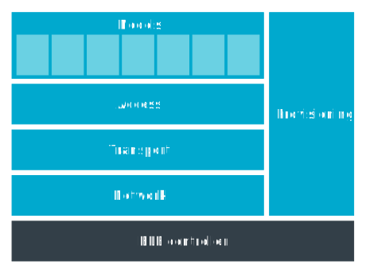

.. _ug_bt_mesh_overview_architecture:
.. _mesh_architecture:

Bluetooth Mesh architecture and data flow
#########################################

.. contents::
   :local:
   :depth: 2

Bluetooth® Mesh is based on the Bluetooth LE part of the Bluetooth 4.0 Specification, and shares the lowest layers with this protocol.
On-air, the Bluetooth Mesh physical representation is compatible with existing Bluetooth LE devices, as mesh messages are contained inside the payload of Bluetooth LE *advertisement* packets.

.. figure:: ../images/bt_mesh_and_ble.svg
   :alt: Relationship between Bluetooth Mesh and Bluetooth LE specifications

   Relationship between Bluetooth Mesh and Bluetooth LE specifications

Stack architecture overview
***************************

The Bluetooth Mesh stack in the |NCS| is an extension of the Zephyr Bluetooth Mesh stack.
The Zephyr Bluetooth Mesh stack implements the Bluetooth Mesh protocol specification (see :ref:`zephyr:bluetooth_mesh`), while the |NCS| provides additional model implementations from the Bluetooth Mesh model specification on top of the :ref:`zephyr:bluetooth_mesh_access` API.

   Basic architecture of the Bluetooth Mesh stack

The Bluetooth Mesh stack's structure corresponds to the structure of the Bluetooth Mesh specification and follows the same naming conventions:

* Bluetooth Mesh components in the |NCS|

  * Models - The Bluetooth Mesh models present and implement device behavior.

* Bluetooth Mesh components in Zephyr

  * Core (network and transport layer) - The Bluetooth Mesh core takes care of encryption and message relaying.
  * Access - The Bluetooth Mesh access layer organizes models and communication.
  * Provisioning` - The Bluetooth Mesh provisioning protocol is used for adding devices to the network.

See the official `Bluetooth Mesh glossary`_ for definitions of the most important Bluetooth Mesh-related terms used in this documentation.

Models
******

The models define the behavior and communication formats of all data that is transmitted across the mesh.
Equivalent to Bluetooth LE's GATT services, the Bluetooth Mesh models are independent, immutable implementations of specific behaviors or services.
All mesh communication happens through models, and any application that exposes its behavior through the mesh must channel the communication through one or more models.

The Bluetooth Mesh specification defines a set of immutable models for typical usage scenarios, but vendors are also free to implement their own models.

You can read more about the Bluetooth Mesh models in :ref:`ug_bt_mesh_overview_models`.
For more information about Bluetooth Mesh models and their APIs available in the |NCS|, see :ref:`bt_mesh_models`.

Access
******

The access layer controls the device's model composition.
It holds references to:

* Models that are present on the device
* Messages these models accept
* Configuration of these models

As the device receives mesh messages, the access layer finds which models the messages are for and forwards them to the model implementations.
The access layer is implemented in Zephyr.
For more information about the access layer, see :ref:`zephyr:bluetooth_mesh_access`.

Bluetooth Mesh core
*******************

Consisting of a network and a transport layer, the Bluetooth Mesh core module provides the mesh-specific transport for the messages.

The transport layer provides in-network security by encrypting mesh packets with *application keys*, and splitting them into smaller segments that can go on air.
The transport layer re-assembles incoming packet segments and presents the full mesh message to the access layer.

The network layer encrypts each transport layer packet segment with a *network key*, and populates the source and destination address fields.
When receiving a mesh packet, the network layer decrypts the message, inspects the source and destination addresses, and decides whether the packet is intended for this device and whether the network layer should relay it.

The Bluetooth Mesh core provides protection against malicious behavior and attacks against the mesh network through two-layer encryption, replay protection, and packet header obfuscation.
The Bluetooth Mesh core is implemented in Zephyr.
Read more about the Bluetooth Mesh core API in :ref:`zephyr:bluetooth_mesh_core`.

Provisioning
************

Provisioning is the act of adding a device to a mesh network.
The Provisioning module takes care of both sides of this process, by implementing a provisioner role (the network owner) and a provisionee role (the device to add).

The mesh stack supports provisioning of a device directly through the PB-ADV/PB-GATT provisioning bearer, which can only happen between a provisioner and a provisionee that are within radio range of each other.
The Bluetooth Mesh provisioning protocol is implemented in Zephyr.
For more information about the provisioning process and the API, see :ref:`zephyr:bluetooth_mesh_provisioning`.

Bluetooth Mesh network data flow
********************************

The following figure demonstrates how the data packets flow between mesh nodes and their layers within the mesh stack structure.

.. figure:: ../images/bt_mesh_data_packet_flow.svg
   :alt: Basic data flow within a mesh network in the |NCS| Bluetooth Mesh

   Basic data flow within a mesh network in the |NCS| Bluetooth Mesh

As an example, consider three development kits set up to compose a Bluetooth Mesh network with three devices/mesh network nodes:

* A source node implementing light switch functionality with Generic OnOff Client model.
* A relay node.
* A destination node implementing light bulb functionality with Generic OnOff Server model.

The process that takes place on each node when the light switch on the source node is pressed is described in the following sections.

Source node with a light switch (Generic OnOff Client model)
============================================================

The following process takes place at this stage:

  1. The application calls the light switch model's publish function.
  #. The model includes an on/off message with an opcode in a packet to be published, and sends it to the access layer.
  #. The access layer fetches the necessary publish parameters, like destination address, encryption keys and time to live value (TTL value), and passes the packet to the transport layer, the highest of the core layers.
  #. The transport layer then encrypts the message with the selected application key, and splits the message into segments if necessary.
     Each segment is passed to the network layer, which attaches a network header with a sequence number and encrypts the packet with the network key before passing it to the Bluetooth LE Controller.
  #. The Bluetooth LE Controller includes the network message in an advertisement packet, and schedules a time slot for the packet to be broadcasted.
  #. When the packet is broadcasted, it is picked up by nodes in the direct radio range of the transmitter.
     The packet might be picked up by for example a relay node.

Relay node
==========

The following process takes place at this stage:

  1. The broadcast is received by a node, and is passed from the bearer layer to its network layer.
  #. The network packet is decrypted, and if the receiving node is not its destination, the packet's TTL value is decreased by one, before being re-encrypted with the same network key and passed back to the bearer layer to be transmitted using the Bluetooth LE Controller.

After one or more hops, assume that the packet arrives at a destination node.

Destination node with a light bulb (Generic OnOff Server model)
===============================================================

The following process takes place at this stage:

  1. The broadcast is received by a node, and is passed from the bearer layer to its network layer.
  #. The network layer will decrypt the packet and pass it to the transport layer.
  #. Once all transport layer segments are received in this manner, the assembled message is decrypted with an application key, and passed on to the access layer.
  #. The access layer checks the opcode, application key and destination address, and passes the message to all eligible models.
  #. If one of these models is a Generic OnOff Server model, the model parses the contents of the message, and notifies the application to turn the light bulb on or off.

The server model may respond to acknowledge the transmission, following the same procedure back to the light switch node, which can notify the application that the on/off message was received.
