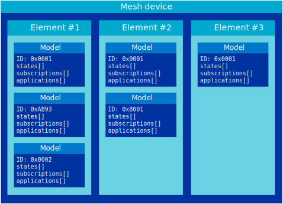

.. _ug_bt_mesh_overview_models:

Bluetooth Mesh models
#####################

.. contents::
   :local:
   :depth: 2

To standardize communication between devices from different vendors, the Bluetooth® Mesh protocol specification defines an access layer, which routes mesh messages between the various *models* in a device.
A Bluetooth Mesh model is a standardized software component that defines a series of states and related behaviors.
The end-user applications are implemented as a set of mesh models.

A model represents a specific behavior or service and defines a set of states and messages that act on these states.
Models encapsulate a single feature of a mesh node, and expose this feature to the mesh network.
The Bluetooth Mesh protocol specification and the model specification each define a set of models to cover typical usage scenarios like device configuration, sensor readings, and light control.
In addition to these, vendors are free to define their own models with accompanying messages and states.

The models in a device belong in *elements*.
Every device has one or more elements, each acting as a virtual entity in the mesh with its own unique unicast address.
Each incoming message is handled by a model instance in an element.
To make it possible to uniquely resolve how messages are handled, only one model instance per element can implement a handler for a specific message opcode.
If a device has multiple instances of the same model, each instance must be assigned to a separate element.
Similarly, if two models implement handlers for the same message, these models must be in separate elements.

To represent complex behavior with minimal message and state duplication, models can be made up of other models, potentially spanning multiple elements.
These models are referred to as *extended models*.
Models that are purely self-contained are referred to as root models.

Models talk to each other through a publish-and-subscribe system.
Every model may subscribe to a set of group and virtual addresses, and the model will only handle messages that are published to one of its subscription addresses or the containing element's unicast address.
Any model may maintain a publish address that it publishes messages to.
This publish address can be of any type.

   Access layer structure

For more information about available Bluetooth Mesh models and their APIs, see :ref:`bt_mesh_models`.

States
******

A state is a value that represents a condition of an element or device, for example to indicate whether it is on or off.

Some states are bound to another state, where a change in one state results in a change in the other state.
Bound states may be from different models, and may be in one or more elements.

Multiple states can be grouped together as a composite state.
This allows a model to refer to this composite state instead of each of the individual grouped states.

States can be changed as a result of any of the following:

* A state-changing message that is received and processed by a server.
* An asynchronous event, for example a scheduler action being executed.
* A local (non-network) event, for example a press of a button located on a networked light source.

.. _bt_mesh_models_transition:

State transitions
*****************

A change of state may be instantaneous (for example, a state reported by a sensor), or may take some time (non-instantaneous changes).
The time that it takes for a state to change from a present state to the target state (the state that the state server is changing to) is called the transition time.
States with non-instantaneous changes make use of :c:struct:`bt_mesh_model_transition` to specify the time it should take a server to change a state to a new value.

The transition to a new value can be postponed by the time defined in :c:member:`bt_mesh_model_transition.delay`, and the current value of a state remains unchanged until the transition starts.
The delay should not be taken into account when calculating the remaining transition time.

Server models are taking care of publishing of status messages, when receiving a state changing message, as well as sending a response back to a client, when an acknowledged message is received.
If a state change is non-instantaneous, for example when :c:func:`bt_mesh_model_transition_time` returns a nonzero value, the application is responsible for publishing a new value of the state at the end of the transition.

.. _bt_mesh_models_categorization:

Model categories
****************

Each model is classified into one of the following categories:

Server
   An element exposing a state is referred to as a server.
   For example, the simplest server is a Generic OnOff Server which represents that the state is either on or off.

Client
   An element accessing a state is referred to as a client.
   In other words, a client reads and writes the server's states.
   For example, the simplest client is a Generic OnOff Client (a binary switch) that is able to control a Generic OnOff Server using messages accepted by the Generic OnOff Server model.

Some models also include a *Setup Server* model instance.
The two server model instances share the states of the server model, but accept different messages.
This allows for a fine-grained control of the access rights for the states, as the two model instances can be bound to different application keys.
Typically, the Setup Server instance provides write access to configuration parameters, such as valid parameter ranges or default values.

Both server and client models can be extended, but because client models do not have states, there is generally no reason to extend them.
None of the specification client models extend other models.
All server models store changes to their configuration persistently using the :ref:`zephyr:settings_api` subsystem.

.. _bt_mesh_models_common_blocking_api_rule:

Common rule for the model's blocking API
****************************************

Some client APIs can be called as blocking if the response buffer is set to non-NULL.
Blocking calls must only be made from threads where they do not disrupt Zephyr's system services.
Thus, do not make blocking calls in interrupt handlers, such as button handlers, or kernel services, such as system work queue handlers.

.. _bt_mesh_models_configuration:

Configuration
*************

You can configure mesh models in |NCS| using Kconfig options.
See :ref:`configure_application` for more information.

The options related to each model configuration are listed in the respective documentation pages.
