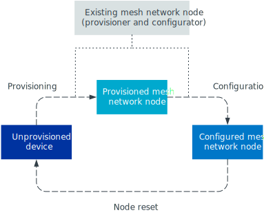

.. _ug_bt_mesh_overview_topology:
.. _mesh_concepts:

Bluetooth Mesh network topology and concepts
############################################

.. contents::
   :local:
   :depth: 2

Understanding Bluetooth Mesh networking topology requires knowledge about basic Bluetooth Mesh technical terms and concepts.
See also the official `Bluetooth Mesh glossary`_ for definitions of the most important Bluetooth Mesh-related terms used in this documentation.

Bluetooth Mesh is a broadcast-based network protocol, where every device in the network sends and receives all messages to and from all devices within radio range.

There is no concept of connections in a mesh network.
Any device in the network may relay messages from any other device.
This feature makes it possible for a mesh device to send messages to a device outside the radio range, by having one or more other devices relay the messages towards the destination.
This feature also allows devices to move around, and drop in and out of the network at any time.

Bluetooth Mesh utilizes the Bluetooth LE advertiser and scanner roles, communicating through Bluetooth LE advertisement packets.
The advertisement packets are picked up by nearby mesh devices and handled like other Bluetooth LE advertisement packets.
The mesh packets are represented with a unique AD (advertisement data) type and added to the advertisement packet payload.

Bluetooth LE devices send advertisement packets at regular *advertisement intervals*, and mesh packets are no exception.
However, unlike traditional advertisers, mesh devices will change their advertisement payload on every transmission, broadcasting new mesh packets as they are queued up in the stack.

If there is no traffic in the mesh network or the mesh stack, or if the application does not generate any messages, the devices stay silent until there is something to transmit.

The image below illustrates a typical mesh network topology and its node types.

   Basic Bluetooth Mesh network topology and the different roles

Devices and Bluetooth Mesh roles
********************************

Devices in a mesh network are called *nodes*.
Devices that are not yet part of a mesh network are called *unprovisioned devices*, and the process that transforms an unprovisioned device to a node is called provisioning.

All nodes can receive and transmit mesh messages.
In addition, a node may possess special capabilities as optional features.
Four optional features (roles) are available for Bluetooth Mesh nodes:

* Relay
* Friend
* Low Power
* Proxy

Relay nodes
===========

Relaying is the mechanism by which a message can traverse the entire mesh network, making multiple hops between devices by being relayed.
Bluetooth Mesh expands the range of the network by relaying messages.
Any mesh device may be configured to act as a relay (Relay node), and no dedicated relay devices are needed to build a network.

Every device acting as a relay will decrement the time to live (TTL) value in received messages and forward them if the TTL equals two or higher.
This undirected relaying is referred to as *message flooding* and ensures a high probability of message delivery, without requiring any information on the network topology.

The Bluetooth Mesh protocol specification does not provide any routing mechanisms, and all messages are forwarded by all relays until the TTL value reaches zero.
To avoid messages being repeatedly forwarded by the same relays, all mesh devices maintain a *message cache*.
This cache is used for filtering out packets that the device has already handled.

The flooding-based approach to message relaying can cause a lot of redundant traffic on air, which may impact the throughput and reliability of the network.
Therefore, it is highly recommended to limit the number of relays in a network to restrict this effect.

The number of relay-enabled devices in the network is a trade-off between message route-redundancy and reliability.
It should be tuned according to:

* Network density
* Traffic volumes
* Network layout
* Requirements for reliability and responsiveness

Low Power and Friend nodes
==========================

To enable broadcast-based communication, the devices must continuously keep their radio in listening mode.
This causes significantly higher power consumption for a Bluetooth Mesh device than for a typical Bluetooth LE device.

Low Power and Friend features are introduced to deal with the power consumption for mesh devices and to enable low-power devices to take part in the mesh network.

Bluetooth Mesh lets low-power devices be defined as Low Power nodes (LPNs) and establish a *friendship* with a regular mesh device (a Friend node), which then will cache and forward messages to the low-power device at regular intervals.
This saves the low-power device from having to stay on to listen for incoming messages.

Proxy nodes
===========

Proxy nodes allow Bluetooth LE devices that do not possess a Bluetooth mesh stack to interact with nodes in a mesh network.

To enable support for legacy Bluetooth LE devices that do not support receiving mesh packets, Bluetooth Mesh defines a separate protocol for tunneling mesh messages over the Bluetooth LE GATT protocol.
For this purpose, the Bluetooth Mesh protocol specification defines a GATT bearer and the corresponding GATT Proxy Protocol.
This protocol allows legacy Bluetooth LE devices to participate in the mesh network by establishing a GATT connection to a mesh device that has the proxy feature enabled (Proxy node).

The legacy device gets assigned an address and the necessary keys to become a full-fledged member of the network.
The device receives the security credentials through the regular provisioning procedure or through some out-of-band mechanism.

Node configuration
==================

Each node supports a standard set of configuration states which are implemented within the standard Configuration Server model and accessed using the Configuration Client model.
The features supported by a node are indicated by Configuration Server states, and the addresses to which a node has subscribed are stored in the Subscription List.

The network and subnet keys, which are indicating the networks the node is a member of, are listed in the configuration block.
This is also the case for the application keys held by the node.

The Configuration Client model and the Configuration Server model support GET, SET and STATUS operations on the Configuration Server model states through a series of configuration messages.

Messages
********

All communication in a mesh network is message-oriented.
Messages are sent whenever a node needs to query the status of other nodes, control other nodes, or report its status to other nodes.

Messages fall within one of two categories:

* Acknowledged messages, which require a response from nodes that receive them
* Unacknowledged messages, that do not require a response

The effect of a given acknowledged message arriving at a node multiple times is the same as if it had only been received once.

All messages are of three broad types: GET, SET and STATUS.
GET messages request the value of a given state from one or more nodes.
A STATUS message is sent in response to a GET message and contains the relevant state value.
A SET message changes the value of a given state.

An acknowledged SET message results in a STATUS message being returned in response to the SET message.
An unacknowledged SET message requires no response.

STATUS messages are sent in response to GET messages and acknowledged SET messages.
STATUS messages do not need to be sent as a response to another message at all, but can for example be driven by a timer running on the element sending the message.

.. _ug_bt_mesh_overview_topology_addressing:

Addressing
**********

Messages must be sent from and to an address.
The Bluetooth Mesh addressing scheme is different from the Bluetooth LE addressing scheme.
Bluetooth Mesh defines three types of addresses:

* *Unicast addresses* - Unique for every device
* *Group addresses* - For forming a group of devices and addressing them all at once
* *Virtual addresses* - Untracked UUID-based addresses with a large address space

When a device is added to a network, it is assigned a range of unicast addresses that represents it.
A device's unicast addresses cannot be changed and are always sequential.
The unicast address space supports having 32767 unicast addresses in a single mesh network.
Unicast addresses can be used by any application to directly send a message to a device.

Group addresses are allocated and assigned as part of the network configuration procedure.
A group address may represent any number of devices, and a device may be part of any number of groups.
There can at most be 16127 general purpose group addresses in a mesh network.

Virtual addresses can be considered a special form of group addresses, and can be used to represent any number of devices.
Each virtual address is a 128-bit UUID generated from a text label.
The virtual addresses do not have to be tracked by a network configuration device, and in this way, users can generate virtual addresses before deployment or addresses can be generated ad-hoc between devices in the network.

Publishing and subscribing
**************************

The act of sending a message is known as publishing.
Subscribing is when nodes are configured to select messages sent to specific addresses for processing.

Messages are typically addressed to group or virtual addresses.
Publishing and subscribing to group and virtual addresses has a benefit in that removing, replacing or adding new nodes to the network does not require reconfiguration of other nodes.

.. _ug_bt_mesh_overview_topology_lifecycle:

Device life cycle
*****************

Every new device that is to be added to the mesh network must go through the following stages to become a mesh network node:

* :ref:`ug_bt_mesh_overview_topology_lifecycle_provisioning` - After this stage, an unprovisioned device becomes a network node.
  The node is authenticated and assigned an address.
* :ref:`ug_bt_mesh_overview_topology_lifecycle_network_config` - After this stage, a node is able to perform its tasks that require exchanging mesh messages with neighboring nodes.
  This stage includes the following steps:

  1. Configuration of the node using the mandatory Configuration Server model.
  #. Addition of desired application keys and additional network keys.
  #. Optional configuration of the application-specific :ref:`models <ug_bt_mesh_overview_models>`, for example for key bindings, publications or subscriptions (or both).

Both of these stages are typically carried out by one device that acts as Provisioner and Configurator.

   Mesh node life cycle

A mesh node can revert to being an unprovisioned device by performing a Node Reset procedure, which removes the node from the network.

The node can also be forcibly excluded from participating in the network with the Key Refresh procedure.
Once the Key Refresh procedure is completed for the rest of the nodes in a network, the node's unicast address can be allocated to a new unprovisioned device.

.. _ug_bt_mesh_overview_topology_lifecycle_provisioning:

Provisioning
============

Before a device can participate in normal mesh operation, it must be provisioned.
Provisioning is a process of adding an unprovisioned device to a mesh network.

The provisioning is done by a *Provisioner*, which is a trusted device with access to the full list of devices in the network, and their configuration data.
A Provisioner is typically a smart phone or other mobile computing device.

After the new device, called *Provisionee*, has been provisioned, the Provisioner uses the new device's device key to establish a secure channel to configure it.

Provisioning is a five-step process, involving the following steps:

* Beaconing
* Invitation
* Public key exchange
* Authentication
* Provisioning data transfer

For more information about provisioning and the different provisioning steps, see :ref:`zephyr:bluetooth_mesh_provisioning`.

.. _ug_bt_mesh_overview_topology_lifecycle_network_config:

Configuration
=============

Bluetooth Mesh leaves the network configuration to a central network configurator.
Devices are not expected to do any sort of service discovery on their own.

To control other devices, new devices must be configured by a provisioner, either through user interaction or by loading a predetermined configuration from a database.
Every device must implement a mandatory Configuration Server model in their first element, which is used to configure the rest of its models.

As soon as the provisioning is complete, the provisioner uses its instance of the Configuration Client model to give the new device a set of application keys and addresses.
The device will use these keys and addresses for the duration of its lifetime on the network, unless it gets reconfigured.

Configuration example scenario: A light bulb and a switch
---------------------------------------------------------

After a new light switch has been provisioned:

1. The Configuration Client model in the provisioner reads out a list of the new device's models and elements, and presents them to the user.
#. The user finds the light switch model in the device's model list and gives it the *Light Control* application key.
#. The user sets the model's publish address to the *Kitchen Area* group address, to which all the light bulbs in the kitchen subscribe.

The next time the new light switch is pressed, all light bulbs in the kitchen turn on.
