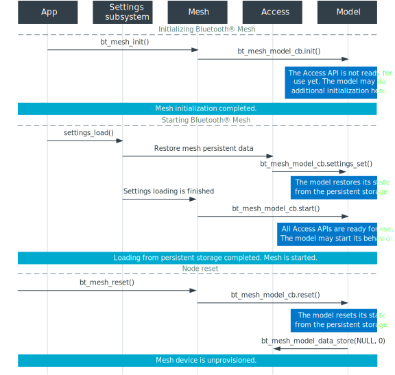

.. _ug_bt_mesh_vendor_model_dev_overview:

Vendor model development overview
#################################

.. contents::
   :local:
   :depth: 2

To implement a new Bluetooth® mesh model, apply the steps described in this step-by-step model development process overview.

Defining a model identifier
***************************

Models define basic functionality of a node in the Bluetooth mesh network.
Once it is decided on what functionality the model will define, its identifier must be specified to be able to recognize it among the other models in the mesh network.

As defined by the `Bluetooth mesh profile specification`_, the vendor model identifiers are composed of two unique 16-bit values specifying a company identifier (Company ID), and a vendor-assigned model identifier (Model ID) tied to this Company ID.

.. code-block:: c

    #define YOUR_COMPANY_ID 0x1234
    #define YOUR_MODEL_ID   0x5678

The Company ID must be registered with the Bluetooth® Special Interest Group (SIG), and the vendor owning the Company ID may freely allocate the model IDs for its Company ID.
See `Bluetooth SIG company identifiers`_ for a list of Company IDs.

Adding the model to the node composition data
*********************************************

Once the model has its own Model ID, it can be added to the node composition data.
This will register the model on the node, and enable the model configuration through the :ref:`zephyr:bluetooth_mesh_models_cfg_cli` so that it can communicate with other models in the mesh network.

.. note::
   The node composition data is passed to :c:func:`bt_mesh_init` at the mesh stack initialization, and cannot be changed at run time.

To add the model to the node composition data, use the :c:macro:`BT_MESH_MODEL_VND_CB` macro, that requires at least the Company ID and the Model ID to be provided.
Below is an example of the simplest model initialization in the node composition data.

.. code-block:: c

    BT_MESH_MODEL_VND_CB(YOUR_COMPANY_ID,
                         YOUR_MODEL_ID,
                         BT_MESH_MODEL_NO_OPS,
                         NULL,
                         NULL,
                         NULL)

The third argument, the :c:macro:`BT_MESH_MODEL_NO_OPS` macro, specifies an empty operation code (opcode) list, meaning that the model won't receive any messages.
The other arguments are optional and set to ``NULL``.
The following sections describe how and when to use these arguments.

When defining the node composition data, pass the vendor models in the second parameter of the :c:macro:`BT_MESH_ELEM` macro:

.. code-block:: c

    static struct bt_mesh_elem elements[] = {
        BT_MESH_ELEM(
            1,
            BT_MESH_MODEL_LIST(BT_MESH_MODEL_CFG_SRV(&cfg_srv),
                               BT_MESH_MODEL_HEALTH_SRV(&health_srv,
                                                        &health_pub)),
            BT_MESH_MODEL_LIST(BT_MESH_MODEL_VND_CB(YOUR_COMPANY_ID,
                                                    YOUR_MODEL_ID,
                                                    BT_MESH_MODEL_NO_OPS,
                                                    NULL,
                                                    NULL,
                                                    NULL))
        ),
    };

Defining opcodes for the messages
*********************************

The communication between the nodes within a mesh network is done by means of message exchange.
Therefore, if you want to implement your own node behavior, you need to define your own set of messages that will be associated with this behavior.
To do that, you need to define vendor-specific opcodes for new messages, using the :c:macro:`BT_MESH_MODEL_OP_3` macro.
This macro encodes an opcode into the special format defined by the `Bluetooth mesh profile specification`_.
Each vendor-specific message must be tied with a Company ID, passed as a second parameter to the macro:

.. code-block:: c

    BT_MESH_MODEL_OP_3(0x01, YOUR_COMPANY_ID)

The two most significant bits of the first octet in a vendor-specific opcode are always set to ``1``.
Therefore, you can specify up to 64 different vendor-specific opcodes.

You can wrap your opcode in a macro to make it convenient to use in the future:

.. code-block:: c

    #define MESSAGE_SET_OPCODE    BT_MESH_MODEL_OP_3(0x01, YOUR_COMPANY_ID)
    #define MESSAGE_ACK_OPCODE    BT_MESH_MODEL_OP_3(0x02, YOUR_COMPANY_ID)
    #define MESSAGE_STATUS_OPCODE BT_MESH_MODEL_OP_3(0x03, YOUR_COMPANY_ID)

Receiving messages
******************

If the model is to receive messages, create an opcode list that will define a list of messages that your model will receive.
To create the opcode list, initialize an array of :c:struct:`bt_mesh_model_op` type with the following required parameters:

1. Message opcode, :c:member:`bt_mesh_model_op.opcode`, to register a message to be received by the model.
#. Minimal message length, :c:member:`bt_mesh_model_op.len`, that prevents the model from receiving messages shorter than the specified value.
#. Message handler, :c:member:`bt_mesh_model_op.func`, which is used to process the received message.

The last element in the opcode list is always the :c:macro:`BT_MESH_MODEL_OP_END` macro:

.. code-block:: c

    static void handle_message_set(struct bt_mesh_model *model,
                                   struct bt_mesh_msg_ctx *ctx,
                                   struct net_buf_simple *buf)
    {
        // Message handler code
    }

    static void handle_message_ack(struct bt_mesh_model *model,
                                   struct bt_mesh_msg_ctx *ctx,
                                   struct net_buf_simple *buf)
    {
        // Message handler code
    }

    static void handle_message_status(struct bt_mesh_model *model,
                                      struct bt_mesh_msg_ctx *ctx,
                                      struct net_buf_simple *buf)
    {
        // Message handler code
    }

    const struct bt_mesh_model_op _opcode_list[] = {
        { MESSAGE_SET_OPCODE,    MESSAGE_SET_LEN,    handle_message_set },
        { MESSAGE_ACK_OPCODE,    MESSAGE_ACK_LEN,    handle_message_ack },
        { MESSAGE_STATUS_OPCODE, MESSAGE_STATUS_LEN, handle_message_status },
        BT_MESH_MODEL_OP_END,
    };

To associate the opcode list with your model, use the :c:macro:`BT_MESH_MODEL_VND_CB` macro.
It will initialize the :c:member:`bt_mesh_model.op` field of the model context:

.. code-block:: c

    BT_MESH_MODEL_VND_CB(YOUR_COMPANY_ID,
                         YOUR_MODEL_ID,
                         _opcode_list,
                         NULL,
                         NULL,
                         NULL)

Sending messages
****************

Before sending a message, you need to prepare a buffer that will contain the message data together with the opcode.
This can be done using the :c:macro:`BT_MESH_MODEL_BUF_DEFINE` macro.
It creates and initializes an instance of :c:struct:`net_buf_simple`, therefore, use the :ref:`net_buf_interface` API to fill up the buffer:

.. code-block:: c

    BT_MESH_MODEL_BUF_DEFINE(buf, MESSAGE_SET_OPCODE, MESSAGE_SET_LEN);

To set the opcode of the message, call :c:func:`bt_mesh_model_msg_init`:

.. code-block:: c

    bt_mesh_model_msg_init(&buf, MESSAGE_SET_OPCODE);

As described in :ref:`Access API <zephyr:bluetooth_mesh_access>`, the model can send a message in two ways:

1. By using a custom :c:struct:`bt_mesh_msg_ctx`.
#. By using a model publication context.

If you want your model to control a destination address or some other parameters of a message, you can initialize :c:struct:`bt_mesh_msg_ctx` with custom parameters, and pass it together with a message buffer to :c:func:`bt_mesh_model_send`:

.. code-block:: c

    static int send_message(struct bt_mesh_model *model, uint16_t addr)
    {
        struct bt_mesh_msg_ctx ctx = {
                .addr = addr,
                .app_idx = model->keys[0],
                .send_ttl = BT_MESH_TTL_DEFAULT,
        };

        BT_MESH_MODEL_BUF_DEFINE(buf, MESSAGE_SET_OPCODE, MESSAGE_SET_LEN);
        bt_mesh_model_msg_init(&buf, MESSAGE_SET_OPCODE);

        // Fill the message buffer here

        return bt_mesh_model_send(model, &ctx, &buf, NULL, NULL);
    }

.. note::
   Before sending the messages, you still need to bind an application key to your model using the Configuration Client.

The :c:func:`bt_mesh_model_send` function is also used if you need to send a reply on a received message.
To do that, use the message context passed to a handler of a message that needs to be replied to, when calling :c:func:`bt_mesh_model_send`:

.. code-block:: c

    static void handle_message_set(struct bt_mesh_model *model,
                                   struct bt_mesh_msg_ctx *ctx,
                                   struct net_buf_simple *buf)
    {
        BT_MESH_MODEL_BUF_DEFINE(reply, MESSAGE_ACK_OPCODE, MESSAGE_ACK_LEN);
        bt_mesh_model_msg_init(&reply, MESSAGE_ACK_OPCODE);

        // Fill the reply buffer here

        (void) bt_mesh_model_send(model, ctx, &reply, NULL, NULL);
    }

The model publication context defines the behavior of messages to be published by the model, and it is configured by the Configuration Client.
If you want your model to send messages using the model publication context, create a :c:struct:`bt_mesh_model_pub` instance and pass it to :c:macro:`BT_MESH_MODEL_VND_CB` macro to initialize :c:member:`bt_mesh_model.pub`:

.. code-block:: c

    static struct bt_mesh_model_pub pub_ctx;

    BT_MESH_MODEL_VND_CB(YOUR_COMPANY_ID,
                         YOUR_MODEL_ID,
                         _opcode_list,
                         &pub_ctx,
                         NULL,
                         NULL)

You must initialize the :c:member:`bt_mesh_model_pub.msg` publication buffer when using the model publication context.
This can be done in two ways.
Either by using the :c:macro:`NET_BUF_SIMPLE` macro:

.. code-block:: c

    static struct bt_mesh_model_pub pub_ctx = {
        .msg = NET_BUF_SIMPLE(BT_MESH_MODEL_BUF_LEN(MESSAGE_SET_OPCODE,
                                                    MESSAGE_SET_MAXLEN)),
    }

Or, for example, in the :c:member:`bt_mesh_model_cb.init` callback, using :c:func:`net_buf_simple_init_with_data`:

.. code-block:: c

    static struct bt_mesh_model_pub pub_ctx;
    static struct net_buf_simple pub_msg;
    static uint8_t buf[BT_MESH_MODEL_BUF_LEN(MESSAGE_SET_OPCODE,
                                             MESSAGE_SET_MAXLEN)];

    static int model_init(struct bt_mesh_model *model)
    {
        model->pub = &pub_ctx;
        net_buf_simple_init_with_data(&pub_msg, buf, sizeof(buf));
        pub_ctx.msg = &pub_msg;

        return 0;
    }

.. note::
   The publication buffer size must be big enough to fit the longest message to be published.

How to initialize :c:member:`bt_mesh_model_cb.init` is described later in this guide.

When the model supports the model publication, configure the model to send messages at certain periods, regardless of the current model state, using the Configuration Client.
This is useful for periodic data publication, for example, if it changes over time.
To support the model publication, initialize the :c:member:`bt_mesh_model_pub.update` callback.

If the periodic publication is configured by the Configuration Client, the access layer calls the :c:member:`bt_mesh_model_pub.update` callback in the beginning of each publication period.
It resets the buffer provided in :c:member:`bt_mesh_model_pub.msg`.
Therefore, you only need to fill the data into the buffer:

.. code-block:: c

    static int update_handler(struct bt_mesh_model *model)
    {
        bt_mesh_model_msg_init(model->pub->msg, MESSAGE_STATUS_OPCODE);

        // Fill the model publication buffer here

        return 0;
    }

Associating the user data
*************************

You can associate your data with the :c:struct:`bt_mesh_model` structure, through the :c:member:`bt_mesh_model.user_data` field.
This is useful for restoring your context associated with the model, whenever any of the callbacks defined by the Access API are called.
To associate the data, pass the pointer to your data to the :c:macro:`BT_MESH_MODEL_VND_CB` macro.

Defining model callbacks
************************

The Access API provides a set of callbacks that are called when certain events occur.
These callbacks are defined in :c:struct:`bt_mesh_model_cb`.

    Bluetooth mesh model callbacks

:c:member:`bt_mesh_model_cb.settings_set`
   This handler is called when the model data is restored from the persistent storage.
   If you need to store data in the persistent storage, use the :c:func:`bt_mesh_model_data_store` function.
   To use the persistent storage, it needs to be enabled with :kconfig:option:`CONFIG_BT_SETTINGS`.
   For more information on persistent storage, see :ref:`zephyr:settings_api`.

:c:member:`bt_mesh_model_cb.start`
   This handler is called after the node has been provisioned, or after all mesh data is loaded from the persistent storage.
   When this callback fires, the mesh model may start its behavior, and all Access APIs are ready for use.

:c:member:`bt_mesh_model_cb.init`
   This handler is called on every model instance during the mesh initialization.
   Implement it if you need to do additional model initialization before the mesh stack starts, for example, to initialize the model publication context.
   If any of the model init callbacks return an error, the mesh subsystem initialization is aborted, and the error is returned to the caller of :c:func:`bt_mesh_init`.

:c:member:`bt_mesh_model_cb.reset`
   The model reset handler is called when the mesh node is reset.
   All of the model's configuration is deleted on reset, and the model should clear its state.
   If the model stores any persistent data, this needs to be erased manually.

If you want to use any of these callbacks, create an instance of :c:struct:`bt_mesh_model_cb` and initialize any of the required callbacks.
Use the :c:macro:`BT_MESH_MODEL_VND_CB` macro to associate the callbacks with your model.
It will initialize the :c:member:`bt_mesh_model.cb` field of the model context:

.. code-block:: c

    static struct bt_mesh_model_cb model_cbs;

    BT_MESH_MODEL_VND_CB(YOUR_COMPANY_ID,
                         YOUR_MODEL_ID,
                         _opcode_list,
                         &pub_ctx,
                         NULL,
                         &model_cbs)
