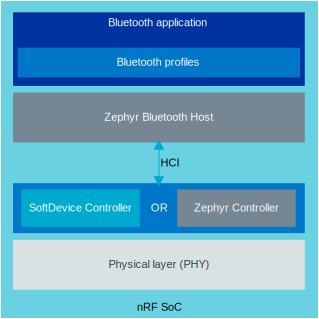

.. _ug_bt_stack_arch:

Bluetooth stack architecture
############################

.. contents::
   :local:
   :depth: 2

The Bluetooth protocol has a layered architecture, and the |NCS| Bluetooth implementation combines components from the Zephyr Project and components developed by Nordic Semiconductor.
This section briefly describes the main components and provides links to pages with additional information.

The following diagram shows the main components of a Bluetooth application, with a focus on the protocol stack.

   Bluetooth stack components in the |NCS|

Physical layer (PHY)
********************

The Bluetooth Low Energy radio PHY supports 4 different modes, each with different bandwidth and range:

* S8 Coded PHY, 125kbps, longest range, optional support
* S2 Coded PHY, 500kbps, optional support
* 1 Mbps, Mandatory support
* 2 Mbps, shortest range, optional support

Key features required for Bluetooth Direction Finding support are also part of the PHY layer.

Feature support for PHY features depend on specific SoCs.
Please refer to the Bluetooth feature support table on the :ref:`software_maturity` page.

.. _ug_ble_controller:

Controller
**********

A Bluetooth LE Controller is the layer of the Bluetooth stack that handles the physical layer packets and all associated timing.
It implements the Link Layer, which is the low-level, real-time protocol that controls the Bluetooth LE communication.

The |NCS| contains two implementations of a Bluetooth LE Controller:

* `SoftDevice Controller`_
* `Zephyr Bluetooth LE Controller`_

The :ref:`nrfxlib:softdevice_controller` is the default and supported Bluetooth controller in the |NCS|.
For this controller the support includes:

* Implementation of new Bluetooth LE controller features.
* Valid qualification (QDID) for each SDK release.

The Zephyr Project has a community support :ref:`ug_ble_controller`.
This Bluetooth controller will be the default when using Zephyr RTOS stand-alone.

.. note::
   It is possible to configure projects in the |NCS| to use the Zephyr Controller.
   Nordic Semiconductor does not support the Zephyr Bluetooth LE Controller for production.

.. _ug_ble_controller_softdevice:

SoftDevice Controller
=====================

The :ref:`SoftDevice Controller <nrfxlib:softdevice_controller>` is developed from the same code base as Nordic Semiconductor's SoftDevices.
The SoftDevice Controller is developed, tested, and supported by Nordic Semiconductor.

The SoftDevice Controller is distributed as a set of precompiled, linkable libraries that can be found in the `sdk-nrfxlib`_ repository.
There are different variants of the libraries that support different feature sets.
Which variant you should choose depends on the chip that you are using, the features that you need, and the amount of available memory.

Nordic's SoftDevice Controller supports an extensive standard feature set from the Bluetooth® specification and a number of extensions for high-performance applications like Low Latency Packet mode (LLPM).
See the :ref:`SoftDevice Controller documentation <nrfxlib:softdevice_controller>` for a detailed list of supported features.

Zephyr Bluetooth LE Controller
==============================

`Zephyr`_ has a full, open source, :ref:`Bluetooth Low Energy stack <zephyr:bluetooth-arch>`, which includes the Zephyr Bluetooth LE Controller.
This Bluetooth LE Controller is designed with an upper and lower implementation to make it possible to support multiple hardware platforms.
It is developed by the Zephyr community and provided as open source.

To use Zephyr's Bluetooth LE Controller in your application, include a :ref:`Controller-only build <zephyr:bluetooth-build-types>` of the Bluetooth LE stack.

Zephyr's Bluetooth LE Controller supports most of the standard Bluetooth LE features.
See the :ref:`Zephyr documentation <zephyr:bluetooth-features>` for a detailed list of supported features.

Usage in samples
================

Most :ref:`Bluetooth LE samples <ble_samples>` in the |NCS|, including the :ref:`bt_mesh_samples`, can use either Bluetooth LE Controller.
Exceptions are the :ref:`ble_llpm` sample, which requires the SoftDevice Controller that supports LLPM, and the :ref:`nrf53_audio_app`, which require the SoftDevice Controller that supports :ref:`LE Isochronous Channels <nrfxlib:softdevice_controller_iso>`.

By default, all samples are currently configured to use SoftDevice Controller.
To use the Zephyr Bluetooth LE Controller instead, use the :ref:`bt-ll-sw-split <zephyr:snippet-bt-ll-sw-split>` snippet (see :ref:`app_build_snippets`) and make sure to build from a clean build directory.

.. note::
   If your Bluetooth application requires the LE Secure Connections pairing and you want to use the Zephyr Bluetooth LE Controller, make sure to enable the :kconfig:option:`CONFIG_BT_TINYCRYPT_ECC` Kconfig option as the ECDH cryptography is not supported by this Bluetooth LE Controller.

Zephyr Host
***********

The |NCS| uses the Bluetooth Host implementation in the Zephyr project for host feature support.
The Zephyr Host implementation is tested with the rest of the SDK for releases, and a valid QDID is provided for each SDK release.

For more information, see the :ref:`bluetooth_le_host` page in the Zephyr documentation set.
