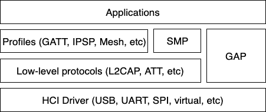
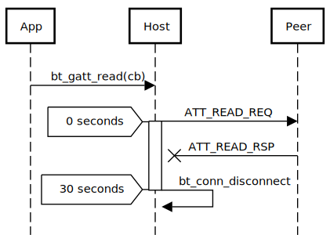

.. _bluetooth_le_host:

LE Host
#######

.. contents::
   :local:
   :depth: 2

The Bluetooth Host implements all the higher-level protocols and profiles, and most importantly, provides a high-level API for applications.
The following diagram depicts the main protocol and profile layers of the host.

   Bluetooth Host protocol and profile layers.

.. |sample path| replace:: :file:`samples/bluetooth/central_and_peripheral_hrs`

Lowest down in the host stack is a HCI driver that is responsible for abstracting away the details of the HCI transport.
It provides a basic API for delivering data from the controller to the host and vice-versa.

Perhaps the most important block above the HCI handling is the Generic Access Profile (GAP).
GAP simplifies the Bluetooth LE access by defining four distinct roles of Bluetooth usage:

* Connection-oriented roles

  * Peripheral (for example, a smart sensor, often with a limited user interface)
  * Central (typically a mobile phone or a PC)

* Connectionless roles

  * Broadcaster (sending out Bluetooth LE advertisements, for example, a smart beacon)
  * Observer (scanning for Bluetooth LE advertisements)

Each role comes with its own build-time configuration option:

* :kconfig:option:`CONFIG_BT_PERIPHERAL`
* :kconfig:option:`CONFIG_BT_CENTRAL`
* :kconfig:option:`CONFIG_BT_BROADCASTER`
* :kconfig:option:`CONFIG_BT_OBSERVER`

Of the connection-oriented roles, central implicitly enables the observer role, and peripheral implicitly enables the broadcaster role.
Usually, the first step when creating an application is to decide which roles are needed and go from there.

Peripheral role
===============

Most Zephyr-based Bluetooth LE devices will most likely be peripheral-role devices.
This means that they perform connectable advertising and expose one or more GATT services.
After registering services using the :c:func:`bt_gatt_service_register` function, the application typically starts connectable advertising using the :c:func:`bt_le_adv_start` function.

There are several peripheral sample applications available in the tree, such as :ref:`ble_samples` (|NCS|) |sample path|.

Central role
============

Central role may not be as common for Zephyr-based devices as peripheral role, but it is still a plausible one and equally well supported in Zephyr.
Rather than accepting connections from other devices, a central role device scans for available peripheral devices and chooses one to connect to.
Once connected, a central typically acts as a GATT client, first performing discovery of available services and then accessing one or more supported services.

To initially discover a device to connect to, the application likely uses the :c:func:`bt_le_scan_start` function, waits for an appropriate device to be found (using the scan callback), stops scanning using :c:func:`bt_le_scan_stop`, and then connects to the device using :c:func:`bt_conn_le_create`.

There are some sample applications for the central role available in the tree, such as :ref:`ble_samples` (|NCS|) |sample path|.

Observer role
=============

An observer role device uses the :c:func:`bt_le_scan_start` function to scan for device, but it does not connect to any of them.
Instead, it uses the advertising data of found devices, combining it optionally with the received signal strength (RSSI).

Broadcaster role
================

A broadcaster role device uses the :c:func:`bt_le_adv_start` function to send non-connectable advertisements.
Other devices cannot connect to a broadcaster, and can only receive its advertising data.

Connections
===========

Connection handling and the related APIs can be found in the :ref:`Connection Management <bluetooth_connection_mgmt>` section.

Security
========

To achieve a secure relationship between two Bluetooth devices a process called pairing is used.
This process can either be triggered implicitly through the security properties of GATT services, or explicitly using the :c:func:`bt_conn_set_security` function on a connection object.

To achieve a higher security level and protect against Man-In-The-Middle (MITM) attacks, it is recommended to use some out-of-band channel during the pairing.
If the devices have a sufficient user interface this "channel" is the user itself.
The capabilities of the device are registered using the :c:func:`bt_conn_auth_cb_register` function.
The :c:struct:`bt_conn_auth_cb` structure that is passed to this function has a set of optional callbacks that can be used during the pairing.
If the device lacks some feature, the corresponding callback can be set to NULL.
For example, if the device does not have an input method but does have a display, the ``passkey_entry`` and ``passkey_confirm`` callbacks would be set to NULL, but the ``passkey_display`` would be set to a callback capable of displaying a passkey to the user.

Depending on the local and remote security requirements and capabilities, there are four possible security levels that can be reached:

* :c:enumerator:`BT_SECURITY_L1` - No encryption and no authentication.
* :c:enumerator:`BT_SECURITY_L2` - Encryption but no authentication (no MITM protection).
* :c:enumerator:`BT_SECURITY_L3` - Encryption and authentication using the legacy pairing method from Bluetooth 4.0 and 4.1.
* :c:enumerator:`BT_SECURITY_L4` - Encryption and authentication using the LE Secure Connections feature available since Bluetooth 4.2.

L2CAP
=====

The Logical Link Control and Adaptation Protocol (L2CAP) is a common layer for all communication over Bluetooth connections.
However, an application comes in direct contact with it only when using it in the Connection-oriented Channels (CoC) mode.
More information on this can be found in the :ref:`L2CAP API section <bt_l2cap>`.

Terminology
-----------

The definitions are from the Core Specification version 5.4, volume 3, part A 1.4.

.. list-table::
  :header-rows: 1

  * - Term
    - Description

  * - Upper layer
    - Layer above L2CAP, it exchanges data in form of SDUs. It may be an
      application or a higher level protocol.

  * - Lower layer
    - Layer below L2CAP, it exchanges data in form of PDUs (or fragments). It is
      usually the HCI.

  * - Service Data Unit (SDU)
    - Packet of data that L2CAP exchanges with the upper layer.

      This term is relevant only in Enhanced Retransmission mode, Streaming
      mode, Retransmission mode and Flow Control Mode, not in Basic L2CAP mode.

  * - Protocol Data Unit (PDU)
    - Packet of data containing L2CAP data. PDUs always start with Basic L2CAP
      header.

      Types of PDUs for LE: :ref:`B-frames <bluetooth_l2cap_b_frame>` and
      :ref:`K-frames <bluetooth_l2cap_k_frame>`.

      Types of PDUs for BR/EDR: I-frames, S-frames, C-frames and G-frames.

  * - Maximum Transmission Unit (MTU)
    - Maximum size of an SDU that the upper layer is capable of accepting.

  * - Maximum Payload Size (MPS)
    - Maximum payload size that the L2CAP layer is capable of accepting.

      In Basic L2CAP mode, the MTU size is equal to MPS. In credit-based
      channels without segmentation, the MTU is MPS minus 2.

  * - Basic L2CAP header
    - Present at the beginning of each PDU. It contains two fields, the PDU
      length and the Channel Identifier (CID).

PDU Types
---------

The following PDU types are used for LE L2CAP data transport, depending on the selected channel
mode.

.. _bluetooth_l2cap_b_frame:

B-frame: Basic information frame
^^^^^^^^^^^^^^^^^^^^^^^^^^^^^^^^

PDU used in Basic L2CAP mode.
It contains the payload received from the upper layer or delivered to the upper layer as its payload.

.. image:: img/l2cap_b_frame.drawio.svg
   :align: center
   :width: 45%
   :alt: Representation of a B-frame PDU. The PDU is split into two rectangles, the first one being the L2CAP header, its size is four octets and its made of the PDU length and the channel ID.
         The second rectangle represents the information payload and its size is less or equal to MPS.

.. _bluetooth_l2cap_k_frame:

K-frame: Credit-based frame
^^^^^^^^^^^^^^^^^^^^^^^^^^^

PDU used in LE Credit Based Flow Control mode and Enhanced Credit Based Flow Control mode.
It contains a SDU segment and additional protocol information.

.. image:: img/l2cap_k_frame_1.drawio.svg
   :width: 45%
   :alt: Representation of a starting K-frame PDU. The PDU is split into three rectangles, the first one being the L2CAP header, its size is four octets and its made of the PDU length and the channel ID.
         The second rectangle represents the L2CAP SDU length, its size is two octets.
         The third rectangle represents the information payload and its size is less or equal to MPS minus two octets.
         The information payload contains the L2CAP SDU.

.. image:: img/l2cap_k_frame.drawio.svg
   :align: right
   :width: 45%
   :alt: Representation of K-frames PDUs after the starting one.
         The PDU is split into two rectangles, the first one being the L2CAP header, its size is four octets and its made of the PDU length and the channel ID.
         The second rectangle represents the information payload and its size is less or equal to MPS.
         The information payload contains the L2CAP SDU.

Relevant Kconfig
----------------

The following Kconfig options have an impact on the L2CAP payload sizes.
They also define whether credit-based channels are available.

.. list-table::
   :header-rows: 1

   * - Kconfig symbol
     - Description

   * - :kconfig:option:`CONFIG_BT_BUF_ACL_RX_SIZE`
     - Represents the MPS

   * - :kconfig:option:`CONFIG_BT_L2CAP_TX_MTU`
     - Represents the L2CAP MTU

   * - :kconfig:option:`CONFIG_BT_L2CAP_DYNAMIC_CHANNEL`
     - Enables LE Credit Based Flow Control and thus the stack may use
      :ref:`K-frame <bluetooth_l2cap_k_frame>` PDUs

GATT
====

The Generic Attribute Profile is the most common means of communication over LE connections.
A more detailed description of this layer and the API reference can be found in the :ref:`GATT API reference section <bt_gatt>`.

ATT timeout
-----------

If the peer device does not respond to an ATT request (such as read or write) within the ATT timeout, the host will automatically initiate a disconnect.
This simplifies error handling by reducing rare failure conditions to a common disconnection, allowing developers to manage unexpected disconnects without special cases for ATT timeouts.

Persistent storage
==================

The Bluetooth host stack uses the settings subsystem to implement persistent storage to flash.
This requires the presence of a flash driver and a designated "storage" partition on flash.
A typical set of configuration options needed looks something like the following:

  .. code-block:: cfg

     CONFIG_BT_SETTINGS=y
     CONFIG_FLASH=y
     CONFIG_FLASH_PAGE_LAYOUT=y
     CONFIG_FLASH_MAP=y
     CONFIG_NVS=y
     CONFIG_SETTINGS=y

Once enabled, it is the responsibility of the application to call the :c:func:`settings_load` function after having initialized Bluetooth (using the :c:func:`bt_enable` function).
