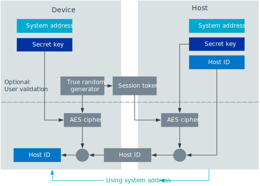
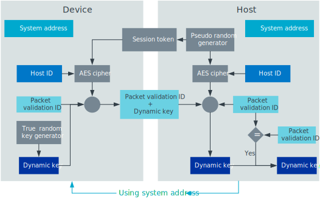
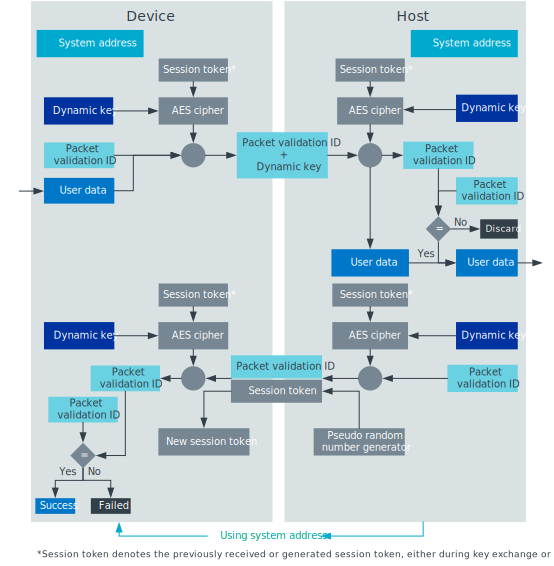

.. _ug_gzp:

Gazell Pairing
##############

.. contents::
   :local:
   :depth: 2

The Gazell Pairing library for the nRF52 Series enables applications to use the Gazell Link Layer to provide a secure wireless link between Gazell nodes.
The library is customized for pairing a Device (for example, a mouse, keyboard, or remote control) with a Host (typically a USB dongle) using Gazell.

Gazell Pairing also uses additional hardware peripherals and restricts the usage of the Gazell Link Layer.

See the :ref:`Gazell Pairing library <gzp>` page for more information on how to use this library.

Features
********

The Gazell Pairing library has the following features:

* Close proximity pairing
* AES-128 encryption
* Secure key exchange
* Dynamic update of key during runtime
* Storage of pairing parameters in non-volatile memory
* One time programmable (OTP) device compatibility
* Backwards compatible with Gazell Pairing library for the nRF24L IC.

Secure key exchange in Gazell Pairing is based on a Secret Key that is factory-programmed.
Only nodes that share the same Secret Key for a desktop ecosystem, can form an encrypted link.
After a pair of nodes have authenticated each other's Secret Key, the Gazell Host generates a random key termed the "Host ID".
This is encrypted with the Secret Key and sent to the Gazell Device.
This Host ID key is used to transmit a dynamic key that is used for encrypting subsequent data.

All encrypted exchanges of keys and data use a session token that is equivalent to the AES counter mode and provides protection against ciphertext attacks.
In addition, all encrypted packets include an encrypted packet validation ID so that all packets are authenticated.

The security features of Gazell Pairing provide counter measures against a range of potential attacks, including:

* Frequency analysis attacks
* Hostile device attacks
* Known-plaintext attacks
* Man-in-the-middle attacks
* Passive eavesdropping
* Replay attacks

See `Terminology`_ for a description of each of these security features.

.. note::
   Gazell only allows pairing when the Host and Device are in close proximity to each other.
   The Received Signal Strength Indication (RSSI) is used on the Host side of the nRF52 Series so that only Devices residing close (<30 cm) to the Host are allowed to pair (on the nRF24L IC Host nodes, the carrier detect functionality is employed).
   Proximity estimation is essential to avoid confusion when pairing in certain environments, for example in an office.

Pairing and key exchange stages
*******************************

The pairing and key exchange process consists of the following stages:

* :ref:`ug_gzp_sys_addr_exchange`
* :ref:`ug_gzp_host_id_exchange`
* :ref:`ug_gzp_dyn_key_exchange`
* :ref:`ug_gzp_enc_user_data_exchange`

Each of these stages are required to send encrypted user data from a Device to a Host.
If encryption is not required, only the "System Address exchange" stage is required to send unencrypted data on pipes 2-7.

Factory preset parameters
=========================

For pairing and key exchange to occur, an unpaired Host and Device must share the following factory preset parameters:

+----------------------+--------+-------+--------------------------------------------------+----------------+
| Parameter            | Secret | Bytes | Purpose                                          | Set            |
+======================+========+=======+==================================================+================+
| Secret Key           | Yes    | 16    | Encrypting Host ID when sent from Host to Device | Factory preset |
+----------------------+--------+-------+--------------------------------------------------+----------------+
| Pairing Address      | No     | 5     | Sending of System Address from Host to Device    | Factory preset |
+----------------------+--------+-------+--------------------------------------------------+----------------+
| Packet Validation ID | No     | 3     | Authentication of packets                        | Factory preset |
+----------------------+--------+-------+--------------------------------------------------+----------------+

In addition, every Host has the unique parameters that are generated at runtime:

+----------------+--------+-------+------------------------------------------------------+-------------------------------------------------------+
| Parameter      | Secret | Bytes | Purpose                                              | Set                                                   |
+================+========+=======+======================================================+=======================================================+
| System Address | No     | 5     | Address used for all transmission.                   | Runtime.                                              |
|                |        |       | Seed for generating channel set.                     | Generated when first system address request received. |
+----------------+--------+-------+------------------------------------------------------+-------------------------------------------------------+
| Host ID        | Yes    | 5     | Encrypting Dynamic Key when sent from Device to Host | Runtime.                                              |
|                |        |       |                                                      | Generated when first Host ID request is received.     |
+----------------+--------+-------+------------------------------------------------------+-------------------------------------------------------+

The System Address and Host ID are stored in the non-volatile memory (NVM) and apply for the lifetime of the Host unless the NVM is erased.

.. figure:: images/gzp_factory_defaults.svg
   :alt: Initial pairing parameters

   Initial pairing parameters

.. _ug_gzp_sys_addr_exchange:

System Address exchange
=======================

The System Address is an individual Host's private address.
For a Device to communicate with an individual Host, it needs to know the Host's System Address.
When requesting a System Address, the Device sets the TX power to a low level using :c:macro:`GZP_POWER`.
By measuring the received signal strength when a pairing request is received from a Device, the Host can estimate the relative proximity of the requesting Device.

For a Device to pair with a Host, it must first obtain the System Address on which all subsequent key exchange and data transfer occur.
This transaction occurs on the pipe 0 and is transmitted in cleartext on the air as it is not a secret.

.. figure:: images/gzp_address_exchange.svg
   :alt: System address exchange

   System Address exchange

.. _ug_gzp_host_id_exchange:

Host ID exchange
================

Once the Device has the System Address, it can request the Host ID on the pipe using :c:macro:`GZP_DATA_PIPE`.
The Host ID is used to generate subsequent Dynamic Keys for encrypted data transfer.

After receiving a Host ID request, the Host generates the ID if it has not done it already.
The Host ID is generated using the random Session Token received from the Device in the Host ID request as well as the session counter.

The Device sends a packet to fetch the Host ID.
The secret Host ID is transmitted on the encrypted pipe :c:macro:`GZP_DATA_PIPE` using the shared Secret Key.

The following security precautions are taken for the Host ID exchange:

* Passive eavesdropping is prevented by using AES encryption.
* Replay attacks are prevented by using session tokens.
* Man-in-the-middle and malicious device attacks can be prevented by implementing a user validation stage before the Host ID is sent to the Device (see :ref:`ug_gzp_host_id_validation`).

   Host ID exchange

The Host ID can be compromised if the attacker has knowledge of the Secret Key.
The attacker could eavesdrop the Host ID exchange and obtain the Host ID or attempt to pair as a malicious device and obtain the Host ID.
Before the Host ID is sent from the Host to the Device, the application can add a validation stage.

.. _ug_gzp_host_id_validation:

Optional Host ID validation stage
---------------------------------

The validation stage would typically contain some user intervention, for example the user can be requested to write a keycode on the Device, displayed on a screen on the Host.

This requires the Device to be able to send user data before all parameters normally used for encrypting user data have been exchanged.
It is still possible to send encrypted data during the validation stage.
This data is encrypted in the same fashion as normal user data, described in Encrypted User Data exchange, except for the following differences:

* The Secret Key is used instead of the Dynamic Key.
* Session token update is not sent from the Device to the Host.

As the same session token is used throughout the entire validation stage, the data exchange in the validation stage has the following properties:

* Only the same Device as the one initializing the Host ID exchange can send data that will be accepted by the Host.
* Only the Device used for sending user data during the validation stage can decrypt the Host ID sent from the Host.

.. _ug_gzp_dyn_key_exchange:

Dynamic Key exchange
====================

The Dynamic Key is used for encrypting user data.
Each Device must have a unique Dynamic Key, and the Host must know the Dynamic Key of each Device it communicates with.

A Device can initialize the update of the Dynamic Key at any time.
The Dynamic Key is generated randomly on the Device and then communicated to the Host.
The Host ID is used for encrypting the Dynamic Key.

The Dynamic Key is considered a secret, and the following security precautions are taken:

* Passive eavesdropping is prevented by using AES encryption.
* Replay attacks are prevented by using session tokens sent from Host.
* Only Devices knowing the Host ID can update the Dynamic Key in the Host.

   Dynamic Key exchange

The main reasons for using a Dynamic Key for encryption of user data are:

* A Host must be able to pair with multiple Devices at the same time, and none of these should use the same key for encryption of user data.
* The solution must be available on OTP devices, where storing of keys in the non-volatile memory during runtime is not desired.

The secrecy of the Dynamic Key is dependent on the secrecy of the Host ID.
The Dynamic Key can be compromised if both these conditions are met:

* Attacker eavesdrops the exchange of the Dynamic Key.
* The Host ID has been compromised.

.. _ug_gzp_enc_user_data_exchange:

Encrypted User Data exchange
****************************

Once the Device and Host share a Dynamic key, encrypted data exchange can occur.
When sending Encrypted User Data, the following security precautions are taken:

* Passive eavesdropping is prevented by AES encryption.
* "Hostile" device attacks are prevented as only Devices that know the current Dynamic Key can send user data that will be accepted by the Host.
* Known plaintext or ciphertext attacks are prevented by AES encryption.
* Replay attacks are prevented by using session tokens sent from the Host.
* Frequency analysis attacks are prevented by updating session token for every packet.

   Encrypted user data exchange

The secrecy of the Encrypted User Data is dependent on the secrecy of the Dynamic Key.
The Encrypted User Data may be compromised if both these conditions are met:

* Attacker eavesdrops the user data exchange.
* The current Dynamic Key has been compromised.

System Address and channel table generation
*******************************************

The System Address determines the Gazell channel table on the Host and Device for subsequent transactions.

When sending the System Address request, the Device knows only the lowest and highest RF channels in the Host's channel table (:c:macro:`GZP_CHANNEL_LOW` and :c:macro:`GZP_CHANNEL_HIGH`).
This is sufficient for the System Address transaction as the Device and Host eventually change channels so that they can communicate.
In an environment with many desktops using Gazell Pairing, the Device and Host will find another channel to communicate on.

Terminology
***********

+----------------------------+------------------------------------------------------------------------------------------------------------------------------------------------------------+
| Name                       | Description                                                                                                                                                |
+============================+============================================================================================================================================================+
| Frequency analysis attacks | Frequency analysis is the study of the frequency of letters, or groups of letters, in the ciphertext.                                                      |
|                            | Even the most advanced ciphers such as AES, do not provide security against this type of attack unless precautions for such an attack have been taken.     |
|                            | Frequency analysis is based on the fact that certain letters and combinations of letters occur with varying frequencies.                                   |
|                            | Knowing these properties of a given language, it can be possible to decipher the packets sent from the keyboard without having to break the cipher itself. |
|                            |                                                                                                                                                            |
|                            | The encrypted user data in Gazell pairing is protected against frequency analysis attacks by using a session token, which is incremented for every packet. |
|                            | This is equivalent to AES "counter" mode.                                                                                                                  |
|                            | As the keys can take on any value they cannot be compromised by a frequency analysis attack.                                                               |
+----------------------------+------------------------------------------------------------------------------------------------------------------------------------------------------------+
| Hostile device attack      | Here, a hostile Device attack is used as a scenario, where a hostile third party Device has been able to pair with the Host and starts sending data that   |
|                            | is interpreted as trusted user data by the Host.                                                                                                           |
|                            | The hostile device may also obtain any keys shared with other devices in order to eavesdrop communications.                                                |
|                            | For example, having such a capability with a wireless keyboard, an attacker can easily perform a range of operations on the host PC, like damaging         |
|                            | contents on the PC or install spyware or key logging software.                                                                                             |
+----------------------------+------------------------------------------------------------------------------------------------------------------------------------------------------------+
| Man-in-the-middle attack   | The man-in-the-middle attack is a form of active eavesdropping in which the attacker makes independent connections with the victims during key exchanges   |
|                            | and relays messages between them, making them believe that they are talking directly to each other over a private connection, when in fact the entire      |
|                            | conversation is controlled by the attacker.                                                                                                                |
|                            |                                                                                                                                                            |
|                            | One method to prevent this attack is that the communicating parties have a shared secret to authenticate the source of the transmission.                   |
|                            | In Gazell Pairing, this is provided by the factory-programmed Secret Key.                                                                                  |
+----------------------------+------------------------------------------------------------------------------------------------------------------------------------------------------------+
| Replay attacks             | A replay attack is an attack where previously sent packets are recorded by a third party and resent to the receiver.                                       |
|                            | Here, the third party is not actually deciphering the keyboard packets, but repeats commands previously sent to the receiver.                              |
|                            | For example, a typical login sequence on a PC consisting of entering a username and a password is in particular vulnerable for a replay attack.            |
|                            | In Gazell pairing, the use of dynamic keys and session tokens prevent this kind of attack.                                                                 |
+----------------------------+------------------------------------------------------------------------------------------------------------------------------------------------------------+
| Session token              | A session token is a random or pseudo random number used for adding randomness to encryption of data packets.                                              |
|                            | The session token is not assumed as a secret.                                                                                                              |
|                            | The session token is generated before every new session and discarded after the session has ended.                                                         |
|                            | Here, a session consists of one message sent from a transmitter to a recipient and one message being sent in return from the recipient to the              |
|                            | transmitter.                                                                                                                                               |
+----------------------------+------------------------------------------------------------------------------------------------------------------------------------------------------------+
