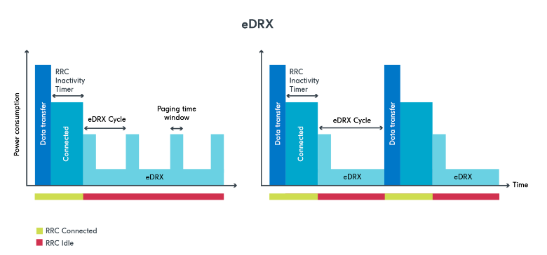
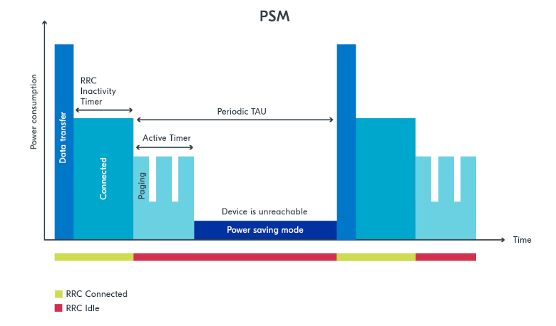
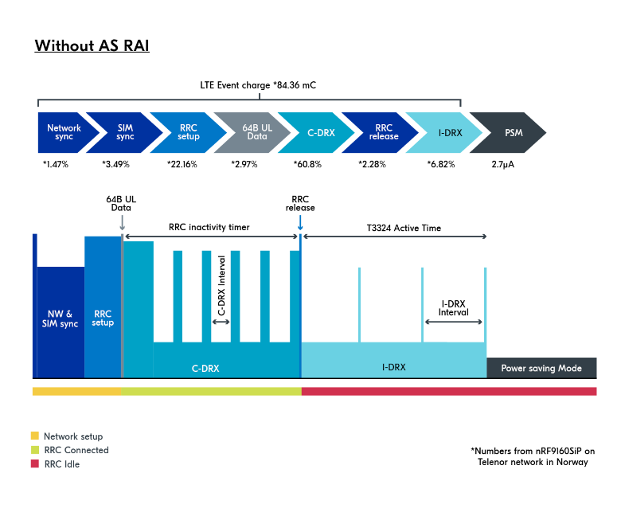
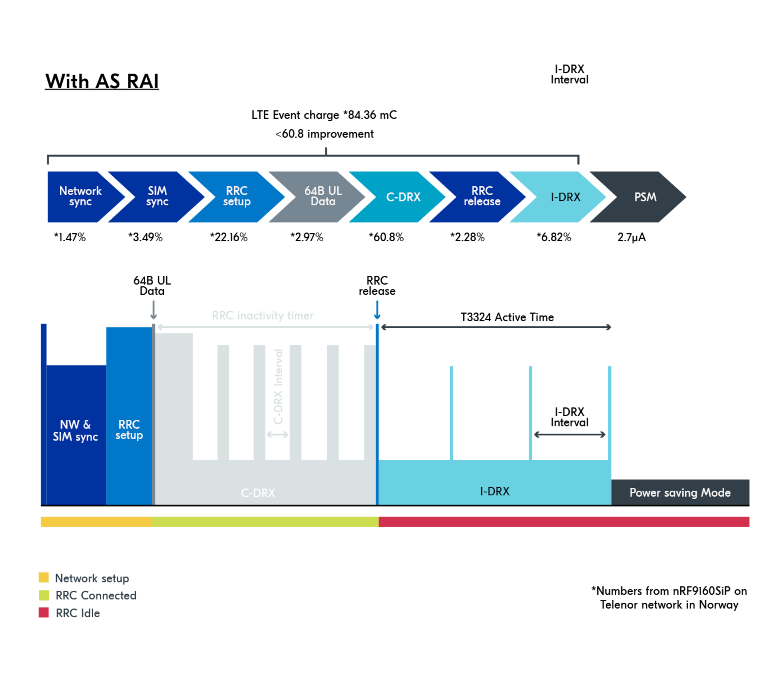

.. _cellular_psm:

Power saving techniques
#######################

.. contents::
   :local:
   :depth: 2

LTE-M and NB-IoT technologies are examples of an LPWAN (Low Power Wide Area Network) because of their coverage, high mobility, roaming capabilities, and infrastructure.
However, battery lifespan can be a problem for devices using LTE-M and NB-IoT if you do not fully understand the power-saving capabilities and how to use them to decrease power consumption.

See the :ref:`app_power_opt_nRF91` and the DevAcademy's `Power saving techniques`_ documentation for more information on power saving techniques.

.. _cellular_radio_modes:

Radio activity modes
********************

The two main operational modes for a :term:`User equipment (UE)` are Radio Resource Control (RRC) connected mode and RRC idle mode, which refers to active mode and idle mode, respectively.
A UE could also be in shutdown mode.

RRC connected mode
==================

The UE's radio is in RRC connected mode when it is active and conducting timely bi-directional communications with the eNB (LTE base station) for activities like synchronization and neighbor cell measurements.
As a result of radio broadcasts and signaling operations, this mode uses the greatest power.

The following tasks are performed in the RRC connected mode:

* Sending uplink (UL) messages from the UE to the eNB.
* Receiving downlink (DL) from the eNB.
* Neighbor cell measurements and synchronization tasks.
* Performing Tracking Area Updates (TAUs) to update the eNB about the UE’s location for reachability.

In RRC connected mode, the UE remains connected for a duration set by the RRC inactivity timer following data transfer.
The device remains in the RRC connected state, awaiting potential near-term future data transmissions, thereby avoiding the resource-consuming transitions between states.
The UE can continue sending or receiving data during the timed period without returning to an idle state.
However, when the RRC inactivity timer runs out, the UE transitions to the idle mode.

RRC idle mode
=============

RRC idle mode is the mode when the UE is turned on but the radio is not performing high-battery-consuming tasks.
In RRC idle mode, the UE accomplishes the bare minimum to maintain network connectivity by remaining reachable and synchronized with the network.
Consequently, battery consumption is low compared to RRC connected mode, but it can be further reduced.

In RRC idle mode, the radio Listens to paging messages to be informed when the eNB requires a status update or value reporting.

.. _cellular_power_saving:

LTE-M and NB-IoT power saving features
**************************************

The following section lists some features you can use to fine-tune the power consumption of LTE-M and NB-IoT.

Discontinuous Reception
=======================

Discontinuous Reception (DRX), which enables the radio to be briefly switched off in between listening intervals, is one of the basic techniques of power conservation.

Connected mode DRX (cDRX)
-------------------------

In RRC connected mode, after data transmission, the UE stays in RRC connected mode till the RRC inactivity timer runs out.
During that period, the UE can briefly turn off its radio and instead listen for incoming radio activity in intervals.
This is called Connected mode DRX (cDRX), as it happens during RRC connected mode.

Idle-mode DRX (iDRX)
--------------------

In RRC idle mode, the UE is not expecting much radio activity, so it turns off its radio to save power and listens for incoming downlink radio messages at specific intervals.
This is referred to as Idle-mode DRX (iDRX), and is a basic power-saving feature.

extended Discontinuous Reception (eDRX)
---------------------------------------

In eDRX periods, the UE can monitor downlink paging messages from the network less frequently, thus saving power by not turning on its radio as often.
However, the UE is still connected and registered to the network.
It only listens to downlink paging messages less frequently and extends its sleep periods.

The network cannot contact the UE when it is not actively listening for paging.
The acceptable delay in UE availability in relation to the eDRX cycle results in power saving.

The following figure shows two different scenarios for eDRX connection states:

   extended Discontinuous Reception (eDRX)

In the first scenario, the UE wakes up without any paging messages to monitor them.
In the second scenario, the UE wakes up to a paging event that requires data transfer.
Thus, the UE switches to RRC connected mode for the required data transfer.
The RRC inactivity timer is then started.

Power Saving Mode (PSM)
=======================

PSM takes power saving to a new level by putting the UE into a deep sleep state.
This means that, unlike in eDRX mode, a UE in PSM will not regularly monitor RX paging messages.
Instead, it enters a deeper sleep for a longer duration.

However, the UE stays registered and attached to the network to enable data transfer upon wakeup.
For this to happen, the UE must wake up regularly and send a Tracking Area Update (TAU) to the network.
This period is decided by the Periodic TAU timer.
A UE in PSM wakes up for one of two reasons, either triggered by the Periodic TAU timer to send a TAU, or by the application to send UL messages.
Waiting until the next TAU to transmit UL data is more power efficient, even though the device can wake up and send UL data whenever it wants.

The UE can negotiate with the network for an amount of time set by the timer called Active Time.
When the RRC inactivity timeout expires after an RRC connection period, the UE enters idle mode.
On the other hand, the Active Time begins when a UE is in idle mode if PSM is enabled.
The UE enters PSM when the timer expires.
If eDRX is enabled, the UE can operate in eDRX mode during the Active Time.

The following figure shows the process of PSM:

   power saving mode

Smart PSM or Proprietary Power Saving Mode (PSM)
================================================

Proprietary PSM performs a PSM-like sleep when the network does not allow normal PSM usage.
When taken into use, the modem goes to sleep the same way as it would if the network allowed the use of PSM.
The sending of MO data or MO SMS automatically wakes up the modem the same way as from normal PSM sleep.
Proprietary PSM can be used only in application use cases where the device always initiates the data connection.
This is because when the device is in proprietary PSM, the network cannot reach it.
If the network notices this, it can perform local deregistration for the device, which would lead to a new registration and extra signaling when the device wakes up.
The operator can take some unwanted actions if a large number of devices are constantly unreachable when there is downlink data to be sent to the devices.
The length of the proprietary PSM sleep depends on the MO data or MO SMS cycles but also on the need to perform periodic Tracking Area Update (TAU), which is controlled by timer T3412.
Typically, the T3412 timer is shorter when PSM is not used.

It can be configured using the ``AT%FEACONF`` command.
See `nRF91x1 Feature configuration %FEACONF`_ for more information.

Reduced mobility
================

If the device in your application is mostly stationary, you can request the modem to reduce mobility.
This feature is designed to reduce power consumption by reducing swapping between cells.
You can use the :ref:`lte_lc_readme` to configure this feature.
The following code shows how to configure this feature:

.. code-block:: c

	err = int lte_lc_reduced_mobility_set(LTE_LC_REDUCED_MOBILITY_NORDIC);
	if (err) {
		printk("lte_lc_reduced_mobility_set, error: %d\n", err);
		return;
	 }

You can also enable this feature using the ``AT%REDMOB=1`` command.

Country-specific search optimization
====================================

The initial search for a network in a new location can take several minutes and might therefore draw a considerable amount of power.
This phase is not covered by the Online Power Profiler but might become a relevant factor if the device frequently travels long distances.

To speed up network selection, you can provide country-specific search parameters for up to 70 countries.
This list can be set using the ``AT%XCOUNTRYDATA`` command.

Abort network search early
==========================

For weak radio conditions, the application can subscribe to :c:enumerator:`LTE_LC_MODEM_EVT_LIGHT_SEARCH_DONE` events.
These occur when the modem finishes an initial search without connecting to a network.
If the connection can wait some more time, the application can decide to abort the search and try again later.
Without intervention, the modem continues with a more thorough search.

Connection Quality Indicator (CQI) or Connection evaluation
===========================================================

Before sending data, the application can request the modem to estimate energy efficiency of the cell that it connects to.
The :ref:`lte_lc_readme` can be used to query this information.
The following code shows how to query this information:

.. code-block:: c

   struct lte_lc_conn_eval_params params = {0};
   int err = lte_lc_conn_eval_params_get(&params);
   if (err) {
      printk("lte_lc_conn_eval_params_get, error: %d\n", err);
      return;
    }

The following code block yields a high-level measure that can be used to delay network operations:

.. code-block:: c

   if (params.energy_estimate < LTE_LC_ENERGY_CONSUMPTION_NORMAL) {
      /* start delay timer */
    } else {
      /* do network operation immediately */
    }

Synchronizing application with modem sleep
==========================================

Depending on network configuration, the modem wakes up at certain intervals.
For example, it will have to do a Tracking Area Update (TAU) periodically to avoid reconnecting to the network.
It is possible to subscribe to :c:enumerator:`LTE_LC_EVT_TAU_PRE_WARNING` or :c:enumerator:`LTE_LC_EVT_MODEM_SLEEP_EXIT_PRE_WARNING` events and then send application data whenever the modem wakes up.
Use the pre-warning notifications to avoid having to wake up twice.
See the :ref:`lte_lc_readme` documentation for more information.

Low battery behavior
====================

You can configure low battery level warnings using the ``AT%XVBATLOWLVL`` command and subscribe using the ``AT%XVBATLVL`` command.
There is also a power-off feature that notifies the application when the modem has shut down because of low voltage.
It can be configured using the ``AT%XPOFWARN`` command.

Release Assistance Indication (RAI)
===================================

If you have low-level control over the protocol your IoT device uses, you might know when you should not expect more data.
The IoT devices informs the network that they do not expect any more data to be sent or received after their current transmission using RAI.
See :ref:`release_assistance_indication` for more information.

There are two types of RAI:

* Control Plane RAI (CP-RAI) - Used for control plane data in NB-IoT.
* Access Stratum RAI (AS-RAI) - Used for both control plane and user plane data in LTE-M and NB-IoT.

The following section explains the Access Stratum (AS-RAI) in detail.

.. _cellular_as_rai:

Access Stratum (AS-RAI)
-----------------------

The UE in RRC connected mode will always transfer data and then wait for an RRC inactivity timer period before switching to RRC idle mode, regardless of the power-saving strategy used.

The RRC inactivity timer period is set by the network and cannot be negotiated by the UE.
Therefore, when waiting to transition to RRC idle mode, a large timer value may unnecessarily increase power usage.
In RRC Connected mode, the timer lasts from 5 to 60 seconds, which can significantly shorten the battery life.

RAI enables the UE to notify the network that it has finished transferring data, so that the network can release the radio resource (RRC release) and the UE can enter RRC idle mode earlier.
By doing this, the UE shortens the time spent unnecessarily in RRC connected mode.

This impacts power consumption because without the use of AS-RAI, the UE would have to keep its radio on for the duration of the RRC inactivity timer.

AS-RAI, which was introduced in 3GPP release 14 for both LTE-M and NB-IoT, can significantly reduce power consumption when enabled by the network.

The following figure shows an example of the connection phases and the power consumption percentage corresponding to each phase when AS-RAI is not used:

   Power consumption with AS-RAI disabled

The significance of AS-RAI is that the network allows the RRC release to occur before the RRC inactivity timer runs out, thus effectively reducing power consumption by around 60%.
With AS-RAI, the cDRX period is shortened, and the UE can enter into idle mode right after it has concluded the data transfer.

The following figure shows an example of the connection phases and the power consumption percentage corresponding to each phase when AS-RAI is enabled:

   Power consumption with AS-RAI enabled

.. note::
   These examples are for illustrative purposes, as in real network there might be a delay of a second after the data upload.
   Your network operator and the parameters you use will affect the results.

These calculations are rough estimates based on the results from calculations gathered from the `Online Power Profiler (OPP)`_ tool.
