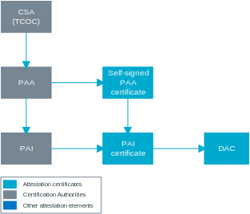
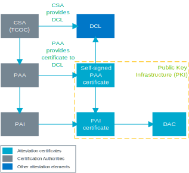
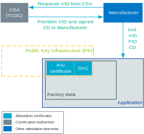
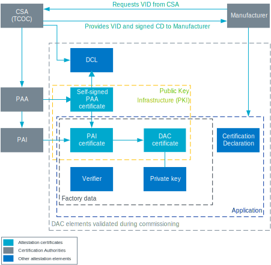

.. _ug_matter_device_attestation:

Matter Device Attestation
#########################

.. contents::
   :local:
   :depth: 2

Device Attestation (DA) is a process of verifying if a Matter device is certified and is produced by a manufacturer that is member of `Connectivity Standards Alliance`_.
The goal is to ensure no counterfeit devices join the Matter network and that the device being checked is genuine.
The Device Attestation process is based on the chain-of-trust concept and is mandatory for all Matter devices.

.. _ug_matter_device_attestation_commissioning_info:

Device Attestation within commissioning
***************************************

The Device Attestation verification process takes place during commissioning.
Before the commissioner can provision the new device to the Matter fabric (network), it must check the certificates of the device and obtain information about it.
To do this, the commissioner first establishes an encrypted session with the commissionee using Passcode-Authenticated Session Establishment (PASE) to ensure confidentiality of the communication.
It then proceeds to verify the device certificates.

To read more about Matter commissioning, see :ref:`ug_matter_network_topologies_commissioning`.

.. note::
   The :ref:`matter_samples` in the |NCS| include temporary Device Attestation with data for testing purposes.
   This data must be regenerated when :ref:`ug_matter_device_attestation_testing_da` of the Matter end product.

.. _ug_matter_device_attestation_cert:

Device Attestation certificates
*******************************

During the Device Attestation procedure, the commissioner checks the certificates on the device, among other things.
These certificates form a chain in which they mutually rely on each other.

All certificates come from Matter certification authorities (CAs).
The primary source of Matter certification authority policies is Connectivity Standards Alliance's Test and Certification Oversight Committee (TCOC), which develops them in accordance with `Connectivity Standards Alliance Certification Policy`_.

CSA assigns the status of Product Attestation Authority (PAA) to selected organizations, which become root certificate authorities for the Device Attestation procedure.
Each PAA owns a key pair, which consists of a private and a public key, and the self-signed PAA certificate.
The private key is used by PAA to sign the certificates of the Product Attestation Intermediate (PAI), an entity that is directly in charge of issuing Device Attestation Certificates (DACs).
Each of PAI certificates is created in the form of Certificate Signing Request by the PAI and presented to the PAA, which sings it with its private key.

The PAI certificate is located at the middle level in the certification chain.
It also includes private and public keys assigned, and it is signed by the higher level PAA certificate that it originates from.
The PAI private key is used to sign the Device Attestation Certificates (DAC).
While a single PAI can only issue DACs belonging to a single device vendor, a single device vendor can operate multiple PAIs, for example in order to issue certificates for different product families.

   Device Attestation certification authorities

.. _ug_matter_device_attestation_cert_pki:

Public Key Infrastructure
=========================

The PAA, PAI, and DAC certificates form the Public Key Infrastructure (PKI), a security structure in which the authenticity of an entity is confirmed by another entity, and each such certificate chain ends with one of the PAA certificates.
The ownership of a certificate is proved using the associated private key.
This is the main reason for keeping the private keys protected.

.. _ug_matter_device_attestation_cert_dcl:

Distributed Compliance Ledger
=============================

CSA's TCOC also maintains the Distributed Compliance Ledger, a database for storing information about the certification status of different vendors.
It is the distribution point of PAA certificates.

   Device Attestation certification authorities with PKI and DCL

To read more about DCL and how to use it, see the :ref:`ug_matter_device_dcl` page.

.. _ug_matter_device_attestation_device_data:

Providing device with Device Attestation data
*********************************************

To pass the Device Attestation procedure, a Matter device that wants to join a Matter fabric must include two sets of information required for the Device Attestation procedure: factory data and Certification Declaration.
Both need to be provided by the manufacturer.

Getting preliminary Device Attestation data
===========================================

The manufacturer needs to get the following information from CSA:

* Vendor ID (VID) - a unique 16-bit number that identifies the manufacturer.
  This can be obtained from CSA when the manufacturer becomes one of `Connectivity Standards Alliance members`_.
* Certification Declaration (CD) - |matter_cd_definition|.
  Until you obtain the CD from CSA, you can use a generic CD for testing purposes during the commissioning.

After the manufacturer obtains Certification Declaration, it can be provided to the device with the new firmware version, for example using the Device Firmware Upgrade functionality or directly in the manufacturing process.
On the other hand, VID is one of the data elements used for :ref:`ug_matter_device_attestation_device_data_generating`.

Alongside VID, the manufacturer also needs to assign a unique 16-bit Product ID (PID) number to identify its product.
Finally, the factory data must include PAI and DAC certificates, and the private key for DAC, which the manufacturer must generate beforehand.

   Simplified view of Device Attestation information from manufacturer

Generating certificates
-----------------------

To generate the certificates for the factory data, the manufacturer can use one of the following options.

Generating DAC with PKI provider (option 1)
+++++++++++++++++++++++++++++++++++++++++++

The manufacturer can request PAI and DAC from one of the PKI providers who are `Connectivity Standards Alliance members`_.
This way, the manufacturer does not have to set up its own Certification Authority chain and can use a trusted source of certification that complies with the PKI certification policy.
The PKI provider's PAA certificate does not contain any specific VID, which lets the provider serve multiple manufacturers.
The manufacturer's PAI certificate generated from the PKI provider's PAA certificate has the VID of the manufacturer and can be used to issue and sign DAC.

Generating DAC using own PKI (option 2)
+++++++++++++++++++++++++++++++++++++++

The manufacturer can set up its own :ref:`ug_matter_device_attestation_cert_pki` to generate PAI and DAC certificates using its own existing PKI.
The rules for setting own PKI are outlined in the `Matter Certification Policy`_ document (authorized access required).
Setting up own PKI lets the manufacturer obtain the following certificates:

* Own PAA - Provided that the manufacturer has a certification authority with root in the DCL.
  The PAA can have the VID embedded (VID-scoped PAA) or not (Non-Vendor Scoped PAA).
* Own PAI - Provided that the manufacturer has sufficient and secure supply chain logistics that can provide DACs to a large number of devices, as each device has a unique DAC.

Generating DAC with platform vendor (option 3)
++++++++++++++++++++++++++++++++++++++++++++++

This solution lets the device manufacturer develop products with SoCs that come with baked-in DACs.
In such case, the VID and the PID of the manufacturer will differ from the VID and the PID of the DAC.
The Certification Declaration will specify the DAC owner in the ``dac_origin_vid`` and ``dac_origin_pid`` fields.

.. note::
   Nordic Semiconductor does not currently offer this option.

.. _ug_matter_device_attestation_device_data_generating:

Generating factory data
=======================

After the manufacturer obtains VID, PID, PAI, and DAC, it can gather them in the factory data that is written to the device during the manufacturing process.
The device stores the factory data in the factory data partition, separately from the firmware.
This is because the factory data is different for each device instance, while the firmware stays the same for the entire device line.
Using a separate partition lets the manufacturer to apply write protection on device boot.
Dedicating a separate partition for this purpose lets avoid recertification when the device's final application changes.

For information about how to generate the factory data, read the detailed :doc:`matter:nrfconnect_factory_data_configuration` guide in the Matter documentation.

Requirements for secured communication
======================================

Before the commissioner can verify the DAC information, it must establish a secure PASE session, which is required for sending commissioning messages, including the `Device Attestation procedure`_.

The Verifier is used for this purpose.
This is one of the input values of the underlying SPAKE2+ protocol.
It is a cryptographic key that is created by the manufacturer using Salt, Iteration Count, and Passcode values, and saved to the device as part of its factory data.

Device Attestation data overview
================================

Once all the required Device Attestation data is obtained, the manufacturer's device will contain the following information unique to it:

Device Attestation Certificate
  A Device Attestation Certificate (DAC) is used for the Device Attestation process and to perform commissioning into a fabric.
  The DAC is a DER-encoded X.509v3-compliant certificate, as defined in RFC 5280.
  It is created using the Product Attestation Intermediate certificate and contains information about Vendor ID and Product ID for the given device.
  It is provided in the factory data.

Private key that matches DAC
  A private key associated with the DAC, unique to the device.
  This key must be protected from leaking and maximum security must be guaranteed when generating it as part of the factory data.

Product Attestation Intermediate certificate
  A Product Attestation Intermediate (PAI) certificate is a type of document issued by the Product Attestation Authority (PAA).
  It is used to create the DAC of the device and is provided in the factory data.

Verifier
  The Verifier itself is not a part of the DAC, although it is included in the factory data.
  See `Requirements for secured communication`_.

Certification Declaration
  This is |matter_cd_definition|.
  It contains a series of information required for Device Attestation, including Vendor ID, Certificate ID, certification type, optional information related to DAC, and other.
  CD is included in the attestation information packet send by the commissionee during the `Device Attestation procedure`_.

  .. note::
      The CD information is not located in the factory data, but in the application itself.
      This is because CD changes after the recertification of the new software version.
      The new CD is applied to the device when you perform a device software update.
      For this reason, you can :ref:`configure CD in firmware and modify it after the certification is done <ug_matter_device_configuring_cd>`.

These are the elements that are checked and validated by the commissioner at the start of the commissioning procedure.

Device Attestation procedure
****************************

The following figure shows the complete overview of the Device Attestation data, with its different actors, dependencies, and stages.

   Device Attestation procedure overview

The procedure is structured into the following steps:

1. The commissioner generates a random 32-byte attestation nonce.
2. The commissioner sends the attestation nonce to the commissionee and requests the attestation information using an appropriate command.
3. The commissionee returns the attestation information packet to the commissioner using an appropriate command.
   The packet is signed and encoded, and contains the following information:

   * Certification Declaration
   * Attestation nonce
   * Timestamp
   * Optional firmware information

4. The commissioner validates the information received from the commissionee.
   During the validation, the commissioner confirms the attestation information received against information contained on the device.
   For example, the Vendor ID from the attestation information packet is vetted against the Vendor ID in the DAC and the Basic Information cluster, the Certificate ID from the CD is verified against the entry in the DCL, and so on.
   For the detailed list of what information undergoes verification, see chapter 6.2.3.1 (Attestation Validation Information) in the `Matter Core Specification <CSA Specifications Download Request_>`_.

A device that passes the Device Attestation procedure has been verified as an authentic Matter device.
The commissioner can then proceed to the next stage of :ref:`ug_matter_network_topologies_commissioning`, which may succeed or not.

.. note::
   The DAC is never removed from the device and stays on the device for later use, for example for commissioning onto a new network.
   It can be overwritten only with the change of the factory data.

.. _ug_matter_device_attestation_testing_da:

Testing Device Attestation during development
*********************************************

The :ref:`matter_samples` in the |NCS| include temporary Device Attestation with data for testing purposes.
If you want to test Device Attestation during development of your product without using the data from the samples, you can generate your own data:

* Factory data - Read the detailed :doc:`matter:nrfconnect_factory_data_configuration` guide in the Matter documentation for more information.
* Certification Declaration only - Read :ref:`ug_matter_device_configuring_cd_generating_steps` for more information.

The data created for integration testing is not to be included in final end products.
