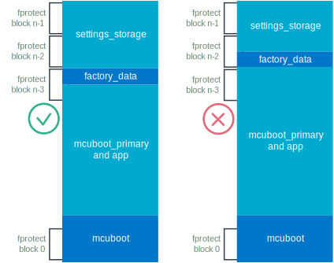

.. _ug_matter_device_bootloader:

Bootloader configuration in Matter
##################################

.. contents::
   :local:
   :depth: 2

All Matter nodes are required to implement a firmware update mechanism that validates the authenticity of new firmware before executing it.
To meet this requirement, Nordic Semiconductor recommends using :doc:`MCUboot <mcuboot:index-ncs>` bootloader for installing a new firmware image.

This page contains guidelines for configuring the MCUboot bootloader in Matter projects.

Adding MCUboot to application
*****************************

Read :ref:`ug_bootloader_adding_immutable_mcuboot` to learn how to add MCUboot to an |NCS| application.
Some Matter samples include :term:`Device Firmware Update (DFU)` support out of the box, as listed in the :ref:`sample feature matrix table <matter_samples>`.

MCUboot minimal configuration
*****************************

MCUboot is by default configured to enable debug features, such as logs.
You can reduce the size of the bootloader image by disabling unnecessary features.

See the `Kconfig.mcuboot.defaults`_ file for the MCUboot minimal configuration used by :ref:`Matter samples <matter_samples>` in the |NCS|.
This configuration allows to reduce the flash partition occupied by MCUboot to 24 kB.

.. _ug_matter_device_bootloader_partition_layout:

Partition layout
****************

Each application that uses MCUboot must use :ref:`partition_manager` to define partitions of the flash memory.
This is needed for the bootloader to know where the current and the new firmware images are located in the flash.

Consider the following when defining partitions for your end product:

* There are multiple ways to define partitions using Partition Manager.
  For example, each :ref:`Matter sample <matter_samples>` provides a :file:`pm_static_dfu.yml` file (one for each configuration) that statically defines the partition layout.
  See :ref:`ug_matter_hw_requirements_layouts` to confirm the reference partition layout for each supported platform.
* Given the size of the Matter stack, it will usually not be possible to fit both the primary and the secondary slot in the internal flash in order to store the current and the new firmware image, respectively.
  Instead, you should use the :ref:`external flash <ug_bootloader_external_flash>` to host the secondary slot.

  .. note::
      Remember to enable a proper flash driver when placing the secondary slot in the external flash.
      For example, if you develop your application on a Nordic Semiconductor's development kit that includes a QSPI NOR flash module, set the :kconfig:option:`CONFIG_NORDIC_QSPI_NOR` Kconfig option.

* When selecting the partition sizes, take into account that some of the partitions, such as settings and factory data ones, are not modified during the DFU process.
  This means that performing DFU from one firmware version to another using different partition sizes may not be possible, and you will not be able to change the partition sizes without reprogramming the device.
  Trying to perform DFU between applications that use incompatible partition sizes can result in unwanted application behavior, depending on which partitions are overlapping.
  In some cases, this may corrupt some partitions; in others, this can lead to a DFU failure.

Settings partition
==================

The nRF Connect platform in Matter uses Zephyr's :ref:`zephyr:settings_api` API to provide the storage capabilities to the Matter stack.
This requires that you define the ``settings_storage`` partition in the flash.
The recommended minimum size of the partition is 32 kB, but you can reserve even more space if your application uses the storage extensively.

As you can see in :ref:`ug_matter_hw_requirements_layouts`, Matter samples in the |NCS| reserve exactly 32 kB for the ``settings_storage`` partition.

Factory data partition
======================

If you make a real Matter product, you also need the ``factory_data`` partition to store the factory data.
The factory data contains a set of immutable device identifiers, certificates and cryptographic keys, programmed onto a device at the time of the device fabrication.
For that partition one flash page of 4 kB should be enough in most use cases.

By default, the ``factory_data`` partition is write-protected with the :ref:`fprotect_readme` driver (``fprotect``).
The hardware limitations require that the write-protected areas are aligned to :kconfig:option:`CONFIG_FPROTECT_BLOCK_SIZE`.
For this reason, to effectively implement ``fprotect``, make sure that the partition layout of the application meets the following requirements:

* The ``factory_data`` partition is placed right after the ``app`` partition in the address space (that is, the ``factory_data`` partition offset must be equal to the last address of the ``app`` partition).
* The ``settings_storage`` partition size is a multiple of :kconfig:option:`CONFIG_FPROTECT_BLOCK_SIZE`, which may differ depending on the SoC in use.

See the following figure and check the :ref:`ug_matter_hw_requirements_layouts` to make sure your implementation is correct.

   Factory data partition implementation criteria for fprotect

In case your memory map does not follow these requirements, you can still use the factory data implementation without the write protection by setting the :kconfig:option:`CONFIG_CHIP_FACTORY_DATA_WRITE_PROTECT` to ``n``, although this is not recommended.

See the :ref:`ug_matter_device_attestation_device_data_generating` section on the Device Attestation page for more information about the factory data in Matter.

Signing keys
************

MCUboot uses asymmetric cryptography to validate the authenticity of firmware.
The public key embedded in the bootloader image is used to validate the signature of a firmware image that is about to be booted.
If the signature check fails, MCUboot rejects the image and either:

* rolls back to the last valid firmware image if the fallback recovery has not been disabled using the MCUboot's :kconfig:option:`CONFIG_BOOT_UPGRADE_ONLY` Kconfig option.
* fails to boot.

.. note::
   To help you get started with MCUboot and ease working with sample applications, MCUboot comes with a default key pair for the firmware image validation.
   As the key pair is publicly known, it provides no protection against the image forgery.
   For this reason, when making a real product, it is of the greatest importance to replace it with a unique key pair, known only to the device maker.

   Read :ref:`ug_bootloader_adding_immutable_mcuboot_keys` to learn how to configure MCUboot to use a custom key pair.

Downgrade protection
********************

The :ref:`downgrade protection <ug_fw_update_image_versions_mcuboot_downgrade>` mechanism makes it impossible for an attacker to trick a user to install a firmware image older than the currently installed one.
The attacker might want to do this to reintroduce old security vulnerabilities that have already been fixed in newer firmware revisions.
You should enable the downgrade protection mechanism if you choose to enable MCUboot's :kconfig:option:`CONFIG_BOOT_UPGRADE_ONLY` Kconfig option, which disables the fallback recovery in case of a faulty upgrade.
