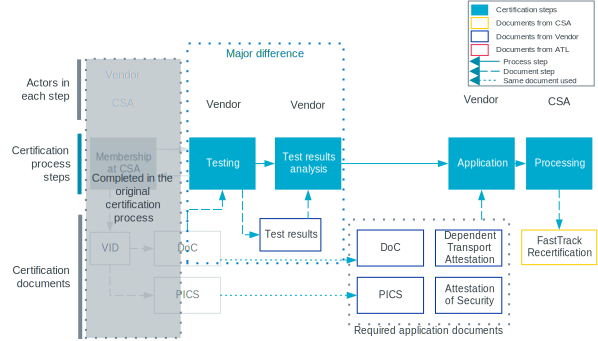

.. _ug_matter_device_certification:

Matter certification
####################

.. contents::
   :local:
   :depth: 2

Matter offers full certification, including test specification, certification program, and certification framework.

Read the following sections for an overview of the Matter certification process.
For detailed information, see the official Certification Policy and Procedures from CSA.
The latest Certification Policy and other documents related to certification are available in the `Matter Resource Kit`_ to Matter members.

The public listing of certified Matter products is available at the `CSA Certified Products Database`_ page.

.. _ug_matter_device_certification_types:

Certification types
*******************

You can apply for certification of the following types:

Certified Product
   An end product that has obtained certification.
   The Certified Product label confirms that the product is fully compliant to the Matter standard and allows the product to use the Certified Product logo.

Certified Software Component
   A software feature of a Supported Operating Environment (SOE).

Matter Compliant Platform
   A platform that provides a certified Matter foundation (for example, stack, commissioning, and mandatory clusters) for building products.

This page offers a general introduction to the Matter certification process, and does not make distinction between these types where the process is the same.
It uses the term *Matter component* to refer to Certified Products and Certified Software Components.

.. _ug_matter_device_certification_overview:

Certification process overview
******************************

Each certification is preceded by a testing phase.
The testing confirms that the Matter component is following the Matter standard, as described in the Matter specification.
The certification is the official recognition of the conformity to the standard.

The following figure provides an overview of the Matter certification process steps.

.. figure:: images/matter_device_certification_process.svg
   :alt: Matter certification process overview

   Matter certification process overview

.. _ug_matter_device_certification_initial_reqs:

Initial requirements: Membership at CSA
=======================================

Before you start applying for the Matter certification, you must join CSA, which is the Standards Developing Organization (SDO) for Matter.

.. table::

   +-------------------------------+---------------------------+-----------------------------+----------------------------------------+
   | Technology certification      | Stage for certification   | SDO to join                 | Minimum SDO membership level required  |
   +===============================+===========================+=============================+========================================+
   | Matter Certification          | Production                | `Join CSA`_                 | Adopter                                |
   +-------------------------------+---------------------------+-----------------------------+----------------------------------------+

Joining CSA allows you to meet the following certification requirements:

* Familiarity with the Matter Core Specification, which is the standard for the certification.
  You can download it from the `CSA Specifications Download Request`_ page.
* Assignment of Vendor ID (VID), which is required when applying for certification.
  You can apply to `CSA's Certification Team`_ to obtain VID.
  The VID codes are valid immediately upon assignment.

If you created your Matter product application using :ref:`matter_samples` as a reference, make sure you have read the :ref:`ug_matter_device_certification_matter_samples` section before proceeding with the following certification steps.

.. _ug_matter_device_certification_testing:

Testing
=======

The Matter certification process requires testing before any application for certification is sent.
The testing process includes specific actions and test scenarios that must be triggered on the device under test.
Some of these operations must be initiated with the :ref:`test event triggers <ug_matter_test_event_triggers>`, which is a dedicated software component supported by the |NCS| Matter samples.
This component allows the Matter controller to trigger test actions by interacting with the ``generaldiagnostics`` Matter cluster implemented on the device.

The testing can be performed at an Authorized Test Laboratory (ATL), using a test plan developed by CSA.
Each ATL has its own submission process, but all require a Declaration of Conformity and a Protocol Implementation Conformance Statement (PICS).
Both documents confirm that the Matter component you are going to certify is meeting the protocol requirements.

The ATL can contact you if your Matter component is failing any of the test cases.

You can find the list of available ATLs on the `CSA's Testing Providers`_ page.

.. _ug_matter_device_certification_reporting:

Reporting
=========

After the Matter component successfully passes all required test cases, the ATL sends a test report to both you and CSA.
The test report summarizes the testing process and includes a variety of information, including details about the device, `Certification types`_, test plans, and Test Harness.

Application
===========

Once you have obtained the test report for your Matter component, you can apply for the certification to CSA.
You can do this online from the `CSA Matter Resource Kit`_ using the different Certification and Testing tools to submit the required documentation.

Application requirements
------------------------

The final application for certification requires you to send the following documents to CSA:

* Declaration of Conformity
* `PICS`_
* `Dependent Transport Attestation`_
* `Matter Attestation of Security`_
* Description of the Matter component to be certified (and photos of the end product, for the product certification)

Certification document templates from Nordic Semiconductor
  When applying for certification for products that use Nordic Semiconductor's devices, some of the certification documents require providing information about Nordic Semiconductor's SoCs or the |NCS|.
  To help you with filling in these documents, Nordic Semiconductor can provide you with appropriate templates for:

  * Matter Attestation of Security
  * Thread certification by inheritance application

  To request and obtain such documents, open a private ticket on `DevZone`_ after you join the related SDO.

  .. note::
     Nordic Semiconductor provides just example answers based on the reference SDK applications, which may guide you on how to answer to certain platform-related questions.
     You are still solely responsible for filling original documents according to a product specification.
     The final approval depends on the Director of Certification in the given SDO.

PICS
++++

You can generate the PICS in the XML format using the `PICS Tool`_, which is provided by CSA.

Dependent Transport Attestation
+++++++++++++++++++++++++++++++

When applying for Matter certification, you must present a self-attestation that confirms you have applied for and obtained the certification for the transport platform you are using for your Matter component.
The processes for obtaining such certification are governed by different Standard Development Organizations (SDOs).

See the :ref:`ug_matter_device_certification_reqs` for more information about the processes compatible with the Matter platform in the |NCS|.

CSA provides attestation forms to its members on the `Matter Attestation Form`_ directory page.

.. _ug_matter_device_certification_reqs_security:

Matter Attestation of Security
++++++++++++++++++++++++++++++

For a Matter component to be certified, CSA's policies require an Attestation of Security that provides detailed information about the security level of the Matter component.
The attestation document lists robustness security requirements based on the Matter Core Specification.
The product developer must indicate the level of compliance and briefly justify the choice.

The attestation must be filled by the person responsible for end product certification who meets the following requirements:

* The person's organization is a `member of the Matter community <Join CSA_>`_.
* The person has an account on the `Connectivity Standards Alliance Certification Web Tool`_.

Once both these requirements are met, the responsible person can download the `Matter Attestation of Security template`_, fill it in, and submit it in the certification web tool when applying for the certification.

Processing
==========

During this stage of the certification process, CSA verifies the submission for relevant criteria, including relevant documentation, membership in CSA, completion of testing, and payment of applicable fees.
The duration of this step depends on the complexity of your application and the length of the review queue.

.. _ug_matter_device_certification_results:

Certification
=============

At the end of a successful processing, the Matter component is granted the certification.

CSA will ensure that the following certification actions are completed when the certification is granted:

* Certificate of compliance is sent to the certification requester.
* The newly certified Matter component is listed on the `CSA Certified Products Database`_ page.
* Matter certified logos are available from the Certification Web Tool dashboard.
* Certification Declaration file is available for download.
* Certification record is entered into :ref:`ug_matter_device_dcl`.

.. _ug_matter_device_certification_reqs:

Dependent certification requirements
************************************

.. ug_matter_certification_sdo_start

Because Matter is an application layer, it relies on proven technologies for network connectivity.
These technologies come with their own certification processes governed by different Standard Development Organizations (SDOs).

.. ug_matter_certification_sdo_end

.. _ug_matter_device_certification_reqs_mot:

Matter over Thread certification requirements
=============================================

The following table lists Matter over Thread certification requirements for when a product moves to production.

+-------------------------------+---------------------------+-----------------------------+----------------------------------------+
| Technology certification      | Stage for certification   | SDO to join                 | Minimum SDO membership level required  |
+===============================+===========================+=============================+========================================+
| Matter Certification          | Production                | `Join CSA`_                 | Adopter                                |
+-------------------------------+---------------------------+-----------------------------+----------------------------------------+
| Bluetooth® QDID               | Production                | `Join Bluetooth SIG`_       | Adopter                                |
+-------------------------------+---------------------------+-----------------------------+----------------------------------------+
| Thread Group Certification    | Production                | `Join Thread Group`_        | Implementer                            |
+-------------------------------+---------------------------+-----------------------------+----------------------------------------+

Bluetooth and Thread certifications can be inherited from Nordic Semiconductor (see the :ref:`ug_matter_device_certification_reqs_dependent` section below).

You can also find more information about the Bluetooth QDID in the :ref:`Bluetooth protocol section <ug_bt_qualification>`, and Thread certification in the :ref:`Thread protocol section <ug_thread_cert>`.

.. _ug_matter_device_certification_reqs_mowifi:

Matter over Wi-Fi® certification requirements
=============================================

The following table lists Matter over Wi-Fi certification requirements for when a product moves to production.

+-------------------------------+---------------------------+-----------------------------+----------------------------------------+
| Technology certification      | Stage for certification   | SDO to join                 | Minimum SDO membership level required  |
+===============================+===========================+=============================+========================================+
| Matter Certification          | Production                | `Join CSA`_                 | Adopter                                |
+-------------------------------+---------------------------+-----------------------------+----------------------------------------+
| Bluetooth QDID                | Production                | `Join Bluetooth SIG`_       | Adopter                                |
+-------------------------------+---------------------------+-----------------------------+----------------------------------------+
| Wi-Fi Alliance Certification  | Production                | `Join Wi-Fi Alliance`_      | Implementer                            |
+-------------------------------+---------------------------+-----------------------------+----------------------------------------+

Bluetooth certification can be inherited from Nordic Semiconductor (see the :ref:`ug_matter_device_certification_reqs_dependent` section below).
:ref:`Wi-Fi certification <ug_wifi_certification>` is not yet available for inheritance from Nordic Semiconductor.

You can also find more information about the Bluetooth QDID in the :ref:`Bluetooth protocol section <ug_bt_qualification>`.

.. _ug_matter_device_certification_reqs_dual:

Certification requirements for dual protocol scenarios
======================================================

The following table lists certification requirements for products that offer :ref:`both Thread and Wi-Fi protocol support with Matter <ug_matter_overview_architecture_integration_designs_switchable>`.

+-------------------------------+---------------------------+-----------------------------+----------------------------------------+
| Technology certification      | Stage for certification   | SDO to join                 | Minimum SDO membership level required  |
+===============================+===========================+=============================+========================================+
| Matter Certification          | Production                | `Join CSA`_                 | Adopter                                |
+-------------------------------+---------------------------+-----------------------------+----------------------------------------+
| Bluetooth QDID                | Production                | `Join Bluetooth SIG`_       | Adopter                                |
+-------------------------------+---------------------------+-----------------------------+----------------------------------------+
| Thread Group Certification    | Production                | `Join Thread Group`_        | Implementer                            |
+-------------------------------+---------------------------+-----------------------------+----------------------------------------+
| Wi-Fi Alliance Certification  | Production                | `Join Wi-Fi Alliance`_      | Implementer                            |
+-------------------------------+---------------------------+-----------------------------+----------------------------------------+

Bluetooth and Thread certifications can be inherited from Nordic Semiconductor (see the :ref:`ug_matter_device_certification_reqs_dependent` section below).
:ref:`Wi-Fi certification <ug_wifi_certification>` is not yet available for inheritance from Nordic Semiconductor.

You can also find more information about the Bluetooth QDID in the :ref:`Bluetooth protocol section <ug_bt_qualification>`, and the Thread certification in the :ref:`Thread protocol section <ug_thread_cert>`.

.. _ug_matter_device_certification_reqs_dependent:

Matter dependent certification inheritance
==========================================

If your product uses a qualified Bluetooth stack or certified Thread libraries (or both) provided as part of the |NCS|, you can *inherit* certification from Nordic Semiconductor, provided that you do not introduce any changes to these stacks.
In practice, this means reusing Nordic Semiconductor's certification identifiers, which were obtained as a result of the official certification procedures.

When reusing Nordic Semiconductor's certification identifiers, you still need to join the SDO and meet its requirements to apply for certification by inheritance.
For example, if you want to inherit Nordic Semiconductor's certification for Matter over Thread, you still need to join organizations listed in :ref:`ug_matter_device_certification_reqs_mot` and meet the inheritance requirements of each of the SDOs.

.. note::
   The inheritance procedure differs from SDO to SDO and has different names.
   For details, contact the appropriate certification body in the SDO.

Certification identifiers
-------------------------

Nordic Semiconductor provides the following certification identifiers:

* Bluetooth Qualified Design IDs (Bluetooth QDIDs) - Obtained in accordance with `Bluetooth SIG's Qualification Process`_.
* Thread Certification IDs (Thread CIDs) - Obtained in accordance with `Thread Group's certification information`_.

You can visit the following pages to check the Bluetooth QDIDs and Thread CIDs valid for SoCs that support Matter applications:

* `nRF52840 Compatibility Matrix <nRF52840 Compatibility Matrix_>`_
* `nRF5340 Compatibility Matrix <nRF5340 Compatibility Matrix_>`_
* `nRF54L15 Compatibility Matrix <nRF54L15 SoC Compatibility Matrix_>`_

Matter certification process variants
=====================================

The standard Matter certification process has several variants, for example:

* certification paths for different devices (including Derived Matter Product),
* recertification for devices that are already certified,
* variants for certifying several products of the same family.

.. _ug_matter_device_certification_dmp:

Derived Matter Product (DMP) certification
==========================================

Another way to achieve product certification is to build your product on a certified Matter Compliant Platform and certify it as a Derived Matter Product (DMP).
A DMP adds product-specific clusters and functionality on top of the platform; only the product-only and shared tests are required for certification, so the testing scope is reduced compared to certifying a full product from scratch.
For the DMP concept, process, and step-by-step guidance, see :ref:`platform and DMP certification <ug_matter_platform_and_dmp>`.

.. _ug_matter_device_recertification_process:

Matter recertification process variants
=======================================

The following variants are meant for devices that are already certified.

FastTrack Recertification program
---------------------------------

Matter FastTrack Recertification is a program for recertification of previously certified Matter products and Matter Platforms.
With FastTrack, you perform the testing yourself and *self-attest* the results.
No Authorized Test Laboratory (ATL) validation is required.
Upon approval, no new Certification Declaration (CD) is issued for Matter, only a :ref:`Distributed Compliance Ledger <ug_matter_device_dcl>` (DCL) update is required.

The procedure for FastTrack recertification consists of the following steps:

1. Request and be granted FastTrack Program membership from the Director of Certifications (for example, through certification@csa-iot.org).
#. Execute the certification test cases valid for the device using the latest applicable test harness and scripts.
#. Validate the results; save logs and results for proof.
#. A registered Point of Contact (PoC) attests to the results in the Declaration of Conformity (DoC).
#. Submit the completed DoC and supporting documents (for example, PICS, and attestations) to the Director of Certifications.
#. Provide two product samples to the CSA Interoperability Laboratory if not already present there, within three months of first using FastTrack for that product.

.. note::
   Store the test results for at least five years from the date of approved certification and share them with the Alliance on request.

.. note::
   For critical and security fixes, you can deploy updates to devices after the Director of Certifications acknowledges the *receipt* of your certification request, without waiting for formal certification approval.

To maintain qualified status, you must:

* be a registered Point of Contact (PoC),
* participate in the relevant working-group subgroups (for example, Matter CSG),
* undergo annual training for self-test individuals as required by the Alliance.

   Matter's FastTrack Recertification program overview

The program allows the following changes:

* Security fixes
* Critical bug fixes
* Interoperability improvements
* Updates to a newer certifiable specification version
* SDK updates recommended by the Matter Steering Committee
* Device improvements and bug fixes

The following changes are not permitted under FastTrack:

* New device types
* Additions or changes to existing clusters
* Adding features not previously tested in a certification context

Rapid Recertification program
-----------------------------

The Rapid Recertification program lets you perform the product testing using the services of a qualified CSA Member, even your own organization, instead of an ATL.
You must still submit the test results to an ATL of your choice for review and validation.
The ATL then recommends recertification to the Director of Certifications, who grants certification in line with existing policy.
The first (initial) certification must still be done at an ATL.

.. figure:: images/matter_device_certification_process_rr.svg
   :alt: Matter's Rapid Recertification program overview

   Matter's Rapid Recertification program overview

.. _ug_matter_device_portfolio_certification:

Matter portfolio certification process variants
===============================================

The following variants are meant for several products of the same family.

Portfolio Certification program
-------------------------------

This certification program applies to both Zigbee and Matter products.
It simplifies the certification process by allowing manufacturers to certify multiple Portfolio Member Products within a single application, using a Parent Product as the basis.
This program offers greater flexibility compared to the existing Certification by Similarity and Product Family Certification Programs.
Over time, it may potentially supersede these programs, making it a highly efficient option for manufacturers seeking certification.

The basic difference lies in the scope of certification between product family and portfolio certifications.
Product family certification applies to the same device, allowing variations only in aspects like housing, language, and power plug, as these do not alter the device's core functionality from a Matter standpoint.
In contrast, portfolio certification accommodates devices that may differ at the Matter level, where a parent certificate covers a master set of the device, and other devices with certain features removed can still leverage the product portfolio certification.

For more details, read a dedicated document in the `Matter Resource Kit`_.

Product Family Certification
----------------------------

The Product Family certification lets you certify several variants of the same product.
In this certification path, the first product must be tested according to the original certification process at an ATL.
Then, you can apply for certification of the first product and a number of other products from the same family.

To be considered of the same family, the other products must meet the following criteria:

* All products must share the same device type as the first product.
* All products must be variants of the first product, which should also be the most feature complete.
* All products must conform with the Matter specifications, regardless of differences.

.. figure:: images/matter_device_certification_process_pf.svg
   :alt: Matter's Product Family certification overview

   Matter's Product Family certification overview

Certification by Similarity
---------------------------

Certification by Similarity lets you certify products that derive from a previously certified product.
This variant is meant for Matter components that use Matter software that was already certified as part of either the standard procedure or the `Product Family certification`_.

.. figure:: images/matter_device_certification_process_cbs.svg
   :alt: Matter certification by similarity overview

   Matter certification by similarity overview

.. _ug_matter_device_certification_matter_samples:

Certification status of Matter samples
**************************************

The |NCS| includes several :ref:`matter_samples` that are example implementations of Matter devices.
The samples are maintained to fulfill Matter certification requirements as closely as possible, but they do not have official Matter compliance certificates.
You can use them as a reference for creating your own application, but this does not guarantee that your application will pass the Matter certification.

Before starting the Matter certification application process, ensure that the application configuration generated using the :file:`.zap` file aligns with the PICS required for certification.
For detailed information about specifications and the appropriate PICS for your target Matter stack version, see the "Specification" section on the `CSA Matter Resource Kit`_ page.
Especially, make sure that:

* ``FeatureMap`` attributes for all clusters match the desired configuration selected in PICS, and all other cluster requirements related to the specific ``FeatureMap`` value are met.
* ``ClusterRevision`` attributes for all clusters match the value of the Matter stack version that you want to use for your application certification.
* ``Attribute List``, ``Accepted Command List`` and ``Generated Command List`` attributes for all clusters contain all the values that need to be there and nothing more.
* Only the clusters, attributes and commands required by your application are enabled.
  For example, the default configurations for the samples use both Thread Network Diagnostics and Wi-Fi Network Diagnostics clusters, and the Network Commissioning cluster has attributes for both Thread and Wi-Fi protocols enabled.
  This is done due to the Thread and Wi-Fi platforms common maintenance reasons, but should not be used in the final product.

See the :ref:`ug_matter_creating_accessory` page for how to configure your application using the ZAP Tool.

Before you request the official product :ref:`ug_matter_device_certification_testing` from ATL, it is recommended to perform in-house certification testing of the product.
This testing can help you detect problems that could lead to certification failure, meaning it saves time and money that would be spent on official certification in ATL laboratory.
You can find the instruction how to execute in-house certification tests using a Matter Test Harness on the `CSA Matter Resource Kit`_ page.
Open the **Test Tool User Guide** link in the **Testing** section under the **Testing and Certification** section of the page.
